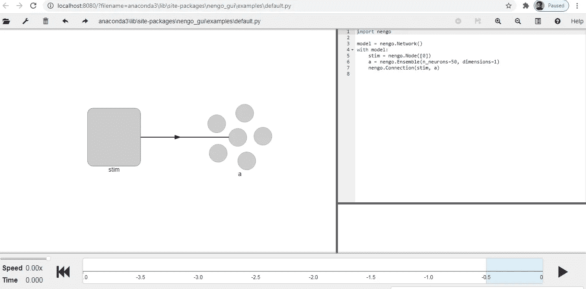
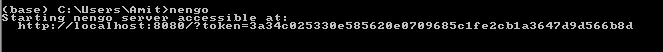
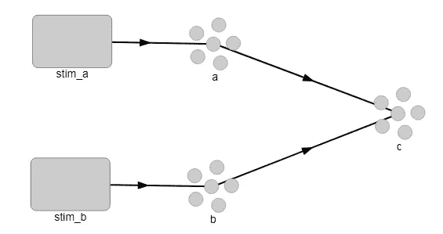
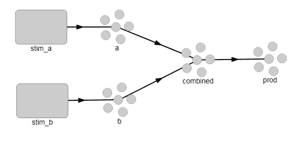

# Nengo:一种新的神经网络构建和部署工具

> 原文：<https://pub.towardsai.net/nengo-a-new-neural-network-building-and-deployment-tool-66677c65fa19?source=collection_archive---------0----------------------->

## [深度学习](https://towardsai.net/p/category/machine-learning/deep-learning)

## 用于构建和部署神经网络的 python 包



阿能戈桂。作者的照片

## 介绍

Nengo 是建立和测试神经网络的有用工具，除了深度学习，它还有助于工作记忆，路径整合等。 *Nengo* 生态系统由许多相互作用的类别组成，如下所示:

Nengo 核心框架有三个主要类别:

*   **能归**为*网页浏览器客户端*和 *python 服务器*
*   **nego core**for*python*和 *numpy*
*   **tensor flow 的*neng odl***

它还包含附加组件和模拟器，但两个主要的重要附加组件是 KerasSpiking 和 PyTorchSpiking，用于在各自的框架中对神经网络进行尖峰处理。

NengoCore 中的重要对象是下面描述的对象:

*   **能戈。网络()**:用于与其他可视化对象分组。网络的自变量是标签、种子和添加容器。

```
network = nengo.Network()
```

*   **能戈。Ensemble():** 用来作为向量馈入神经元的数目。
*   **nengo . ensemble . neurons():**它用于直接连接到神经元，而不是连接到解码值。
*   **能戈。Node():** 用于输入和控制 nengo 模拟器。它不是大脑模型的一部分，而是总结大脑模型没有完成的数据。
*   **能戈。Connection():** 当有两个对象时，它用来连接它们。

示例:

```
**with nengo.Network() as net:
    node = nengo.Node(np.zeros(2))
    ensemble = nengo.Ensemble(10, 1)**#here node and ensemble are two objects
#connection is used to connect these two objects**with net:
    nengo.Connection(node[0], ensemble)
    nengo.Connection(node[1], ensemble)**
```

*   能戈。Probe():用于从模拟的所有对象中收集数据。数据可以是尖峰值、电压值等。

示例:

```
with nengo.Network():
    ens = nengo.Ensemble(10, 1)
print(ens.probeable)#output:
('decoded_output', 'input', 'scaled_encoders')
```

[](/step-by-step-basic-understanding-of-neural-networks-with-keras-in-python-94f4afd026e5) [## 使用 Python 中的 Keras 逐步基本了解神经网络

### 具有定义的神经网络的学习

pub.towardsai.net](/step-by-step-basic-understanding-of-neural-networks-with-keras-in-python-94f4afd026e5) [](/understand-tensorflow-basic-with-python-87281e737db9) [## 使用 Python 了解 TensorFlow Basic

### 张量流中使用的基本术语

pub.towardsai.net](/understand-tensorflow-basic-with-python-87281e737db9) 

## 在 windows 中安装

要安装 Nengo，请在 anaconda 提示符下使用 pip 命令。

```
pip install nengo
```

要使用交互式 nengo GUI，我们需要安装 Nengo GUI。

```
pip install nengo-gui
```

安装 GUI 后，我们可以使用 nengo 命令打开 nengo 的交互 GUI。



作者的照片

执行该命令后，GUI 将在您的默认浏览器中打开。


作者的照片

上述神经元连接的代码如下所示:

```
import nengo                       
import numpy as np model = nengo.Network()                       
with model:                           
    neurons = nengo.Ensemble(n_neurons=100, dimensions=2)

    stim = nengo.Node([0, 0])
    nengo.Connection(stim, neurons)
```

我们还可以从两个突触中加入两个电流连接。

```
import nengo
model = nengo.Network()
with model:
    # Creating three ensemble neuron
    a = nengo.Ensemble(n_neurons=100, dimensions=1)
    b = nengo.Ensemble(n_neurons=100, dimensions=1)
    c = nengo.Ensemble(n_neurons=100, dimensions=1)# Feed the values to the nodes
    stim_a = nengo.Node(0.5)
    stim_b = nengo.Node(0.3)# Connection of two object nodes
    nengo.Connection(stim_a, a)
    nengo.Connection(stim_b, b)# Connect the two onject to the third object
    nengo.Connection(a, c)
    nengo.Connection(b, c)
```



作者的照片

我们也可以将两个突触连接相乘。

```
import nengo
model = nengo.Network()
with model:
    # Creating four ensemble neuron
    a = nengo.Ensemble(n_neurons=100, dimensions=1, radius=1)
    b = nengo.Ensemble(n_neurons=100, dimensions=1, radius=1) # Feed the radius of this object 
    combined = nengo.Ensemble(n_neurons=200, dimensions=2,
                               radius=1.5) prod = nengo.Ensemble(n_neurons=100, dimensions=1, radius=1) #This line will create the encoders and corner points of the
      cube will improve the computation quality. combined.encoders = nengo.dists.Choice([[1,1],[-1,1],[1,-1],
                                            [-1,-1]])

    stim_a = nengo.Node([0])
    stim_b = nengo.Node([0])# Connection of a and b 
    nengo.Connection(stim_a, a)
    nengo.Connection(stim_b, b)# coneection of a and b with combined ensemble
    nengo.Connection(a, combined[0])
    nengo.Connection(b, combined[1])# This function will compute the multiplication
    def product(x):
        return x[0] * x[1]# This connection will the give the product result
    nengo.Connection(combined, prod, function=product)
```



作者的照片

## 结论:

本文展示了 Nengo 工具的基本思想，它将改变大脑模型的工作理念。

[](/understand-time-series-components-with-python-4bc3e2ba1189) [## 用 Python 理解时间序列组件

### 机器学习中预测模型的基本概念及实例

pub.towardsai.net](/understand-time-series-components-with-python-4bc3e2ba1189) 

我希望你喜欢这篇文章。通过我的 [LinkedIn](https://www.linkedin.com/in/data-scientist-95040a1ab/) 和 [twitter](https://twitter.com/amitprius) 联系我。

# 推荐文章

[1。NLP —零到英雄用 Python](https://medium.com/towards-artificial-intelligence/nlp-zero-to-hero-with-python-2df6fcebff6e?sk=2231d868766e96b13d1e9d7db6064df1)
2。 [Python 数据结构数据类型和对象](https://medium.com/towards-artificial-intelligence/python-data-structures-data-types-and-objects-244d0a86c3cf?sk=42f4b462499f3fc3a160b21e2c94dba6)
3。[Python 中的异常处理概念](/exception-handling-concepts-in-python-4d5116decac3?source=friends_link&sk=a0ed49d9fdeaa67925eac34ecb55ea30)
4。[用 Python 进行主成分分析降维](/principal-component-analysis-in-dimensionality-reduction-with-python-1a613006d531?source=friends_link&sk=3ed0671fdc04ba395dd36478bcea8a55)
5。[用 Python 全面讲解 K-means 聚类](https://medium.com/towards-artificial-intelligence/fully-explained-k-means-clustering-with-python-e7caa573176a?source=friends_link&sk=9c5c613ceb10f2d203712634f3b6fb28)
6。[用 Python 充分解释了线性回归](https://medium.com/towards-artificial-intelligence/fully-explained-linear-regression-with-python-fe2b313f32f3?source=friends_link&sk=53c91a2a51347ec2d93f8222c0e06402)
7。[用 Python](https://medium.com/towards-artificial-intelligence/fully-explained-logistic-regression-with-python-f4a16413ddcd?source=friends_link&sk=528181f15a44e48ea38fdd9579241a78)
充分解释了 Logistic 回归 8。[用 Python 做时间序列的基础知识](https://medium.com/towards-artificial-intelligence/basic-of-time-series-with-python-a2f7cb451a76?source=friends_link&sk=09d77be2d6b8779973e41ab54ebcf6c5)
9。[与 Python 的数据角力—第一部分](/data-wrangling-with-python-part-1-969e3cc81d69?source=friends_link&sk=9c3649cf20f31a5c9ead51c50c89ba0b)
10。[机器学习中的混淆矩阵](https://medium.com/analytics-vidhya/confusion-matrix-in-machine-learning-91b6e2b3f9af?source=friends_link&sk=11c6531da0bab7b504d518d02746d4cc)