# 网飞股票价格预测模型

> 原文：<https://pub.towardsai.net/netflix-stock-prediction-model-a-comparative-study-of-linear-regression-k-nearest-neighbor-knn-4527ff17939b?source=collection_archive---------0----------------------->

## 机器学习

## 线性回归、K 近邻(KNN)和支持向量机(SVM)的比较研究

本文的目的是设计一个股票预测线性模型来预测网飞的收盘价。这将是对各种机器学习模型的比较研究，如线性回归、K-最近邻和支持向量机。

在设计模型之前，我浏览了互联网上一些与投资相关的博客和文章，以便更好地了解这件事，我发现了一些决定股票开盘价和收盘价的关键指标。因此，关于模型训练的本教程将不限于单个特征，而是这将是多特征训练的模型。

## **股市基本影响因素**

作为一名数据科学家或 ml 专业人士，当我们对我们试图建立的业务或功能有了清晰的认识时，我们的工作就会变得轻松，所以我想我也必须分享一些业务见解，然而，我不是股票市场专业人士，但我认为这将建立一种理解。所以基本上,**收盘价**是买家在营业时间内为特定股票支付的最后价格，开盘价是该股票的第一笔交易价格，在股票交易中,**开盘价**可能与收盘价不同是一个非常常见的现象，原因是供求之间的波动决定了股票的吸引力。这种现象被称为 **AHT(盘后交易)**，它在改变股票开盘价方面起着关键作用。还有其他因素，我不是这方面的专家，所以我不打算深究。这一小段信息是为了让人们对现实世界的问题有一个基本的了解。
因此，不再浪费时间，让我们直接跳到解决方案"**编码**"

## **1。导入先决条件:**

```
import pandas as pd
from sklearn.linear_model import LinearRegression
from sklearn.model_selection import train_test_split
import matplotlib.pyplot as plt
import numpy as np
import pandas_datareader as web
```

> pandas_datareader 库允许我们连接到网站并直接从互联网资源中提取数据，在我们的例子中，我们从 Yahoo Finance API 中提取数据。

## **2。读取并显示**

```
df = web.DataReader(‘NFLX’, data_source=’yahoo’, start=’2012–01–01', end=’2020–04–28')
df.tail(10)
```

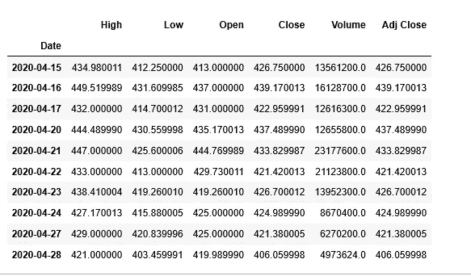

NFLX 股票价格

```
df.reset_index(inplace=True)
df.describe()
```

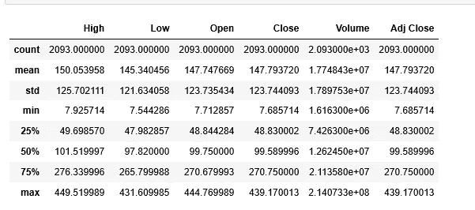

股票价格统计

## **3。检查相关性**

在我们检查相关性之前，让我们了解它到底是什么？

相关性是对两个特征之间的关联性或依赖性的度量，即 **Y** 会随着 **X** 的变化而变化多少。我们将使用的相关方法是**皮尔逊相关法**。

**皮尔逊相关系数**是衡量相关性最流行的方式，取值范围从-1 到 1 不等。在数学/物理学术语中，可以理解为如果两个特征正相关，那么它们是**正比**，如果它们共享负相关，那么它们是**反比**。

```
corr = df.corr(method=’pearson’)
corr
```

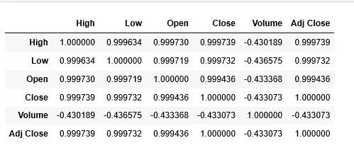

皮尔逊相关系数

不是所有的文字都是可以理解的，让我们把相关系数形象化。

```
import seaborn as sb
sb.heatmap(corr,xticklabels=corr.columns, yticklabels=corr.columns,
            cmap='RdBu_r', annot=True, linewidth=0.5)
```

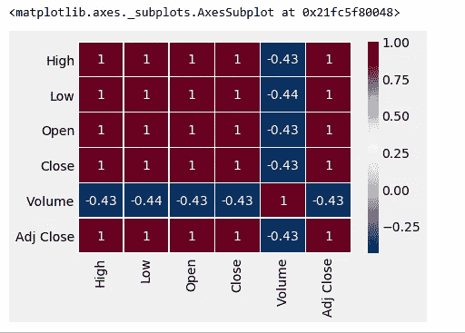

相关图

深栗色区不是栗色 5，哈哈开玩笑，但它表示高度相关的功能。

## **4。用独立特征可视化因变量**

```
#prepare dataset to work with 
nflx_df=df[[‘Date’,’High’,’Open’,’Low’,’Close’]]
nflx_df.head(10)plt.figure(figsize=(16,8))
plt.title('Netflix Stocks Closing Price History 2012-2020')
plt.plot(nflx_df['Date'],nflx_df['Close'])
plt.xlabel('Date',fontsize=18)
plt.ylabel('Close Price US($)',fontsize=18)
plt.style.use('fivethirtyeight')
plt.show()
```

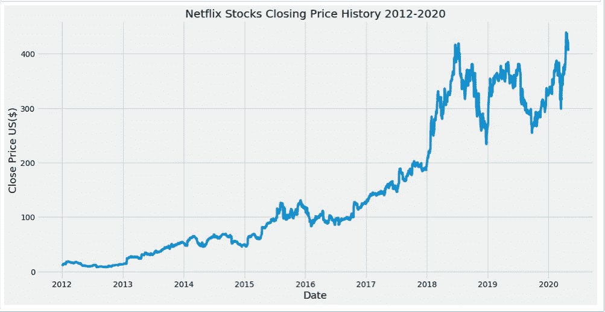

日期与收盘价

```
#Plot Open vs Close
nflx_df[['Open','Close']].head(20).plot(kind='bar',figsize=(16,8))
plt.grid(which='major', linestyle='-', linewidth='0.5', color='green')
plt.grid(which='minor', linestyle=':', linewidth='0.5', color='black')
plt.show()
```

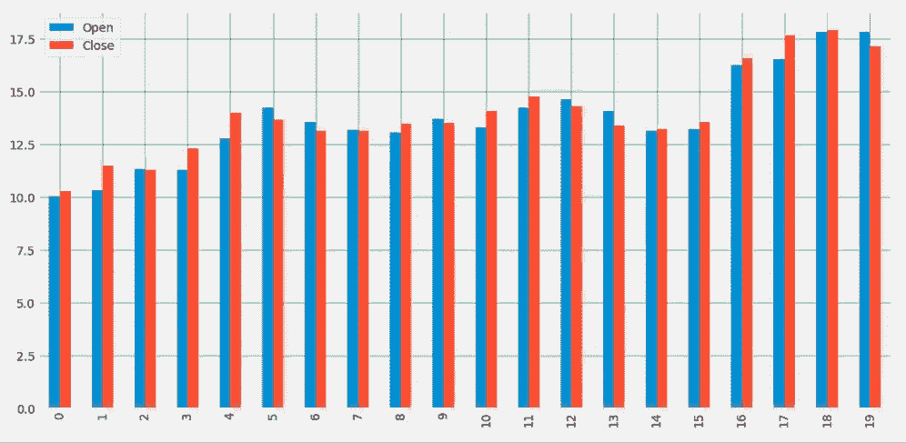

开盘价与收盘价

```
#Plot High vs Close
nflx_df[['High','Close']].head(20).plot(kind='bar',figsize=(16,8))
plt.grid(which='major', linestyle='-', linewidth='0.5', color='green')
plt.grid(which='minor', linestyle=':', linewidth='0.5', color='black')
plt.show()
```

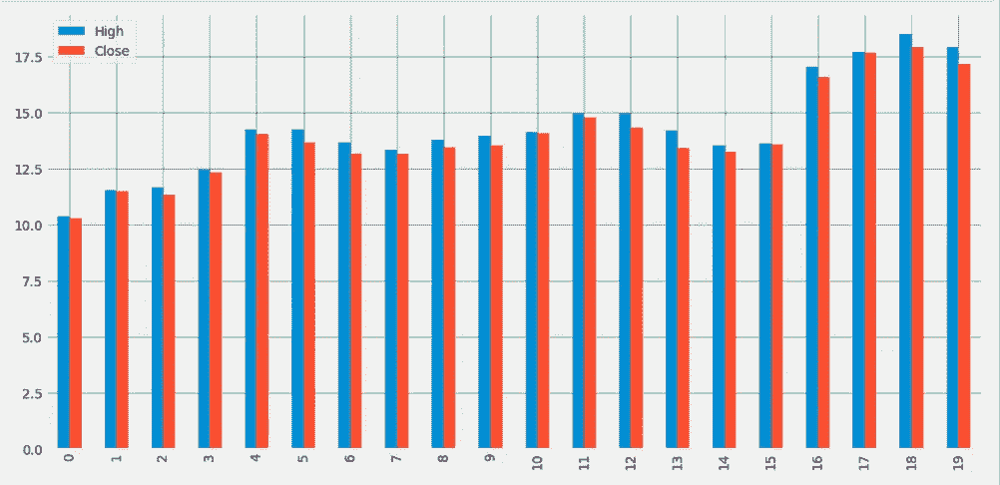

高价与收盘价

```
#Plot Low vs Close
nflx_df[[‘Low’,’Close’]].head(20).plot(kind=’bar’,figsize=(16,8))
plt.grid(which=’major’, linestyle=’-’, linewidth=’0.5', color=’green’)
plt.grid(which=’minor’, linestyle=’:’, linewidth=’0.5', color=’black’)
plt.show()
```

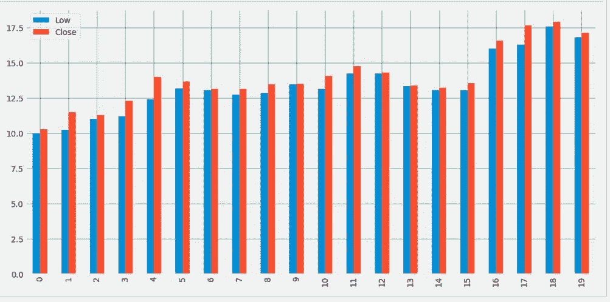

低价对收盘价

## **5。模型训练和测试**

```
#Date format is DateTime and it will throw error while training so I have created seperate month, year and date entitiesnflx_df[‘Year’]=df[‘Date’].dt.year
nflx_df[‘Month’]=df[‘Date’].dt.month
nflx_df[‘Day’]=df[‘Date’].dt.day
```

为模型训练创建最终数据集

```
nfx_df=nflx_df[[‘Day’,’Month’,’Year’,’High’,’Open’,’Low’,’Close’]]
nfx_df.head(10)
```

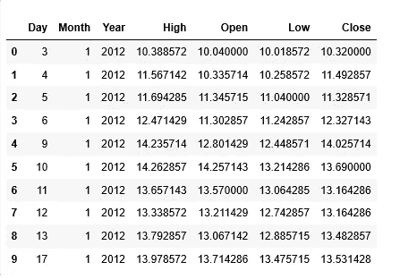

最终训练数据集

```
#separate Independent and dependent variable
X = nfx_df.iloc[:,nfx_df.columns !=’Close’]
Y= nfx_df.iloc[:, 5]print(X.shape)  #output: (2093, 6)
print(Y.shape) #output: (2093,)
```

将数据集分为训练和测试

```
from sklearn.model_selection import train_test_split
x_train,x_test,y_train,y_test= train_test_split(X,Y,test_size=.25)print(x_train.shape) #output: (1569, 6)
print(x_test.shape)  #output: (524, 6)  
print(y_train.shape) #output: (1569,)
print(y_test.shape)  #output: (524,)
#y_test to be evaluated with y_pred for Diff models
```

# **模型 1:线性回归**

## **线性回归模型训练和测试**

```
lr_model=LinearRegression()
lr_model.fit(x_train,y_train)y_pred=lr_model.predict(x_test)
```

## **线性模型交叉验证**

**交叉验证到底是什么？**

基本上，交叉验证是一种在数据集上评估模型的技术，在该数据集上模型没有被训练，即它可以是测试数据，也可以是根据可用性或可行性的另一组数据。

```
from sklearn import model_selection
from sklearn.model_selection import KFold
kfold = model_selection.KFold(n_splits=20, random_state=100)
results_kfold = model_selection.cross_val_score(lr_model, x_test, y_test.astype('int'), cv=kfold)
print("Accuracy: ", results_kfold.mean()*100)#output: Accuracy: 99.999366595175
```

**绘制实际值与预测值的对比图**

```
plot_df=pd.DataFrame({‘Actual’:y_test,’Pred’:y_pred})
plot_df.head(20).plot(kind='bar',figsize=(16,8))
plt.grid(which='major', linestyle='-', linewidth='0.5', color='green')
plt.grid(which='minor', linestyle=':', linewidth='0.5', color='black')
plt.show()
```

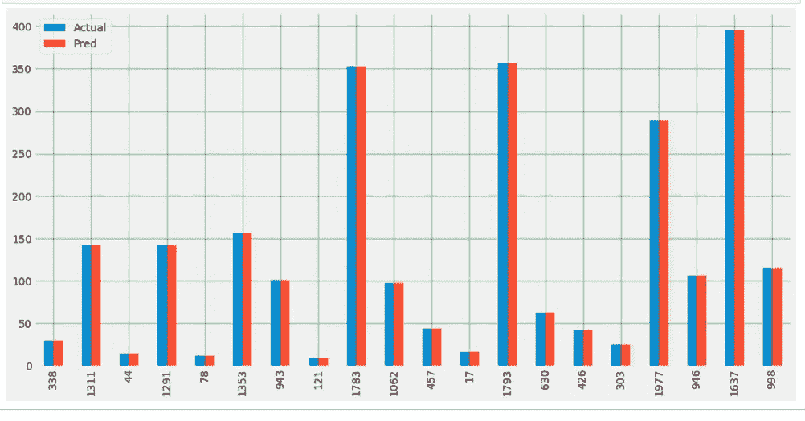

线性实际与预测

# **模型二:KNN K 近邻回归模型**

## **KNN 模型培训和测试**

```
from sklearn.neighbors import KNeighborsRegressor
knn_regressor=KNeighborsRegressor(n_neighbors = 5)
knn_model=knn_regressor.fit(x_train,y_train)
y_knn_pred=knn_model.predict(x_test)
```

## **KNN 交叉验证**

```
knn_kfold = model_selection.KFold(n_splits=20, random_state=100)
results_kfold = model_selection.cross_val_score(knn_model, x_test, y_test.astype(‘int’), cv=knn_kfold)
print(“Accuracy: “, results_kfold.mean()*100)#output: Accuracy: 99.93813335235933
```

## **绘制实际与预测的对比图**

```
plot_knn_df=pd.DataFrame({‘Actual’:y_test,’Pred’:y_knn_pred})
plot_knn_df.head(20).plot(kind=’bar’,figsize=(16,8))
plt.grid(which=’major’, linestyle=’-’, linewidth=’0.5', color=’green’)
plt.grid(which=’minor’, linestyle=’:’, linewidth=’0.5', color=’black’)
plt.show()
```


KNN 实际与预测

# **模型 3: SVM 支持向量机回归模型**

## **SVM 模型培训和测试**

```
from sklearn.svm import SVR
svm_regressor = SVR(kernel=’linear’)
svm_model=svm_regressor.fit(x_train,y_train)
y_svm_pred=svm_model.predict(x_test)
```

## **绘制实际与预测的对比图**

```
plot_svm_df=pd.DataFrame({‘Actual’:y_test,’Pred’:y_svm_pred})
plot_svm_df.head(20).plot(kind=’bar’,figsize=(16,8))
plt.grid(which=’major’, linestyle=’-’, linewidth=’0.5', color=’green’)
plt.grid(which=’minor’, linestyle=’:’, linewidth=’0.5', color=’black’)
plt.show()
```

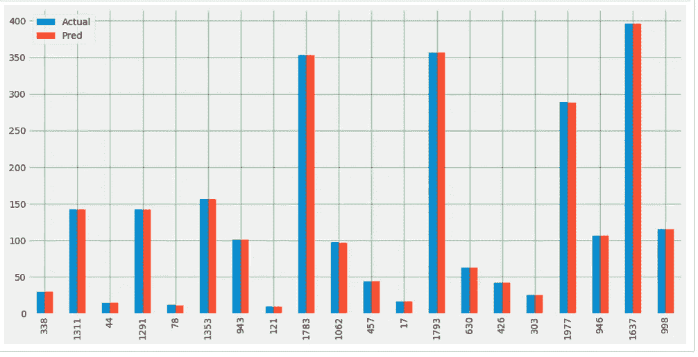

SVM 实际与预测

## **RMSE(均方根误差)**

均方根误差是残差的标准偏差，它衡量数据点与回归的距离。或者简单地说，数据点在最佳拟合线周围有多集中。

```
from sklearn.metrics import mean_squared_error , r2_score
import mathlr_mse=math.sqrt(mean_squared_error(y_test,y_pred))
print(‘Linear Model Root mean square error’,lr_mse)knn_mse=math.sqrt(mean_squared_error(y_test,y_knn_pred))
print(‘KNN Model Root mean square error’,mse)svm_mse=math.sqrt(mean_squared_error(y_test,y_svm_pred))
print(‘SVM Model Root mean square error SVM’,svm_mse)#outputs as below:
Linear Model Root mean square error 1.7539775065782694e-14 
KNN Model Root mean square error 1.7539775065782694e-14 
SVM Model Root mean square error SVM 0.0696764093622963
```

**R2 或 r 平方误差**

r2 或 R2 分数在 0 到 100%之间变化。

**R2 得分的数学公式:(y_test[i] — y_pred[i]) **2**

```
print(‘Linear R2: ‘, r2_score(y_test, y_pred))
print(‘KNN R2: ‘, r2_score(y_test, y_knn_pred))
print(‘SVM R2: ‘, r2_score(y_test, y_svm_pred))#output as below:
Linear R2:  1.0 
KNN R2:  0.9997974105145412 
SVM R2:  0.9999996581785765
```

> 关于对 RMSE 和 R2 误差的基本数学理解，请参考我的博客:[https://www . geeksforgeeks . org/ml-mathematical-explain-of-RMSE-and-r-squared-error/](https://www.geeksforgeeks.org/ml-mathematical-explanation-of-rmse-and-r-squared-error/)

我们的模型看起来非常好，有惊人的统计数据。

# **概要:**

必备库的使用

使用 **pandas_datareader** 从网络中提取数据

基本股票理解

模型训练和测试

ML 算法如**线性回归**、 **K 近邻**和**支持向量机**

**模型的交叉验证**

Python **seaborn** 库可视化关联热图

**皮尔森相关性**

使用 Matplotlib 对相关输出进行特征绘图。

实际值与预测值的绘图。

**均方根误差** (RMSE)。

**R 平方误差**

感谢所有人阅读我的博客，如果你喜欢我的内容和解释，请在媒体上关注我并分享你的反馈，这将永远帮助我们所有人提高我们的知识。

感谢阅读！

Vivek Chaudhary