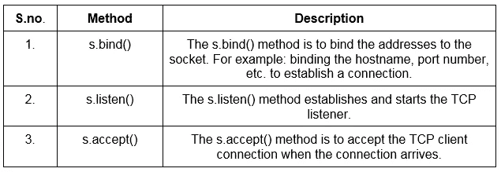
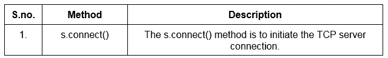
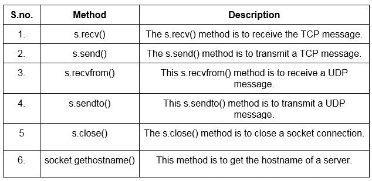

# 用 Python 对套接字、服务器套接字、客户端套接字进行网络编程

> 原文：<https://pub.towardsai.net/network-programming-of-sockets-server-sockets-client-sockets-with-python-5ce556276b0b?source=collection_archive---------1----------------------->

## [编程](https://towardsai.net/p/category/programming)

## 低级和高级接入网内编程


由[埃琳娜·莫日维洛](https://unsplash.com/@miracleday?utm_source=medium&utm_medium=referral)在 [Unsplash](https://unsplash.com?utm_source=medium&utm_medium=referral) 上拍摄的照片

> ***简介***

我们知道 Python 程序有很多用途，比如数据分析、数据可视化、人工智能、机器学习等等。但是，如果我们想从一个明确的 URL 下载文件，与远程系统进行交互，或者使用 python 通过网络发送受密码保护的资源，该怎么办呢？

这就是网络编程发挥作用的地方。

Python 程序是最广泛使用的编程语言之一，用于构建脚本，以使用其各种功能、库和模块来处理计算机网络需求，从而自动化繁琐和复杂的网络配置。它是软件定义的网络中使用最广泛的编程语言。

要在网络上操作，必须能够访问您希望使用的特定网络。Python 通常提供两种级别的网络服务访问:

1.  **低级访问**:在低级，可以在操作系统中访问基本的套接字支持。这允许我们为连接和无连接协议实现服务器和客户机。
2.  **高层访问**:在高层，可以使用 Python 库访问所有应用级网络协议。这些协议的几个例子是 FTP、HTTP 等。

> ***插座***

套接字只不过是网络中运行的两个程序之间的双向通信链接的端点。每个端点都包含一个 IP 地址和一个端口号的组合；使其对于每个系统都是唯一的。利用 IP 地址和端口号，使得 TCP 层可以识别要发送的数据的特定目的地。

为了在两个节点之间建立通信，我们需要对双向连接进行套接字编程。在这里，套接字的一端侦听特定的 IP 地址，而套接字的另一端伸出手来形成连接。这也意味着当客户机向服务器伸出手时，服务器变成了监听器套接字。

套接字可以在同一台机器上的一个进程内通信，也可以在不同国家的进程之间通信。Python 程序提供的库和模块使这些功能成为可能。它由用于管理公共传输和其他复杂任务的套接字库组成。这种类型的编程对于在同一台机器上的一个进程内交换信息、不同国家的进程、将工作分配给效率最高的机器等是非常高效的。换句话说，套接字编程就是使用几行代码使任务自动化。

在进入各种方法和模块之前，让我们先来看看网络中使用的一些重要术语——套接字编程。

1.  **域:**域是指定地址类型，以便套接字可以与该地址通信。简而言之，有必要指定地址族来使用套接字的地址类型。

例如:PF_INET、PF_X25、AF_INET 等。

**2。类型:**“类型”是确定 2 个套接字(端点)之间的通信类型。

示例:SOCK_DGRAM 用于无连接协议，SOCK_STREAM 用于连接协议。

**3。协议:协议是一组特定的数据传输规则。如果调用方不想指定任何协议，协议也可以是“0”。这将由服务提供商来处理。**

示例:TCP/IP、UDP/IP

**4。主机名:**主机名是分配给连接到计算机网络的设备的标签，用于在各种电子通信中识别该设备。

例如:域名:big.foot.com

主机名:大

**5。端口:**任何通信开始和结束时都是虚点。简单来说，就是在网络消息到达服务器时要转发的时候，标识一个特定的流程。

[](/introduction-to-mlops-for-data-science-e2ca5a759f68) [## 面向数据科学的 MLOps 简介

### 持续集成、持续开发和持续测试的一部分

pub.towardsai.net](/introduction-to-mlops-for-data-science-e2ca5a759f68) [](/types-of-kernels-in-machine-learning-291cf85fcdd0) [## 机器学习中的核类型

### 使用线性函数解决非线性问题

pub.towardsai.net](/types-of-kernels-in-machine-learning-291cf85fcdd0) 

> ***插座模块***

创建套接字时最重要的一步是您应该始终使用 socket.socket()函数，该函数由套接字模块提供。使用 python 标准库中的这个模块给了我们 BSD 套接字接口的等价物。下面给出了套接字模块的语法。

**语法:**

```
s = socket.socket (socket_family, socket_type, protocol=0)
```

## **方法:**

*   **服务器套接字:**

服务器套接字提供了客户端或服务器套接字连接的独立实现。换句话说，服务器套接字搜索客户机以与它们建立连接，并相互通信或交换信息。这些是一些服务器套接字方法。



*   **客户端套接字:**

客户端套接字就是，当客户端创建套接字时，他/她会尝试将该套接字连接到服务器。当连接成功时，服务器在其通信端创建一个对象。以下是将客户端连接到服务器的方法:



> ***通用套接字方法***

其他套接字方法有:



现在让我们使用一个实际的例子来研究这些方法:如果您想尝试这个例子，您可以使用 pycharm、VS code editor 或任何其他您喜欢的 IDE。

[](/python-zero-to-hero-with-examples-c7a5dedb968b) [## Python:从零到英雄(带示例)

### python 初学者手册指南

pub.towardsai.net](/python-zero-to-hero-with-examples-c7a5dedb968b) 

> ***简单服务器套接字***

```
# import socket modules
import sockets = socket.socket()
print('socket created')# Get local machine name
hn = socket.gethostname()# Reserve a port for your service.
port = 94989s.bind((host, port))
s.listen(3)# Waiting for client to get connected
print('Waiting for connections')while True:
    # Establish connection with client
    c, addre = s.accept()
    print("Connected with: ",addr) # Close the socket    
    c.send(bytes(‘Welcome to my server’, ‘utf-8’))
    c.close() **Output:** Waiting for connections
Connected with: #the IP address of the client#
```

## **解释:**

在第一行中，我们导入套接字模块来使用必要的库和函数。下一步是创建一个套接字对象。如果你想确保是否；对象创建后，您可以在该行下面打印一条消息，说明“Socket created”。然后，输入您的服务器的主机名(您的本地机器的名称)和端口号，为您的服务预留一个位置。现在，我们使用 s.bind()方法将地址绑定到端口号。

让我们假设我们希望我们的服务器连接到 3 个客户端。因此，我们使用 listen()方法，后跟一个 while 条件。这表明我们的程序将监听想要与我们连接的客户端。如果客户想要连接到我们的服务器，我们必须接受。为此，我们使用程序中所示的 while 循环。您还可以在 while 循环中向客户端发送消息。如您所见，send()方法将消息传输到客户端。一旦服务器连接到 3 个客户端，就必须关闭套接字。

> ***简单客户端套接字***

```
# Import socket modules
import socket# Create a socket object
c = socket.socket()# Get local machine name
hn = socket.gethostname()# Reserve a port for your service(port number of client)
port = 94989
c.connect((host, port))
print (c.recv(1036).decode())# Close the socket
c.close()**Output:** Welcome to my server**Output:** Welcome to my server
```

## **说明:**

我们可以观察到服务器正在“等待连接”当上述程序运行时，客户机套接字将连接到服务器。连接后，输出消息打印为:在服务器端与#客户端的 IP 地址#连接。除此之外，服务器还会向我们发送一条消息，这条消息会在客户端接收到(recv()方法)。一旦收到消息，套接字就被关闭。

> **结论:**

总之，本文已经涵盖了网络套接字连接的基础知识。我强烈建议学习 Unix 套接字编程。使用 python 程序应用这些概念，还可以试验大量套接字库和模块。

我希望你喜欢这篇文章。通过我的 [LinkedIn](https://www.linkedin.com/in/data-scientist-95040a1ab/) 和 [twitter](https://twitter.com/amitprius) 联系我。

# 推荐文章

1.[8 Python 的主动学习见解收集模块](/8-active-learning-insights-of-python-collection-module-6c9e0cc16f6b?source=friends_link&sk=4a5c9f9ad552005636ae720a658281b1)
2。 [NumPy:图像上的线性代数](/numpy-linear-algebra-on-images-ed3180978cdb?source=friends_link&sk=d9afa4a1206971f9b1f64862f6291ac0)3。[Python 中的异常处理概念](/exception-handling-concepts-in-python-4d5116decac3?source=friends_link&sk=a0ed49d9fdeaa67925eac34ecb55ea30)
4。[熊猫:处理分类数据](/pandas-dealing-with-categorical-data-7547305582ff?source=friends_link&sk=11c6809f6623dd4f6dd74d43727297cf)
5。[超参数:机器学习中的 RandomSeachCV 和 GridSearchCV](/hyper-parameters-randomseachcv-and-gridsearchcv-in-machine-learning-b7d091cf56f4?source=friends_link&sk=cab337083fb09601114a6e466ec59689)
6。[用 Python](https://medium.com/towards-artificial-intelligence/fully-explained-linear-regression-with-python-fe2b313f32f3?source=friends_link&sk=53c91a2a51347ec2d93f8222c0e06402)
7 全面讲解了线性回归。[用 Python](https://medium.com/towards-artificial-intelligence/fully-explained-logistic-regression-with-python-f4a16413ddcd?source=friends_link&sk=528181f15a44e48ea38fdd9579241a78)
充分解释了 Logistic 回归 8。[数据分发使用 Numpy 与 Python](/data-distribution-using-numpy-with-python-3b64aae6f9d6?source=friends_link&sk=809e75802cbd25ddceb5f0f6496c9803)
9。[机器学习中的决策树 vs 随机森林](/decision-trees-vs-random-forests-in-machine-learning-be56c093b0f?source=friends_link&sk=91377248a43b62fe7aeb89a69e590860)
10。[用 Python 实现数据预处理的标准化](/standardization-in-data-preprocessing-with-python-96ae89d2f658?source=friends_link&sk=f348435582e8fbb47407e9b359787e41)