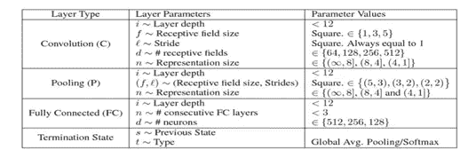
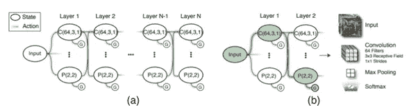
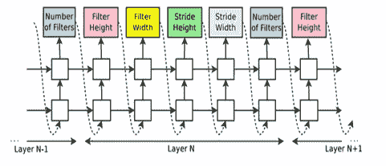
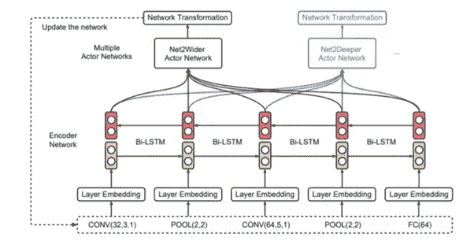
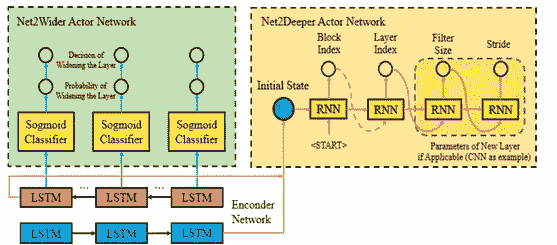
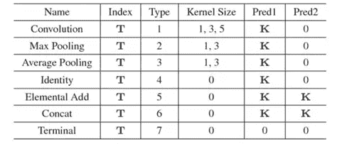
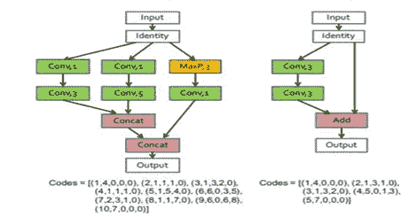
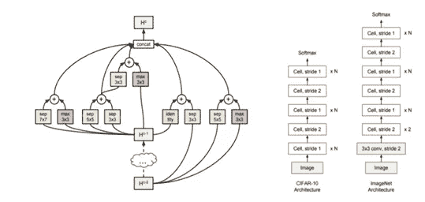

# 神经结构搜索(NAS)和强化学习(RL)

> 原文：<https://pub.towardsai.net/neural-architecture-search-nas-and-reinforcement-learning-rl-5515f32135b9?source=collection_archive---------7----------------------->

## [深度学习](https://towardsai.net/p/category/deep-learning)

计算机视觉，更具体地说是分类任务，是最流行的深度学习技术之一。卷积神经网络(CNN)特别流行于机器学习的计算机视觉领域。CNN 的特殊性在于每个隐层神经元与前一层神经元子集的选择性连接。这意味着在分类任务中，初始隐藏层可以显示边界，第二个隐藏层可以显示特定的形状，依此类推，直到识别特定对象的最后一个隐藏层。

CNN 架构包括几种层类型，包括卷积、池化和全连接。元建模中的许多研究努力试图在设计神经网络架构时最小化人工干预。由[1]提出的基于 RL(强化学习)的方法在众所周知的分类基准上取得了最先进的结果。NAS 方法增强了 NAS 的吸引力，并引发了关于这一研究主题的一系列激动人心的工作。我们的调查主要是出于检查架构搜索的背景，并集中于近年来获得最大兴趣的 RL 方法。

CNN 的性能主要取决于模型结构、训练过程和数据表示。几个超参数用于控制所有这些变量，并对学习过程有重大影响。由于 CNN 结构的未知性，CNN 参数设置被认为是一个黑箱问题。在这种情况下，自动设计解决方案是非常必要的，并启动了大量的研究。CNN 超参数调整的任务已经通过元建模来处理。

使用强化学习(RL)的神经结构搜索(NAS)的一些论文:

# **MetaQNN [2]:**

该模型[2]依赖于 Q 学习在有限空间中顺序选择网络层及其参数。层组成它，如图 1 所示:卷积(C)、池化(P)、完全连接(FC)、全局平均池化和 softmax。MetaQNN 与相似和不同的手工制作的 CNN 架构进行了竞争性评估。给定一定数量的限制，代理动作空间被集成到代理可能移动到的可能层中(图 2)。

图一。状态空间可能的参数[2]

图二。完整状态和动作空间(a)以及代理选择的路径(b)的图示[2]

# **具有强化学习的神经架构搜索[1]:**

控制器递归神经网络(RNN)为 CNN 的卷积层依次选择参数[1]。softmax 分类器预测每个序列输出，并用作后续序列的输入。参数是-过滤器的高度和宽度，步幅的高度和宽度，每层过滤器的数量。一旦层数超过预定义的值，建筑设计就停止。所建立的体系结构的准确性是对 RNN 控制器的 RL 训练的奖励。在 CIFAR10 和 Penn Treebank 数据集上取得了竞争结果(图 3)。

图 3。说明了代理用来选择超参数的方式[1]。

# **高效架构搜索(EAS) [3] :**

在最近的工作中，有效的架构搜索(EAS)，[3]实现了允许重用预先存在的模型的技术。操作包括网络变换活动，如添加、扩展和删除图层。EAS 解决方案的重点是受 Net2Net 技术启发的更深层次的学生网络。如图 4 所示，用双向递归神经网络[4]实现的编码器网络为具有给定架构的网络提供参与者。Net2Wider 的动作网络共享同一个 sigmoid 分类器，并根据每个编码器的隐藏状态决定是否加宽层。Net2Deeper 中的动作网络将最终的双 LSTM 隐藏层输入到递归网络中，递归网络决定在哪里插入该层以及插入层的相应参数。EAS 提供了类似的最先进的模型，无论是手动的还是自动的，这提供了相对较小的计算资源。

图 4。网络改造的元控制器操作[3]。

**图五。**两个行动网络的内部结构:Net2Wider 和 Net2Deeper [3]。

# **BlockQNN [5]:**

最近关于神经结构搜索的大部分工作是基于更复杂的模块化(多分支)结构。然后，这些多分支组件重复堆叠，通过跳跃连接创建深层架构。“逐块”架构通过加快搜索过程显著减少了搜索空间。BlockQNN 是实现块式架构的第一种方法[5]。它使用 Q 学习强化技术自动构建卷积网络。Block 架构接近现有网络，比如 ResNet 和 Inception (GoogLeNet)。块搜索空间如图 5 所示，由五个参数组成。该参数由五层组成:索引(位于块中)、操作类型(通常从七种类型中选择)、内核大小和前趋层的两层索引。通过顺序堆叠 n 次，基于指定的块构建整个网络。图 6 描述了两个不同的块示例，一个具有多分支结构，另一个显示了跳过连接。

图 5。网络结构代码空间[5]。

图 6。具有代表性的块样本及其网络结构代码[5]

# **渐进式神经架构搜索(PNAS)【6】:**

渐进式神经架构搜索(PNAS) [6]提出探索模块化结构的空间，从简单的模型开始，然后发展到更复杂的模型。在这种方法下，模块化结构被称为单元，并且包括设定数量的块。在这种方法中，模块化结构称为单元，包含固定数量的块。每个块由八个选定运算符中的两个运算符组成。为了创建最终的 CNN，首先学习细胞结构，然后将其堆叠 N 次。PNAS 的主要贡献在于通过避免在单元的整个空间中直接搜索来优化搜索过程。最大像元大小为 5 个块，K 等于 256，PNAS 快了 5 倍。性能预测比设计单元的完全训练花费更少的时间。最佳单元架构如图 7 所示。

图 7。PNAS 的最佳选择细胞架构[6]。

当前 RL 方法在 NAS 领域的成功已被广泛证明。然而，这是通过高计算资源的成本来实现的。由于这个原因，目前的技术水平阻止了个体研究人员和小型研究实体(公司和实验室)充分利用这项创新技术。

跟随作者[阿琼戈什哈](https://medium.com/u/add16b429026?source=post_page-----5515f32135b9--------------------------------)T4 来到这里。

**参考文献:**

[1] B. Zoph，Q.V. Le，具有强化学习的神经架构搜索，学习表征国际会议论文集(ICLR)，2017。

[2] B. Baker，O. Gupta，n .纳伊克，R. Raskar，利用强化学习设计神经网络架构，学习表征国际会议论文集(ICLR)，2017。

[3]蔡宏，陈婷，张伟，于，王军，基于网络变换的高效体系结构搜索，2018 年第 32 届人工智能大会。

[4] M. Schuster，K. Paliwal，双向递归神经网络，译。签名。继续。45 (11) 2673–2681, 1997.

[5]钟，严，吴，邵，刘，实用的块式神经网络体系结构生成，IEEE 计算机视觉与模式识别会议，，2018 .

[6]刘 C，佐夫 B，诺依曼 M，施伦斯 J，华 W，李立杰，L，尤耶 A，黄 J，墨菲 K，“渐进式神经架构搜索”，载于:欧洲计算机视觉会议，2018 年。