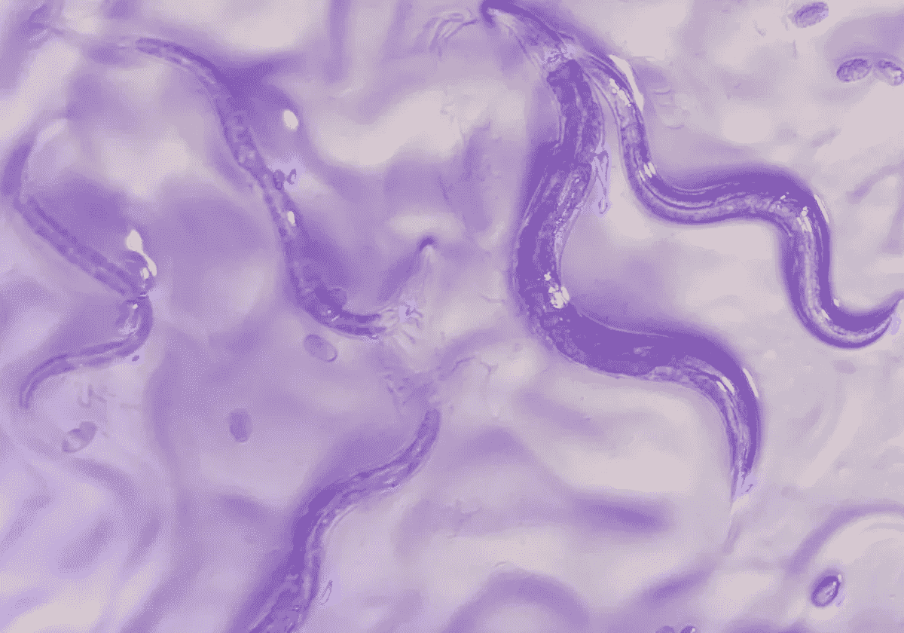
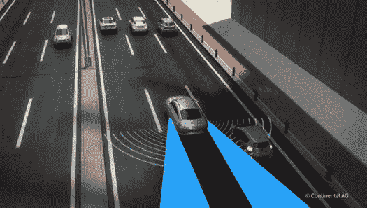
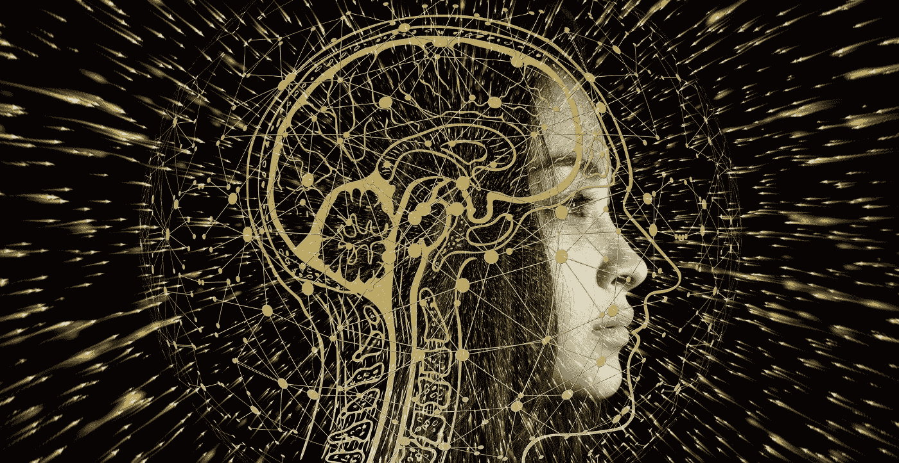

# 神经回路策略:模仿人工智能中的生物模型以获得更好的可靠性和可解释性。

> 原文：<https://pub.towardsai.net/neural-circuit-policies-mimicking-biological-models-in-ai-for-better-reliability-and-6d56c1996bef?source=collection_archive---------2----------------------->

## [技术](https://towardsai.net/p/category/technology)

试图理解 NCP 和 threadworms 如何启发了一组来自麻省理工学院、维也纳大学和 IST 大学的研究人员来建立一个新的人工智能系统。

(图片来自谷歌)

## 自然启发的深度学习

即使在这个先进技术的时代，我们正处于人类发展的技术与人类智慧融合的阶段，大自然总是证明有改进的余地。经过 35 亿年的自然选择和物种进化，大自然母亲设计出了创新的解决方案，并激发了生物科学家、工程师和发明家的灵感。这次是 AI。

> **“多年来，我们一直在研究我们可以从自然中学习什么来改善深度学习，”维也纳大学“网络物理系统”研究小组负责人 Radu Grosu 教授说。**

人工神经网络包含许多相互通信的单个细胞，类似于生命体的大脑。这种交流以信号的形式发生。当一个单元被激活时，它向其他单元发送信号。根据细胞接收到的输入，它可能被激活，也可能不被激活。这样，系统被调整以完成特定的任务。一个细胞影响另一个细胞的方式决定了系统的行为。现在，根据手头的任务，这些参数被调整以执行特定的任务。从识别图像中的猫到破解疫苗的蛋白质结构。

现在，根据任务的复杂程度，人工神经网络的结构会增加并变得更深。即使我们可以用我们拥有的巨大计算能力来完成这项任务，现在出现的问题是，这项任务能用少量的神经元来完成吗？？

似乎有一个答案，那就是神经回路政策(NCP)。NCP 是一种受生物神经元启发的新架构，为能够处理复杂任务的较小模型铺平了道路。这种简单性使它更加健壮和可解释。这种新架构背后的团队表示，与以前的模型相比，该系统具有优势:它更擅长处理有噪声的输入，其简单性使其更容易解释。

## **无人驾驶汽车里的虫子**

C.Elegans(谷歌)

这项研究最有趣的部分是，它的灵感来自我们周围的大自然。更具体地说，来自麻省理工学院、维也纳大学和 IST 大学的研究人员将这个新的人工智能系统建立在线虫(C.elegans)的基础上。这个系统可以用较少的神经元控制车辆。

> **“例如，线虫 C. elegans 的神经元数量少得惊人，但仍然表现出有趣的行为模式。这是由于线虫的神经系统处理信息的高效和谐的方式。”**

threadworms 的布线图展示了具有稀疏网络的特定拓扑，有效的信息传播，需要少量具有分层时间动态的神经元。根据研究人员的说法，蛔虫的布线图达到了 90%左右的稀疏度，主要是从传感器到中间神经元的前馈连接，神经元之间和命令神经元之间的高递归连接，以及从命令神经元到运动神经元的前馈连接。核心上，NCP 拥有一种非线性时变突触传递机制，与深度学习对手相比，这种机制提高了它们在建模时间序列方面的表达能力。NCP 的基本神经构建块被称为液体时间常数(LTC)网络。

这个完整的 NCP 网络比建立端到端驱动技术的卷积神经网络小 63 倍。此外，NCP 的控制网络比长短期记忆(LSTM)稀疏 970 倍，比 CT-RNN 稀疏 241 倍。

## **自动车道保持测试系统**

无人驾驶汽车(谷歌)

在全栈自动驾驶系统中，其中一个组件是自动车道保持，使自动驾驶汽车保持在自己的车道上。神经网络接收来自摄像头的输入，并根据车道向左或向右驾驶汽车。要深入了解车道检测，您可以访问[这个](https://scholar.google.com/citations?view_op=view_citation&hl=en&user=yAxlVQoAAAAJ&citation_for_view=yAxlVQoAAAAJ:u5HHmVD_uO8C)。

如今，这种复杂的任务需要数百万个参数，但这个基于 NCP 的系统仅使用 75000 个参数，将数量减少了两个数量级。该系统的控制部分(称为*神经回路策略*，或 NCP)，将来自感知模块的数据转化为转向命令，仅由 19 个神经元组成。

> **“它只处理视觉数据，从输入像素中提取结构特征。与车辆的实际转向无关。”这个网络决定相机图像的哪些部分是有趣和重要的，然后将信号传递到网络的关键部分——一个“控制系统”,然后控制车辆。**

## **健壮性、可解释性等等**

作为一种新的神经模型和架构，NCP 被认为对噪声输入具有鲁棒性，并实现了对大型深度学习模型几乎不可能实现的可解释性。当研究人员提供扰动的输入图像，而其他深度神经网络认为这是一个不可克服的问题时，NCP 对此表现出强烈的抵制。谈到可解释性，更简单的结构和更少的神经元使得研究神经过程流变得容易。这给了我们一个机会来推断网络在驾驶时关注的是什么。研究人员发现，网络专注于图像的特定部分，这是人工智能系统中的一种独特行为。

此外，有了这样的稀疏系统，每一个细胞在一个特定的决定可以被识别和观察。这为理解每一个细胞和解释它们在整个系统中的功能打开了一扇新的大门。

## **人工智能新发展的国家联络点**

图片(谷歌)

> **“受大自然的启发，我们开发了神经元和突触的** [**新数学模型**](https://arxiv.org/abs/2006.04439) **，”IST 奥地利分校校长 Thomas Henzinger 教授说。**

由于鲁棒性和可解释性是主要优势，NCP 还开辟了减少训练时间和在简单系统中实现 AI 的可能性。生物系统中的计算原理可以成为创建高性能可解释人工智能的重要资源。