# 摩根大通的神经实体链接

> 原文：<https://pub.towardsai.net/neural-entity-linking-in-jpmorgan-chase-29b7f0b7373e?source=collection_archive---------1----------------------->

## *JPMC 在 2021 年发表了一篇***的论文，突出强调了他们对* ***实体的衔接*** *。本文总结了问题陈述、解决方案和论文的其他关键技术组成部分**

*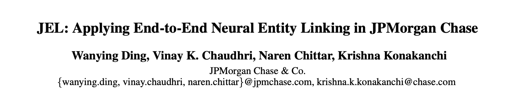*

# *什么是实体链接？*

*它的任务是给文本中不明确提到的**命名实体**分配一个**唯一标识**。*

*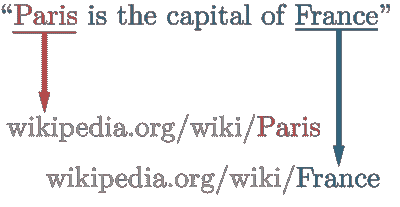*

*从维基百科链接的实体的例子*

*在这里，文本中的“ *Paris* ”通过一个 URL(最常见的类型**URI**)”*wikipedia.org/wiki/Paris*)被赋予了一个唯一的身份。注意，用于标识所提到的实体的 URI 的类型唯一地依赖于域。例如，如果我们要从文本中识别书籍，我们可以使用 ISBNs 而不是网址。*

*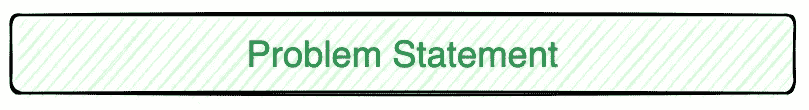*

*JPMC 感兴趣的是:*

> ***从**新闻文章**到存储在其内部知识库中的实体 **(** 存储为**知识图)**映射金融机构***

*下面显示了一个示例:*

*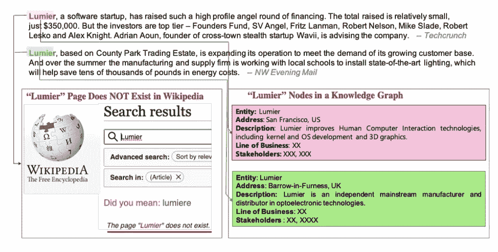*

*论文中的实体链接示例*

*必须定义两个子问题:*

1.  ***识别** :
    从财经新闻文章中提取提及。JPMC 为此使用了空间。*
2.  ***链接:** 从内部知识图中选择正确的实体链接到上一步提取的提及。本文讨论了这一步骤。*

*这种情况的图示如下所示:*

*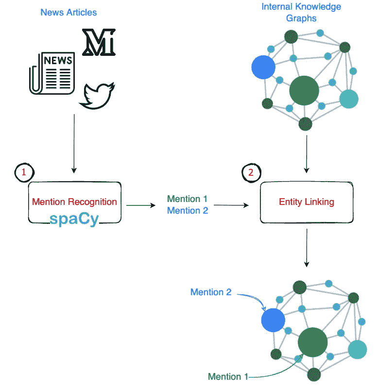*

*(图片由作者提供)作为整体解决方案一部分的子问题*

**

1.  ***字符串匹配** 这些方法捕捉实体名称的“形态”结构。团队用
    (a)**【JAC card】**
    (b)**Levenshtein**
    (c)**Ratcliff-Obershelp**(也称为*完形-模式匹配*)(d)**Jaro Winkler** (e)**N-Gram 余弦相似度***

*这些方法的缺点是它们只关注名称的语法，而不是语义。失败案例的一个例子是“Lumier”和“Lumier”的匹配。尽管它们完全相同，但它们指的是两个不同的实体。*

***2。上下文相似性方法** 这些方法采用提及和实体周围的上下文来给出相似性分数。
“提及”的上下文是提及左边和右边的文本，而
“实体”的上下文是存储在 KG 中该实体的所有数据。
最后，余弦相似度/雅克卡相似度可以用在上下文向量之上。*

***3。最大似然分类** 朴素贝叶斯、逻辑回归和 SVM 在(提及、实体)对上被训练，以找到应该被链接的那些*

***4。学习排列方法(LTR)** 这些模型与 ML 方法协同工作，这可能给我们多个(提及，实体)对作为解决方案。LTR 方法只是缩小到最可能的解决方案。*

*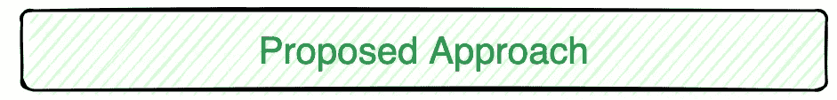*

*其思想是捕获姓名之间的语义距离(语义距离)和句法距离，并使用对比损失函数来训练模型。*

*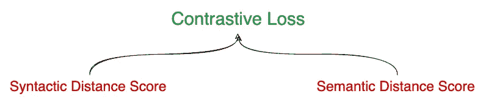*

*我们将在下面看到这两个距离是如何逐步计算的。*

# *步骤 1:获取实体和提及的嵌入*

*为了得出这两个距离，作者建议在 KG 中使用*提及*以及*实体*的嵌入。*

*为了获得 ***实体*嵌入**，作者使用了一个**三重损失函数**(如下所示)*

*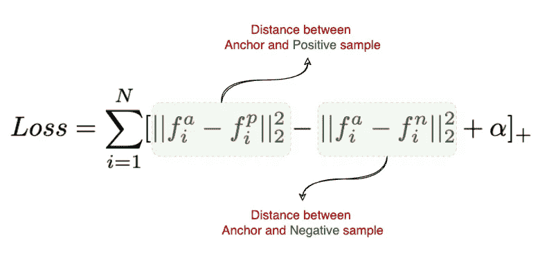*

*三重损失函数*

*对于每个实体，他们使用 10 个阳性和 10 个阴性样本，使得 **10 个<实体、阳性词、阴性词>三个一组**。*

*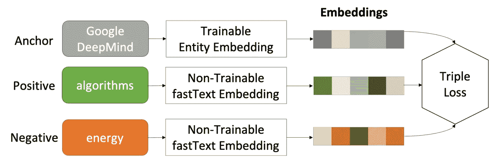*

*实体嵌入模型*

*与他们预先计算的*实体*嵌入不同，***提及*嵌入**使用实时嵌入方法进行训练，其中嵌入矩阵是在训练过程中学习的。*

# *步骤 2:计算句法距离得分*

*在更进一步之前，值得一提的是谷歌在 2016 年推出的**“宽&深】架构**。你可以在这里找到他们的官方博客[。我们不会深入细节，但总结一下，这是一个包含两个组件的体系结构——宽组件和深组件。](https://ai.googleblog.com/2016/06/wide-deep-learning-better-together-with.html)*

*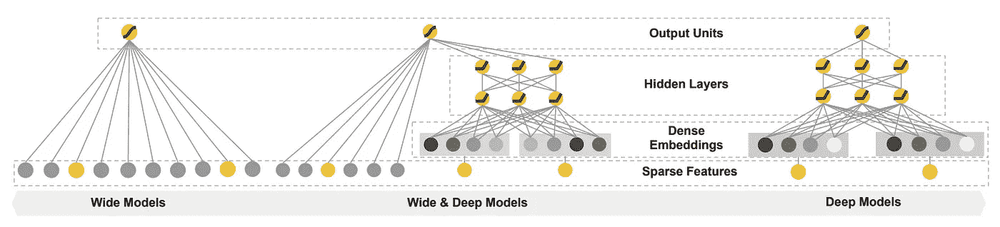*

*图片来自[谷歌论文](https://arxiv.org/pdf/1606.07792.pdf) |宽深度模型谱*

***句法** **距离**分数计算使用宽部分完成，宽部分由一个**线性连体网络组成。***

*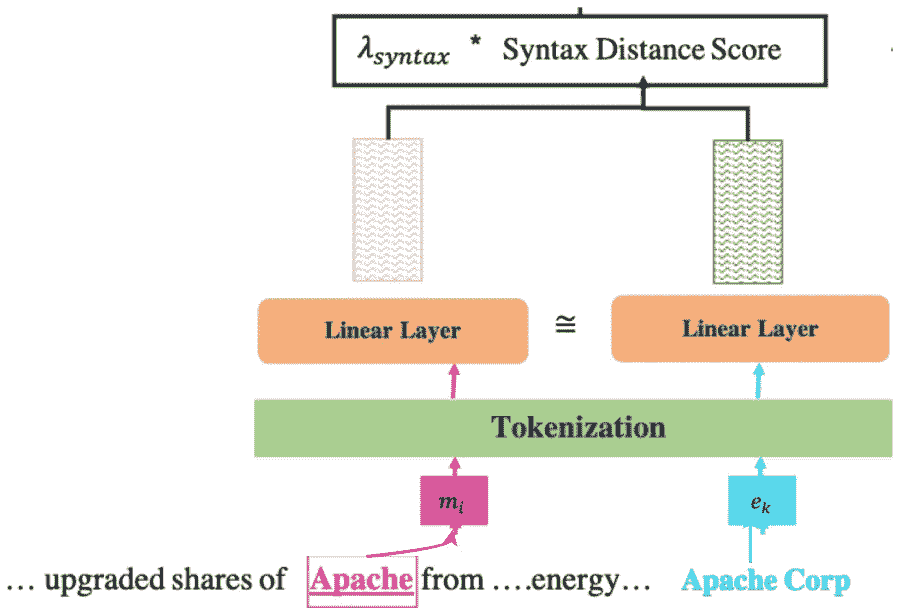*

*句法距离得分的计算*

*暹罗网络的输出是针对*实体*和*提及*的向量，然后对其进行比较以找到欧几里德距离。*

*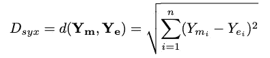*

# *步骤 3:计算语义距离得分*

***语义** **距离**得分计算是使用深度部分完成的*

**

*语义距离得分的计算*

***eₖ** 是步骤 1 中计算的“Apache Corp”的预训练嵌入。为了获得对*提及*的嵌入，它的左右上下文单词被输入到训练嵌入的双 LSTM 网络中。*提及***【vₘ】**和*实体* ( **Vₑ)** 的嵌入向量随后被用于寻找欧几里德距离:*

*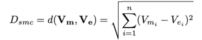*

# *步骤 4:计算对比损失*

*句法距离和语义距离以如下加权方式组合:*

*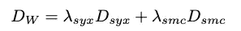*

*对比损失函数然后被组合如下:*

*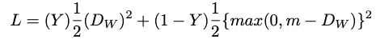*

*对比损失函数*

*其中 Y 是基础真值，值 1 表示提及 m 和实体 e 匹配，否则为 0。*

*结合所有的部分，最终的模型框架如下所示:*

*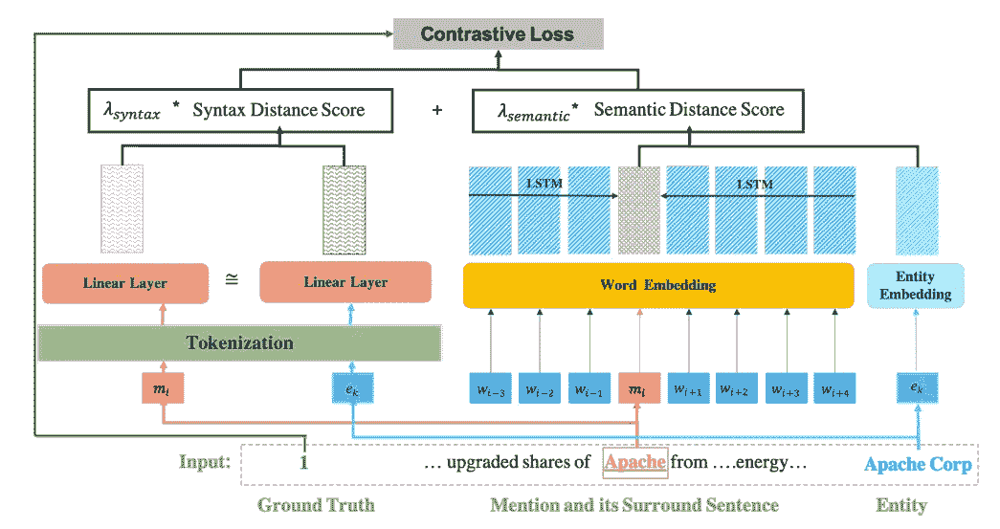*

*JEL 模型框架*

**

*在撰写本文时，JPMC 仍在部署该模型，一旦完成，将有助于支持 JPMC 各地的用户发现对其业务至关重要的相关和精选新闻。*

*从成本的角度来看，并不是所有的提及都通过 JEL 框架，因为这将是计算上昂贵的。JPMC 设置了另一个阻挡层来过滤那些与实体内部 KGs 共享不到 2 个二元模型的提及。*

*再次声明，如果你想阅读全文，这里的是论文链接。*

**跟随* [*直观短讯*](https://intuitiveshorts.substack.com/) *(我的 Substack 简讯)，快速直观的阅读 ML/NLP/DS 概念的摘要。**