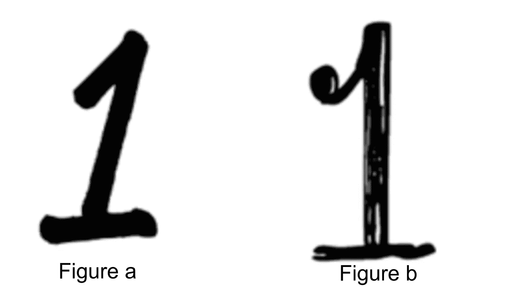
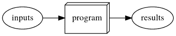
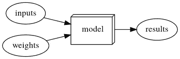
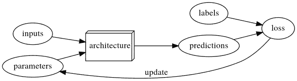
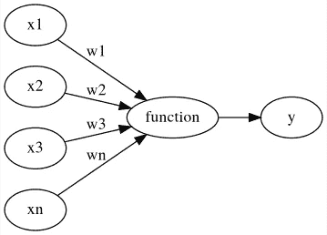
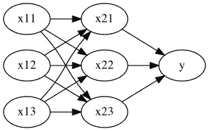
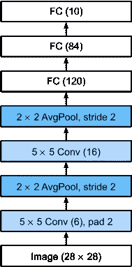
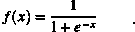
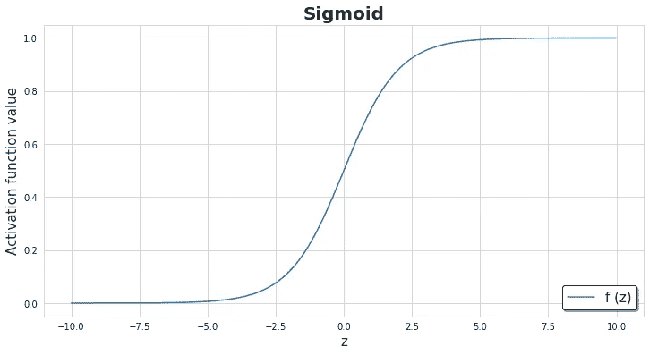
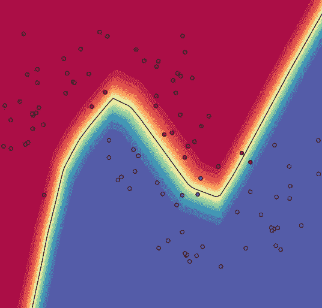

# 探索神经网络

> 原文：<https://pub.towardsai.net/neural-networks-from-scratch-a-brief-introduction-for-beginners-d3776599aaac?source=collection_archive---------2----------------------->

## 深度学习

## 理解神经网络背后的概念。


乔希·希尔德在 [Unsplash](https://unsplash.com?utm_source=medium&utm_medium=referral) 上的照片

# 介绍☕

我们的大脑是我们仍在试图理解的世界奇迹之一。长期以来，我们一直对它的功能和复杂性感到好奇。目前我们能够在一定程度上理解它，但还有很长的路要走！在寻求更多了解大脑及其奇妙能力的过程中，我们受到启发，开发了我们今天称之为**的人工智能**。

> “我们的智慧是我们成为人类的原因，人工智能是这种品质的延伸。”纽约大学教授 Yann LeCun

我们将从基础开始，涵盖深入理解神经网络所需的所有部分。本系列的这一部分包含对您可能遇到过的常见术语的简要介绍，如深度学习、机器学习、人工神经网络等。

在下面的段落中，我还讨论了为什么传统编程无法完成的任务需要机器学习和深度学习。还讨论了常见的疑问和术语，试图以最简单的方式解释，以便初学者/读者理解。

# 动机😇

> 电脑聪明吗？

考虑一个小孩试图学习的手写数字“1”的图像。儿童通过在观看多次后观看图像来学习(*例如*图(a))。下一次，即使我们用不同的书写风格显示数字“1”(例如，*，*图(b))，孩子也会认出这是“1”。我们不需要教孩子学习世界上每一种独特的书写风格，甚至是不同位置的所有情况。即使两幅图像的图像像素的具体值互不相同，大脑也会进行学习。



(数量相同，但像素值不同)

我们的视觉系统接收到的图像的特定像素强度是不同的。但是，我们仍然毫不费力地认出他们都是第一名。同样，我们感知的任何事物都不局限于我们在学习时第一次遇到的确切例子。

如果我们不得不教*计算机*同样的任务，让它们识别数字的图像，那会怎么样？计算机是愚蠢的，它们还没有如此复杂的系统。显而易见的方法是…开发一个程序！

via GIPHY

> 但是，我们必须考虑每一个可能的步骤和所有的细节！那不是很难吗？



(传统编程)

一般来说，编程(— **传统编程**)就是编写一个函数，它接受输入并将其映射到输出。*传统的编程*似乎更加繁琐、令人望而生畏，而且受限。如此具有挑战性的任务需要更好的解决方案。



(机器学习)

很快我们想出了一种方法，我们称之为——**机器学习。**机器学习模型进一步分为监督学习、非监督学习和强化学习。对于这种具有挑战性的任务，机器学习技术是一种更容易接受的方法。但是，它需要大量的数据来获得准确的结果。*机器学习*的思路是，

> 我们现在让程序(计算机)自己解决问题，而不是告诉计算机要学习的确切细节。

有一些特定的性能指标可以显示模型预测的错误程度。基于度量的分数，参数被更新。该模型遵循将输入和参数的组合映射到输出的函数。这一般被称为模型的*假设*。

考虑如下定义的简单模型，

```
Output(Y) = Weights(W)*Inputs(X) + Biases(B)
```

最初，数据被分成训练和测试数据。第一部分是 ***训练*** ，最终我们会得到一组误差较小、精度较好的参数(*权重和偏差*)。

上面的函数表示二维空间中的一条线。我们的模型在训练时使用来自训练数据的一组输入计算输出(Y)，这些输入是模型的 T20 预测’。输出(Y)和预测之间的差异代表*误差*。如果我们得到一个大的误差，这意味着我们的模型是纯的。因此，我们然后选择另一组权重(W)值并再次训练它们。现在，要检查我们的模型是好是坏，是通过测量在看不见的数据(测试数据)上训练后的性能来决定的，也称为*。*

*当用神经网络层(神经网络架构)替换上述模型时，我们称之为**深度学习。***

# *深度学习🤖*

> *深度学习到底是什么？它有什么特别之处？*

**

*(深度学习)*

**深度学习*是使用神经网络架构的*机器学习*的一个子领域。*

*“神经网络”的灵感来自大脑中存在的细胞，名为“**神经元**，它们负责将信息从一个部分发送到另一个部分。这里的概念是找到一个功能，它应该是如此灵活，它不局限于一个特定的任务。神经网络非常适合这类任务。在**通用逼近定理**中证明了以良好的精度解决任何问题的有效性。*

*我已经写了一个帖子，查看下面的更多细节，*

*[](https://towardsdatascience.com/exploring-neural-networks-and-their-fascinating-effectiveness-81ebc054cb16) [## 探索神经网络及其迷人的有效性

### 理解神经网络有效性的基本概念。

towardsdatascience.com](https://towardsdatascience.com/exploring-neural-networks-and-their-fascinating-effectiveness-81ebc054cb16) 

# 调查表🤔

> 回答什么，为什么，如何。

这里我们讨论几个在初学者中普遍出现的问题。(*完整深入的理论可参考上次提到的资源*)

## —什么是神经元？



神经元

> 一个“**函数**，它将**输入** (x ={x1，x2，x3，…，xn})作为向量，然后使用**权重** (w = {w1，w2，w3…)将其映射到标量**输出** (y)。wn})和**非线性函数** (a)。

它的名字是受我们大脑中负责将信息从一个部分发送到另一个部分的“神经元”的启发。

## —什么是神经网络？

> 一个**神经网络**是用一组权重相互连接的神经元层。这种连接通过隐含层从输入向量流向输出向量。

## —神经网络的结构是什么？它由什么组成？



(神经网络-单一隐藏层[3–3–1])

> 一个**神经网络**由**输入**层、**隐藏**层和**输出**层组成。输入层由连接到隐藏层神经元的输入向量组成。对每个连接应用一组权重。此外，隐藏层的神经元连接到输出层的神经元，每个连接上有另一组权重。每一层的输出都经过一个非线性函数。这些从一层传递到另一层，也称为“激活”。

## —什么是神经网络架构？

> 一层一层堆叠的神经网络层的排列。这些包含激活函数和各层之间的各种数学运算。层数一般较高。

比如 ***LeNet*** ，这是一个 ***CNN*** *(卷积神经网络)*。世界上第一个传播深度学习的架构之一。它的结构可以在下面看到，



(LeNet 的一个表示)

蓝色块代表数学运算(卷积、平均池)。FC 代表完全连接的层。

## —什么是“非线性”函数？

> 非线性函数是斜率在区间内变化的函数。这些用于剪切输出或“激活”下一层的输出(例如，隐藏层的输入)。

例如，一个如此强大的函数是 Sigmoid，它被定义为:



其中 x 是输入向量。它的情节如下，



(乙状结肠)

## —为什么我们需要非线性？

> 需要非线性，因为其目的是通过权重和输入的非线性组合产生非线性决策边界。

对于具有这种噪声数据集，线性函数可能得不到好的边界(观察下文)。根据判定边界图可以更清楚地看出，



(非线性决策边界将数据分为两类——红色和蓝色)

## —数据在深度学习中起什么作用？

> 都是数据！

> 我们训练的数据的数量和质量(种类)越好，我们的神经网络的准确性就越好。

## —我们已经走了多远？计算机有多智能？

> 计算机在医疗保健、工业、银行等各个领域表现最佳。一些热门的研究领域是，
> 
> 计算机视觉、自动文本生成、自动机器翻译、自然语言处理，

最近开发的一个这样的例子是由开放人工智能开发的 [GPT-3。](https://www.technologyreview.com/2020/07/20/1005454/openai-machine-learning-language-generator-gpt-3-nlp/)

## —神经网络是最新的技术进步吗？

> 不要！自 20 世纪 40 年代以来，它一直伴随着我们。由于最近的技术进步(GPU、TPU 和 CPU)，它获得了更多的关注。此外，海量数据的可用性在神经网络的发展中起着重要作用。

## —深度学习从业者一般用什么技术栈？

> 最常见的框架是 PyTorch 和 Tensorflow。技术栈一般是 PyTorch，Fastai，Tensorflow，Keras，Gluon，mxnet，Scikit Learn，Pandas 和 Numpy。(不一定局限于这些)* 

# *神经网络的要素🔥💦🌱💨*

> *神经网络的参数是什么？*

*神经网络的元素(参数)可定义如下—*

*   ***权重** —这些可以被认为是调整模型以给出更好预测的“旋钮”。权重是用来决定特定输入的重要性的值。*
*   ***偏差** —添加这些偏差是为了满足期望的决策边界。这些就像截击。*
*   ***目标函数** —输入、权重和偏差之间的关系。它将输入映射到结果。*
*   ***学习率** —这是在最小化误差函数的同时控制每次迭代的步长。*
*   ***错误** —性能指标，给出了我们的模型预测相对于实际标签/事实有多错误的想法。它被定义为调整权重，目标是最小化权重。例如——交叉熵。*
*   ***优化器** —通过考虑误差度量来调整权重以获得准确结果的更新规则(函数)。例如随机梯度下降。*

*神经网络*操作*可以细分为以下内容，*

1.  *正向传播*
2.  *激活功能*
3.  *反向传播*
4.  *更新规则*
5.  *培养*
6.  *预测*

**

*这些将在本系列的下一部分用代码进行简要讨论。*

**

*由 [Manuel Cosentino](https://unsplash.com/@manucosen?utm_source=medium&utm_medium=referral) 在 [Unsplash](https://unsplash.com?utm_source=medium&utm_medium=referral) 上拍摄的照片*

# *结论😇*

> *最后，一篇长长的简介告一段落！*

*人们可以查看以下资源。如果你对上面给出的解释有任何困难，你也可以联系我。*

*深度学习任何人都可以进行！ ***你不需要博士****

# *要检查的参考资料和资源🔎*

> *接下来检查什么？*

1.  *[http://neuralnetworksanddeeplearning.com](http://neuralnetworksanddeeplearning.com)*
2.  *[https://colah . github . io/post/2014-03-NN-Manifolds-Topology/](https://colah.github.io/posts/2014-03-NN-Manifolds-Topology/)*
3.  *[http://alexminnaar.com/2015/02/14/deep-learning-basics.html](http://alexminnaar.com/2015/02/14/deep-learning-basics.html)*
4.  *所有的图片和图表都是从我的笔记本里生成的[这里分享](https://github.com/pr2tik1/neural-networks/blob/master/mlp-numpy/nn-blog.ipynb)。还有，下一个要分享的帖子包含了所有的代码。*

# *关于我😃*

*嗨！我是普拉蒂克·库马尔。通过以下方式联系我，*

*[](https://pr2tik1.github.io) [## 普拉蒂克·库马尔

### 我喜欢玩算法、开发应用程序和尝试新事物。我主要做数据方面的项目…

pr2tik1.github.io](https://pr2tik1.github.io) 

# 我发布的更多帖子:

[](https://towardsdatascience.com/understanding-kaplan-meier-estimator-68258e26a3e4) [## 了解卡普兰-迈耶估计量

### 一种生存分析技术的介绍。

towardsdatascience.com](https://towardsdatascience.com/understanding-kaplan-meier-estimator-68258e26a3e4) [](https://pr2tik1.medium.com/what-happens-to-programmers-in-2020-d04a6bd7452f) [## 开发者趋势

### 根据调查数据分析开发人员和编程趋势。

pr2tik1.medium.com](https://pr2tik1.medium.com/what-happens-to-programmers-in-2020-d04a6bd7452f) [](https://towardsdatascience.com/explore-new-github-readme-feature-7d5cc21bf02f) [## 如何创建令人敬畏的 Github 个人资料-自述文件！

### 探索展示你作为开发者或开源贡献者的“GitHub 简历”的新方法。每一个开源…

towardsdatascience.com](https://towardsdatascience.com/explore-new-github-readme-feature-7d5cc21bf02f)*