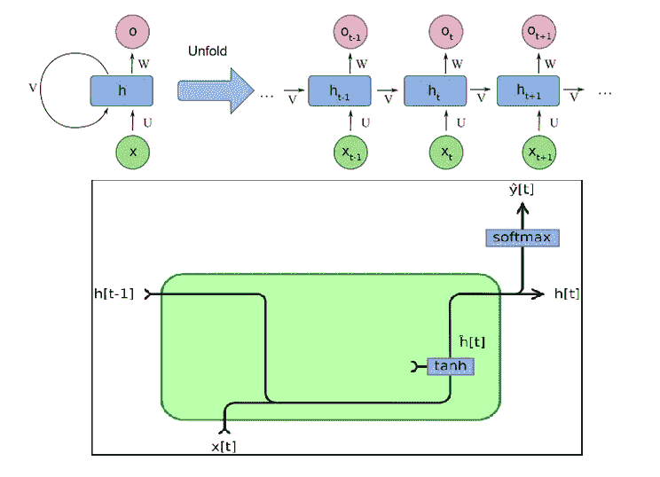
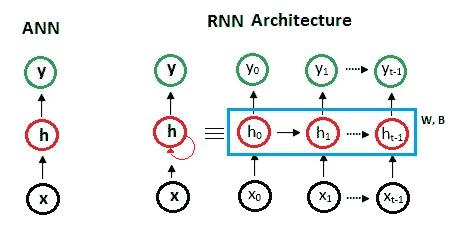
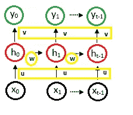
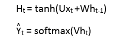
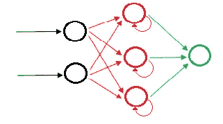
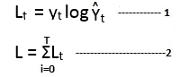
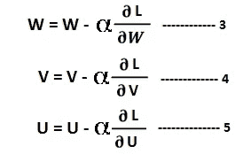

# 神经网络:递归神经网络的兴起

> 原文：<https://pub.towardsai.net/neural-networks-the-rise-of-recurrent-neural-networks-df740252da88?source=collection_archive---------2----------------------->

## [深度学习](https://towardsai.net/p/category/machine-learning/deep-learning)

## 深度学习中的渐进一代



pic 的来源是[中的](https://medium.com/deeplearningbrasilia/deep-learning-recurrent-neural-networks-f9482a24d010)

在本文中，我们将讨论深度学习中的递归神经网络的基础。递归神经网络的兴起是为了克服我们在神经网络和卷积神经网络中看到的局限性。

## 涵盖的主题:

```
**1\. Limitation of neural network and convolutional neural network
2\. Introduction about the architecture of RNN
3\. Working of RNN
4\. Limitation of RNN**
```

> ***限制***

## 人工神经网络

*   设计合适的神经网络没有特定的规则，而是采用试凑法。
*   模特的训练时间比较多。
*   在基于矩阵的大数据的情况下，ram 的存储器大小需要更多。然后数据需要分成许多批，因此任务计算复杂。
*   图像的输入和输出大小是固定的。
*   没有到操作前一状态的记忆存储链接。

## 卷积神经网络

*   图像的倾斜和旋转会给下一个神经元带来更少的信息。
*   与无噪声图像相比，识别有噪声图像的难度。
*   CNN 中输入和输出图像的固定大小也是一样的。
*   CNN 也没有到前一状态的记忆存储链接来识别预测。

因此，递归神经网络克服了图像的长期依赖性和固定维数的问题。

长期依赖性意味着，由于 RNN 处理的记忆存储能力的这种依赖性，未来预测与前一阶段或第一阶段神经元相关联。

递归神经网络捕捉输入数据中存在的顺序信息，即在进行预测时两个数据点之间的相关性。

[](/understand-tensorflow-basic-with-python-87281e737db9) [## 使用 Python 了解 TensorFlow Basic

### 张量流中使用的基本术语

pub.towardsai.net](/understand-tensorflow-basic-with-python-87281e737db9) 

> ***关于 RNN 建筑的介绍***

RNN 建筑的视图如下所示



作者的照片

上图显示了人工神经网络和递归神经网络之间的差异。RNN 中的隐藏层可以再次将隐藏层的输出馈送到输入。多个神经元的输入和输出是输入和输出向量。

```
X = [x1, x2,----x(t-1)]Y = [y1, y2,----y(t-1)]
```

## RNN 的类型

*   **一对一:**在这种类型的 RNN 中，有一个输入和一个输出。它也类似于一个简单的神经网络。这种 RNN 在二元分类中的实际应用。
*   **一对多:**这种类型的 RNN 有一个输入和多个输出。输入也可以是图像形式，输出是该图像中的多个特征。
*   多对一:在这种类型的 RNN 中，有许多输入和一个输出。这种类型的一个例子是股票预测，其中输入是多个时间序列数据，输出是特定时间的预测输出。
*   **多对多:**在这种类型的 RNN 中有许多输入和许多输出。这种类型的一个例子是语言转换，其中输入语言具有许多特征，而转换后的输出语言也具有多个特征。

## 与 RNN 建筑相关的术语



*   **输入大小:**输入的大小是一个(Kx1)的向量，对于所有的输入，大小只是一个向量形式。输入可以是图像或文字，但采用向量形式。
*   **输出大小:**输出的大小也是 Kx1 的向量。
*   **权重(U):** 是输入和隐藏层之间的一个权重。
*   **权重(V):** 是隐藏层和输出层之间的一个权重。
*   **权重(W):** 它是一个自我之间隐含层之间的权重。

## RNN 方程式

RNN 体系结构中有几种类型的等式，如下所示:



RNN 方程式。作者的照片

等式 **H(t)** 具有水平方向的信息流，即从左到右。第二个等式具有垂直方向的信息流，即从底部到顶部。

**H(t)** 是 **h(t-1)** 和 **x(t)** 的函数，其中 **H(t)** 是当前隐藏状态， **h(t-1)** 是前一隐藏状态， **x(t)** 是当前输入。

**U、W 和 V** 是权重矩阵。

[](/step-by-step-basic-understanding-of-neural-networks-with-keras-in-python-94f4afd026e5) [## 使用 Python 中的 Keras 逐步基本了解神经网络

### 具有定义的神经网络的学习

pub.towardsai.net](/step-by-step-basic-understanding-of-neural-networks-with-keras-in-python-94f4afd026e5) [](/understand-time-series-components-with-python-4bc3e2ba1189) [## 用 Python 理解时间序列组件

### 机器学习中预测模型的基本概念及实例

pub.towardsai.net](/understand-time-series-components-with-python-4bc3e2ba1189) 

> ***RNN 的作品***

RNN 的基本功能是记住以前的状态，以便预测的输出更加准确。

我们将讨论如下所示的两种工作状态:

*   正向传播
*   反向传播

## 正向传播

我们上面讨论的两个方程向前传播，因此流量信息将水平和垂直传播。我们可以看到一个简单的正向传播图，如下所示:



在 RNN 向前传播。作者的照片

正向传播中还有两个等式，如下所示:



等式 1st 是分类问题情况下的多类熵损失。熵损失用于寻找概率以提高分类性能，因此，多类用于多类预测。

```
y(t) is the actual label
y^(t) is the predicted label
```

等式 2nd 是通过从 i=0 到时间(T)的单独输出预测的 RNN 中的总损失。

这两个方程用于量化预测与实际标签的接近程度。

## 通过时间的反向传播或反向传播(BPTT)

这是我们训练网络的模型的一部分。此部分的功能用于更新 RNN 的可训练参数，参数为 U、V 和 W，即 RNN 中的重量。

我们使用梯度下降方程来更新权重，如下所示:



等式 3 是 W 权重的更新等式。方程 4 是 V 权值的更新方程。方程 5 是 U 权值的更新方程。L 是完全损失，α是学习参数。

> ***RNN 的局限***

我们讨论了一个模型来克服神经网络和 CNN 模型，但仍然有一个问题与消失梯度问题。为了解决这个问题，我们采用了以下方法:

1.  **随时间截断反向传播:**这是一种我们用来标记时间之间的部分以避免过度反向传播的方法。
2.  **裁剪方法:**对特定范围的权重的导数进行裁剪。这个方法在 TensorFlow 中很容易实现，这样梯度下降就不会爆炸和消失。
3.  使用先进的架构，如 LSTM 和格鲁

> **结论:**

本文给出了递归神经网络的基本理解。逐渐消失的梯度问题促使人们寻找更先进的建筑，如 LSTM 和 GRU，这将在以后的文章中讨论。

我希望你喜欢这篇文章。通过我的 [LinkedIn](https://www.linkedin.com/in/data-scientist-95040a1ab/) 和 [twitter](https://twitter.com/amitprius) 联系我。

# 推荐文章

[1。NLP —零到英雄与 Python](https://medium.com/towards-artificial-intelligence/nlp-zero-to-hero-with-python-2df6fcebff6e?sk=2231d868766e96b13d1e9d7db6064df1)
2。 [Python 数据结构数据类型和对象](https://medium.com/towards-artificial-intelligence/python-data-structures-data-types-and-objects-244d0a86c3cf?sk=42f4b462499f3fc3a160b21e2c94dba6)3 .[Python 中的异常处理概念](/exception-handling-concepts-in-python-4d5116decac3?source=friends_link&sk=a0ed49d9fdeaa67925eac34ecb55ea30)
4。[用 Python 进行主成分分析降维](/principal-component-analysis-in-dimensionality-reduction-with-python-1a613006d531?source=friends_link&sk=3ed0671fdc04ba395dd36478bcea8a55)
5。[用 Python 全面讲解 K-means 聚类](https://medium.com/towards-artificial-intelligence/fully-explained-k-means-clustering-with-python-e7caa573176a?source=friends_link&sk=9c5c613ceb10f2d203712634f3b6fb28)
6。[用 Python](https://medium.com/towards-artificial-intelligence/fully-explained-linear-regression-with-python-fe2b313f32f3?source=friends_link&sk=53c91a2a51347ec2d93f8222c0e06402)
7 全面讲解了线性回归。[用 Python](https://medium.com/towards-artificial-intelligence/fully-explained-logistic-regression-with-python-f4a16413ddcd?source=friends_link&sk=528181f15a44e48ea38fdd9579241a78)
充分解释了 Logistic 回归 8。 [Nengo:一种新的神经网络构建和部署工具](/nengo-a-new-neural-network-building-and-deployment-tool-66677c65fa19?source=friends_link&sk=6f6d2495d486dda2acb28f2d2bf7dd77)
9。[与 Python 的数据角力—第一部分](/data-wrangling-with-python-part-1-969e3cc81d69?source=friends_link&sk=9c3649cf20f31a5c9ead51c50c89ba0b)
10。[机器学习中的混淆矩阵](https://medium.com/analytics-vidhya/confusion-matrix-in-machine-learning-91b6e2b3f9af?source=friends_link&sk=11c6531da0bab7b504d518d02746d4cc)