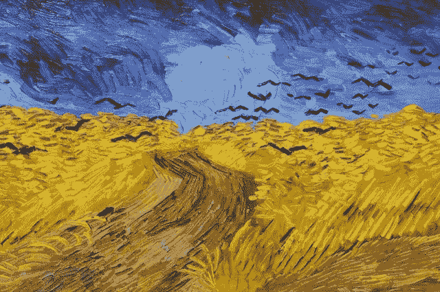
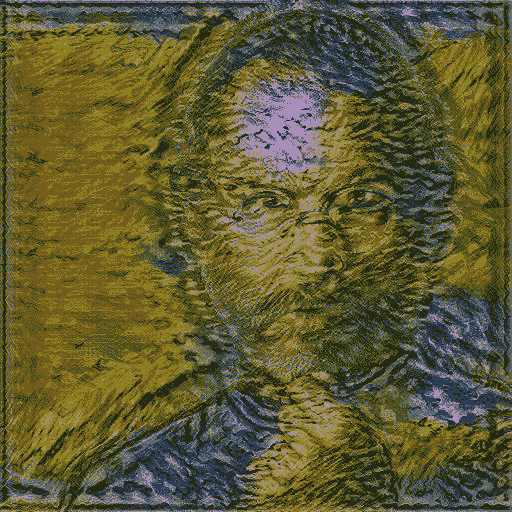

# 使用简单的 python 库进行神经风格转换

> 原文：<https://pub.towardsai.net/neural-style-transfer-using-a-python-library-112c08ee93c6?source=collection_archive---------5----------------------->

## [计算机视觉](https://towardsai.net/p/category/computer-vision)

使用惊人的**神经样式转移** python 库和几行代码的神经样式转移指南。

在这个 [*教程*](https://colab.research.google.com/drive/1ZMX9POGds87CZyIgagLbnAN-eEa8fr2L?usp=sharing) 中，我们将学习如何使用 [**神经样式转移**](https://pypi.org/project/neural-style-transfer/) 库，使用几行代码就可以将图像合成为其他图像的样式。

神经样式转移基本上是一种优化技术，它将两张图片作为输入，一张图片**参考样式图片**，另一张图片是**输入**您想要样式化的图片——模型将这两张图片混合在一起，并生成一张看起来像给定输入(**内容**)但在给定参考样式图片中绘制的转换后的图片。

看起来很有趣，对吧..但是它需要很多东西，包括图像预处理代码、模型训练代码、优化函数和许多其他小函数，但是为了摆脱所有这些东西，我们有一个惊人的库，叫做 [**神经类型转移**](https://pypi.org/project/neural-style-transfer/) ，它只用几行代码就为我们做了所有这些事情，所以在这个博客中，我们将向你展示如何使用这个漂亮的库。

首先，安装库

```
pip install neural-style-transfer
```

导入库并创建一个类对象

```
from neuralstyletransfer.style_transfer import NeuralStyleTransfernst = NeuralStyleTransfer()
```

现在我们需要使用给定的命令加载内容和引用样式图像。

这里我使用了一个来自外部 URL 的图像，你也可以通过提供一个绝对路径和 pathType='local '直接从本地机器加载图像。

```
content_url = 'https://i.ibb.co/6mVpxGW/content.png'
style_url = 'https://i.ibb.co/30nz9Lc/style.jpg'nst.LoadContentImage(content_url, pathType='url')
nst.LoadStyleImage(style_url, pathType='url')
```

**内容图片**


内容图像

**风格图像**



太好了！现在我们都准备好开始模特训练了..

不需要写任何长代码，你只需要调用应用函数和模型开始优化，并给出最终结果作为输出。

```
output = nst.apply(contentWeight=1000, styleWeight=0.01, epochs=600)
```

**输出**变量包含最终转换的图像，您可以使用枕头库保存输出。

```
from PIL import Image
output.save('output.jpg')
```

这个过程需要一些时间，基于你机器的硬件，我建议使用一个 **GPU** 机器来使这个过程快得多。

在应用功能中，您可以根据自己的需求提供不同的超参数。

*   **内容权重**→使用此参数，我们可以指定内容图像的权重，如果该值设置得比转换后的(结果)图像低，则图像看起来不清晰。要使内容图像更清晰，您可以增加内容权重的值。
*   **样式重量**→使用这个参数我们可以指定样式图像的重量，通常它被设置为 0.01，但是如果你想使它变轻，你可以根据你的要求降低这个值。
*   **纪元**→使用此参数，您可以设置模型训练的纪元数量，因为这是一个优化问题，您可以将其设置为更高的值，如 500 或 600，甚至更高。如果您希望您的图像更清晰，基本上纪元图像的数量越高越优化，在训练期间，它会打印内容和样式图像的损失，因此基于此，您可以决定您的纪元以获得最佳结果。

**转换后的图像(输出)**



输出图像

哇..上面我们做的就是我们改造后的形象的样子

检验这款用于演示的笔记本电脑。