# NTM:神经图灵机

> 原文：<https://pub.towardsai.net/neural-turing-machines-eaada7e7a6cc?source=collection_archive---------0----------------------->

## 神经图灵机的详细走查


由 [Unsplash](https://unsplash.com/s/photos/technology?utm_source=unsplash&utm_medium=referral&utm_content=creditCopyText) 上的 [Kvistholt 摄影](https://unsplash.com/@freeche?utm_source=unsplash&utm_medium=referral&utm_content=creditCopyText)拍摄

# 介绍

我们讨论神经图灵机(NTM)，一种由 Graves 等人在 DeepMind 中提出的架构。ntm 旨在解决需要向外部存储器写入信息和从外部存储器检索信息的任务，这使其类似于工作记忆系统，可以通过信息的短期存储(记忆)及其基于规则的操作来描述。与具有内部存储器的 RNN 结构相比，ntm 利用注意机制来高效地读写外部存储器，这使得它们成为捕获长程相关性的更有利的选择。但是，正如我们将看到的，这两者并不是相互独立的，可以结合起来形成一个更强大的体系结构。

# 神经图灵机

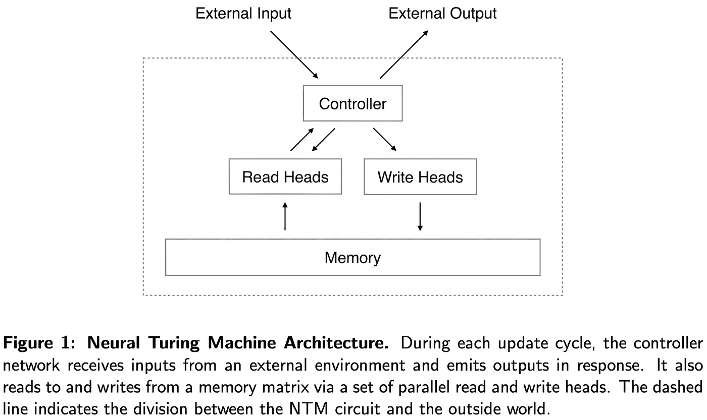

资料来源:亚历克斯·格雷夫斯、格雷格·韦恩和伊沃·达尼埃尔卡。2014.“神经图灵机”

NTM 的整体架构如图 1 所示，其中*控制器*是一个普通的神经网络，一个 MLP 或 RNN，它接收输入和先前的读取向量，并作为响应省略输出。此外，它通过一组并行读写头从存储器矩阵中读取和写入。*内存*是一个 *N ⨉ W* 矩阵，其中 *N* 是内存位置(行)的数量， *W* 是每个位置的向量大小。

## 阅读

在每个时间步 *t* ，读取头输出在 *N* 个位置上的归一化权重的矢量***w****_ t*。磁头返回的长度为 *W* 的读取向量***r****_ t*定义为行向量***M****_ t(I)*的加权组合:

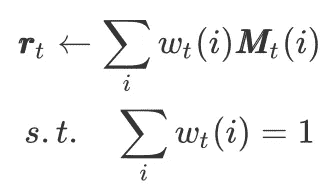

我们可以将上面的等式矢量化如下

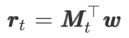

等式 1

# 写作

写操作被分解成两个部分:一个*擦除*，随后是一个*添加*。在每个时间步 *t* ，写头发出三个向量:一个*N*-维度加权向量 ***w*** *_t* ，一个*W*-维度擦除向量***e****_ t*，以及一个*W*-维度相加向量 ***a*** *每个存储器向量***M****_ { t-1 }(t)*首先被擦除向量修改:*

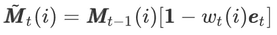

其中 ***1*** 是全 1 的行向量，针对存储位置的乘法是逐点进行的

则应用添加向量

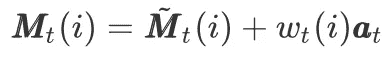

我们还可以将上述两种操作结合起来，并对它们进行矢量化，如下所示

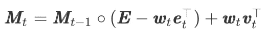

等式 2。其中 ***E*** 是具有与 ***M*** 相同形状的 1 的矩阵，并且∘表示逐元素乘法

# 寻址机制

到目前为止，我们已经展示了读写的等式，但是我们还没有描述权重是如何产生的。这些权重是通过将两种寻址机制与互补设施相结合而产生的:

1.  第一种机制是基于内容的寻址，它基于位置与控制器发出的权重的相似性来关注位置。这可能是一种建立在余弦相似性基础上的注意机制，我们在讨论[变压器](https://medium.com/towards-artificial-intelligence/attention-is-all-you-need-transformer-4c34aa78308f?source=friends_link&sk=a259e84597d542f812a155711e9c8e97)时已经看到过。
2.  第二种机制是基于位置的寻址，它根据变量的位置而不是内容来识别变量。这种机制对于算术问题非常有用:例如，变量 *x* 和 *y* 可以取任何值，但是只要它们的地址被识别，过程 *f(x，y)= x ⨉ y* 仍然应该被定义。

请注意，基于内容的寻址比基于位置的寻址更普遍，因为内存位置的内容可能包含位置信息。然而，在实验中，Graves 等人发现提供基于位置的寻址作为原始操作对于某些形式的一般化是必要的，因此他们同时使用了这两种机制。图 2 展示了整个寻址机制。我们将在下面的小节中一步一步地介绍它。

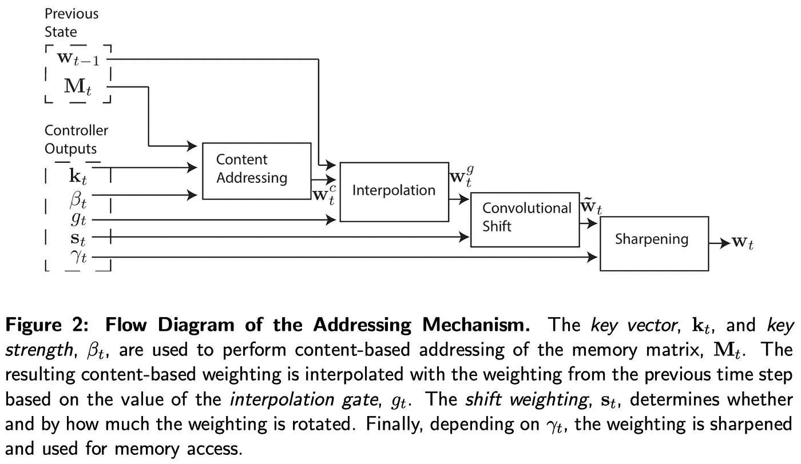

资料来源:亚历克斯·格雷夫斯、格雷格·韦恩和伊沃·达尼埃尔卡。2014.“神经图灵机”

## 基于内容的寻址

对于内容寻址，我们基于 ***M*** *_t* 和*w***k****_ t*的行之间的余弦相似度来计算归一化权重 ***w*** *_t^c* ，为了调整相似度的有效性，我们另外引入了一个正的密钥强度 *𝛽_t* ，它可以这导致以下加权*

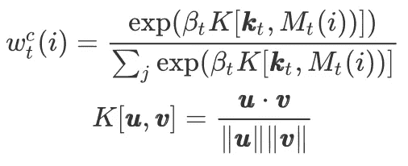

我们可以将这种计算矢量化为

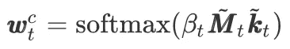

等式 3。其中\波浪号 M 是具有 l2 规范化行的 M，而\波浪号 k 是 l2 规范化的 k，

## 基于位置的寻址

基于位置的寻址机制被设计成便于跨越存储器位置的简单迭代和随机存取跳转。这是通过实现加权的旋转移位来实现的。

在旋转之前，每个头发出一个范围为 *(0，1 )* 的标量插值门 *g_t* 。 *g_t* 的值用于融合头部在前一时间步产生的权重****w****_ { t-1 }*和基于内容的权重***w****_t^c*:*

*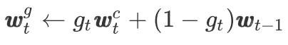*

*等式 4*

*尤其是当 *g_t=0* 、**、 *w* 、**、 *_t^g* 等于**、 *w* 、**、 *_{t-1}、*时，完全省略了基于内容的加权，简单地专注于位置移位。*

*插值后，我们对加权应用 1-D 卷积移位核，其参数***s****_ t*是由头部产生的归一化分类分布，必要时用零填充(例如参见最后的代码):*

*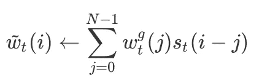*

*等式 5*

*其中所有索引算法都是以 *N* 为模计算的。如果移位加权**_ t*不尖锐，这种卷积运算会导致权重随时间的泄漏或分散。为了解决这一问题，每个头发射另一个标量 *𝛾_t≥1* ，其作用是锐化最终权重，如下所示:**

**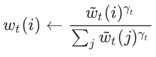**

**等式 6**

**值得注意的是，正如 Graves 等人在实验中提到的，他们发现方程 4 和方程 6 在训练数据范围之外的 NTM 推广中起着重要作用。**

## **摘要**

**现在我们将寻址机制总结如下:**

1.  **使用等式 3 计算内容权重***w****_t^c*。**
2.  **通过将内容权重 ***w*** *_t^c* 内插到先前的权重****w****_ { t-1 }*中来计算门控权重 ***w*** *_t^g* ，这是通过等式 4 来完成的。***
3.  **将 1D 卷积核应用于门控加权，以获得基于局部的加权*\波浪号****w****_ t*遵循等式 5。**
4.  **使用等式 6 通过锐化*\波浪号****w****_ t*来计算最终权重。**

**加权插值和基于内容和位置的寻址的组合寻址系统可以在三种互补模式下操作:**

1.  **内容系统可以选择权重，而无需位置系统进行任何修改，在这种情况下，对于 j≠0，和*γt = 1*，我们有 *g_t=1，s_t(0)=1，s_t(j)=0。***
2.  **由内容寻址系统产生的权重可以被选择，然后被移动。这允许焦点跳转到内容访问的地址旁边的位置，而不是在该地址上；在计算方面，这允许磁头找到一个连续的数据块，然后访问该数据块中的特定元素**
3.  **来自先前时间步长的权重可以被旋转，而无需来自基于内容的寻址系统的任何输入( *g_t=0* )。这允许加权通过在每个时间步长推进相同的距离来迭代通过地址序列。**

# **履行**

**在本节中，我们将进一步讨论 Collier&Beel 工作中的一些实现细节。**

## **存储器内容初始化**

**他们尝试了三种不同的内存内容初始化:**

1.  ***常量初始化*:所有内存位置初始化为 *10^{-6}***
2.  ***学习初始化*:我们在训练时通过内存初始化反向传播**
3.  ***随机初始化*:每个内存位置被初始化为一个从截尾正态分布中提取的值，平均值 *0* 和标准偏差 *0.5* 。**

**他们发现常量初始化比其他两种方案更有效。**

## **其他参数初始化**

**它们通过读取向量***r****_ 0*和地址权重***w****_ 0*的初始化来反向传播，而不是将它们初始化为偏置值。**

## **相似性测度**

**他们使用余弦相似性，如等式 3 所示**

## **控制器输入**

**在每个时间步 *t* ，控制器接收来自环境的输入，并从 NTM 的所有读取头读取向量**_ { t-1 }*。***

## **参数非线性**

**他们申请**

*   **tanh 函数对关键向量 ***k*** *_r* 和添加向量***a****_ t***
*   **sigmoid 函数对擦除向量***e****_ t*和门 *g_t***
*   **softplus 函数用于键入强度以满足约束 *𝛽_t > 0***
*   **softmax 函数对卷积移位向量***s****_ t***
*   **oneplus 功能(*【1+log(1+e^x】)*)锐化因子**

## **等式 5 的代码**

```
**s = tf.concat(
  [s[:, :shift_range + 1],
  tf.zeros([s.get_shape()[0], memory_size - (shift_range * 2 + 1)]),
  s[:, -shift_range:]], axis=1
)
t = tf.concat([tf.reverse(s, axis=[1]), tf.reverse(s, axis=[1])], axis=1)
s_matrix = tf.stack(
    [t[:, memory_size - i - 1: memory_size * 2 - i - 1] 
     for i in range(memory_size)],
    axis=1
)
w_ = tf.reduce_sum(tf.expand_dims(w_g, axis=1) * s_matrix, axis=2)      # Equation 5**
```

**让我们举一个简单的例子来更清楚地看到这个过程。假设内存大小(即 *N* )为 *4* ，移位范围为 *1* ，*s =【0.5，0.2，0.3】*，其中 *0.5* 为中心质量(为简单起见，此处省略批量尺寸)。那么我们有**

```
**w_g = np.array([
  [.1, .2, .3, .4]
])
s = np.array([.5, .2, 0, .3])
t = np.array([.3, 0, .2, .5, .3, 0, .2, .5])
s_matrix = np.array([
  [.5, .3, 0, .2],
  [.2, .5, .3, 0],
  [0, .2, .5, .3],
  [.3, 0, .2, .5]
])
w_ = np.sum(w_g * s_matrix, axis=1)
# >>> array([0.19, 0.21, 0.31, 0.29])**
```

# **参考**

**亚历克斯·格雷夫斯，格雷格·韦恩和伊沃·丹尼卡。2014.《神经图灵机》1–26。[http://arxiv.org/abs/1410.5401](http://arxiv.org/abs/1410.5401)。**

**科利尔，马克和乔兰·比尔。2018."实现神经图灵机。"计算机科学讲义(包括人工智能的子系列讲义和生物信息学的讲义)11141 LNCS:94–104。[https://doi.org/10.1007/978-3-030-01424-7_10](https://doi.org/10.1007/978-3-030-01424-7_10)。**

**代号:[https://github.com/MarkPKCollier/NeuralTuringMachine](https://github.com/MarkPKCollier/NeuralTuringMachine)**