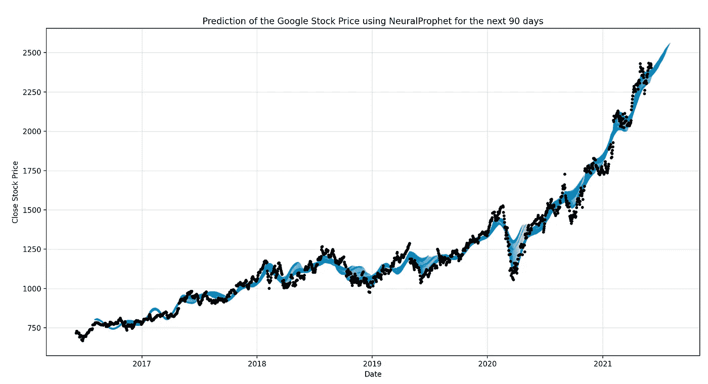
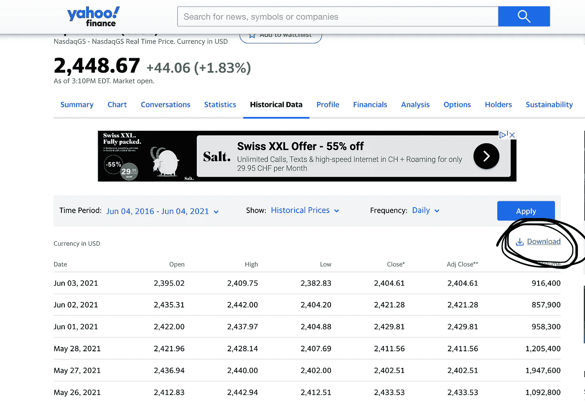
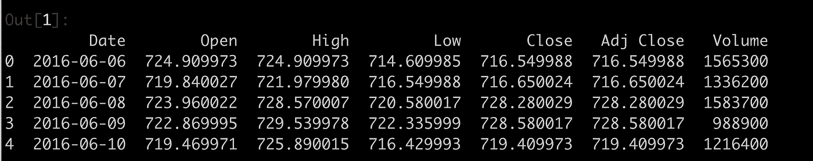
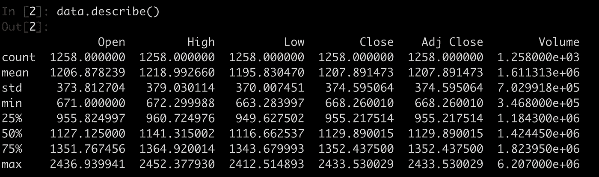
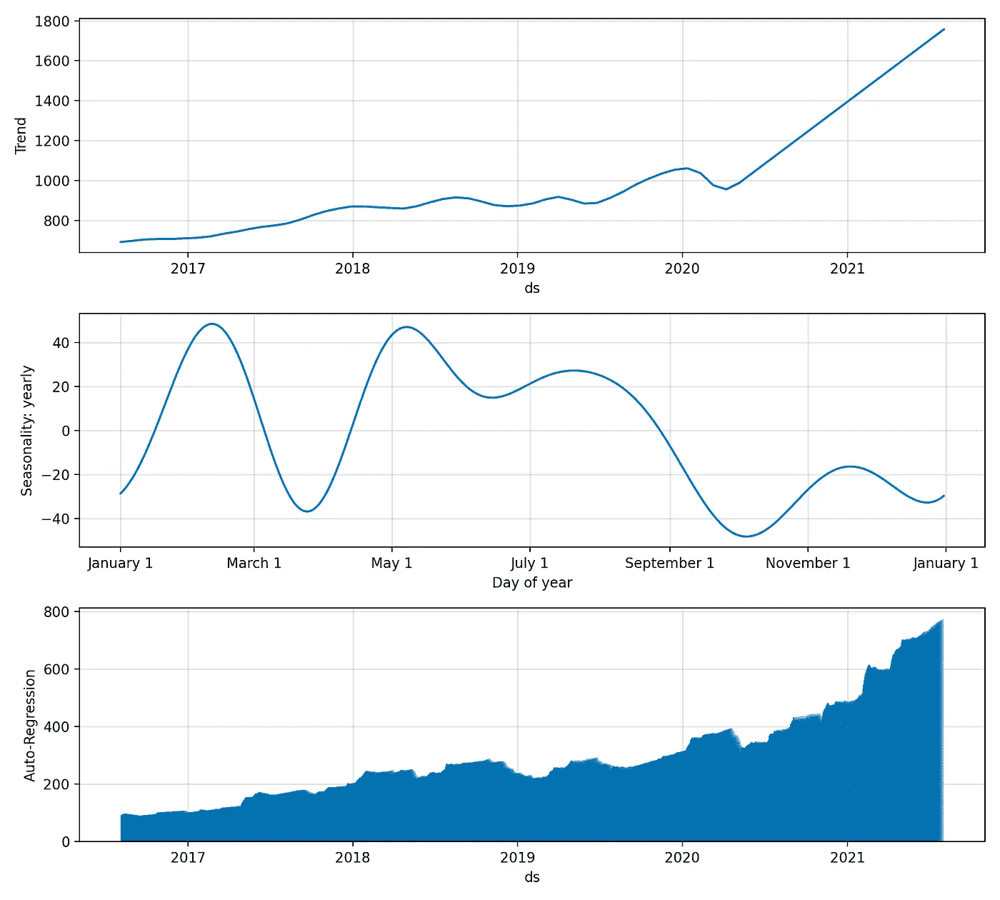

# 时间序列预测的神经网络:用脸书的新模型预测股票价格

> 原文：<https://pub.towardsai.net/neuralprophet-for-time-series-forecasting-predicting-stock-prices-using-facebooks-new-model-c5c191ed4eb8?source=collection_archive---------0----------------------->

## [数据科学](https://towardsai.net/p/category/data-science)

## 在这篇文章中，我将向您展示如何使用一种新的预测模型来预测时间序列，这种模型可以从脸书数据科学团队公开获得:著名的 NeuralProphet！



作者使用模型制作的图形。

# 1.介绍

在之前的帖子中，我解释并展示了脸书的先知模型是如何工作的。如果你错过了，看看这里的。

近日，脸书数据科学团队发布了该模型的新版本[**NeuralProphet**](https://github.com/ourownstory/neural_prophet)**。**

**免责声明**(在我们继续之前):已经有人尝试使用时间序列分析算法来预测股票价格，尽管它们仍然不能用于在真实市场中下注。这只是一篇教程文章，并不打算以任何方式“指导”人们购买股票。

让我们开始吧。

如果您想在交互式路线图和活跃的学习社区的支持下自学数据科学，请查看以下资源:[https://aigents.co/learn](https://aigents.co/learn)

## 1.1.时间序列和预测模型

传统上，大多数机器学习(ML)模型使用一些观察值(样本/例子)作为输入特征，但是在数据中没有**时间**维度**维度**。

**时间序列预测**模型是能够根据**先前** **观测** **值**预测 **未来值**的模型。时间序列预测广泛用于**非平稳数据**。**非平稳数据**被称为其统计属性(例如，平均值和标准偏差)不随时间保持不变，而是随时间变化的数据。

这些非平稳输入数据(用作这些模型的输入)通常被称为**时间序列。**时间序列的一些例子包括随时间变化的温度值、随时间变化的股票价格、随时间变化的房屋价格等。因此，输入是一个**信号**(时间序列),它是由在时间中连续进行的观察所定义的**。**

> 时间序列是按时间顺序进行的一系列观察。


时间序列的一个例子。剧情是作者用 Python 创作的。

**观察:时序**数据被记录在一个**离散** **时间** **刻度**上。

## 1.2 旧的预测模型:脸书的先知

预测预测最常用的模型是 [**自回归**](https://en.wikipedia.org/wiki/Autoregressive_model) 模型。简而言之，自回归模型规定输出变量线性依赖于它自己以前的值和一个随机项(一个不完全可预测的项)。

最近，为了开发一个可以在时间序列数据中捕捉**季节性**的模型，**脸书**开发了著名的 **Prophet** 模型，每个人都可以公开获得。预言者能够通过实现 [**加性回归**](https://en.wikipedia.org/wiki/Additive_model) **模型来捕捉**每日**、**每周**和**每年的季节性**以及**假日** **影响**。**

Prophet 模型背后的数学方程式定义为:

> y(t) = g(t) + s(t) + h(t) + e(t)

*   其中，g(t)代表趋势。Prophet 使用分段线性模型进行趋势预测。
*   s(t)代表周期性变化(每周、每月、每年)。
*   h(t)代表假期的影响(回想一下:假期影响业务)。
*   e(t)是误差项。

Prophet 模型拟合过程通常非常快(即使对于成千上万的观察)，并且不需要任何数据预处理。它还处理缺失数据和异常值。

## 1.3 新的预测模型:脸书的[神经营养因子](https://github.com/ourownstory/neural_prophet)

最近，脸书数据科学团队发布了该模型的新版本[](https://github.com/ourownstory/neural_prophet)****。**[**NeuralProphet**](https://github.com/ourownstory/neural_prophet)**是基于神经网络的时间序列数据模型。****

## **1.4 NeuralProphet vs. Prophet**

**与旧的 Prophet 模型相比的主要差异总结如下:**

*   **通过使用 PyTorch 作为后端进行优化的梯度下降。**
*   **基于 AR-Net 的时间序列自相关建模**
*   **使用独立的前馈神经网络建模滞后回归量。**
*   **FFNNs 的可配置非线性深层。**
*   **可调整到特定的预测范围(大于 1)。**
*   **自定义损失和指标。**

**来源:https://neuralprophet.com/changes-from-prophet/**

**现在让我们开始吧！**

# **2.获取股票价格历史数据**

**感谢**雅虎财经，**我们可以免费获得**的数据**。使用以下链接获取谷歌过去 5 年的股价历史:[https://finance.yahoo.com/quote/GOOG/history?周期 1=1433548800 &周期 2=1591833600 &间隔=1d &过滤器=历史&频率=1d](https://finance.yahoo.com/quote/GOOG/history?period1=1464998400&period2=1622764800&interval=1d&filter=history&frequency=1d&includeAdjustedClose=true)**

**您应该看到以下内容:**

****

**如何下载数据。**

**点击**下载**并保存**。csv** 文件本地保存在您的计算机上。数据是从 **2016** 到现在( **2021** )！**

# **3.Python 工作示例**

**现在有了数据，就来考察数据，建立模型，预测股价吧！**

****3.0 安装 python 模块****

```
pip install neuralprophet
```

****3.1。加载&检查数据****

```
import numpy as np
import pandas as pd
import matplotlib.pyplot as plt# Load the dataset using pandas
data = pd.read_csv("/Users/loukas/Downloads/GOOG.csv") 
data.head(5)
```

**上面的代码应该打印出以下内容:**

****

**数据集的前 5 行。**

**现在，让我们打印一些**统计数据**，例如上述特征(列)的平均值、中值、最小值、最大值和标准偏差值。**

```
data.describe()
```

****

**在过去的 5 年里(2016-2021)，在**收盘**时**的平均**股价为 1207.9 美元！真的很高！**

**现在让我们继续建模。我们将**仅**使用**日期**和**收盘**价格**作为我们模型的特征。****

```
# Select only the important features i.e. the date and price
data = data[["Date","Close"]] # select Date and Price# Rename the features: These names are NEEDED for the model fitting
data = data.rename(columns = {"Date":"ds","Close":"y"}) #renaming the columns of the datasetdata.head(5)
```

**最后一个 python 命令应该返回数据集的前 5 行。您应该会看到类似这样的内容:**

****

**这里，`ds`是日期，`y`是**谷歌** **股票**价格。**

**在本教程中，我们不会将数据拆分为**训练**和**测试**集，而是使用所有数据来拟合模型，然后要求模型预测未来值，即 2022 年的股价。**

**通常，人们将数据分为训练和测试，因为他们不想在测试集上训练模型。如果我们隐藏一个测试集，那么模型将会预测看不见的数据的值。在这种情况下，我们也能够测量模型的误差。**

****3.2。建立预测模型(简单版)****

**接下来，我们从`neuralprophet`模块导入`NeuralProphet`类，然后创建一个`NeuralProphet`类的对象。**

**这个数据集的一个简单模型`neural_prophet`可以通过如下创建一个`NeuralProphet`类的对象并调用 fit 函数来拟合。这将使模型符合模型中的默认设置。有关这些默认设置的更多详情，请参考[超参数选择](https://neuralprophet.com/hyperparameter-selection/)一节。**

**为了预测 GOOGLE 价格，我们可以训练一个模型，使用过去 2 天的股票价格来预测未来 3 天的价格。这些参数由下面代码中的 **n_lags** 和 **n_forecasts** 参数指定。点击阅读更多[。](https://neuralprophet.com/model/auto-regression/)**

```
from neuralprophet import NeuralProphet# m = NeuralProphet() # default model# our modelm = NeuralProphet(
    n_forecasts=60,
    n_lags=60,
    n_changepoints=50,
    yearly_seasonality=True,
    weekly_seasonality=False,
    daily_seasonality=False,
    batch_size=64,
    epochs=100,
    learning_rate=1.0,
)metrics = m.fit(data, freq="D")  # fit the model using all data# with cross-validation
# metrics = m.fit(data, 
#                 freq="D",
#                 valid_p=0.2, # validation proportion of data (20%)
#                 epochs=100)
```

**要检查所有参数，请使用:**

```
help(NeuralProphet)
```

**试衣可能需要 3-4 分钟。**

****3.3。进行预测并绘制预测图****

**现在，对于最后一步，我们将要求模型预测未来值，然后将预测可视化。**

**一旦模型被拟合，我们就可以使用拟合的模型进行预测。为此，我们首先需要创建一个未来数据框架，其中包含我们需要预测的未来时间步长。`NeuralProphet`为此提供了助手功能`make_future_dataframe`。**

```
# Predictions
future = m.make_future_dataframe(data, periods=60, n_historic_predictions=len(data)) #we need to specify the number of days in future
prediction = m.predict(future)# Plotting
forecast = m.plot(prediction)plt.title("Prediction of the Google Stock Price using NeuralProphet for the next 60 days")
plt.xlabel("Date")
plt.ylabel("Close Stock Price")
plt.show()
```

****

## **该模型使用所有数据进行训练(黑点)，并预测从 2021 年 6 月到未来 90 天的未来股票价格。**

****侧** **注**:在这种情况下，**我们无法测量模型**的误差。如果有人想这样做，那么他们应该将数据分为训练集和测试集，仅使用训练集拟合模型，预测测试集的价格，然后使用测试集的基本真实价格值来衡量误差。另请参见处的验证指南[。](https://neuralprophet.com/)**

****观察结果**:2020 年 3 月，由于新冠肺炎的封锁，股价大幅下跌，但此后又大幅增长。**

## **-我的邮件列表只需 5 秒:[https://seralouk.medium.com/subscribe](https://seralouk.medium.com/subscribe)**

## **-成为会员支持我:【https://seralouk.medium.com/membership】T2**

# **奖金**

****3.4。绘制趋势图、周图、季图、年图和日图****

**如果您想要查看预测组件，即**趋势、每周、季节性、每年和每日组件**，那么您可以使用以下命令来完成。**

***警告*:以下命令需要一段时间来显示图形。**

```
m.plot_components(prediction)
plt.show()
```

****

# **结论**

**NeuralProphet 是新脸书的 Prophet 更新版本，允许用户使用简单但强大的深度学习模型，如 AR-Net 进行预测任务。NeuralProphet 的独特之处在于它能够在生成预测和拟合时将趋势、季节性和重复事件等附加信息纳入考虑。**

**要了解更多信息，请访问[这个](https://neuralprophet.com/model-overview/)网站。**

**就这些了，伙计们！我希望你喜欢这篇文章！**

## **也可以看看我最近用 LSTM 模型写的文章:**

**[](https://towardsdatascience.com/lstm-time-series-forecasting-predicting-stock-prices-using-an-lstm-model-6223e9644a2f) [## LSTM 时间序列预测:使用 LSTM 模型预测股票价格

### 在这篇文章中，我将向你展示如何使用预测 LSTM 模型来预测股票价格

towardsdatascience.com](https://towardsdatascience.com/lstm-time-series-forecasting-predicting-stock-prices-using-an-lstm-model-6223e9644a2f) 

## 也可以看看我最近用 ARIMA 模型写的文章:

[](https://towardsdatascience.com/time-series-forecasting-predicting-stock-prices-using-an-arima-model-2e3b3080bd70) [## 时间序列预测:使用 ARIMA 模型预测股票价格

### 在这篇文章中，我将向你展示如何使用预测 ARIMA 模型来预测特斯拉的股票价格

towardsdatascience.com](https://towardsdatascience.com/time-series-forecasting-predicting-stock-prices-using-an-arima-model-2e3b3080bd70) 

# 参考

[1][https://Facebook . github . io/prophet/docs/quick _ start . html # python-API](https://facebook.github.io/prophet/docs/quick_start.html#python-api)

[https://en.wikipedia.org/wiki/Additive_model](https://en.wikipedia.org/wiki/Additive_model)

[3][https://neuralprophet.com/](https://neuralprophet.com/)

# 敬请关注并支持这一努力

如果你喜欢这篇文章并觉得它有用，请关注我，这样你就可以看到我所有的新帖子。

有问题吗？把它们作为评论贴出来，我会尽快回复。

# 和我联系

*   **领英**:[https://www.linkedin.com/in/serafeim-loukas/](https://www.linkedin.com/in/serafeim-loukas/)
*   **推特**:[https://twitter.com/LoukasSerafeim](https://twitter.com/LoukasSerafeim)
*   **研究门**:【https://www.researchgate.net/profile/Serafeim_Loukas 
*   **栈**溢出:[https://stackoverflow.com/users/5025009/seralouk](https://stackoverflow.com/users/5025009/seralouk)

# 最新帖子

[](https://medium.com/@seralouk/the-best-free-data-science-resources-free-books-online-courses-9c4a2df194e5) [## 最佳免费数据科学资源:免费书籍和在线课程

### 最有用的免费书籍和在线课程，适合想了解更多数据科学知识的人。

medium.com](https://medium.com/@seralouk/the-best-free-data-science-resources-free-books-online-courses-9c4a2df194e5) [](https://towardsdatascience.com/roc-curve-explained-using-a-covid-19-hypothetical-example-binary-multi-class-classification-bab188ea869c) [## 用新冠肺炎假设的例子解释 ROC 曲线:二分类和多分类…

### 在这篇文章中，我清楚地解释了什么是 ROC 曲线以及如何阅读它。我用一个新冠肺炎的例子来说明我的观点，我…

towardsdatascience.com](https://towardsdatascience.com/roc-curve-explained-using-a-covid-19-hypothetical-example-binary-multi-class-classification-bab188ea869c) [](https://towardsdatascience.com/support-vector-machines-svm-clearly-explained-a-python-tutorial-for-classification-problems-29c539f3ad8) [## 支持向量机(SVM)解释清楚:分类问题的 python 教程…

### 在这篇文章中，我解释了支持向量机的核心，为什么以及如何使用它们。此外，我还展示了如何绘制支持…

towardsdatascience.com](https://towardsdatascience.com/support-vector-machines-svm-clearly-explained-a-python-tutorial-for-classification-problems-29c539f3ad8) [](https://towardsdatascience.com/pca-clearly-explained-how-when-why-to-use-it-and-feature-importance-a-guide-in-python-7c274582c37e) [## PCA 清楚地解释了——如何、何时、为什么使用它以及特性的重要性:Python 指南

### 在这篇文章中，我解释了什么是 PCA，何时以及为什么使用它，以及如何使用 scikit-learn 在 Python 中实现它。还有…

towardsdatascience.com](https://towardsdatascience.com/pca-clearly-explained-how-when-why-to-use-it-and-feature-importance-a-guide-in-python-7c274582c37e) [](https://towardsdatascience.com/everything-you-need-to-know-about-min-max-normalization-in-python-b79592732b79) [## 关于 Python 中的最小-最大规范化，您需要知道的一切

### 在这篇文章中，我解释了什么是最小-最大缩放，何时使用它，以及如何使用 scikit-learn 在 Python 中实现它

towardsdatascience.com](https://towardsdatascience.com/everything-you-need-to-know-about-min-max-normalization-in-python-b79592732b79) [](https://towardsdatascience.com/how-and-why-to-standardize-your-data-996926c2c832) [## Scikit-Learn 的标准定标器如何工作

### 在这篇文章中，我将解释为什么以及如何使用 scikit-learn 应用标准化

towardsdatascience.com](https://towardsdatascience.com/how-and-why-to-standardize-your-data-996926c2c832)**