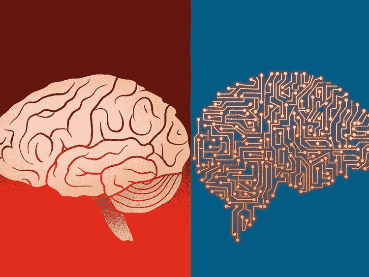
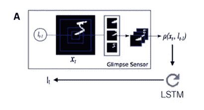
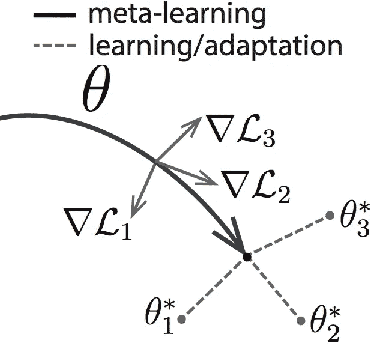

# 神经科学启发的人工智能

> 原文：<https://pub.towardsai.net/neuroscience-inspired-ai-9bce3d6073b4?source=collection_archive---------0----------------------->

## [人工智能](https://towardsai.net/p/category/artificial-intelligence)

## 人类大脑的一些认知能力正在激发深度学习研究。

来源:[https://gulf news . com/opinion/op-eds/ai-cannot-replace-the-wonderful-of-human-brain-1.2194745](https://gulfnews.com/opinion/op-eds/ai-cannot-replace-the-wonders-of-human-brain-1.2194745)

> 我最近创办了一份专注于人工智能的教育时事通讯，已经有超过 10 万名订户。《序列》是一份无废话(意思是没有炒作，没有新闻等)的 ML 导向时事通讯，需要 5 分钟阅读。目标是让你与机器学习项目、研究论文和概念保持同步。请通过订阅以下内容来尝试一下:

 [## 序列

### 订阅人工智能世界中最相关的项目和研究论文。受到 110，000+的信任…

thesequence.substack.com](https://thesequence.substack.com/) 

大脑一直被认为是人工智能(AI)领域的主要灵感。对于许多人工智能研究人员来说，人工智能的最终目标是模拟大脑的能力。这似乎是一个不错的说法，但考虑到神经科学家仍在努力理解为我们大脑的魔力提供动力的认知机制，这是一项令人难以置信的艰巨任务。尽管存在挑战，但我们更经常地看到人工智能研究和实现算法受到人脑中特定认知机制的启发，并产生了令人难以置信的有前途的结果。几年前，DeepMind 团队[发表了一篇关于神经科学启发的人工智能](http://www.cell.com/neuron/fulltext/S0896-6273(17)30509-3)的论文，总结了人工智能和神经科学研究之间的影响圈。

你可能想知道这个话题有什么新鲜的？众所周知，人工智能中的大多数基础概念，如神经网络，都是受人类大脑架构的启发。然而，在那种高层次的说法之外，我们每天使用的流行的 AI/深度学习模型与神经科学研究之间的关系并不那么明显。让我们快速回顾一下在最新一代深度学习方法中留下足迹的一些大脑过程。

# 注意力

注意力是人类大脑的神奇能力之一，我们对此并不十分了解。什么样的大脑机制让我们专注于一项特定的任务，而忽略了环境的其余部分？注意力机制已经成为深度学习模型(如卷积神经网络(CNN)或深度生成模型)的最新灵感来源。例如，现代 CNN 模型已经能够获得输入的示意图，并忽略不相关的信息，从而提高了它们对图片中的对象进行分类的能力。

图片来源:DeepMind

# 情景记忆

当你回忆自传体事件，比如事件或地点时，我们使用的是一种被称为情景记忆的大脑功能。这种机制通常与内侧颞叶中的回路有关，主要包括海马体。最近，人工智能研究人员试图将情景记忆启发的方法融入强化学习(RL)算法中，以进行情景控制。这些网络存储特定体验(例如，与特定 Atari 游戏屏幕相关联的动作和奖励结果)，并且基于当前情况输入和存储在存储器中的先前事件之间的相似性来选择新的动作，同时考虑与那些先前事件相关联的奖励。

图片来源:DeepMind

# 持续学习

作为人类，我们有能力学习新的任务，而不会忘记以前的知识。相比之下，神经网络则遭遇了所谓的灾难性遗忘问题。例如，当神经网络参数朝着执行两个连续任务中的第二个任务的最佳状态移动，覆盖了允许它们执行第一个任务的配置时，就会发生这种情况。

受持续学习领域的启发，最近的深度学习技术之一被称为“弹性”权重整合(EWC)。这种新方法通过减缓在被识别为对先前任务重要的网络权重子集中的学习来起作用，从而将这些参数锚定到先前找到的解决方案。这允许在不增加网络容量的情况下学习多个任务，在具有相关结构的任务之间有效地共享权重。通过这种方式，EWC 算法允许深度 RL 网络支持大规模的连续学习。

图片来源:DeepMind

# 想象力和计划

我最喜欢的意识定义之一与人类(和其他物种)预测和思考未来的能力有关。大多数深度学习系统仍然以令人难以置信的反应模式运行，这使得不可能对长期结果进行规划。人工智能研究的新领域集中于应用于深度生成模型的基于模拟的规划。特别地，最近的工作已经引入了新的体系结构，该体系结构具有生成时间上一致的所生成样本序列的能力，该序列反映了新经历的现实环境的几何布局，提供了与海马体在将多个组件结合在一起以创建空间和时间上一致的想象体验中的功能的相似性。

图片来源:DeepMind

# 推理

人类的认知因其通过归纳推理从以前的知识中汲取灵感来学习新概念的能力而臭名昭著。与此相反，深度学习系统依靠大量的训练数据来掌握最简单的任务。最近在结构化概率方法和深度生成模型方面的工作已经开始在人工智能程序中纳入大脑启发的推理机制。尽管缺乏数据，但模型的类别可以对新概念做出推断，并从单个示例概念中生成新样本，元学习的快速增长领域是受人脑推理能力启发的另一个人工智能研究领域。

图片来源:DeepMind