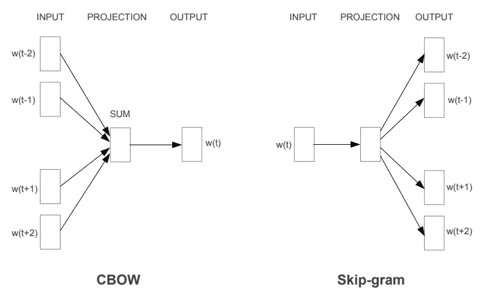
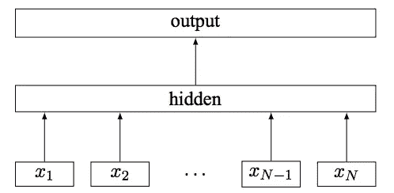
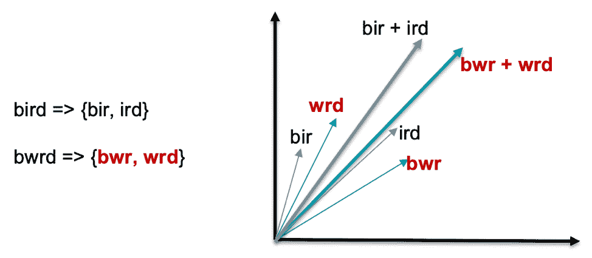

# 抗拼写错误的单词嵌入新模型(MOE)

> 原文：<https://pub.towardsai.net/new-model-for-word-embeddings-which-are-resilient-to-misspellings-moe-9ecfd3ab473e?source=collection_archive---------0----------------------->

## 用一个新的模型来研究单词嵌入| [走向人工智能](https://towardsai.net)

[马志威](https://unsplash.com/@makcedward?utm_source=medium&utm_medium=referral)在 [Unsplash](https://unsplash.com/?utm_source=medium&utm_medium=referral) 上的照片

传统的词嵌入技术擅长解决自然语言处理的许多下游问题，如文档分类和命名实体识别(NER)。然而，缺点之一是缺乏处理超词汇的能力(OOV)。

脸书引入了拼写错误的遗忘(单词)嵌入(MOE ),克服了这一限制。MOE 扩展了 fastText 体系结构来实现它。所以这个故事先经过 fastText 的训练方法和架构，再谈 MOE。

# 负采样跳跃图

fastText 扩展了 word2vec 的体系结构，该体系结构使用带有负采样方法的 skip-gram 来训练单词嵌入。Skip-gram 使用上下文单词来预测周围的单词，以便学习文本表示(也称为嵌入)。负抽样方法是为上述训练挑选错误案例的一种方式。更多细节，你可以查看这些帖子([跳过图](https://towardsdatascience.com/3-silver-bullets-of-word-embedding-in-nlp-10fa8f50cc5a)和[负采样](https://medium.com/@makcedward/how-negative-sampling-work-on-word2vec-7bf8d545b116))了解更多信息。

下图显示了 word2vec 中不同的训练方法。连续词袋(BOW)利用周围的词来预测上下文词，而 Skip-gram 使用上下文词来预测周围的词。

向量空间中单词表示的有效估计(Tomas 等人，2013 年)

# 快速文本

fastText 遵循 SGNS 的思想，几乎没有修改。fastText 的一个特点就是子字。N-gram 方法用于将单词拆分成子单词。例如，n 元字符的范围在 3 到 5 之间。我们可以把`banana`拆分为`ban`、`ana`、`nan`、`bana`、`anan`、`nana`、`banan`、`anana`。同时，`banana`的嵌入是这些子字嵌入的总和。

fastText 的训练目标分类标签。模型输入是 n 元特征(即 x1，x2 … xN)。这些要素将在隐藏图层中进行平均，并最终输入到输出图层中。

fastText 的架构(Joulin 等人，2016 年)

# 拼写错误的遗忘(单词)嵌入(MOE)

MOE 通过引入拼写纠正损失进一步扩展了快速文本的概念。拼写校正丢失的目标是将拼写错误的单词嵌入映射到其拼写正确的变体的嵌入附近。法术修正损失是典型的逻辑函数。它是正确单词和拼写错误单词的子单词的输入向量之和的点积。

下面显示的是`bird`(正确的单词)和`bwrd`(拼错的单词)的嵌入是靠在一起的。

教育部的代表([脸书](https://ai.facebook.com/blog/-a-new-model-for-word-embeddings-that-are-resilient-to-misspellings-/)

# 拿走

*   子词是处理拼写错误的单词和未知单词的有效方法。MOE 使用 n-gram 字符来构建子词字典，而其他最新的 NLP 模型(如 BERT、GPT-2)使用统计方法(如单词块、字节对编码)来构建子词字典。
*   在许多 NLP 系统中，处理看不见的单词是一个重要的优势。例如，聊天机器人需要处理大量的新词汇，无论是拼写错误还是新单词。

# 喜欢学习？

我是湾区的数据科学家。专注于数据科学、人工智能，尤其是 NLP 和平台相关领域的最新发展。在 [LinkedIn](https://www.linkedin.com/in/edwardma1026) 或 [Github](https://github.com/makcedward) 上随时联系 [me](https://makcedward.github.io/) 。

# 延伸阅读

*   训练 MOE 的拼写错误数据集[。](https://bitbucket.org/bedizel/moe/src/master/)
*   关于[负抽样](https://medium.com/@makcedward/how-negative-sampling-work-on-word2vec-7bf8d545b116)方法的故事
*   关于[快速文本](https://towardsdatascience.com/3-silver-bullets-of-word-embedding-in-nlp-10fa8f50cc5a)的故事
*   [fastText](https://fasttext.cc/docs/en/english-vectors.html) 的官方页面。

# 参考

*   T.Mikolov，G. Corrado，K. Chen 和 J. Dean。[向量空间中单词表示的有效估计](https://arxiv.org/pdf/1301.3781.pdf)。2013.
*   A.Joulin、E. Grave、P. Bojanowski 和 T. Mikolov。[高效文本分类的锦囊妙计](https://arxiv.org/pdf/1607.01759.pdf)。2016
*   B.埃迪泽尔、a .皮克图斯、p .博亚诺斯基、r .费雷拉、e .格雷夫和 f .西尔维斯特里。[拼错遗忘词嵌入](https://arxiv.org/pdf/1905.09755.pdf)。2019