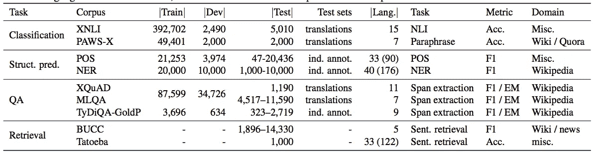
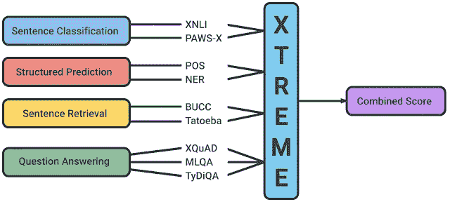

# 新的多语言模型——XTREME

> 原文：<https://pub.towardsai.net/new-multilingual-model-xtreme-276bbaa26d79?source=collection_archive---------4----------------------->

[马志威](https://unsplash.com/@makcedward?utm_source=medium&utm_medium=referral)在 [Unsplash](https://unsplash.com/?utm_source=medium&utm_medium=referral) 上拍照

开发通用的多语言表示是近年来的趋势。大多数早期的模型是基于英语开发的，而我们在全世界有几千种语言。之前的研究包括[伯特](https://towardsdatascience.com/how-bert-leverage-attention-mechanism-and-transformer-to-learn-word-contextual-relations-5bbee1b6dbdb)和 [XLM](https://medium.com/towards-artificial-intelligence/cross-lingual-language-model-56a65dba9358) 。虽然那些奇妙的模型是为通用目的而设计的，但对它们的评价往往仅限于翻译和分类以及类似的语言。

# 播放器

XTREME (Hu 等人，2020)的引入克服了上述限制。EXTREME 的全称是**Cross**-language**TR**ansfer**E**evaluation of**M**multilingual**E**n coders。它涵盖 40 种语言，能够支持多达 9 项任务。另外，XTREME 关注的是[零镜头](https://medium.com/towards-artificial-intelligence/a-gentle-introduction-to-meta-learning-8e36f3d93f61)跨语言转换场景。零射击意味着把它应用到看不见的领域。

零炮传递设置数据集(仅英文)(胡等，2020)

# 更多任务

XTREME 支持 4 个主要问题和 9 个评估任务，而不是有限的任务。

*   句子分类:XNLI 是*跨语言自然语言推理*。它问一个前提句是必然的、矛盾的还是中性的。PAWS-X 是*跨语言意译对手从文字加扰*。它决定了两个句子是否是转述。
*   结构化预测:POS 为*词性*。它预测每个单词的词性标签(如动词、名词等)。NER 被*命名为实体识别*。它预测目标词的实体(例如位置、名称等)。
*   句子检索:BUCC 正在*建立和使用平行语料库*。它提取英语和其他目标语言之间的平行句子。Tatoeba 指的是找到最近的句子对。
*   问答:XQuAD 是*跨语言问答数据集*。它在相应的段落中确定一个答案。MLQA 正在*多语问答*。它挖掘目标语言句子。QyDiQA 是一个类型多样的问题回答。它类似于 XQuAD 和 MLQA，但更具挑战性。

XTREME 支持的任务(来自[谷歌](https://ai.googleblog.com/2020/04/xtreme-massively-multilingual-multi.html)

# 分析

## 数据大小相关性

其中一个发现是模型性能和数据大小之间的关系。应用皮尔逊相关系数来找出相关性。作者观察到，在许多任务中，相关性在 0.8 左右。它相当高。

## 语言特征

注意到印欧语系具有最好的迁移性能，而低资源语言仍然只能达到较低的性能。

# 延伸阅读

*   [变压器的双向编码器表示](https://towardsdatascience.com/how-bert-leverage-attention-mechanism-and-transformer-to-learn-word-contextual-relations-5bbee1b6dbdb)
*   [跨语言语言模型](https://medium.com/towards-artificial-intelligence/cross-lingual-language-model-56a65dba9358)
*   [元学习(零射击)](https://medium.com/towards-artificial-intelligence/a-gentle-introduction-to-meta-learning-8e36f3d93f61)
*   [XTREME Git 库](https://github.com/google-research/xtreme)

# 关于我

我是湾区的数据科学家。专注于数据科学、人工智能，尤其是 NLP 和平台相关领域的最新发展。你可以通过[媒体博客](https://medium.com/@makcedward/)、 [LinkedIn](https://www.linkedin.com/in/edwardma1026) 或 [Github](https://github.com/makcedward) 联系我。

# 参考

J.胡、S. Ruder、A. Siddhant、G. Neubig、O. Firat 和 M. Johnson。XTREME:一个评估跨语言推广的大型多语言多任务基准。2020

由[向艾](https://towardsai.net/)发布