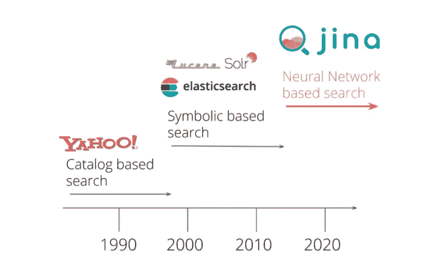
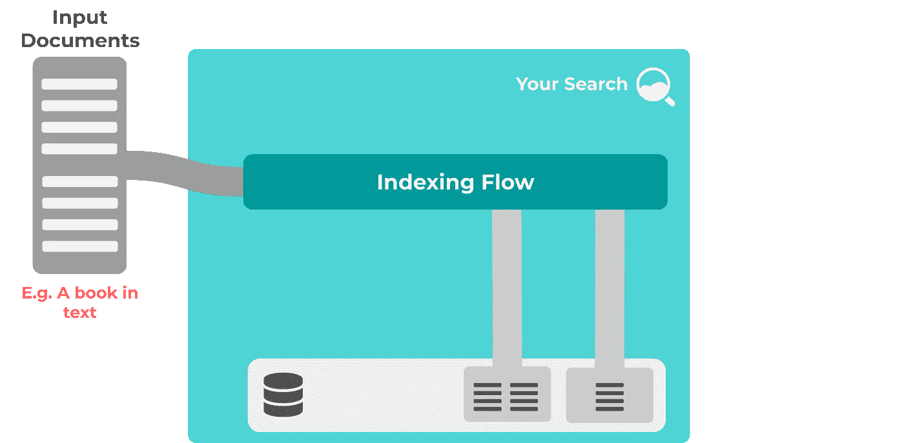
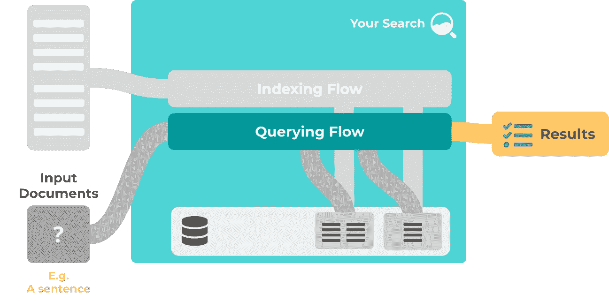
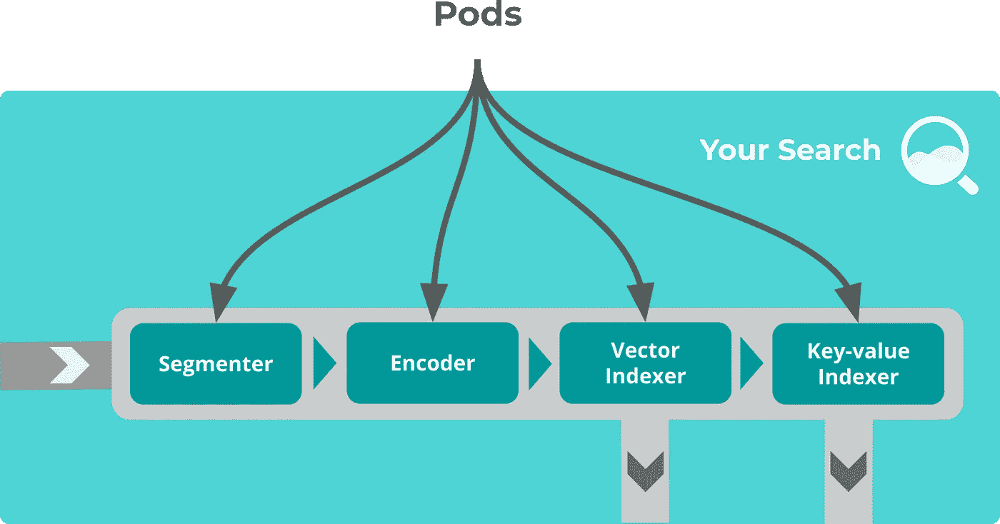
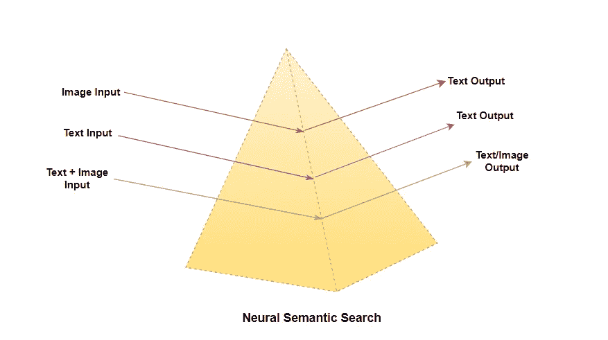
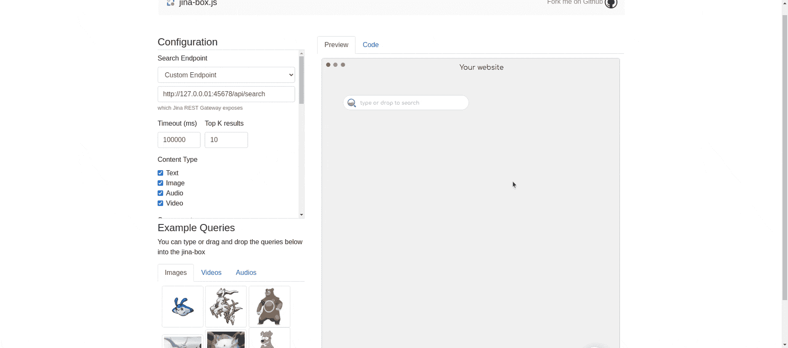

# 纪娜推动下一代搜索

> 原文：<https://pub.towardsai.net/next-gen-search-powered-by-jina-dca6953ca068?source=collection_archive---------2----------------------->

## [技术](https://towardsai.net/p/category/technology)

## 自从在线搜索出现以来，世界已经发生了巨大的变化，但推动这一行业的“好奇心”却始终不变…

“目标不是让你的链接看起来自然，目标是你的链接是自然的。”——马特·卡茨

# 什么是神经语义搜索？

神经搜索是一种检索上下文和语义相关信息的智能方法。神经搜索不是告诉机器一套规则来理解什么数据是什么，而是通过预先训练的神经网络来做同样的事情。这意味着开发人员不必编写每一个小规则，节省了他们的时间和麻烦，并且系统会随着它的发展训练自己变得更好。

# 常规搜索 v/s 神经搜索

## 常规搜索

*   传统的搜索是符号化的和关键字驱动的，因此它缺乏必要的上下文。
*   传统的搜索是脆弱的，因为它的硬编码规则引擎。
*   传统的搜索需要用新增加的数据来更新规则，这使得它不可扩展且耗时。
*   传统的搜索需要一定程度的领域知识来实现。

## 神经/语义搜索

*   神经搜索是上下文驱动的，使其能够找到语义相关的信息。
*   神经搜索灵活地适应所有的极限情况，并对噪声有弹性。
*   另一方面，神经搜索可以使用过去的推理/上下文在新数据上训练自己，使其高度可扩展和高效。
*   神经搜索需要很少甚至不需要领域知识来实现。

# 什么是纪娜？

纪娜是一个云原生神经搜索平台。它可以部署在容器、云或本地服务器中。它提供了从文本到文本、图像到图像、视频到视频或任何其他数据类型的搜索，可以作为引擎的输入。纪娜操作它的原始数据类型，即文档。文档是您想要搜索的任何数据集中的数据片段，也是您用来查找所需内容的输入查询。

基本上，它们是纪娜搜索工作流的输入和输出数据。纪娜核心包括两个主要流程，它们是语义搜索引擎的心脏和灵魂:

*   **索引流程:**索引流程使得整个语料库可以按句子进行搜索。索引流程准备并预处理要搜索的数据。输入文档被输入、处理，另一端的输出存储为可搜索的索引。

*   **查询流**:一个查询流将用户查询作为输入文档(原始纪娜数据类型)，并返回一个基于单词嵌入中相似性得分的排序匹配列表。

# 纪娜组件

**流程代表高级任务**，例如索引、搜索、训练。它由一组吊舱组成，协调它们完成一项任务。pod 是一组共享相同属性的执行器，它允许多个执行器并行执行，并为执行器添加上下文和控制。

**Executor 代表纪娜的一个算法单元。**将图像编码成向量、将向量存储在磁盘上、对结果进行排序等算法，都可以被公式化为执行器。Executor 提供了有用的接口，允许 AI 开发者和工程师真正专注于算法。一些常见的遗嘱执行人如下:

*   **Crafter** : Crafter 用于将文档预处理成块。
*   **Encoder** : Encoder 从 crafter 获取输入的预处理过的文档，并将其编码成嵌入向量。
*   **索引器**:索引器将编码的向量作为输入，并以键值的方式索引和存储向量。
*   **Ranker** : Ranker 运行在索引存储上，根据一定的排名对结果进行排序。

# 搜索方式

**纪娜**是一个数据类型不可知的框架，它允许你处理任何类型的数据并运行*跨模态*和*多模态*搜索流。

*   **单一模态:**在这种类型的搜索中，输入类型和输出类型保持不变，包括文本到文本搜索、图像到图像搜索、音频到音频搜索等。在单一模态中，搜索被设计成处理单一数据类型，这使得它对于不同数据类型的输入来说不太灵活和脆弱。
*   **跨通道搜索:**通过查询通道 B(比如说—“文本”)的文档，您可以有效地找到通道 A(比如说—“图像”)的相关文档。跨模态指的是一组应用程序，在这些应用程序中，您可以通过一种模态的查询(例如文本)来查找另一种模态的文档(例如图像)。
*   **多模态搜索:**它使您能够将不同模态的文档投影到一个公共嵌入空间中，并找到关于多模态融合的相关文档。多模态是指当您在来自不同模态的查询中合并信息时，提供由(文本+图像)组成的融合输入，以获得可根据模型的解释而灵活变化的输出。

> 支持不同类型的模态解锁了许多强大的模式，并使纪娜完全灵活和不可知的搜索！

一体式、数据类型无关的搜索平台…

# 纪娜在行动

为了展示一个现场演示，我设计了一个简单的文本数据神经语义搜索。该模型是根据从维基百科随机页面获取的数据进行训练的。纪娜获取输入文档，并遵循内部纪娜流程(索引，然后是查询)来开发一个搜索引擎。

## 使用的框架/工具:

*   **纪娜核心:**它为相应的应用程序启用索引和查询工作流。
*   **语言模型:**这里使用的语言模型来自于 BERT(变压器的双向编码器表示)家族，这里我们使用了“ ***、distilbert-BERT-cased”****来理解纪娜查询流程下的上下文。*
*   ***纪娜盒子:**纪娜盒子是一个易于使用、轻量级、可定制的前端 web 组件，用于数据类型不可知的搜索(可以是文本、音频、视频等)。)可以很容易地连接到纪娜后端，为用户提供一个简单有效的界面来与搜索引擎进行交互。*
*   ***Python 3.7:** 它被用作纪娜应用程序的开发环境。*

***示例:**在搜索框中，我们尝试搜索“computer”并得到以下结果。有趣的是，在索引文档的任何地方都没有提到确切的单词“computer ”,但模型仍然找出了上下文或语义相关的句子 computer。*

**

*纪娜在变魔术！*

# *参考*

1.  *[https://github.com/jina-ai/jina](https://github.com/jina-ai/jina/)*
2.  *[https://docs.jina.ai](https://docs.jina.ai/)*
3.  *[https://www.thinkwithgoogle.com](https://www.thinkwithgoogle.com/intl/en-apac/consumer-insights/consumer-trends/evolution-search/#:~:text=The%20world%20has%20changed%20dramatically,become%20more%20complex%20than%20ever)*

*如果你想了解更多，或者想让我写更多关于这个主题的东西，请随时联系我们。*

*我的社交链接:[LinkedIn](https://www.linkedin.com/in/shubhamsaboo/)|[Twitter](https://twitter.com/Saboo_Shubham_)|[Github](https://github.com/Shubhamsaboo)*

**

*如果你喜欢这篇文章或觉得它有帮助，请花一分钟按一下拍手按钮，它会增加文章对其他媒体用户的可见性。*