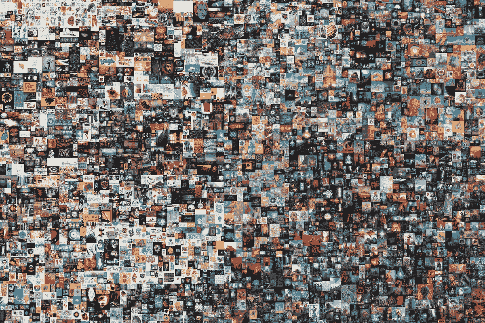
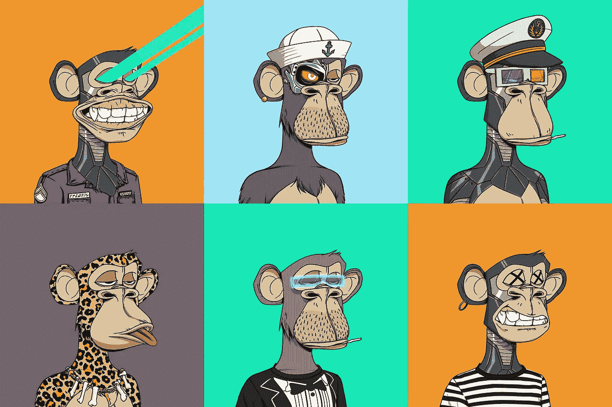
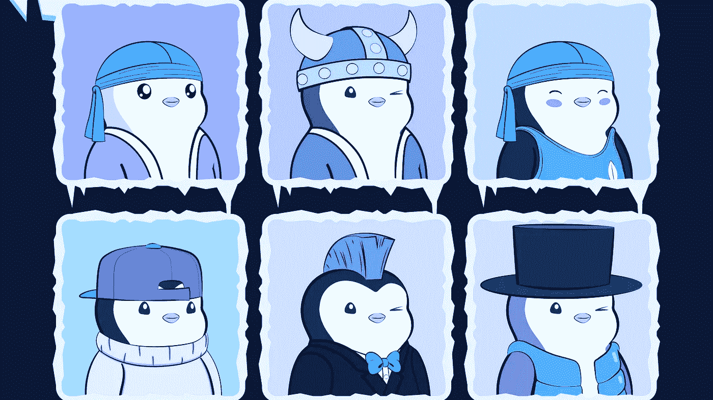
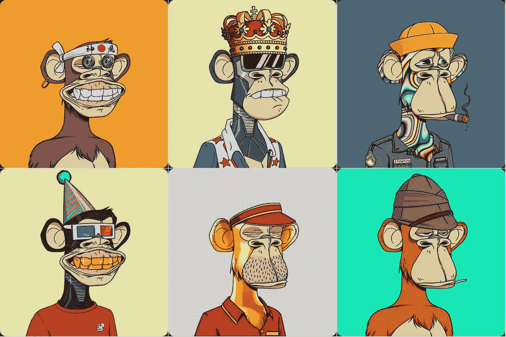
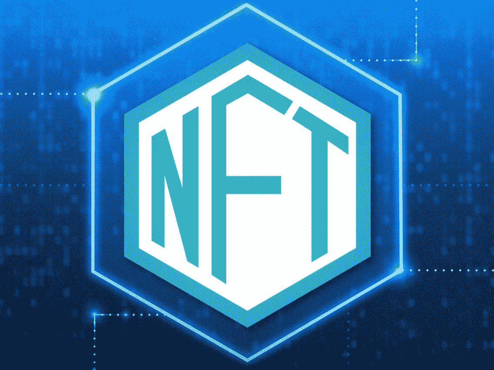

# NFTs & AI

> 原文：<https://pub.towardsai.net/nfts-ai-9776fc10e328?source=collection_archive---------3----------------------->

我的文章中使用的图像是各自组织的财产，在此仅用于参考、说明和教育目的。(图片来源:Google【除了部分图片，在图片下方特别提到了其来源】)

一辆[牌](https://www.google.com/search?q=mike+winkelmann&ei=y4QpYqaHDbydseMPmOWL2Ac&gs_ssp=eJzj4tLP1TcwKS7LqCg2YPTiz83MTlUoz8zLTs3JTczLAwCMRgoE&oq=mike+&gs_lcp=Cgdnd3Mtd2l6EAMYADIECC4QQzIECAAQQzIECAAQQzIICC4QgAQQsQMyCwguEIAEELEDENQCMggILhCABBCxAzIFCAAQgAQyCAgAEIAEELEDMggILhCABBCxAzIICAAQgAQQsQM6BwgAEEcQsAM6BwgAELADEEM6BwguELADEEM6CggAEOQCELADGAA6DAguEMgDELADEEMYAToSCC4QxwEQ0QMQyAMQsAMQQxgBOgcIABCxAxBDOgsIABCABBCxAxCDAToKCC4QsQMQgwEQQzoHCC4Q1AIQQzoFCC4QgAQ6DgguEIAEELEDEMcBENEDOgsILhCABBCxAxCDAUoECEEYAEoECEYYAVDzBFinCmCDEmgCcAF4AIABhQGIAd0DkgEDNC4xmAEAoAEByAETwAEB2gEGCAAQARgJ2gEGCAEQARgI&sclient=gws-wiz)NFT 卖了 6900 万美元！(各自所有者的财产)

## 但是，什么是 NFT 呢？

我们来分别了解一下。

# NFT 到底是什么？

“一个**不可替代令牌** ( **NFT** )是一个存储在区块链上的不可互换的数据单位，是一种数字分类账的形式，可以出售和交易。NFT 数据单元的类型可以与诸如照片、视频和音频的数字文件相关联。因为每个令牌都是唯一可识别的，所以 NFT 不同于区块链加密货币，如比特币”——维基百科

“不可替代”意味着它是独一无二的，不能被其他东西替代。例如，比特币是可替代的——你可以用一个比特币换另一个比特币，你会得到同样的东西。但是，独一无二、特殊/稀有的交易卡是不可替代的。如果你把它换成另一张卡，你会得到完全不同的东西。

它也是一种数字资产，代表现实世界中的对象，如艺术、音乐、游戏中的项目和视频。它们经常与加密货币一起在网上买卖，并且它们与许多加密货币一样使用相同的底层软件进行编码。

“虽然自 2014 年以来，NFT 就已经存在，但现在它越来越臭名昭著，因为它正在成为一种越来越流行的买卖数字艺术品的方式。自 2017 年 11 月以来，已有 1.74 亿美元用于非功能性医疗。

NFT 通常也是一类中的一种，或者至少是有限集合中的一种，并且具有唯一的识别码。华盛顿技术行业协会卡斯卡迪亚区块链委员会主席兼黄伞风险投资公司董事总经理 Arry Yu 表示:“从本质上讲，NFT 造成了数字稀缺。”

任何人都可以免费在线观看单个图像，甚至整个拼贴图像。那么，为什么人们愿意花数百万美元购买他们可以轻松截图或下载的东西呢？

因为 NFT 允许买家拥有原始物品。不仅如此，它还包含内置的身份验证，作为所有权的证明。收藏家对这些“数字吹嘘的权利”的重视几乎超过了物品本身”——《福布斯》

Bored-Ape 游艇俱乐部(各自所有者的财产)

# NFTs 是如何工作的？

在很高的层面上，大多数非功能性测试都是以太坊区块链的一部分。以太币是一种加密货币，就像比特币或 dogecoin 一样，但它的区块链也支持这些 NFT，这些 NFT 存储额外的信息，使它们的工作方式与 ETH coin 不同。值得注意的是，其他区块链可以实现他们自己版本的 NFTs。([有的已经有了](https://dappradar.com/blog/tron-introduces-nft-standard-trc-721)。)— The Verge

NFTs 存在于区块链上，这是一种记录交易的分布式公共分类账。你最熟悉的是区块链，它是使加密货币成为可能的基础过程。

具体来说，NFT 通常在区块链[以太坊](https://www.forbes.com/advisor/investing/what-is-ethereum-ether/)举行，尽管其他区块链也支持 NFT。

NFT 由代表有形和无形项目的数字对象创建或“铸造”,包括:

**艺术**

****图片****

******视频和体育集锦******

********收藏品********

********虚拟化身和视频游戏皮肤********

********设计师运动鞋********

******音乐******

******甚至推特也算。Twitter 的联合创始人杰克·多西以 NFT 的身份发布了他的第一条推文，售价超过 290 万美元！******

******NFT 就像实物收藏家的项目，只是数字。因此，买家得到的不是挂在墙上的真正的油画，而是一个数字文件。******

******他们还获得独家所有权。没错:NFT 一次只能有一个所有者。NFTs 的独特数据使得验证其所有权和在所有者之间转移令牌变得容易。所有者或创建者也可以在其中存储特定的信息。例如，艺术家可以通过在 NFT 的元数据中包含他们的签名来为他们的作品签名。******

# ******NFT 与加密货币有何不同？******

******NFT 代表不可替代的令牌。它是使用与加密货币相同的编程构建的，如比特币或以太坊，但相似之处仅此而已。******

******实物货币和加密货币是“可替代的”，这意味着它们可以相互交易或交换。它们在价值上也是相等的——一美元总是值另一美元；一个比特币总是等于另一个比特币。加密的可替代性使其成为区块链上进行交易的可信手段。******

******NFT 不一样。每一个都有一个数字签名，使得 NFT 不可能与另一个交换，或者等同于另一个。(因此，不可替代)。******

******例如:******

******一个 NBA 顶级投篮剪辑不等于每一天，因为他们都是 NFT。(就此而言，一个 NBA 最佳投篮片段甚至不一定等于另一个 NBA 最佳投篮片段。)—福布斯******

******看看这段 YouTube 视频，它解释了关于 NFTs 的一切。******

******资料来源:YouTube.com/Mrwhosetheboss******

******现在你知道什么是 NFT 了，让我们进入今天文章的主题吧！******

# ******NFTs & AI******

******为了理解今天的技术如何实现智能 NFT，我们需要理解哪些人工智能领域与当前一代的 NFT 相交。NFT 数字表示基于数字格式，如图像、视频、文本和音频。这些表示可以很好地映射到不同的人工智能子领域。******

******深度学习是人工智能的一个领域，它依赖于深度神经网络来从数据集归纳知识。深度学习背后的想法自 20 世纪 70 年代以来就已经存在，但在过去十年中，随着许多框架和平台的出现，促进了它们的主流采用。深度学习有几个关键领域可以对 NFTs 中的智能能力产生重大影响。******

********计算机视觉:**NFT 目前主要是关于图像和视频，非常适合利用计算机视觉的进步。近年来，卷积神经网络(CNN)、生成式敌对网络(GANs)以及最近的变形金刚(Transformers)等技术推动了计算机视觉的发展。图像生成、物体识别和场景理解是可以应用于下一波 NFT 技术的一些计算机视觉技术。生成艺术似乎是结合计算机视觉和 NFTs 的一个明确领域。******

******自然语言理解:**语言是显性知识的基本形式，所有制形式是其中的一部分。自然语言理解(NLU)一直是过去十年深度学习最重要突破的核心。为 GPT3 (OpenAI)等模型供电的变压器等技术在 NLU 达到了一个新的里程碑。诸如问题回答、摘要和情感分析之类的领域可能涉及新形式的非功能性测试。在 NFT 的现有形式上叠加语言理解的想法似乎是丰富 NFT 的交互性和用户体验的简单机制。****

******语音识别:**语言智能可以看做是深度学习的第三个可以快速影响 NFTs 的领域。近年来，CNN 和递归神经网络(RNNs)等技术推动了语言智能领域的发展。语音识别和语音分析等功能可以驱动有趣的 NFT 形式。毫不奇怪，音频 NFT 似乎是语音智能方法的完美场景。****

# ****NFTs 与 AI 融合的 3 个关键类别。****

*****(来源:纳斯达克)*****

********

****矮胖的企鹅(各自所有者的财产)****

********

****Bored Ape 游艇俱乐部(各自所有者的财产)****

## ****人工智能生成的 NFT****

****这是 NFT 生态系统受益于人工智能技术最新进展的最明显的方面。在计算机视觉、语言和语音等领域的深度学习方法的经验可以在一个尚未见过的水平上体验 NFT 创作者的体验。****

****今天，我们可以在普通艺术等领域看到这种趋势的迹象，但从人工智能方法的角度进行比较，以及人工智能方法和它们吸引的应用是有限的。简而言之，我们应该看到人工智能产生的 NFT 的价值超越了发电技术，而不是发电技术，以提供自然车辆使用最新的深度技术。****

****这种价值建议的一个例子可以在一位数字艺术家身上看到，比如 Refik Anadol，他已经尝试用 Nolledge 创作了一幅 NFT。Anadol 的工作室使用了 Goans 甚至量子计算等技术。NFTs 是 Anadol 调查的最新投放机制之一。****

****在过去的这个夏天，AI 成功地服务于密码世界的 pic NFT 项目。因此，一个“JPEG 夏天”一些最著名的 PFP NFT 项目包括无聊猿游艇俱乐部和矮胖企鹅系列。他们似乎利用它的成功从密码朋克。因此，它继续在创建 NFT 领域占据主导地位****

****创新技术导致了许多不同寻常的艺术类型的发展。艺术家现在可以在这个过程中使用人工智能和计算机算法。装满虚拟资产的桶被制成。这些配备了独特的设计特点。或者这里没有的配件。它们也有独特的特征，这取决于你想要什么样的。****

****在支持下，生成艺术的世界正在改变。以及算法比传统方法更受欢迎。一个新的平台，[艺术街区](https://www.artblocks.io/)，通过提供独特的美学品质正在改变一切。****

****人工智能生成的 NFT 是独特而有趣的。此外，一种算法使它们具有预定义的风格。艺术家可以将他们的算法上传到艺术块上。此外，为铸造件设置迭代次数限制。然后，从众多适合他们的款式中选择一款。****

****艺术创作的新策略就像一台“得到你所得到的”口香糖贩卖机。但是一些买家把它当成是购买期权。****

********

## ****NFT 嵌入式人工智能****

****你可以用 AI 来生成 NFT，但这并不意味着它们会是智能的。但是如果他们可以呢？在 NFTs 中嵌入人工智能功能是这两种引人注目的技术趋势交汇所释放的市场的另一个方面。****

****想象一下，一个包括语音和语言技能的 NFT 可以与用户建立对话，回答关于用户含义的问题，并与特定环境进行交互。像 Alethea AI 和 Fetch.ai 这样的平台已经开始触及这个领域。****

## ****AI-first NFT 基础设施****

*****(来源:CoinDesk)*****

****NFTs 的深度学习方法的价值不仅体现在单个 NFT 层面，还体现在整个生态系统中。将人工智能能力融入 NFT 市场、甲骨文或 NFT 数据平台等构建模块，可以为逐步实现 NFTs 整个生命周期的智能奠定基础。****

****想象一下 NFT 数据 API 或 Oracles 提供从链上数据集提取的智能指标，或者 NFT 市场使用计算机视觉方法向用户提供智能建议。数据和智能 API 将成为 NFT 市场的重要组成部分。****

****人工智能正在改变所有软件的面貌，非功能软件也不例外。通过整合 NFT 功能，NFTs 可以从基本的所有权原语发展到智能的、自我发展的形式，或者为 NFT 创作者和消费者提供更丰富的数字体验和更高的效用的所有权。智能 NFTs 时代不需要任何未来的技术突破。计算机视觉、自然语言理解或语音分析方面的最新进展与 NFT 技术的灵活性相结合，已经为将智能引入 NFT 生态系统的实验提供了一个很好的前景。****

# ****进一步研究的方向****

****[NFTs 和人工智能即将融合|纳斯达克](https://www.nasdaq.com/articles/the-coming-convergence-of-nfts-and-artificial-intelligence-2021-10-25)****

****【cointelegraph.com】这就是为什么配备人工智能的 NFT 可以成为通往元宇宙的真正门户****

****:)****

****感谢阅读，快乐学习！****