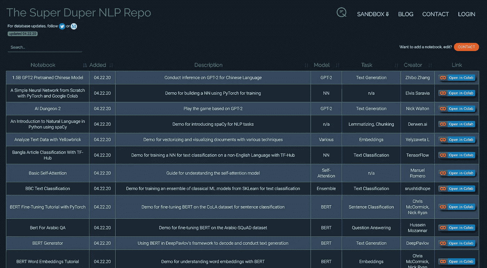

# NLP Colab 存储库

> 原文：<https://pub.towardsai.net/nlp-colab-repository-65136d3e45da?source=collection_archive---------2----------------------->

罗尔夫·诺依曼在 [Unsplash](https://unsplash.com?utm_source=medium&utm_medium=referral) 上的照片

## 100 多台运行 AI 模型的 Colab 笔记本

一月份，我们发布了[大坏 NLP 数据库](https://datasets.quantumstat.com/)，帮助 ML 开发者接触到高质量和多样化的数据集。在此期间，随着 NLP 行业的不断成熟，我们开始探索其他途径来满足社区的需求。事实证明，开发人员希望更直接地访问代码。

为了满足这种需求，我们创建了专业名称为**的超级 Duper NLP 回购。**一个数据库，包含 100 多个运行 ML 代码的 Colab 笔记本，用于各种 NLP 任务。Colab 是一个试验最新模型的绝佳目的地，因为它配备了位于谷歌后端服务器中的免费 GPU/TPU。

 [## 超级骗子 NLP 回购

### 适用于 NLP 中各种任务的 Colab 笔记本

notebooks.quantumstat.com](https://notebooks.quantumstat.com/) 

[notebooks.quantumstat.com](http://notebooks.quantumstat.com)

这些笔记本是由独立和行业人工智能研究人员(仅举几个例子)创建的:TensorFlow，Hugging Face，DeepPavlov 等。在其中，您可以运行几个最先进的模型，例如 BERT 或 T5，执行从分类到文本生成的任务。(别担心，我们没有排除你最喜欢的 RNN😁).

我们继续保持同样的社区心态，为开发人员提供一个目的地，为 NLP 这个新兴领域贡献他们自己的代码。如果你有一个笔记本要分享，你可以随时点击红色的大按钮。

迫不及待地想向你展示我们接下来的工作！

干杯，

里奇·科斯塔| [量子统计](http://www.quantumstat.com)