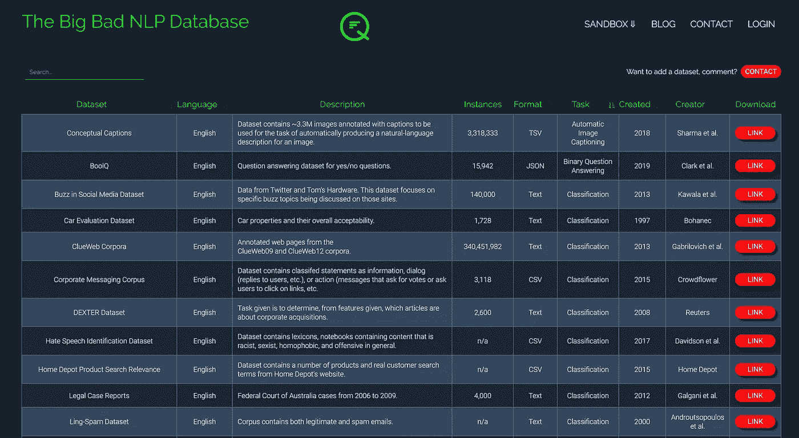

# NLP 数据集库

> 原文：<https://pub.towardsai.net/nlp-dataset-library-14443ddd3084?source=collection_archive---------0----------------------->

罗尔夫·诺依曼在 [Unsplash](https://unsplash.com?utm_source=medium&utm_medium=referral) 上的照片

## 面向机器学习开发人员的数百个数据集(还在增加)

随着深度学习的出现以及对更多和多样化数据的需求，研究人员不断寻找可以帮助训练他们的 ML 模型的最新数据集。目前，NLP 数据似乎分散在几个第三方图书馆、Reddit 或大型科技公司的研究部门。虽然这些媒体是有用的，但似乎没有一个中心枢纽来存放 NLP 数据，以便 ML 工程师可以轻松地访问和搜索。因此，我们创建了“**大坏 NLP 数据库，”**世界上最大的自然语言处理数据库:

 [## 大坏数据集—量子统计

### 自然语言处理中各种任务的数据集

quantumstat.com](https://quantumstat.com/dataset/dataset.html) 

我们已经为这个项目工作了几个星期了。到目前为止，我们已经积累了近 200 个数据集(还在增加),涵盖了 NLP 中的各个领域。除了包含 GLUE 和 SuperGLUE 中的经典数据集，我们还包含了从庞大的 CommonCrawl 到经典的 Penn Treebank 的数据集。

我们也不仅仅关注传统的 NLP 任务。在包括分类标准、问题回答的同时，我们还涵盖了与文本到 SQL、语音识别和多模态(文本和图像)相关的数据集。

我们希望这个库有一个社区心态，所以如果你有一个新的数据集或想推荐一个编辑，请使用网页上的联系链接，我们会尽快与你联系。

最后，我们一直在寻找有助于语言多样化的数据集(大多数数据集是英文的)，以使我们的图书馆更加全球化。如果有我们应该研究的英语以外的数据集，请不要犹豫与我们联系。我们希望这个库对您的开发工作有所帮助。

谢谢你

里奇·科斯塔|量子统计| [www.quantumstat.c](http://www.quantumstat.com) om