# NLP 精通第 1 部分

> 原文：<https://pub.towardsai.net/nlp-mastery-part-1-93cec31a457?source=collection_archive---------1----------------------->

## [自然语言处理](https://towardsai.net/p/category/nlp)

由[约书亚·阿拉贡](https://unsplash.com/@goshua13?utm_source=unsplash&utm_medium=referral&utm_content=creditCopyText)在 [Unsplash](https://unsplash.com/s/photos/code?utm_source=unsplash&utm_medium=referral&utm_content=creditCopyText) 上拍摄的照片

在这一系列文章中，我们不仅要学习如何使用 NLP 解决现实世界中的问题，还要学习这些概念背后的数学原理。这样我们就能理解这些算法实际上是如何工作的。

**自然语言处理** ( **NLP** )是语言学、计算机  科学和人工  智能的一个分支，涉及计算机和人类语言之间的交互，特别是如何给计算机编程以处理和分析大量自然  语言数据。其结果是计算机能够“理解”文档的内容，包括其中语言的上下文细微差别。然后，该技术可以准确地提取文档中包含的信息和见解，并对文档本身进行分类和组织。(来源:-维基)

> 听起来很复杂，对吧？让我们试着把它分解成一个简单的方法

我们都听说过或用过谷歌助手、苹果 Siri 或亚马逊 Alexa，但它们不会说你的语言，也听不懂你的话？那么他们如何理解我们，如何回答我们所有的问题呢？

或者你去一个新的地方，你不知道他们的语言，但通过使用翻译你可以简单地翻译它？这一切是怎么发生的呢？

**自然语言处理的魔力来了**

# **词汇和特征提取**

在这篇文章中，我们将学习如何把一个文本表示成一个向量。

为此，我们需要建立一个**词汇表，**但是等等什么是**词汇表？**

所以词汇什么都不是，只是给定文本语料库列表中的唯一单词的列表，要获得该列表，我们首先必须遍历所有给定文本语料库中的所有单词，并保存搜索中出现的每个新单词。(简单不是)

> 让我们举一个例子

给定的文本语料库是:

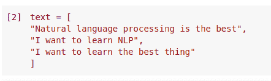

用它创造词汇

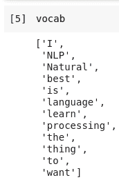

如您所见，没有重复值，只有唯一值

现在让我们用我们的词汇提取新的文本和特征。要做到这一点，我们必须检查我们的词汇中的每个单词是否都出现在文本“尸体”中。如果是，则赋值 1，否则赋值 0。

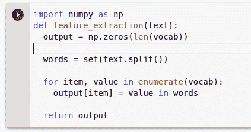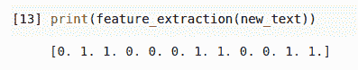

正如我们所看到的，对于那些在我们的词汇表中的单词，我们有 1，对于那些不在词汇表中的单词，我们有 0。所以我们有六个 1 和许多 0。目前，我们的词汇很少，没有很多零，但在现实世界中，我们的词汇中有很多单词，所以在这种情况下，我们有很多零，现在这种相对数量较少的非零值的表示被称为稀疏表示。

> 稀疏表示的问题

我们的 features_extraction 的大小等于我们的词汇表的大小，但是这里的大多数值都是零，这没有任何意义。所以我们的模型比如说(逻辑回归)必须学习 n+1 个参数，其中 n 是词汇量的大小。所以你可以想象，对于我们在现实世界中拥有的大量词汇来说，这是有问题的。

因此，对于 10000 个单词或词汇，我们有 10000 + 1 个参数要学习，这可能会导致过多的时间来训练，以及更多的时间来进行预测。

**正负频率**

正如我们在上面看到的，我们有一个稀疏表示的问题，这导致更多的训练时间和更多的时间来进行预测，那么我们要如何解决这个问题呢？

实际上，我们希望记录它作为正面类出现的次数，以及这个单词在负面类中出现的次数。使用这两个计数，我们可以提取特征，并在任何分类模型中使用这些特征，并训练我们的模型。

**假设我们有一个语料库**

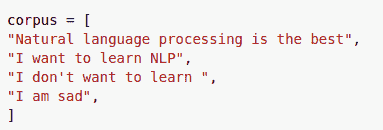

**和词汇**

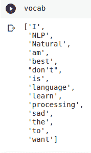

对于这个特殊的例子，我们可以看到我们有两个类。一个与积极情绪相关，另一个与消极情绪相关。

**肯定句**

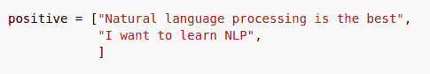

**否定句**

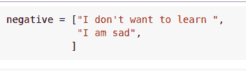

> 正频率计数

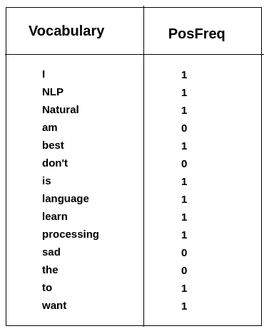

> 负频率计数

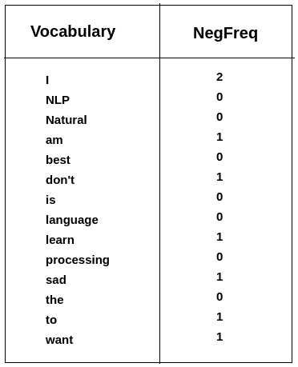

> 课堂上的词频

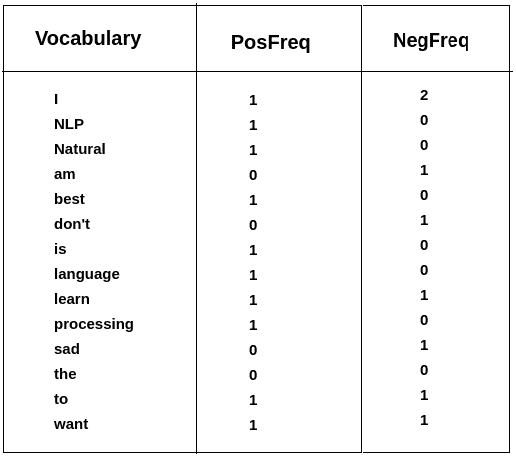

这是整张表格，包含了语料库的正负频率。这个表是一个从词类到词频的字典映射。

现在我们要用一个频率字典来表示一个文本。我们将对一个表示为三维向量的文本进行编码。那么我所说的三维是什么意思呢？

因此，以任意一条 tweet m 为例，第一个特征是偏差单位等于 1。第二个特征是文本 m 上每个唯一单词的正频率之和。第三个特征是文本上每个唯一单词的负频率之和。

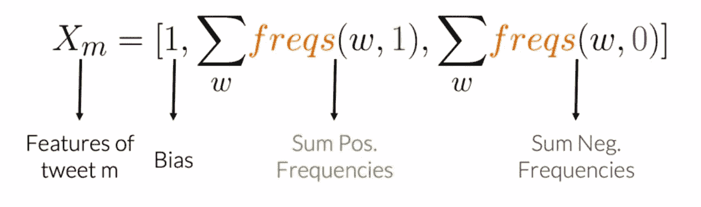

正频率和:- 10

负频率和:- 8

因此，我们最终得到以下特征向量[1，10，8]。1 对应于偏差，10 对应于正特性，8 对应于负特性。

现在，我们知道如何把给定的文本表示成向量。所以在下一篇文章中，我们将学习如何处理模型构建的文本。

暂时就这样了👏👏。下一篇文章再见。

参考:-[https://www . coursera . org/specializations/natural-language-processing](https://www.coursera.org/specializations/natural-language-processing)

**在我的 YouTube 上查看更多有趣的机器学习、深度学习、数据科学项目👉:-**[**YouTube**](https://www.youtube.com/c/himanshutripathi)**(👍)**

> ****看看我以前的文章:****

** [## 机器学习自动化…

### "仅仅因为你能使某件事自动化，并不意味着它就应该自动化."

medium.com](https://medium.com/nerd-for-tech/machine-learning-automation-1c112e099005)  [## 基于网页视觉相似性的产品推荐:机器学习项目…

### 众所周知，谷歌、亚马逊、网飞等大型科技公司都在使用推荐系统…

medium.com](https://medium.com/@iamhimanshutripathi0/product-recommendation-based-on-visual-similarity-on-the-web-machine-learning-project-end-to-end-6d38d68d414f)  [## Web 上印度语言(印地语)的自然语言处理(NLP)

### "语言是一个秘密，每个人都可以处理，对我来说，这是美丽的."

medium.com](https://medium.com/datadriveninvestor/natural-langauge-processing-nlp-for-indian-language-hindi-on-web-64d83f16544a)  [## 什么是平衡和不平衡数据集？

### 不平衡数据集到平衡数据集的转换技术及其比较

medium.com](https://medium.com/analytics-vidhya/what-is-balance-and-imbalance-dataset-89e8d7f46bc5)  [## 基于迁移学习的脑肿瘤分类

### 迁移学习的详细解释以及如何使用它进行分类

medium.com](https://medium.com/analytics-vidhya/brain-tumor-classification-transfer-learning-e04f84f96443)  [## 用于分类变量编码的不同类型的特征工程编码技术

### “让我们从现有功能中创建新功能。”

medium.com](https://medium.com/analytics-vidhya/different-type-of-feature-engineering-encoding-techniques-for-categorical-variable-encoding-214363a016fb) 

**如果你觉得这篇文章有趣，有帮助，如果你从这篇文章中学到了什么，请鼓掌(**👏👏)**并留下反馈。**

**感谢阅读！****