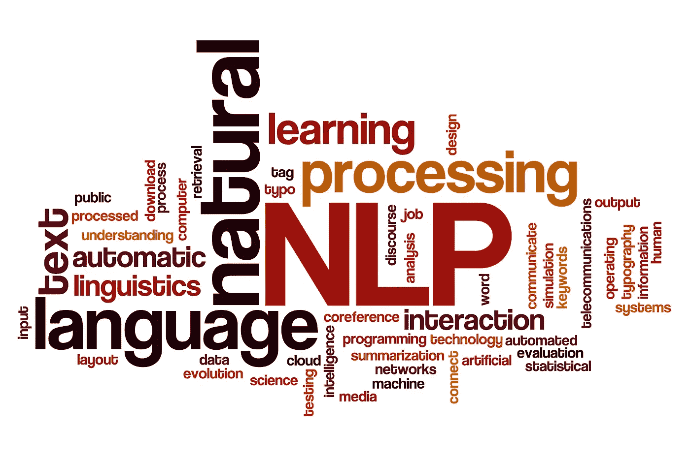
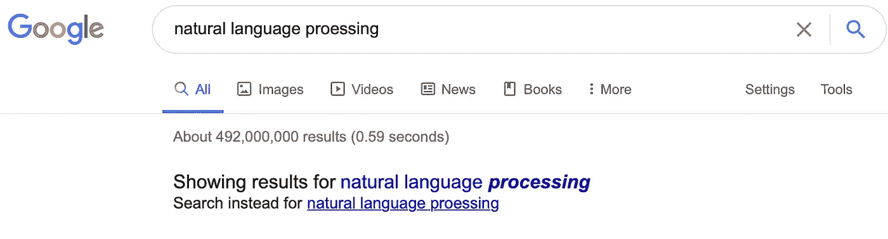
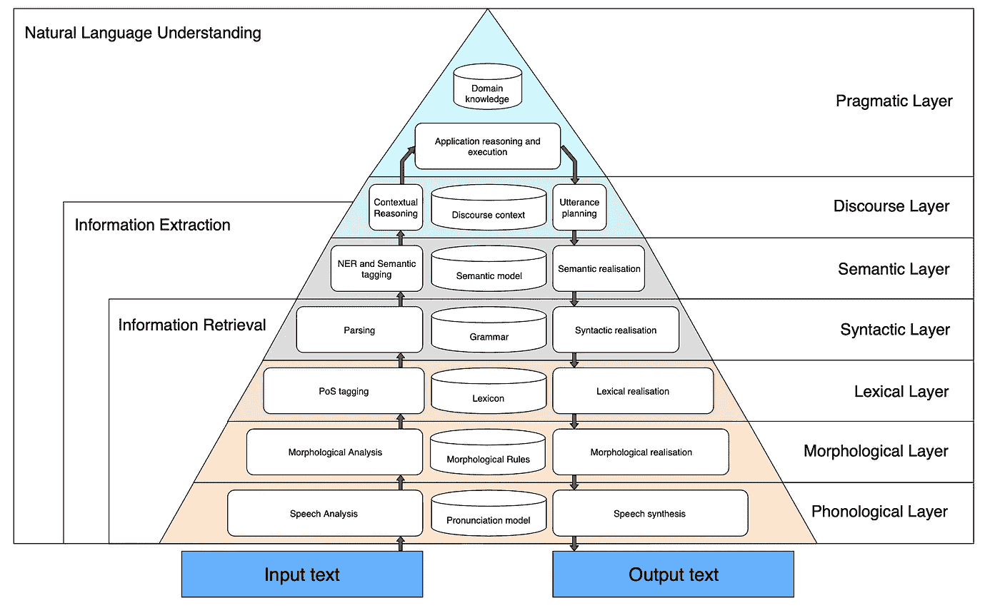
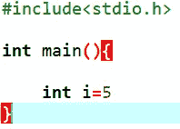
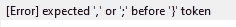
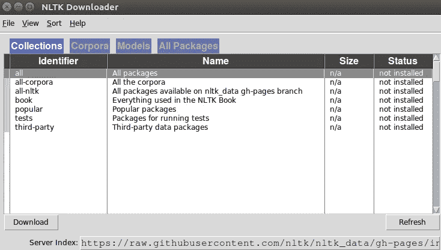
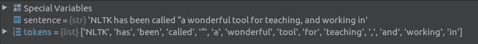

# 自然语言处理

> 原文：<https://pub.towardsai.net/nlp-natural-language-processing-b0581252373a?source=collection_archive---------1----------------------->

## [自然语言处理](https://towardsai.net/p/category/nlp)

由[爱德华·乔佩蒂亚](https://unsplash.com/@edurnepaula?utm_source=medium&utm_medium=referral)在 [Unsplash](https://unsplash.com?utm_source=medium&utm_medium=referral) 上拍摄的照片

大家好，在这篇文章里，我会讲一个随着**语言学**和**人工神经网络**的发展而发生在我们生活中的一个概念。NLP 是机器通过理解和推导人类语言来产生意义。机器被称为 **NP-Hard 问题**在优化问题中很常见，因为它们在翻译过程中不知道如何具体翻译。就像许多翻译程序的工作一样，它通过分析语法方面的主语、形容词和谓语等元素来理解单词并在某种程度上做出估计。

🧷:当然，有几个特点我应该提一下。在我们生活中 NLP 的早期，工作逻辑是基于基于规则的方法。然而，在自然语言处理中，仅仅使用规则是不够的。比如，come 这个词和 I am coming 这个词在意思上是有区别的。不幸的是，在一些加法语言中，基于规则的工作是不够的。为了消除这个问题，必须将句子分解成最小的积木，并进行分析。并且通过进行单词之间的概率估计，提供了单词之间的含义完整性。

参考文献[4]中的图像

**计算语言学中的🧷，**它包含了语言中所有的语法规则，语言是形式化的，用数学模型来表达。我下面使用的 NLTK 库包括许多模型和规则。给大家举几个小例子更好的理解 NLP，智能助手(Google Assistant，Siri，Cortana 等。)就是这些最好的例子。例如，*“你是说？”Section 是自然语言处理的一个很好的例子，它在你在搜索引擎上错过的搜索中为你返回反馈。在这个区域中，搜索引擎通过使用 n-gram 方法在你正在进行的搜索中分离整个句子来查看单词的含义关系。因此，它成功地将拼写错误的单词返回给用户。*

作者图片

🔺如果您希望更好地分析 NLP，让我们一起检查这些层。众所周知，语言有两个来源，语音和文本。检查文本数据的软件通常在 OCR /标记化领域工作。但在某些情况下，文本感知不足(需要强调等。).研究声音的科学叫做语音学(声音科学)。

参考文献[2]中的图像

🔺看看这些层，形态学被称为第二层，是 NLP 经常使用的一层。在词法层，通过词尾和词根的分离来推断词义。自动机理论中经常遇到的正则表达式(正则表达式)在形态学中有着广泛的应用。

🔺在第三层，句法(分词)层，确定单词在句子中出现的位置，并且单词含义可以根据这种分析而改变。换句话说，句子结构通过分析变得有意义。在这个阶段，我们可以想到任何编程语言的语法错误。每种语言都有独特的语法结构。例如，在 C 编程语言中；即使不使用，也会出现语法错误。在这里，每种语言自己在自然语言处理上的工作规则也很重要。在一些高级语言中，这种情况甚至可以在编码期间不等待操作就给出错误。

作者图片

作者图片

🔺语义层有一个基于词的意义推理，是 4 层。从语义 UI 可知，语义词义表现为语义分析。它通过逐个分离提取的元素进行形态学分析。对这些概念之间的关系进行了研究。其他层面的语用和话语概念完全依赖于语言使用。例如，话语的概念表达了使用该词的上下文。让我们考虑一个球。当读这个句子时，我们可以推断出这个球是篮球还是排球。这叫话语。

> 我将致力于 Python，这是一种专为数据科学和人工智能设计的编程语言。有意愿的可以查看自然语言库 **NLTK** 。

🧷正如你在上图中看到的，我们已经安装了 NLTK 库，也就是**自然语言工具包**，并使 NLTK 图形界面能够打印在屏幕上。你可以通过这个接口拥有我们将要使用的所有库。

作者图片

# Tokenizer🕵🏻‍♀️

下载的库中有我们可以把单词和句子一个一个分开的功能。在 Python 控制台中，我们按如下方式分隔单词。

作者图片

我向您展示了一点 NLTK 分析，以确保所说的在头脑中更好。有许多可以用 NLTK 图形界面下载的包，您可以按需下载并进行自然语言处理。祝大家编码好。✨

# 参考

1.  [https://www.nltk.org](https://www.nltk.org)

2. [Yudhanjaya Wijeratne](https://www.researchgate.net/publication/scientific-contributions/Yudhanjaya-Wijeratne-2158963013?_sg%5B0%5D=kMMeTz3KXh5_urSdUSTJoaf84M7NJrKACZTL-jceKzyPOWUw_fo2HFr5y-0MO_3YYLtFpE8._dRN0T2eA2X-gjZ3EIlb3kSOTuEtNj42OxRQqmkqoEJUxmQCVOkaQRmQCV-r2PPLOXMuBqyghHXPIhL--Ftjyg&_sg%5B1%5D=hS4nOU-_UgFy_PgC1C74gyeJ55AxP1Y3tAeOmgPCk71YT3mcUHT9bcjB1uYk28UBgRHuHgQ.Rp9BSJRufLwYeT90vUMa1DvBqZzW_oQl2QAkvqcT4uj02Sis_L4lYGZ2XHYv5RsZIU-35_3OMb7X2s0DC8lf2g) ， [Nisansa de Silva](https://www.researchgate.net/publication/profile/Nisansa_De_Silva2?_sg%5B0%5D=kMMeTz3KXh5_urSdUSTJoaf84M7NJrKACZTL-jceKzyPOWUw_fo2HFr5y-0MO_3YYLtFpE8._dRN0T2eA2X-gjZ3EIlb3kSOTuEtNj42OxRQqmkqoEJUxmQCVOkaQRmQCV-r2PPLOXMuBqyghHXPIhL--Ftjyg&_sg%5B1%5D=hS4nOU-_UgFy_PgC1C74gyeJ55AxP1Y3tAeOmgPCk71YT3mcUHT9bcjB1uYk28UBgRHuHgQ.Rp9BSJRufLwYeT90vUMa1DvBqZzW_oQl2QAkvqcT4uj02Sis_L4lYGZ2XHYv5RsZIU-35_3OMb7X2s0DC8lf2g) ， [Yashothara Shanmugarajah](https://www.researchgate.net/publication/scientific-contributions/Yashothara-Shanmugarajah-2158949788?_sg%5B0%5D=kMMeTz3KXh5_urSdUSTJoaf84M7NJrKACZTL-jceKzyPOWUw_fo2HFr5y-0MO_3YYLtFpE8._dRN0T2eA2X-gjZ3EIlb3kSOTuEtNj42OxRQqmkqoEJUxmQCVOkaQRmQCV-r2PPLOXMuBqyghHXPIhL--Ftjyg&_sg%5B1%5D=hS4nOU-_UgFy_PgC1C74gyeJ55AxP1Y3tAeOmgPCk71YT3mcUHT9bcjB1uYk28UBgRHuHgQ.Rp9BSJRufLwYeT90vUMa1DvBqZzW_oQl2QAkvqcT4uj02Sis_L4lYGZ2XHYv5RsZIU-35_3OMb7X2s0DC8lf2g) ，政府自然语言处理:问题与潜力，2009 年 4 月。

3.[https://towards data science . com/recurrent-neural-networks-and-natural-language-processing-73 af 640 C2 aa 1](https://towardsdatascience.com/recurrent-neural-networks-and-natural-language-processing-73af640c2aa1)

4.[https://www . blume global . com/learning/natural-language-processing/](https://www.blumeglobal.com/learning/natural-language-processing/)

5.来自维基百科，免费百科，[https://en.wikipedia.org/wiki/Natural_language_processing](https://en.wikipedia.org/wiki/Natural_language_processing)