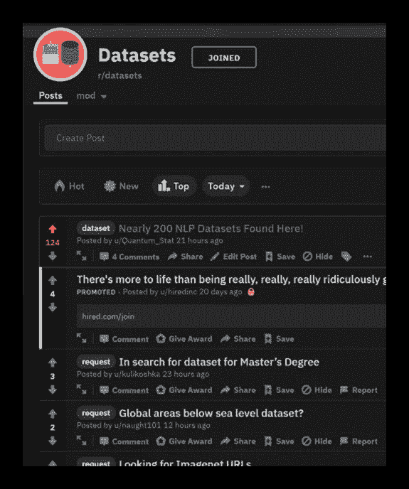
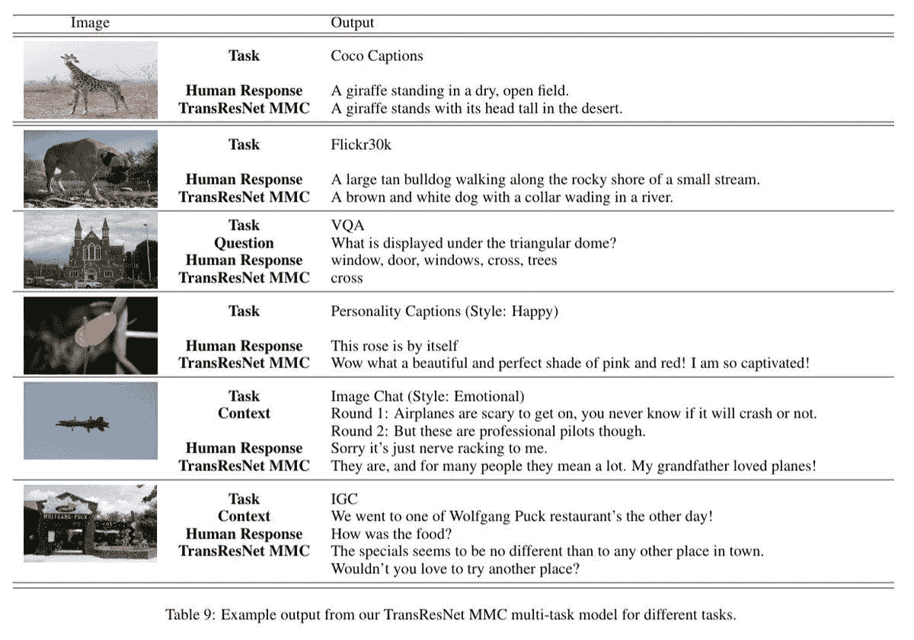

# NLP 新闻密码| 01.19.20

> 原文：<https://pub.towardsai.net/nlp-news-cypher-01-19-20-9e49c22401b3?source=collection_archive---------2----------------------->


罗伯特·穆雷在 [Unsplash](https://unsplash.com?utm_source=medium&utm_medium=referral) 上的照片

## 走向人工智能和无限

第二个。我们回来了！多好的一周啊！

首先，我们很高兴地宣布，我们现在将在《走向人工智能的平台》上发布我们的每周博客💪💪！很高兴这次出版合作，因为我们打算将 NLP 趋势带给更多的全球读者，从纽约的开发者到香港的商业专业人士。

谈到全球…

如果你在过去的一周里很忙:我们放弃了“**大坏 NLP 数据库**”，这是一个为 ML 和 NLP 开发者准备的大型数据集集合！数据库继续增长，我们已经收到了来自用户的极好的建议。更新即将推出！

**周三公告文章:**

[](https://medium.com/towards-artificial-intelligence/nlp-dataset-library-14443ddd3084) [## NLP 数据集库

### 面向 ML 开发人员的数百个数据集(还在增加)

medium.com](https://medium.com/towards-artificial-intelligence/nlp-dataset-library-14443ddd3084) 

**数据库:**

[](https://quantumstat.com/dataset/dataset.html) [## 大坏 NLP 数据库-量子统计

### 自然语言处理中各种任务的数据集

quantumstat.com](https://quantumstat.com/dataset/dataset.html) 

谢谢大家的支持！



解密的

# 本周:

> 重整变压器
> 
> 说出想法和想法
> 
> 识别脸书的实时语音
> 
> 深度黑客
> 
> Wolfram 数据分析网络研讨会
> 
> 康尼遇见空间
> 
> 我推荐研究论文
> 
> 本周数据集:记录
> 
> 同时，回到维加斯农场…

# 重整变压器

> Transformer 模型旨在处理多达 100 万个单词的上下文窗口，所有这些都在单个加速器上，并且仅使用 16GB 内存

谷歌以一声巨响和一个新的变形金刚开始了新的一年。谷歌的新模型想要解决两个问题:注意力和记忆力，这两个问题都是大输入序列的变形金刚所面临的压力。

在大量单词的情况下，注意力很难扩展，因此，谷歌引入了一种哈希技术，允许模型有效地将相似的向量“连接”在一起，并将它们分成组块。在关注这些片段之后，这导致计算负荷的减少。

在多层模型中会出现存储问题，因为需要在每一层为反向传递保存激活。这可能会导致您的 GPU 的内存爆炸又名 OOM 错误。

[链接](https://arxiv.org/pdf/1707.04585.pdf)

为了缓解这个问题，谷歌转向可逆层。(这种技术在上面的文章中讨论过)。它避免在内存中存储每一层的激活，而是通过一种巧妙的技术在向后传递时计算它们。

**博客:**

[](https://ai.googleblog.com/2020/01/reformer-efficient-transformer.html) [## 改革者:高效的变压器

### 理解连续数据——如语言、音乐或视频——是一项具有挑战性的任务，尤其是当有…

ai.googleblog.com](https://ai.googleblog.com/2020/01/reformer-efficient-transformer.html) 

**用于文本生成的 Colab:**

[](https://colab.research.google.com/github/google/trax/blob/master/trax/models/reformer/text_generation.ipynb) [## 谷歌联合实验室

### 编辑描述

colab.research.google.com](https://colab.research.google.com/github/google/trax/blob/master/trax/models/reformer/text_generation.ipynb) 

# 说心里话

脸书的对话式人工智能研究小组 ParlAI 的新研究将一个在几个基于图像的对话任务(又名多模态)中表现良好的单一模型结合在一起。下面是一些输出示例:



**论文:**

[链接](https://arxiv.org/pdf/1912.12394.pdf)

# 识别脸书的实时语音

脸书开源了他们的 wav2letter@anywhere 语音识别框架。这里的要点是，这个框架的推论是针对实时性能的。此外，它在 LibriSpeech 数据集上实现了 SOTA 性能！

**博客:**

[](https://ai.facebook.com/blog/online-speech-recognition-with-wav2letteranywhere/) [## 使用 wav2letter@anywhere 进行在线语音识别

### 从输入音频流实时转录语音的过程称为在线语音识别。大多数…

ai.facebook.com](https://ai.facebook.com/blog/online-speech-recognition-with-wav2letteranywhere/) 

**GitHub:**

[](https://github.com/facebookresearch/wav2letter/tree/master/recipes/models/sota/2019) [## facebookresearch/wav2letter

### 在本文中，我们考虑:声学建模的不同架构:不同的标准:不同的…

github.com](https://github.com/facebookresearch/wav2letter/tree/master/recipes/models/sota/2019) 

# 深度黑客

当进行工程设计时，饼干会在微观层面上破碎。是的，你可以从一个大的微调变压器获得很好的效果，但你仍然需要磨练你的经典技巧。Priyansh Trivedi 在他的博客中透露了一些关于这个话题的信息:

[](https://priyansh.page/bag-of-tricks/2020/01/10/bagoftricks-p1.html) [## 诡计多端👜对于 NLP 模型-(第 1 部分)

### 这是一系列简单的，部分显而易见的，并且(很大程度上)独立的提高性能的文章中的第一篇…

priyansh.page](https://priyansh.page/bag-of-tricks/2020/01/10/bagoftricks-p1.html) 

# Wolfram 数据分析网络研讨会

有三个 90 分钟。即将到来的 Wolfram 网络研讨会将重点介绍定制的 Twitter 分析、虚拟地图的数据挖掘以及如何创建自动报告系统(等等)。如果你对 Wolfram 语言和这些科目感兴趣，可以在这里注册[。](https://register.gotowebinar.com/register/483834997595797260?source=blog)

**博客:**

[](https://blog.wolfram.com/2020/01/16/3-free-wolfram-u-webinars-showcasing-innovative-data-science-applications/) [## 3 场免费的 Wolfram U 网络研讨会，展示创新的数据科学应用——Wolfram 博客

### 2020 年 1 月 16 日- Jamie Peterson，Wolfram U 技术项目经理，希望实现您的新年计划…

blog.wolfram.com](https://blog.wolfram.com/2020/01/16/3-free-wolfram-u-webinars-showcasing-innovative-data-science-applications/) 

# 康尼遇见空间

现在好了。特别为布拉姆呐喊。他更新了 spacy_conll repo，允许你将文本解析成 CoNLL-U 格式。该插件现在可以在命令行或 python 脚本中用作自定义管道。

你会问什么？

```
>  python -m spacy_conll --input_str "I like cookies . What about you ?" --is_tokenized --include_headers
# sent_id = 1
# text = I like cookies .
1       I       -PRON-  PRON    PRP     PronType=prs    2       nsubj   _       _
2       like    like    VERB    VBP     VerbForm=fin|Tense=pres 0       ROOT    _       _
3       cookies cookie  NOUN    NNS     Number=plur     2       dobj    _       _
4       .       .       PUNCT   .       PunctType=peri  2       punct   _       _

# sent_id = 2
# text = What about you ?
1       What    what    NOUN    WP      PronType=int|rel        2       dep     _       _
2       about   about   ADP     IN      _       0       ROOT    _       _
3       you     -PRON-  PRON    PRP     PronType=prs    2       pobj    _       _
4       ?       ?       PUNCT   .       PunctType=peri  2       punct   _       _
```

[](https://github.com/BramVanroy/spacy_conll) [## BramVanroy/spacy_conll

### 这个模块允许你把一个文本解析成 CoNLL-U 格式。您可以将它用作命令行工具，或者将其嵌入到您的…

github.com](https://github.com/BramVanroy/spacy_conll) 

# 我推荐研究论文

Santosh 创建了一个使用自然语言搜索研究论文的推荐引擎，称为自然语言推荐！它是根据摘要训练的，所以描述越长，搜索结果越好。

查看他的 GitHub，其中还包括一个用于测试引擎的 Colab。

[](https://github.com/Santosh-Gupta/NaturalLanguageRecommendations) [## Santosh-Gupta/natural language 建议

### https://colab . research . Google . com/github/Santosh-Gupta/natural language recommendations/blob/master/notebooks/inference/De…

github.com](https://github.com/Santosh-Gupta/NaturalLanguageRecommendations) 

# 本周数据集:记录

**是什么:**

"需要常识推理的阅读理解数据集."

**样本:**

[](https://sheng-z.github.io/ReCoRD-explorer/examples/002.html) [## 记录

### 常识推理阅读理解数据集(ReCoRD)是一种新的阅读理解数据集

sheng-z.github.io](https://sheng-z.github.io/ReCoRD-explorer/examples/002.html) 

**在哪里？**

[](https://sheng-z.github.io/ReCoRD-explorer/) [## 记录

### 常识推理阅读理解数据集(ReCoRD)是一种新的阅读理解数据集

sheng-z.github.io](https://sheng-z.github.io/ReCoRD-explorer/) 

# 同时，回到维加斯农场…

最后但同样重要的是，我不敢相信这是真的，但显然 indeed.com 有一个招聘启事，要求有国防部“绝密”许可的护卫？！？！？🤣🤣🤣你有资格吗？在下面发帖:

 [## 国防合同工作，在内华达州拉斯维加斯的就业| Indeed.com

### 内华达州 Indeed.com 的拉斯韦加斯有 57 个国防合同职位。适用于就业律师，技术员，指挥官…

www.indeed.com](https://www.indeed.com/q-Defense-Contract-l-Las-Vegas,-NV-jobs.html?advn=7484472901929921&vjk=6dfb72e3d9bf100b) 

> 每周日，我们都会对来自世界各地研究人员的 NLP 新闻和代码进行一次每周综述。
> 
> *如果您喜欢这篇文章，请帮助我们，并与朋友或社交媒体分享！*
> 
> *如需完整报道，请关注我们的 Twitter:*[*@ Quantum _ Stat*](https://twitter.com/Quantum_Stat)


[www.quantumstat.com](http://www.quantumstat.com/)