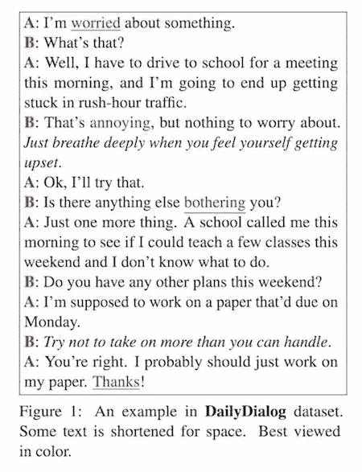

# NLP 新闻密码| 01.26.20

> 原文：<https://pub.towardsai.net/nlp-news-cypher-01-26-20-626fe7b7c24c?source=collection_archive---------3----------------------->

杰里米·毕晓普在 [Unsplash](https://unsplash.com?utm_source=medium&utm_medium=referral) 上的照片

## 关于自然语言处理(NLP)新闻和研究的每周时事通讯

## NLP 数据库更新出错

第二个。我们回来了！你这周过得怎么样？？

我们正在继续我们在 NLP 数据库上的努力工作！在周中，我们增加了 21 个数据集，用户的贡献帮助很大，这里提到了它们:

自从[大坏 NLP 数据库](https://quantumstat.com/dataset/dataset.html)发布以来，我们在全球范围内获得了压倒性的支持，包括仅在过去一周来自 98 个国家的访问者。我们还有更多的数据集，希望我们能捕捉到更多的国际变量。更多更新即将推出！

# 本周:

> 荷兰人罗伯塔
> 
> 入侵 GitHub 发布博客
> 
> 无服务器、虚拟机和容器
> 
> 梅隆的 Twitter NLP 库
> 
> 一种新的视觉问答数据集
> 
> 人工智能内容变得简单
> 
> mmmmmBART
> 
> 了解您的硬件
> 
> 本周数据集:每日对话

# 荷兰人罗伯塔

看起来我们有了一个新的专注于语言的转换器，它直接来自荷兰，world meet **RobBERT** 。它在几个荷兰的下游任务上取得了 SOTA 成果。你可以在这里了解更多信息:

**博客**:[https://people.cs.kuleuven.be/~pieter.delobelle/robbert/](https://people.cs.kuleuven.be/~pieter.delobelle/robbert/)

**GitHub(剪影头像，道具)**:

 [## 伊皮特/罗伯特

### 一个基于 RoBERTa 的荷兰语模型，带有一些特定于荷兰语的任务。在我们的博客或报纸上阅读更多…

github.com](https://github.com/iPieter/RobBERT) 

**论文**:

[链接](https://arxiv.org/pdf/2001.06286.pdf)

# 入侵 GitHub 发布博客

一个家伙想出了如何在 GitHub 页面中嵌入交互式 Jupyter 笔记本😎😎。如果你想让你的作品看起来更闪亮的话，这很酷。

 [## 博客文章用 Jekyll 导出笔记本为 HTML 的方法？

### 我试图解决的问题是用 Jupyter 写博客，但保持我的 Altair 图表的交互性。此外…

forums.fast.ai](https://forums.fast.ai/t/way-to-export-notebook-as-html-in-jekyll-for-blog-posts/61970/4) 

# 无服务器、EC2 和容器

部署 AI 模型的下一步需要一个独特的环境。在本白皮书中，Flux7 详细介绍了三种可能的云框架之间的差异:

> **“无服务器**是一种执行模式，云提供商负责通过动态分配资源来执行一段代码。无服务器资源按消耗的资源量定价；您只需为运行代码所使用的内容付费。”
> 
> “一个**容器**是一个标准的软件单元，它封装了代码及其所有依赖项，因此应用程序可以快速可靠地从一个计算环境运行到另一个计算环境”
> 
> **EC2** : 亚马逊的 VM lol

**论文**:

[链接](https://quantumstat.com/wp-content/uploads/WP_%20ServerlessvsEC2vsContainers_AComparativeStudy.pdf)

# 梅隆的 Twitter NLP 库

嘿…想去卡内基梅隆大学的 Twitter NLP 图书馆看看吗？您得到了一个分词器、一个词性标注器、分层单词簇和一个依存解析器(以及更多！).这是用 Java 写的，但是在博客中，他们提供了 Python 包装器的链接。

 [## Twitter 自然语言处理-诺亚方舟

### 我们为 tweets 提供了一个标记器、一个词性标注器、层次化的单词簇和一个依赖解析器，以及…

www.cs.cmu.edu](http://www.cs.cmu.edu/~ark/TweetNLP/) 

# 一种新的视觉问答数据集

> “子 VQA，一个由 200，000 个新感知问题组成的新数据集，这些问题作为子问题，对应于有效回答推理部分中复杂推理问题所需的感知任务集。”

好吧，那这到底是什么意思？

这是报纸上的一个例子:模特看到一张香蕉的照片。模型被问到，“香蕉熟到可以吃了吗？”它正确地回答“是”，但是接着模型被询问“香蕉主要是绿色还是黄色？”它错误地回答绿色，显示出与第一个答案的逻辑不一致。这个新的数据集试图研究这个问题。

**论文**:

[链接](https://arxiv.org/pdf/2001.06927.pdf)

# 人工智能内容变得简单

如果你想看看人工智能社区如何整理内容，你应该看看这个平台:

 [## 热门内容-实践应用

### 发现和组织顶级社区策划的内容。

practicalai.me](https://practicalai.me/explore/content/) 

它们使得在 URL 上添加标签变得简单，这样你就能掌握每周的内容。这本质上是一个针对顶级 AI 内容的巧妙的内容管理平台！干得好！

# mmmmmBART

脸书凭借一款名为 **mBART** 的新 Seq2Seq 多语言机器翻译模型引发热议。我们在推特上找到了其中一名研究人员。下面是详细讨论这项研究的帖子:

 [## @thoma_gu 写的一个帖子

### 1/7]超级激动地呈现我们的新作——mBART。我们演示了多语言去噪预训练产生…

线程应用程序](https://threader.app/thread/1221066191449546752) 

据研究人员称，GitHub 代码将很快在 Fairseq 的回购中发布。

 [## pytorch/fairseq

### Fairseq(-py)是一个序列建模工具包，允许研究人员和开发人员训练自定义模型…

github.com](https://github.com/pytorch/fairseq) 

**论文**:

[链接](https://arxiv.org/pdf/2001.08210.pdf)

# 了解您的硬件

在之前的时事通讯中，我对 Vivienne Sze 在 NeurIPS 的工作室赞不绝口，她让我大吃一惊。部分原因是她有如此多的知识要分享，部分原因是我理解在处理计算/内存/推理问题时部署大型模型的痛苦。如果你对部署的痛苦感兴趣，可以看看她在 Fridman 播客上的演讲:

# 本周数据集:每日对话

**是什么:**

标记有通信意图和情感信息的多回合对话数据集。

**样本:**

解密的

**在哪里？**

 [## 杨希嫣的阁楼

### 我们开发了一个高质量的多回合对话数据集 DailyDialog，它在几个方面都很吸引人。语言…

李燕然](http://yanran.li/dailydialog.html) 

> *每周日，我们都会对来自全球研究人员的 NLP 新闻和代码进行一次每周综述。*
> 
> *如果您喜欢这篇文章，请帮助我们，并与朋友或社交媒体分享！*
> 
> *完整报道，关注我们的推特:*[*@ Quantum _ Stat*](https://twitter.com/Quantum_Stat)

[www.quantumstat.com](http://www.quantumstat.com/)