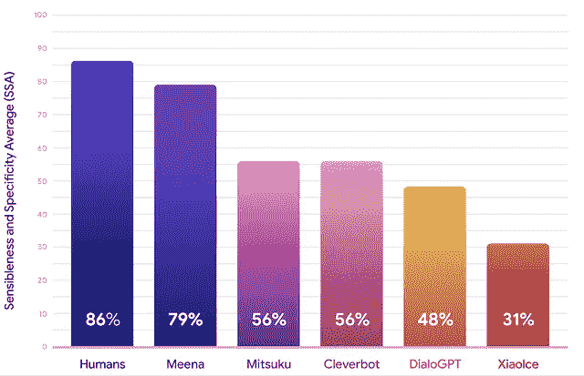

# NLP 新闻密码| 02.02.20

> 原文：<https://pub.towardsai.net/nlp-news-cypher-02-02-20-16dda25930bd?source=collection_archive---------1----------------------->

吉米·科诺弗在 [Unsplash](https://unsplash.com?utm_source=medium&utm_medium=referral) 上的照片

## 每周时事通讯自然语言处理(NLP)新闻和研究

## 木已成舟

今天是 02 . 02 . 20——909 年来的第一个全球回文日。👀

你这周过得怎么样？

好吧，如果你住在 NLP 宇宙附近的任何地方，你可能已经偶然发现了 NLP 数据库。如果你没有，你应该！

接下来，我想对上周的两位数据库贡献者表示感谢:Kiril Gashteovski 和 Chandra Sekhar。谢谢大家！到目前为止，我们已经积累了 239 个自然语言处理数据集。

如果您知道某个数据集缺失或有编辑请求，请通过数据库网页联系我们。

# 本周:

> BERTs 通用语
> 
> 深度学习训练营
> 
> 米娜令人费解
> 
> 有意识的头脑
> 
> 表示感谢
> 
> S&P 全球 NLP 白皮书
> 
> 部署难题
> 
> 本周数据集:QA-SRL 银行

# BERTs 通用语

在 Twitter 上，Sebastian Ruder 分享了我们已经有多少国际 BERT 模型！然后抱脸又分享了一些。总的来说，展出了很多国旗！这对国际社会来说是好事！

**抱紧脸:**

**我**:

# 深度学习训练营

在下一代机器人杀手和莱克斯·弗里德曼深色西装的脚步之外，在麻省理工学院的最深处，有一个为期一周的深度学习训练营。它在 YouTube 上:

# 米娜令人费解

谷歌创造了一个聊天机器人，其训练目标是最小化困惑。显然，它的质量非常好。当阅读 Meena 的对话时，它似乎正在做一件对大多数聊天对话系统来说非常困难的事情:记忆。为了解决这个问题，他们使用了 1 个编码器和 13 个解码器模块。编码器存储 convo 的上下文，解码器帮助制定更高的对话质量。这是机器人逆天而行的方式:

我问谷歌大脑的 Thang Luong 它是否会开源。显然，他们对它的发布持谨慎态度，就像 OpenAI 处理自己的 GPT-2 发布一样:

**博客:**

 [## 一个可以聊天的对话代理...任何事

### 现代的对话代理(聊天机器人)趋向于高度专业化——只要用户不偏离主题，它们就会表现良好…

ai.googleblog.com](https://ai.googleblog.com/2020/01/towards-conversational-agent-that-can.html) 

# 有意识的头脑

大约七年前，在曼哈顿下城，我在一家电影院外偶然遇到了大卫·查默斯(当时他正穿着皮夹克，正处于“鞭打金属头发”阶段)。当我们离开这个机构时，我谈到了我对他的书《有意识的头脑》的喜悦。我接着讲了一个神经科学笑话。他傻笑。

总之，以下是查默斯在弗里德曼播客上的发言:

# 表示感谢

似乎每次我阅读 FloydHub 的文章时，阅读前的一个明确的先决条件是热可可和壁炉。在最近的一篇文章中，他们举例说明了各种标记化器以及它们在功能上的不同。下面是讨论过的标记化器(并做一个更详细的介绍):

> 子词标记化
> 字节对编码(BPE)
> 单字子词标记化
> 单词块
> 句子块

 [## 记号赋予器:机器如何读取

### 深度学习(DL)自然语言处理(NLP)的世界正在快速发展。我们试图捕捉一些…

blog.floydhub.com](https://blog.floydhub.com/tokenization-nlp/) 

# S&P 全球 NLP 白皮书

S&P 全球市场研究公司发布了几份关于自然语言处理在金融中的应用的白皮书。他们还共享用例和代码！这对私营企业来说是罕见的。无论如何，跟上商业方面的事情总是好的。

**第一部分:**

[链接](https://www.spglobal.com/marketintelligence/en/documents/sp-global-market-intelligence-nlp-primer-september-2018.pdf)

**第二部分:**

[链接](https://www.spglobal.com/marketintelligence/en/documents/mi-research-qr-nlp-part-ii-180912-new.pdf)

**第三部分:**

[链接](https://www.spglobal.com/marketintelligence/en/documents/nlp-iii-final-013020-10a.pdf)

# 部署难题

如果您想要部署您的模型，那么阅读这篇文章将会对您有所帮助。Cortex 的 Caleb Kaiser 展示了当试图部署一个大型 transformer 模型并同时要求它大规模工作时的常见陷阱。

 [## 太大而无法部署:GPT-2 如何打破生产

### 看看将大规模模型部署到生产中的瓶颈

towardsdatascience.com](https://towardsdatascience.com/too-big-to-deploy-how-gpt-2-is-breaking-production-63ab29f0897c) 

# 本周数据集:QA-SRL 银行

**什么事？**

这是一个用于语义角色标注的问答数据集。

**样本:**

 [## 质量保证-SRL |浏览数据

### 编辑描述

browse.qasrl.org](http://browse.qasrl.org/) 

**在哪里？**

 [## uw NLP/QA SRL-银行

### 该库是 QA-SRL 银行 2.0 的参考点，该数据集在论文《大规模 QA-SRL…

github.com](https://github.com/uwnlp/qasrl-bank) 

> 每周日，我们都会对来自世界各地的研究人员的 NLP 新闻和代码进行每周综述。
> 
> 如果您喜欢这篇文章，请帮助我们，并与朋友或社交媒体分享！
> 
> *如需完整报道，请关注我们的推特:*[*@ Quantum _ Stat*](https://twitter.com/Quantum_Stat)

[www.quantumstat.com](http://www.quantumstat.com/)