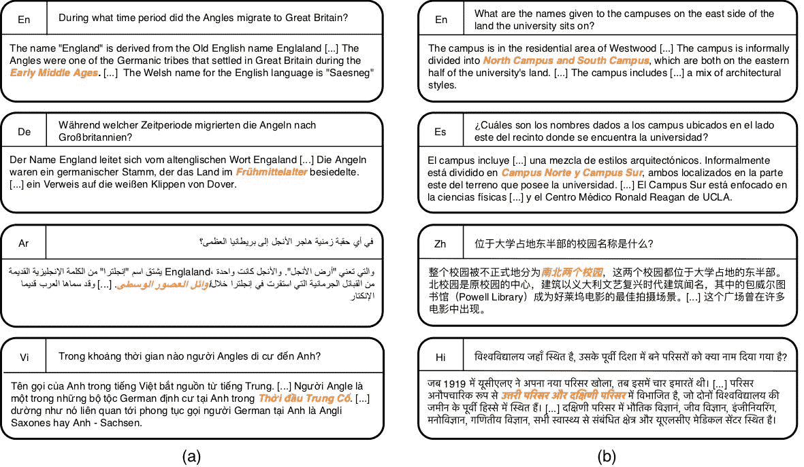

# NLP 新闻密码| 02.09.20

> 原文：<https://pub.towardsai.net/nlp-news-cypher-02-09-20-4a183b58e3da?source=collection_archive---------0----------------------->

杰里米·毕晓普在 [Unsplash](https://unsplash.com?utm_source=medium&utm_medium=referral) 上的照片

## 自然语言处理每周时事通讯

## 去地狱然后回来…

DARPA，国防高级研究计划局，也就是建造👽飞船(ABAS)，真的很爱 NLP。更具体地说，他们真的喜欢构建多模态模型来增强知识图。显然，他们也有自己的 YouTube 频道，名为 DARPAtv。🤷‍♂️

解密的

在上面的视频进行到一半时，这个人陷入了一个关于“我家外面有一辆坦克”这句话中“坦克”一词的词义歧义问题🤣🤣。

我想我在语义学上有很大的问题，我猜 DARPA 胜过我。

你这周过得怎么样？

本周，我们向[大坏 NLP 数据库](https://quantumstat.com/dataset/dataset.html)添加了 25 个新数据集。我们有几个用户贡献者:Philip Vollet，Arthit Suriyawongkul，Talha Anwar 和 Gabriel Altay。非常感谢！

# 本周:

> 缺失的学期
> 
> 流光照明空间
> 
> 质疑意义
> 
> 从头开始研究
> 
> COTA:顾客痴迷票务助理
> 
> 多语言数据集屹立于巨人之林
> 
> 为投资而投资 AI
> 
> 本周数据集:多语言问答(MLQA)

# 缺失的学期

麻省理工有更多的秘密。显然，麻省理工学院有一个隐藏的 Konami 作弊代码，用于学习很少有人知道的计算机科学。在搜索他们的网站时，我发现了这个:

 [## 你计算机科学教育的缺失学期

### 课程教你所有关于 cs 的高级主题，从操作系统到机器学习，但是有一个…

missing.csail.mit.edu](https://missing.csail.mit.edu/) 

**视频:**

# 流光照明空间

我认为 SpaCy 不能得到更多的视觉震撼。但显然，它可以。在 Streamlit 的帮助下，您可以实现 SpaCy 必须提供的所有 NLP 好处。你甚至可以用受 Ines Montani 启发的 Prasanna's code (Github)来重现。

如果你还没看过 Streamlit，这里是他们的网站:

 [## streamlit——构建定制 ML 工具的最快方法

### Streamlit 是一个面向机器学习和数据科学团队的开源应用框架。在…中创建漂亮的数据应用程序

www.streamlit.io](https://www.streamlit.io/) 

# 质疑意义

艾伦研究所发布了一篇很棒的博文，对问题理解进行了有趣的思考。虽然我们通常关注人工智能模型能否回答问题，但 AI2 让我们踏上了理解其前身的旅程:它能理解问题吗？

它们通过分解来实现这一点。这里有一个例子:

> "一个系统可能回答"**说出人口最稠密的国家**的政党"，首先使用 DB 查询返回"**人口最稠密的国家**"，然后使用文本的 QA 模型返回"**# 1 的政党**。"

解密的

**博客:**

 [## 突破:将自然语言问题映射到它们的意义表示

### 特拉维夫大学和艾伦人工智能研究所的一组 NLP 研究人员的联合工作。

medium.com](https://medium.com/ai2-blog/break-mapping-natural-language-questions-to-their-meaning-representation-31bb753701d6) 

# 从头开始研究

爱德华·拉夫提出了一个核心问题:

> "最新的 ML 研究的可重复性如何，我们可以开始量化影响其可重复性的因素吗？"

**发现 1:** 每页的方程式越少，论文的可重复性越好。

**发现二:**经验型论文可能比理论型论文更具有可复制性。

**发现三:**共享代码不是万能的。

**发现 4:** 有详细的伪代码和没有伪代码一样具有可复制性。

**调查结果 5:** 创建简化的示例问题似乎对再现性没有帮助。

**调查结果 6:** 请检查您的电子邮件(回复邮件中关于论文的问题)

 [## 量化可独立再现的机器学习

### 300 多年来，eer 评审一直是科学研究不可或缺的一部分。但是甚至在同行评议之前…

thegradient.pub](https://thegradient.pub/independently-reproducible-machine-learning/) 

# COTA:顾客痴迷票务助理

欢迎来到优步兄弟！在他们的博客中，优步回顾了他们如何建立一个内部客户服务票系统，以帮助当人们对他们的司机生气时(jk)。但说真的，优步展示了他们如何使用简单而有效的技术，像 TF-IDF，余弦相似度(word2vec be like👀)来帮助扩展他们的服务！所以你想知道私营企业是如何使用人工智能的？你可以在这里读到:

 [## COTA:用自然语言处理和机器学习改善优步客户服务

### 进入 COTA，我们的客户困扰票务助理，一个使用机器学习和自然语言处理的工具…

eng.uber.com](https://eng.uber.com/cota/) 

# 多语言数据集屹立于巨人之林

出于某种原因，本周大量数据集丢失。脸书和谷歌加入了多语言领域的行动。是的，我计划这周把它们加入数据库。

(惊讶吧，谷歌的数据集已经在数据库里了😁)

# 为投资而投资 AI

世界经济论坛和剑桥大学在最近发布的一份报告中调查了人工智能在金融服务中的使用。

**值得关注的亮点:**

人工智能采用的首要领域:*风险管理*

人工智能领导者采用人工智能的首选领域:*客户服务*

数据分析领域的顶级人工智能用例:*销售分析*

[链接](https://quantumstat.com/wp-content/uploads/WEF_AI_in_Financial_Services_Survey_Feb2020.pdf)

# 本周数据集:多语言问答(MLQA)

**什么事？**

用于评估英语、阿拉伯语、德语、西班牙语、印地语、越南语和简体中文跨语言问答性能的数据集。

**样品:**

**在哪里？**

 [## facebookresearch/MLQA

### MLQA(多语言问答)是一个评测跨语言问答的基准数据集…

github.com](https://github.com/facebookresearch/MLQA) 

> *每周日，我们都会对来自世界各地研究人员的 NLP 新闻和代码进行一次每周综述。*
> 
> *如果您喜欢这篇文章，请帮助我们，并与朋友或社交媒体分享！*
> 
> *如需完整报道，请关注我们的 Twitter:*[*@ Quantum _ Stat*](https://twitter.com/Quantum_Stat)

[www.quantumstat.com](http://www.quantumstat.com/)