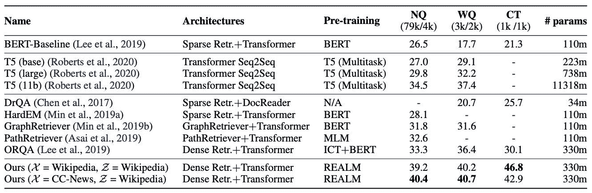

# NLP 新闻密码| 02.16.20

> 原文：<https://pub.towardsai.net/nlp-news-cypher-02-16-20-e3101b7400cb?source=collection_archive---------2----------------------->

戴维·阿拉克里扬在 [Unsplash](https://unsplash.com?utm_source=medium&utm_medium=referral) 上的照片

## 自然语言处理每周时事通讯

## 天空中伟大的演出

第二…我们回来了！你这周过得怎么样？

上周是非常有趣和冒险的，许多新的数据集、研究和 NLP 研究被一炮打响！

也是在纽约，AAAI 会议召开了。在那里，图灵奖获得者(LeCun、Bengio 和 Hinton)聚在一起进行了一些激动人心的演讲。

Yoshua 非常兴奋，他甚至开了一个博客…他的第一句话是:

 [## Yoshua Bengio 的博客-第一句话- Yoshua Bengio

### 我经常在社交媒体上写评论和帖子，但这些往往只是暂时可见的，所以我想我需要一个…

yoshuabengio.org](https://yoshuabengio.org/2020/02/10/fusce-risus/) 

Yann 发表了演讲并分享了幻灯片:

 [## lecun-20200209-aaai.pdf

### 编辑描述

drive.google.com](https://drive.google.com/file/d/1r-mDL4IX_hzZLDBKp8_e8VZqD7fOzBkF/view) 

Yann 的自我监督学习谈话显示了 NLP 在过去几年里给我们带来了多少。你可能从 BERT 和其他变形金刚那里听说过“屏蔽”，这种过滤掉数据导致模型适应信息缺乏的关键概念是幻灯片的症结所在，其后果是深远的。问问计算机视觉领域的人就知道了:

最后但同样重要的是，在 AAAI 会议上，杰出论文奖授予了艾伦研究所 WinoGrande 数据集的作者。特别感谢 Chandra 在几周前向我们转发了数据集。它已经被添加到[大坏 NLP 数据库](https://quantumstat.com/dataset/dataset.html)的保险库中。👍

# 本周:

> 高尔基图来了
> 
> 压缩伯特
> 
> DeepMind 保持 PG-19
> 
> 极速和零度冷却
> 
> 开域 QA 反击！
> 
> 为什么模型会失败
> 
> 卡格尔，科拉布和伯恩斯先生
> 
> 本周数据集:WinoGrande

# 高尔基图来了

*“今年 AAAI 共收到 1591 篇论文，其中约有 140 篇与图形相关。”*

不能有一个会议不提到高尔金的知识图的覆盖范围！

流行什么

在语言模型上转储知识图…

不同模式知识图上的实体匹配…

时态知识图也称为动态图…

对于那些构建面向目标的机器人来说👇，请查阅模式引导的对话状态跟踪研讨会论文:

[链接](https://arxiv.org/pdf/2002.01359.pdf)

 [## 知识图表@ AAAI 2020

### 2020 的第一个重大 AI 事件已经来了！希望你假期过得愉快🎄，或者新年快乐，如果你的…

medium.com](https://medium.com/@mgalkin/knowledge-graphs-aaai-2020-c457ad5aafc0) 

# 压缩伯特

Peeps 在拥抱脸的社区图书馆上丢了一个新的 BERT。这是 BERT 的压缩版本，在 6 个粘合任务上优于蒸馏版本(实际上与基本模型相当)！这对那些希望在计算上省钱的人来说太棒了！(和我一样😁)

 [## 残文旭/伯特修斯-MNLI 拥抱脸

### 参见我们的论文“BERT-of-Theseus:通过渐进式模块替换压缩 BERT”。忒修斯的伯特是一个新的压缩…

huggingface.co](https://huggingface.co/canwenxu/BERT-of-Theseus-MNLI) 

# DeepMind 保持 PG-19

这家研究巨头发布了一个新的转换器 Compressive Transformer 和一个新的数据集 PG-19，用于语言建模。

该数据集由 1919 年前出版的古登堡计划的 28，000 本书组成。

transformer 的目标是通过能够维护书籍文本的长上下文来帮助解决当前 transformer 的内存限制。

> “压缩变形金刚能够产生各种风格的叙事，从多角色对话，第一人称日记条目，或第三人称散文。”

**博客:**

 [## 一个新的长期记忆模型和数据集

### 这个博客介绍了一个新的长期记忆模型，压缩变压器，以及一个新的基准…

deepmind.com](https://deepmind.com/blog/article/A_new_model_and_dataset_for_long-range_memory) 

# 极速和零度冷却

微软不得不提醒大型科技公司，它有一些王牌。它发布了一个名为 DeepSpeed 的新库。这是什么？

> “…[它]是一种新的并行化优化器，它大大减少了模型和数据并行所需的资源，同时大幅增加了可训练的参数数量。研究人员利用这些突破创造了图灵自然语言生成([图灵-NLG](https://www.microsoft.com/en-us/research/blog/turing-nlg-a-17-billion-parameter-language-model-by-microsoft) )，这是最大的公共已知语言模型，有 170 亿个参数，你可以在这篇附带的博客文章中了解更多关于[的信息。](https://www.microsoft.com/en-us/research/blog/turing-nlg-a-17-billion-parameter-language-model-by-microsoft)

是的，你没看错，170 亿参数。它与 PyTorch 兼容。这个新的图书馆能够训练更大的变形金刚，但是更有效率！

 [## ZeRO & DeepSpeed:新的系统优化支持超过 1000 亿个参数的训练模型…

### 人工智能的最新趋势是，更大的自然语言模型提供更好的准确性；但是，较大的型号…

www.microsoft.com](https://www.microsoft.com/en-us/research/blog/zero-deepspeed-new-system-optimizations-enable-training-models-with-over-100-billion-parameters/?OCID=msr_blog_zerodeep_tw) 

# 开域 QA 反击！

在过去的几年里，开放领域的 QA 几乎停滞不前。自从脸书放弃了 DrQA 之后，这个领域并没有看到太多的进步，直到几天前，谷歌的一个新模型在自然问题基准上以几分之差达到了 SOTA！

解密的

 [## @kelvin_guu 写的一个线程

### 来自谷歌研究的新消息！领域:http://realm.page.link/paper 我们训练了一个 LM，它很少出现在…

线程应用程序](https://threader.app/thread/1227378652318330885) 

附注:他们计划开源它:

**论文:**

[链接](https://kentonl.com/pub/gltpc.2020.pdf)

# 为什么模型会失败

哦，天啊，在野外放模型的时候，有时候事情并不像预期的那样。我们都理解当看到 SOTA 模型由于新兴环境的琐碎属性而表现不佳时所感到的焦虑(现实世界中的事物是适应性的，而不是静态的)。

Hady Elsahar 在这篇直观的文章中讨论了畴变问题及其对模型性能的影响:

 [## 预测 ML 模型何时在生产中失败

### 要不要批注？预测域转移下的性能下降。Hady Elsahar 和 Matthias 的#EMNLP2019 论文…

medium.com](https://medium.com/@hadyelsahar/predicting-when-ml-models-fail-in-production-a8a021592f8a) 

# 卡格尔，科拉布和伯恩斯先生

现在在 Kaggle 上，你可以每周使用 30 个小时的 TPUs，一次最多使用 3 个小时。

 [## 张量处理单元(TPUs)文档

### Kaggle 是世界上最大的数据科学社区，拥有强大的工具和资源来帮助您实现您的数据…

www.kaggle.com](https://www.kaggle.com/docs/tpu?utm_medium=social&utm_source=twitter&utm_campaign=tpu-announcement-1) 

**科拉布:**

推出 Colab Pro，每月 10 美元，它提供更好的 GPU 和更长的运行时间:

 [## 谷歌推出 Colab Pro w/更快的 GPU，更多内存-9 比 5

### Google Colab 是数据科学家和人工智能研究人员在线共享工作的有用工具。该公司本周悄悄…

9to5google.com](https://9to5google.com/2020/02/08/google-introduces-colab-pro/) 

**谷歌像:**

伯恩斯先生

# 本周数据集:WinoGrande

**什么事？**

公式化为具有二元选项的填空任务，目标是为需要常识推理的给定句子选择正确的选项。

**样本:**

卡特里娜有财力买得起一辆新车，而莫妮卡却没有，因为她有份高薪工作。

*选项 1:* 卡特里娜

选项 2: 莫妮卡

**在哪里？**

 [## 阿莱奈/威诺兰德

### 1.1 版(2019 年 12 月 2 日)通过 download_winogrande.sh 下载数据集。/data/ ├──火车 _[xs，s，m，l，xl]。jsonl #培训…

github.com](https://github.com/allenai/winogrande) 

> 每周日，我们都会对来自世界各地的研究人员的 NLP 新闻和代码进行每周综述。
> 
> 如果您喜欢这篇文章，请帮助我们，并与朋友或社交媒体分享！
> 
> *完整报道，关注我们的推特:*[*@ Quantum _ Stat*](https://twitter.com/Quantum_Stat)

[www.quantumstat.com](http://www.quantumstat.com/)