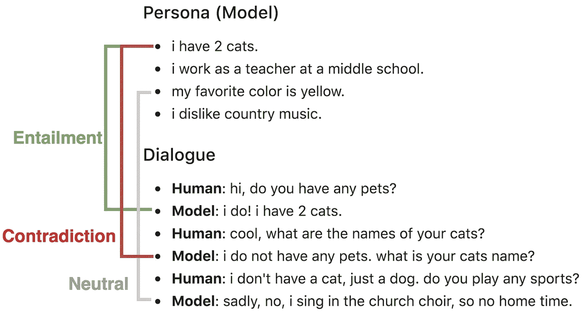

# NLP 新闻密码| 02.23.20

> 原文：<https://pub.towardsai.net/nlp-news-cypher-02-23-20-446285e828f9?source=collection_archive---------2----------------------->

马西米利亚诺·莫罗西诺托在 [Unsplash](https://unsplash.com?utm_source=medium&utm_medium=referral) 上拍摄的照片

## 自然语言处理每周时事通讯

## 达库努 riști 努 câștigi

如果你想知道副标题是什么意思，那是罗马尼亚语。意思是这样的:

你这周过得怎么样？

上周我们再次更新了大坏 NLP 数据库，感谢艾曼·阿尔赫尔巴维的贡献！

# 本周:

> Los 趋势
> 
> 真相伤人
> 
> 总结一下我
> 
> 拥抱 NER
> 
> 嘿，邻居，我是语言模特
> 
> (红色)帽子的尖端
> 
> 带注释的 GPT-2
> 
> 本周数据集:对话 NLI

# Los 趋势

我们阅读的所有书籍的作者奥赖利分析了他们的在线学习平台，以洞察最流行的科技趋势。

TL；博士:

1.  Python 正在杀死它(R.I.P. to *R*
2.  云的使用正在杀死它(微服务和它们的容器)
3.  2019 年，对 NLP 的兴趣增长了+22%。👀

**全图:**

 [## 2020 年技术领导者需要关注的 5 个关键领域

### O'Reilly 在线学习包含有关趋势、主题和问题的信息，技术领导者需要关注和…

www.oreilly.com](https://www.oreilly.com/radar/oreilly-2020-platform-analysis/) 

# 真相伤人

艾伦研究所有大量的演示供你玩。最近，Twitter 上的一个演示引起了我的注意。这个模型能够根据你在自然语言中赋予它的条件来判断一个陈述是真还是假。根据 AI2 的说法:

> “ROVER(**R**eason**ov**R**R**ules)模型读入自然语言事实和规则的新规则库，并在封闭世界(以及否定即失败)假设下决定新语句的真值。”

**演示:**

 [## 漫游者:对规则的推理

### 编辑描述

rule-reasoning.apps.allenai.org](https://rule-reasoning.apps.allenai.org/) 

# 总结一下我

从整洁有序的文本中总结很难。但是从论坛/对话数据中总结就更难了。微软亚洲的 Peeps 发表了一篇关于摘录摘要的新论文，讨论了注意力的用法。

该模型在 Trip Advisor 论坛讨论数据集上获得了 SOTA 胭脂的分数！

[链接](https://arxiv.org/pdf/2002.03405.pdf)

# 拥抱 NER

嘿，想通过拥抱脸库用 SOTA 变形金刚做一些命名实体识别吗？想要密码吗👇

**Colab:**

 [## 谷歌联合实验室

### 编辑描述

colab.research.google.com](https://colab.research.google.com/drive/184LPlygvdGGR64hgQl3ztqzZJu8MmITn) 

GitHub:

 [## 拥抱脸/变形金刚

### 🤗变形金刚:用于 TensorFlow 2.0 和 PyTorch 的最新自然语言处理。…

github.com](https://github.com/huggingface/transformers/blob/master/examples/ner/run_pl_ner.py) 

# 嘿，邻居，我是语言模特

根据脸书研究中心和斯坦福大学的最新研究，将 k 近邻(kNN)应用于语言模型可以提高性能。在 Wikitext-103 语言模型数据集上，这种新方法在没有任何额外训练的情况下，在困惑度上提高了 2.9 个百分点！

**论文:**

[链接](https://arxiv.org/pdf/1911.00172.pdf)

# (红色)帽子的尖端

红帽发布了一份关于开源软件状况的新报告！根据该报告，专有软件预计将在未来几年暴跌，开源软件预计将增加。他们还分享了为什么开源如此受欢迎(除了免费之外)以及在企业中采用的主要领域。如果你卖开源软件，你应该看看这个:

[链接](http://quantumstat.com/wp-content/uploads/rh-enterprise-open-source-report-detail-f21756-202002-en.pdf)

# 带注释的 GPT-2

嘿，还记得[带注释的变形金刚](https://nlp.seas.harvard.edu/2018/04/03/attention.html)吗？那时，拉什先生用代码注释了臭名昭著的“你所需要的只是注意力”这篇论文。好吧，看起来我们现在有一个来自阿罗拉先生的 GPT-2。尽情享受吧！

GPT-2:

 [## 带注释的 GPT-2

### 介绍先决条件语言模型是无监督的多任务学习者抽象模型架构(GPT-2)…

amaarora.github.io](https://amaarora.github.io/2020/02/18/annotatedGPT2.html) 

# 伯特学习编码

微软正在使用 BERT 来编码👀。在本月发表的一篇论文中，他们的研究团队使用了自然语言文本和来自几种编程语言的代码，并在预训练期间部署了它们。具体来说，它是用自然语言和代码对以及单峰数据(没有自然语言对的代码)来训练的。

该模型实现了下游任务的 SOTA，如自然语言代码搜索和代码到文档的生成。

**论文**:

[链接](https://arxiv.org/pdf/2002.08155.pdf)

# 本周数据集:对话 NLI

**什么事？**

数据集由标记为蕴涵、中性或矛盾的句子对组成，用于自然语言推理任务。

**样本:**

**在哪里？**

 [## 对话自然语言推理

### 摘要:一致性是对话模型面临的一个长期问题。在本文中，我们构造了…的一致性

wellecks.github.io](https://wellecks.github.io/dialogue_nli/) 

> 每周日，我们都会对来自世界各地研究人员的 NLP 新闻和代码进行一次每周综述。
> 
> 如果您喜欢这篇文章，请帮助我们，并与朋友或社交媒体分享！
> 
> 如需完整报道，请关注我们的 twitter: @Quantum_Stat

[www.quantumstat.com](http://www.quantumstat.com/)