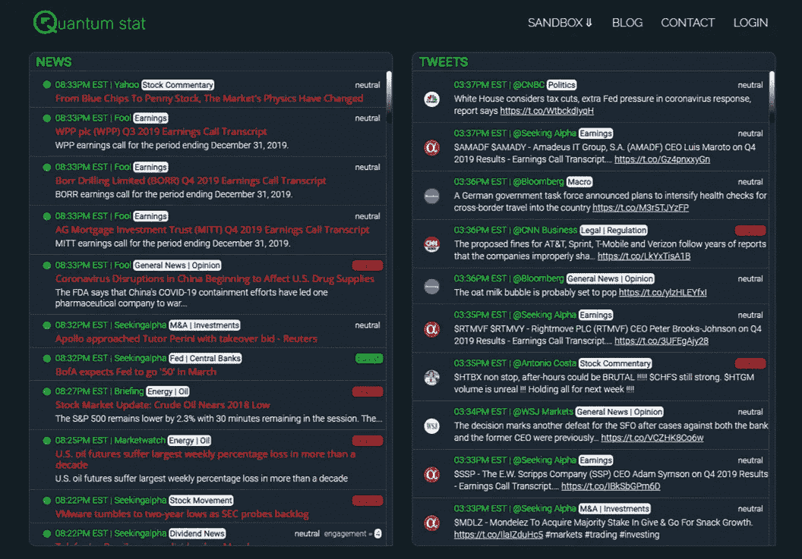

# NLP 新闻密码| 03.01.20

> 原文：<https://pub.towardsai.net/nlp-news-cypher-03-01-20-ccfa7a6cf8?source=collection_archive---------1----------------------->

照片由 [SoloTravelGoals](https://unsplash.com/@solotravelgoals?utm_source=medium&utm_medium=referral) 在 [Unsplash](https://unsplash.com?utm_source=medium&utm_medium=referral) 上拍摄

## 自然语言处理每周时事通讯

## 除此之外什么都没有…

正如你可能已经猜到的，当前管理简单系统的定律(即牛顿物理学)允许观察独立变量。也就是说，如果你在这个所谓的简单系统中观察一个变量，信息不会从观察系统中的其他变量中丢失。

> 观察金星的轨迹不会影响地球的轨迹。

然而，当我们增加变量的数量时，这种独立性变得难以精确观察，并且我们发现变量之间存在关系。这些变量通常以集群或系统的形式出现，它们相互依赖，是构成复杂系统的单元。

当前现实中存在各种复杂系统，或者 Neo 会称之为矩阵，例如:进化过程、气候、大脑、语言(NLP？)，甚至股市…

就拿一个可变的“情绪”和一个复杂的系统“股市”来说吧。如果我们从新闻标题的角度观察股票市场的状态，并试图将标题分为看涨、看跌或中性；我们很快就会意识到我们正处于复杂的阵痛之中。

这里有一个例子，假设我们有这样一个标题:

> 由于冠状病毒爆发的下行压力给股票带来压力，黄金在盘前上涨了 6%。

你认为这个标题的基本观点是什么？黄金上涨了，这很好(看涨，对吗？)，但是等等，它说股票下跌(然后看跌？)，对但是它在标题里说了两个 pos/neg 语句(所以是中性的对吧？！🤷‍♂️).看起来好像标题中的信息包并不是独立的，我们在将情感归结为一个分句时丢失了信息。你猜对了，自然语言是很难的！

WOAH！

让我们思考这个问题，直到下周(扣人心弦)，与此同时，这就是我们即将推出的实时平台的演示，该平台根据主题/情绪对金融新闻进行分类👇。我还没有完成部署，如果你想提前访问，请在 [El Twitter](https://twitter.com/Quantum_Stat) 上与我联系。

解密的

你这周过得怎么样？

# 本周:

> 机器学习东京
> 
> 分解，这是一个问题
> 
> NLP 获得多种语言
> 
> 给我看看 100 美元的 TensorFlow for
> 
> NER 任务的 Colab 演示
> 
> 嘿，伯特…欢迎来到黑客帝国
> 
> 本周数据集:HotpotQA

# 机器学习东京

有时，回购页面会出现并挽救局面。这个坏男孩拥有麻省理工学院系列讲座的链接，涉及 CV、NLP 和 RL 的各种主题！

 [## 机器学习-东京/人工智能 _ 课程

### 开放深度学习和强化学习讲座，来自顶尖大学，如斯坦福大学，麻省理工学院，加州大学…

github.com](https://github.com/Machine-Learning-Tokyo/AI_Curriculum) 

# 分解，这是一个问题

一篇新论文展示了如何将一个复杂的问题分解成小的子问题，有助于提高问答任务的性能。他们使用无监督的分解模型来分解从普通爬行中提取的问题，然后使用标准 QA 模型来回答这些问题，然后用于 HotpotQA 数据集上的多跳问题的下游。

**线程**:

 [## @EthanJPerez 写的一个线程

### 新的！“用于问答的无监督问题分解”:我们将一个困难的问题分解成几个更简单的问题，用…

线程应用程序](https://threader.app/thread/1232127027961942018) 

**论文:**

[链接](https://arxiv.org/pdf/2002.09758.pdf)

# NLP 获得多种语言

Abed 先生使用 MULTIFIT 模型为阿拉伯语构建了一个情感分析工具，并部署在 Heroku 上！

**演示**:

 [## 阿拉伯文本分类

### 使用这种神经网络模型(MULTIFiT ),你可以将阿拉伯语评论或类似文本分为正面或负面…

arabic-nlp.herokuapp.com](http://arabic-nlp.herokuapp.com/) 

# 给我看看 100 美元的 TensorFlow for

TensorFlow 上周宣布，他们将转发你在他们的 ML 跟踪平台 [TensorBoard](https://tensorflow.org/tensorboard) 上分享的模型。如果你想让你的应用程序在社交媒体上或者可能在他们的开发峰会上得到报道，下面是详细信息:

**地点**:

 [## TensorBoard.dev

### 托管 TensorBoard 体验，让您上传并与任何人分享您的 ML 实验结果。

tensorboard.dev](https://tensorboard.dev/) 

# NER 任务的 Colab 演示

厌倦了在你的 colab 笔记本上使用 GPU😢？Rush 先生发布了一款 colab 笔记本，它使用 TPUs 来训练 PyTorch 上用于命名实体识别的转换器！(它使用 [PyTorch 闪电](https://towardsdatascience.com/from-pytorch-to-pytorch-lightning-a-gentle-introduction-b371b7caaf09))

**Colab** :

 [## 谷歌联合实验室

### 编辑描述

colab.research.google.com](https://colab.research.google.com/drive/1dBN-wwYUngLYVt985wGs_OKPlK_ANB9D) 

**代码**:

 [## 拥抱脸/变形金刚

### 🤗变形金刚:用于 TensorFlow 2.0 和 PyTorch 的最新自然语言处理。…

github.com](https://github.com/huggingface/transformers/blob/master/examples/ner/run_pl_ner.py) 

# 嘿，伯特…欢迎来到黑客帝国

GitHub 上有一个隐藏的宝藏。有人发现了一个仓库，里面有一大堆文件，关于伯特的一切！我是说一切！

*   [下游任务](https://github.com/tomohideshibata/BERT-related-papers#downstream-task)
*   [代](https://github.com/tomohideshibata/BERT-related-papers#generation)
*   [修改(多任务、掩蔽策略等。)](https://github.com/tomohideshibata/BERT-related-papers#modification-multi-task-masking-strategy-etc)
*   [变压器变体](https://github.com/tomohideshibata/BERT-related-papers#transformer-variants)
*   [探针](https://github.com/tomohideshibata/BERT-related-papers#probe)
*   [伯特内部](https://github.com/tomohideshibata/BERT-related-papers#inside-bert)
*   [多语言](https://github.com/tomohideshibata/BERT-related-papers#multi-lingual)
*   [除英制车型外](https://github.com/tomohideshibata/BERT-related-papers#other-than-english-models)
*   [特定领域](https://github.com/tomohideshibata/BERT-related-papers#domain-specific)
*   [多模态](https://github.com/tomohideshibata/BERT-related-papers#multi-modal)
*   [模型压缩](https://github.com/tomohideshibata/BERT-related-papers#model-compression)
*   [杂项](https://github.com/tomohideshibata/BERT-related-papers#misc)

 [## tomohideshibata/BERT 相关论文

### 伯特相关论文。通过在 GitHub 上创建一个帐户，为 tomohideshibata/BERT 相关论文的开发做出贡献。

github.com](https://github.com/tomohideshibata/BERT-related-papers) 

# 本周数据集:HotpotQA

**什么事？**

“这是一个问答数据集，以自然、多跳问题为特色，并对支持事实进行强有力的监督，以实现更具解释力的问答系统。”

**样本:**

 [## HotpotQA:一个多样化、可解释的多跳问答数据集

### 探索 HotpotQA

hotpotqa.github.io](https://hotpotqa.github.io/explorer.html) 

**在哪里？**

 [## HotpotQA

### HotpotQA 是一个问答数据集，具有自然，多跳的问题，具有强大的监督支持…

hotpotqa.github.io](https://hotpotqa.github.io/) 

> 每周日，我们都会对来自世界各地的研究人员的 NLP 新闻和代码进行每周综述。
> 
> 如果您喜欢这篇文章，请帮助我们，并与朋友或社交媒体分享！
> 
> 如需完整报道，请关注我们的 twitter: @Quantum_Stat

[www.quantumstat.com](http://www.quantumstat.com/)