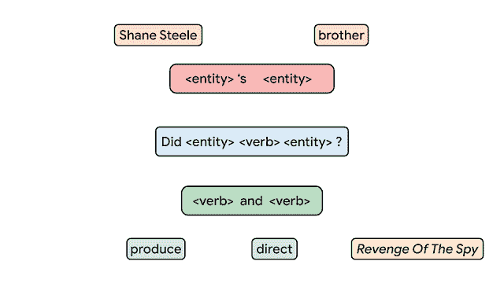
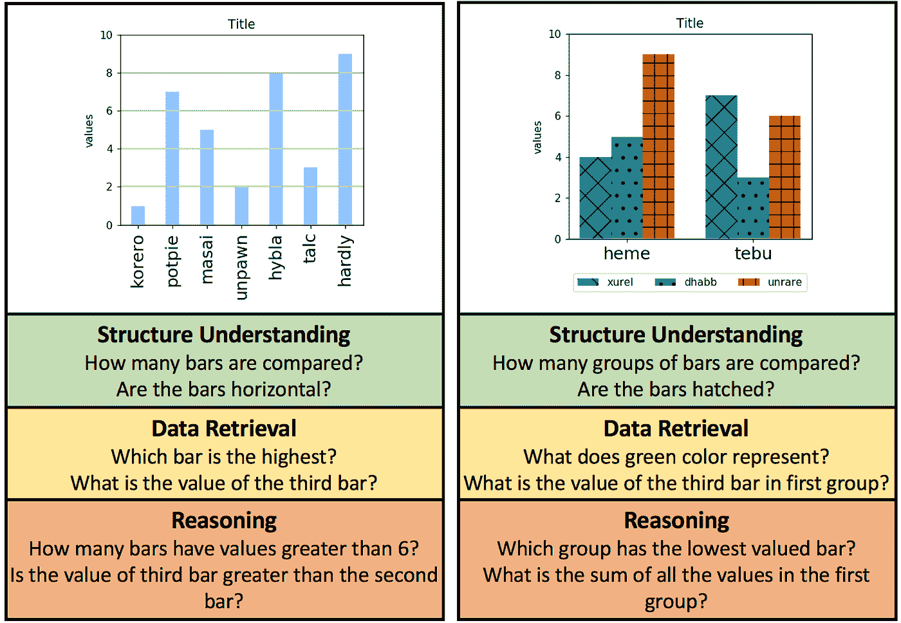

# NLP 新闻密码| 03.08.20

> 原文：<https://pub.towardsai.net/nlp-news-cypher-03-08-20-64918ffd1f?source=collection_archive---------1----------------------->

尼古拉·努南在 [Unsplash](https://unsplash.com?utm_source=medium&utm_medium=referral) 上拍摄的照片

## 自然语言处理每周时事通讯

## 它以这种方式肆虐

前进，我们走。在上周的[专栏](https://medium.com/towards-artificial-intelligence/nlp-news-cypher-03-01-20-ccfa7a6cf8)中，我提出了一个关于情感分析复杂性的问题。在我们的例子中:

> 由于冠状病毒爆发的下行压力给股票带来压力，黄金在盘前上涨了 6%。

在处理复杂系统时，特别是在处理这个例子时，其后果是，一种一般化的方法是困难的。很难将复杂性降低到一个向量。但是如果我们自下而上，如果我们把它定位到客户，我们会看到隧道尽头的光。为了了解真相，我们必须将情感定位于用户的持有物。如果用户持有黄金，那么它是看涨的，如果客户押注黄金下跌，那么它是看跌的，如果没有头寸，那么它是中性的声明。换句话说，对于这个例子，个性化不仅仅是一个营销噱头，而是一个功能需求。没有完美的解决方案，每个独特的领域都需要自己的本地规则来解释基本事实。

尽管如此，这种说法是最难分析的，而且通常是一种边缘情况。但是在深度学习中，数据集中的离群值是模型被烟熏的原因。

*(我们可能会遇到其他复杂的瓶颈，如 n 阶逻辑、不明确的基本事实、域转移等。我将在即将发布的白皮书中讨论这些和其他因素。敬请期待！)*

你这周过得怎么样？

顺便说一句，我们更新了 BBN 数据库，感谢所有的贡献者！

# 本周:

> 行走的维基百科
> 
> 从未标记数据中学习
> 
> 我们中的一员
> 
> 拥抱脸的笔记本
> 
> 构成语义
> 
> 变压器尺寸、训练和压缩
> 
> 制图知识
> 
> 本周数据集:DVQA

# 行走的维基百科

正在进行的用变压器定位图结构的研究继续前进。研究表明，一个新的模型如何能够遵循英语维基百科的推理路径来回答 HotpotQA 中发现的多跳问题。这意味着开放域规模。

(上周的专栏有一篇类似的论文，看起来开放域、多跳在研究人员中真的越来越流行。✨😎)

**GitHub:**

 [## AkariAsai/learning _ to _ retrieve _ reasoning _ path

### 这是以下论文的正式实施:浅井明里，和马桥本，汉纳内赫 Hajishirzi，理查德…

github.com](https://github.com/AkariAsai/learning_to_retrieve_reasoning_paths) 

**论文:**

[链接](https://arxiv.org/pdf/1911.10470.pdf)

# 从未标记数据中学习

Thang 的演讲幻灯片，2020 年 2 月的某个时候(Thang 是最近来自 Google 的 Meena chatbot 论文/模型的作者)。他回顾了彻底改变了 NLP 的自我监督学习的重要性，以及它是如何传播到计算机视觉的。接近尾声时，他讨论了米娜论文:

 [## ThangLuong-talk-Feb-2020.pdf

### 编辑描述

drive.google.com](https://drive.google.com/file/d/1ax1-XprJHDRRv2Ru3dJwPLs3ShxcpQ3r/view) 

# 我们中的一员

我们有一个新的 NLU 框架可以玩！框架的伟大之处在于它允许您扩展实验，这也是 Jiant 利用配置文件的原因。是的，它建在 PyTorch 的顶部。

**博客:**

 [## 用于通用文本理解模型的 jiant 工具包

### jiant 是一个进行中的自然语言处理研究软件工具包，旨在促进…

jiant.info](https://jiant.info/) 

**GitHub:**

 [## 纽约大学-mll/jiant

### jiant 是一个用于自然语言处理研究的软件工具包，旨在促进多任务学习的工作

github.com](https://github.com/nyu-mll/jiant) 

# 拥抱脸的笔记本

几天前，🤗展示了 4 款 Colab 笔记本电脑，帮助您的 NLP 管道从他们的图书馆开始。请关注这个 GitHub 页面，因为他们正在寻找社区来做出贡献。

 [## 拥抱脸/变形金刚

### 你可以在这里找到拥抱脸提供的官方笔记本列表。此外，我们想在这里列出…

github.com](https://github.com/huggingface/transformers/tree/master/notebooks) 

# 构成语义

谷歌发布了一个新的数据集，名为组合自由基础问题(CFQ)和一个新的基准来衡量一个程序概括组合性的程度。如果你认为语义解析已经被忽略了，你应该看看这个:

 [## 测量成分概括

### 人们能够学习一个新单词的意思，然后将其应用到其他语言环境中。作为湖和…

ai.googleblog.com](https://ai.googleblog.com/2020/03/measuring-compositional-generalization.html) 

# 变压器尺寸、训练和压缩

所以增加模型的规模提高了训练/推理速度？反直觉对吗？伯克利的新研究强调了一个有趣的权衡。它表明，训练非常大的模型并尽早切断它们比使用训练更多时期的较小模型要好得多。此外，当压缩非常大的模型时，你会比少量压缩较小的模型得到更多的回报。

**博客**:

 [## 通过增加模型大小来加速变压器训练和推理

### 在深度学习中，使用更多计算(例如，增加模型大小、数据集大小或训练步骤)通常会导致…

bair.berkeley.edu](https://bair.berkeley.edu/blog/2020/03/05/compress/) 

# 制图知识

如果你想了解关于知识图表的所有事情，上周发布了一篇全面的论文👀：

[链接](https://arxiv.org/pdf/2003.02320.pdf)

# 本周数据集: **DVQA**

**什么事？**

DVQA 数据集将条形图理解转换为问答框架。

**样本:**

**在哪里？**

 [## kushalkafle/DVQA_dataset

### 这个库提供了图像、元数据和问答配对，如论文:DVQA:理解…

github.com](https://github.com/kushalkafle/DVQA_dataset) 

> *每周日，我们都会对来自世界各地的研究人员的 NLP 新闻和代码进行每周综述。*
> 
> 如果您喜欢这篇文章，请帮助我们并与朋友分享！
> 
> *如需完整报道，请关注我们的 Twitter:*[*@ Quantum _ Stat*](http://twitter.com/Quantum_Stat)

[www.quantumstat.com](http://www.quantumstat.com/)