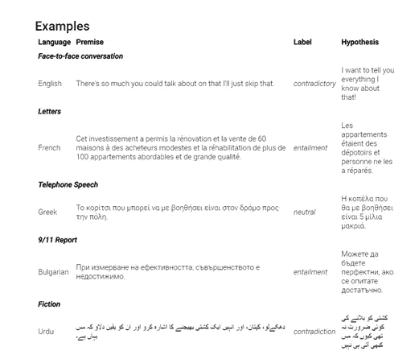

# NLP 新闻密码| 03.29.20

> 原文：<https://pub.towardsai.net/nlp-news-cypher-03-29-20-ee82a061b1cb?source=collection_archive---------2----------------------->

由 [Unsplash](https://unsplash.com?utm_source=medium&utm_medium=referral) 上的[西风航空服务](https://unsplash.com/@westwindairservice?utm_source=medium&utm_medium=referral)拍摄的照片

## 自然语言处理每周时事通讯

## 在我朋友的帮助下

T4 录制了(几乎完成的)演示的现场直播。我使用两个分类器来对财经新闻推文进行主题和情绪分类，它们会实时分类👀。部署大型变压器模型进行在线推理是硬核！

与此同时，回到牧场，[路孚特](https://medium.com/u/ad6f90a13266?source=post_page-----ee82a061b1cb--------------------------------)发布了一篇博客文章，展示了他们如何使用路透社新闻语料库从头开始训练伯特，然后针对下游任务进行微调。

他们关注的是财经新闻事件，更具体地说，是**环境、社会和治理(ESG)** 争议。(从投资者的角度来看，他们对社会事件如何影响公司感兴趣。)

**博客**:

 [## 下一级 NLP 和潜在的 ESG 争议|路孚特观点

### 路孚特实验室专注于利用大数据和机器学习(ML)的力量来推动创新和塑造…

www.refinitiv.com](https://www.refinitiv.com/perspectives/ai-digitalization/next-level-nlp-and-potential-esg-controversies/) 

**参考消息**:即将发布[大坏 NLP 数据库](https://datasets.quantumstat.com/)的新更新！

你这周过得怎么样？😎

# 本周:

> *软件正在蚕食世界*
> 
> 解码输出
> 
> 深入 QA BERT
> 
> Y Combinator 演示日
> 
> BART 汇总
> 
> 人工智能在 2020 年企业中的采用
> 
> XTREME 基准
> 
> 本周数据集:XNLI

# 软件正在吞噬世界

从 Andreessen Horowitz 的博客中，他们对人工智能初创公司的地下世界进行了非常清醒的审视。这篇文章强调了处理边缘情况、域转移、计算成本和其他令人头痛的问题的困难。我自己部署过人工智能模型，这篇文章相当准确。

 [## 人工智能的新业务(以及它与传统软件的不同之处)

### 在技术层面，人工智能似乎是软件的未来。人工智能在…方面显示出显著的进步

a16z.com](https://a16z.com/2020/02/16/the-new-business-of-ai-and-how-its-different-from-traditional-software/) 

# 解码输出

当你听到 ML 工程师谈论波束搜索、温度或 top-k 采样时，你可能会感到困惑。但是花时间去理解这些参数对像 GPT-2 这样的文本生成模型有着持久的影响！在一篇新的拥抱脸博客文章中阅读所有相关内容:

 [## 如何生成文本:使用不同的解码方法通过转换器生成语言

### 近年来，由于大规模语言生成的兴起，人们对开放式语言生成越来越感兴趣。

huggingface.co](https://huggingface.co/blog/how-to-generate) 

# 深入 QA BERT

McCormick 以一篇关于问答 w/ BERT 内部运作的博客文章进行了反击。第 1 部分介绍了 BERT 如何处理问题回答任务，第 2 部分 Chris 介绍了 BERT(在 SQuAD 上进行微调)对数据的归纳能力，这是前所未有的:

 [## 用微调过的 BERT 回答问题

### 伯特在“问答上达到人类水平的表现”意味着什么？伯特是不是最伟大的搜索…

mccormickml.com](http://mccormickml.com/2020/03/10/question-answering-with-a-fine-tuned-BERT/) 

令人惊讶的是，还有一个 Colab 笔记本:

 [## 谷歌联合实验室

### 编辑描述

colab.research.google.com](https://colab.research.google.com/drive/1uSlWtJdZmLrI3FCNIlUHFxwAJiSu2J0-#scrollTo=6_mAnIPKaXyw) 

# Y Combinator 演示日

Y Combinator 演示日活动为我们带来了几家崭露头角的 AI 公司。这篇 TechCrunch 文章介绍了每家公司以及它们能提供什么。这是技术发展方向的短期一瞥。现在，有很多公司在做开发者工具(剧透一下😁 ):

 [## 所有来自 Y Combinator 的 W20 演示日的公司，第三部分:硬件、机器人、人工智能和开发者…

### Y Combinator 的演示日这次有点不同。随着对新冠肺炎病毒传播的担忧增加，Y…

techcrunch.com](https://techcrunch.com/2020/03/17/all-the-companies-from-y-combinators-w20-demo-day-part-iii-hardware-robots-ai-and-developer-tools/) 

# BART 摘要:Colab

Peeps 总是想要更多的总结例子。这里有一个很棒的 Colab 笔记本，可以和 BART 模型一起使用！

**可乐布**:

 [## 谷歌联合实验室

### 编辑描述

colab.research.google.com](https://colab.research.google.com/drive/1iAIFX1QQiFm1F01vMmnAgFh4oH1H-K8W) 

**巴特纸**:

[链接](https://arxiv.org/pdf/1910.13461.pdf)

# 人工智能在 2020 年企业中的采用

《你所爱之书》的制作者奥莱利在本月早些时候发布了他们的人工智能采用调查。

似乎机构人士仍然对人工智能技术持怀疑态度:

> "..缺乏人工智能和人工智能技能并不是人工智能采用的最大障碍。近 22%的受访者认为缺乏机构支持是最重要的问题。”

点击此处查看该报告的亮点:

 [## 人工智能在 2020 年企业中的采用

### 3 月 26 日，请加入 Roger Magoulas，参加在线实时互动会议，探索最近的 O'Reilly AI/ML 研究。获得…

www.oreilly.com](https://www.oreilly.com/radar/ai-adoption-in-the-enterprise-2020/) 

# XTREME 基准

在可能的情况下，研究人员喜欢将表征嵌入从一种语言转移到另一种语言，尤其是对于低资源语言。一个新的测试跨语言泛化能力的基准出现了，叫做 XTREME！目前，它涵盖了 40 种语言和 9 个任务的多语言表示。

**纸张**:

[链接](https://arxiv.org/pdf/2003.11080.pdf)

# 本周数据集:XNLI

**什么事？**

> “语料库是为 [MultiNLI 语料库](http://www.nyu.edu/projects/bowman/multinli)众包的 5000 个测试和 2500 个开发对的集合。这对组合被标注了文本的**蕴涵**，并被翻译成 14 种语言:法语、西班牙语、德语、希腊语、保加利亚语、俄语、土耳其语、阿拉伯语、越南语、泰语、中文、印地语、斯瓦希里语和乌尔都语

**样品:**

**在哪里？**

 [## XNLI

### 介绍跨语言自然语言推理(XNLI)语料库是 5000 个测试和测试的众包集合

www.nyu.edu](http://www.nyu.edu/projects/bowman/xnli/) 

> *每周日，我们都会对来自世界各地研究人员的 NLP 新闻和代码进行一次每周综述。*
> 
> *如果您喜欢这篇文章，请帮助我们并与朋友分享！*
> 
> *如需完整报道，请关注我们的 Twitter:*[*@ Quantum _ Stat*](http://twitter.com/Quantum_Stat)

[www.quantumstat.com](http://www.quantumstat.com/)