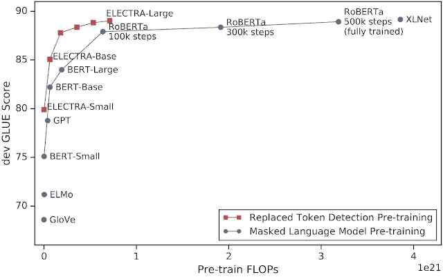
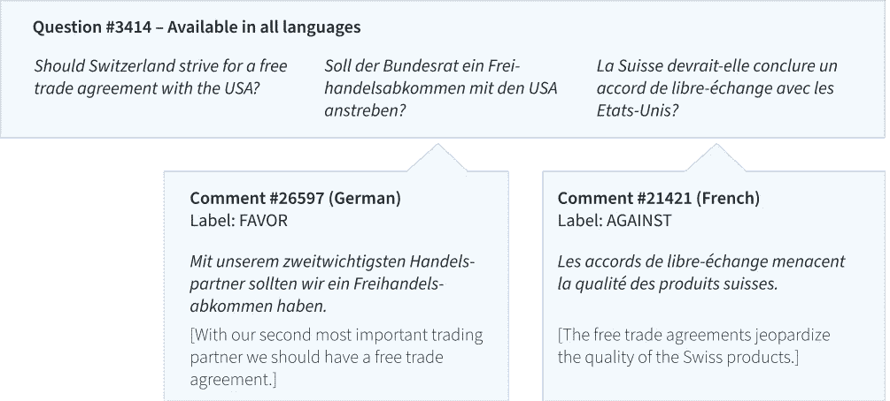

# NLP 新闻密码| 04.12.20

> 原文：<https://pub.towardsai.net/nlp-news-cypher-04-12-20-a40cd3d8a4a2?source=collection_archive---------1----------------------->

照片由 [Sz 拍摄。马顿](https://unsplash.com/@szm?utm_source=medium&utm_medium=referral)开启[开启](https://unsplash.com?utm_source=medium&utm_medium=referral)

## 掉进兔子洞

我叫它兔子。我的演示结束了。我们为那些对流式 API、在线推理和生产中的变形金刚感兴趣的人构建了一个应用。

**** *更新:04 . 13 . 20:***[***rabbit.quantumstat.com***](http://rabbit.quantumstat.com)

web 应用程序(我在过去的*中已经展示过一次*)试图做一个非常困难的平衡动作。今天深度学习中最困难的瓶颈之一是利用 NLP 中最先进的模型(*变压器，RAM 昂贵*)，并能够在生产中部署它们，而不会使您的服务器或银行帐户爆炸。我想我可能已经弄明白了，至少对于这个应用程序来说😎。

## 这是什么？

RABBIT 从几十个金融新闻来源(*通常的嫌疑人:彭博、美国消费者新闻与商业频道、华尔街日报和更多*)发送推文，并实时运行两个分类器！

我在分类什么？第一个模型对金融领域的 21 个主题进行了分类:

解密的

第二个模型将推文分为看涨、看跌或中性。这是什么意思？这意味着，如果你是一个持有黄金的投资者/交易者，而推文提到黄金价格上涨，这将被贴上看涨，反向看跌的标签，如果你不在乎任何一种方式，这是中性的。事实上，这个应用程序应该是个性化的个人用户。因为你将看到的是一个面向普通观众的演示，所以我尽量用这个分类模式来概括。

> 因此，这假定了分类中的一阶逻辑。意思是，我的逻辑不是假设 n 阶效应。例如，如果你持有石油，而石油价格上涨，这被认为是看涨的，(尽管石油上涨的原因可能是因为一些地缘政治冲突，这可能对市场产生负面影响(看跌)，这是一种假设的 n 阶效应)。

## 它靠什么运行？

我设计的后端可以根据需要扩展计算和连接。这些变形金刚是罗伯塔的精华版本，通过 10K 的推特从一个定制的数据集中获取。目前，我正在利用消息队列和异步框架来帮助我向用户推送推文。向亚当·金致敬，他在我们的一次数字炉边聊天中激发了这个想法。(仅供参考，你可以在这里查看他臭名昭著的 GPT-2 模型:[talktotransformer.com](http://www.talktotransformer.com)

RABBIT 使用 web-socket 连接来实现流功能，并且只在 4 个 CPU 内核上运行。虽然这台计算机可能看起来很小，但当与这种架构结合时，它实际上快如闪电(甚至在用 2 个变压器进行在线推理时！).由于 web 套接字连接到浏览器，并且数据服务是单向的，因此向客户端扩展是相当健壮的。

## 正误表

最近，由于冠状病毒改变了新闻周期，出现了一些领域转移(这降低了模型的准确性)。我将继续添加更多的数据来减轻这种情况，尽管目前来看，它表现得相当好。

## 鳍状物

将于明天，即 4 月 13 日正式发布。查看我的 [**推特**](https://twitter.com/Quantum_Stat) 进行更新。仅供参考，该应用程序最好在每周股市开放的交易时间使用，这样你就可以看到它快速流动(尽管从技术上讲，你可以随时查看)。

以此作品为荣。它便宜，功能强大，速度快。

未来可能的方法是从头开始创建一个语言模型，然后在我上面提到的自定义数据集上对其进行微调。此外，将是很好的添加更多的实时股票市场流的仪表板数据。

你这周过得怎么样？😎

# 本周:

> 裸金属
> 
> 本周可乐杯，关于自我关注
> 
> 拥抱伊莱克特
> 
> 科尔伯特·艾
> 
> 一个非常大的新闻数据集
> 
> 表示感谢
> 
> 本周数据集:X 姿态

# 裸金属

人工智能芯片制造商押注 NLP 模型越来越大，尽管他们的芯片变得越来越智能。金属 peeps 表示，他们希望将 NN 输入隔离到单个内核，而不是批量处理它们。其结果是，只有网络中“需要”激发的神经元才会这样做，因为它们是孤立的:

> ”公司专注于“稀疏”的概念，即如果去除冗余信息，许多神经网络可以更有效地处理。Lie 观察到“稀疏性有一个巨大的未开发的潜力”，并且“神经网络自然是稀疏的”。"

 [## 初创公司 Tenstorrent 显示人工智能正在改变计算，反之亦然| ZDNet

### Tenstorrent 是 2016 年成立并最终展示产品的人工智能芯片制造商中的一员。新一波的芯片…

www.zdnet.com](https://www.zdnet.com/article/startup-tenstorrent-and-competitors-show-how-computing-is-changing-ai-and-vice-versa/) 

有了这些知识，新的人工智能芯片不需要训练很长时间，并且可以在更早的时候退出训练。🧐

# 本周可乐杯，关于自我关注

我会让你探索这一个:

 [## 谷歌联合实验室

### 编辑描述

colab.research.google.com](https://colab.research.google.com/github/mrm8488/shared_colab_notebooks/blob/master/basic_self_attention_.ipynb) 

# 拥抱伊莱克特

这种用相对较低的计算量训练语言模型的新方法现在出现在拥抱人脸库上。你可能还记得伊莱克特拉那激动人心的表演👇

 [## 拥抱脸/变形金刚

### ELECTRA 是一种新的自监督语言表征学习方法。它可以用来预训练变压器…

github.com](https://github.com/huggingface/transformers/releases/tag/v2.8.0) 

开发人员很快就利用了 ELECTRA，这是一个简单的变形金刚库，它构建在🤗的变形金刚，已经有了:

 [## 理解 ELECTRA 并训练一个 ELECTRA 语言模型

### 变形金刚模型如何学习语言？伊莱克特拉有什么新消息？你如何在一个…

towardsdatascience.com](https://towardsdatascience.com/understanding-electra-and-training-an-electra-language-model-3d33e3a9660d) 

# 科尔伯特·艾

GPT-2 用一点幽默进行了反击。开发者阿巴斯·默罕默德和 T2·舒巴姆·拉奥通过从 YouTube 上晚间节目的视频字幕中提取独白，创造了这个模型。他们为想做类似事情的人提供了一个很好的 Colab 笔记本，里面有很好的文档。(您可能需要获得自己的数据集😢)

**Colab** :

 [## 谷歌联合实验室

### 编辑描述

colab.research.google.com](https://colab.research.google.com/gist/iam-abbas/b93961bc9468e375f1b75a1a6e47610c/colbert-ai-v2.ipynb) 

# 一个非常大的新闻数据集

在 Reddit 上找到了这块宝石。随着普通开发人员越来越接近从零开始训练他们自己的语言模型，从长远来看，超级大数据集将在 NLP 开发人员中变得越来越受欢迎。该数据集包含过去 4 年的 270 万篇新闻文章:

 [## 所有新闻 2.0:270 万篇新闻文章-组件

### 2017 年发布的流行的 All the News 数据集的更新。该数据集包含来自 26 家公司的 270 万篇文章…

组件.一](https://components.one/datasets/all-the-news-2-news-articles-dataset/) 

# 表示感谢

本周，一个相对较新的记号赋予器引起了我的注意，它吹嘘自己的速度优于其他著名的记号赋予器(它是用 C++编写的)。如果你想比较它和其他产品([拥抱脸](https://github.com/huggingface/tokenizers)、[句子片段](https://github.com/google/sentencepiece/)和 [fastBPE](https://github.com/glample/fastBPE) )的速度，看看他们的基准测试结果:

**主回购:**

 [## VKCOM/YouTokenToMe

### YouTokenToMe 是一个无监督的文本标记器，专注于计算效率。它目前实现快速字节…

github.com](https://github.com/VKCOM/YouTokenToMe) 

**基准**:

 [## VKCOM/YouTokenToMe

### YouTokenToMe 将与拥抱脸、句子和 fastBPE 相比较。这三种算法被认为是…

github.com](https://github.com/VKCOM/YouTokenToMe/blob/master/benchmark.md) 

# 本周数据集:X 姿态

**什么事？**

*“x-stance 数据集包含 150 多个政治问题，以及候选人就这些问题撰写的 67k 条评论。”*评论有英语、德语、法语和意大利语。

**样品:**

**在哪里？**

 [## ZurichNLP/xstance

### “X-Stance:Stance 的多语言多目标数据集”一文附带的文档和评估脚本

github.com](https://github.com/ZurichNLP/xstance) 

> *每周日，我们都会对来自世界各地研究人员的 NLP 新闻和代码进行一次每周综述。*
> 
> *如果您喜欢这篇文章，请帮助我们并与朋友分享！*
> 
> *如需完整报道，请关注我们的 Twitter:*[*@ Quantum _ Stat*](http://twitter.com/Quantum_Stat)

[www.quantumstat.com](http://www.quantumstat.com/)