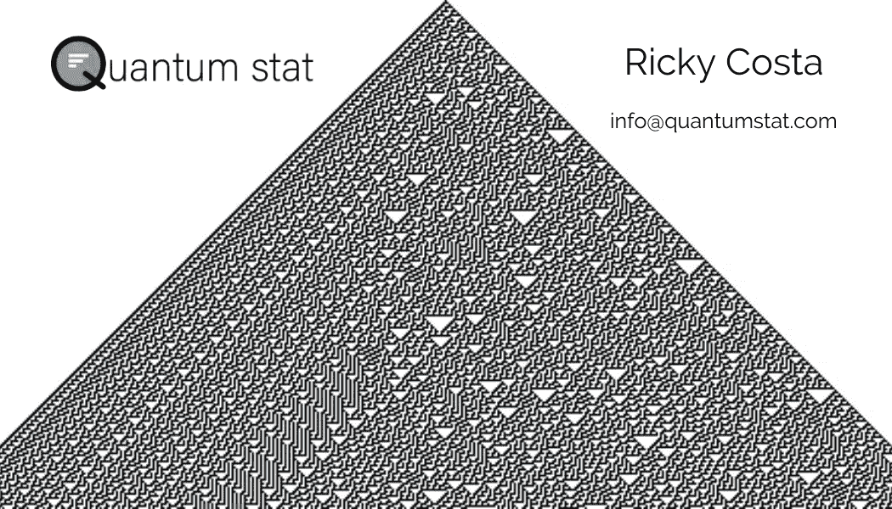

# NLP 新闻密码| 04.19.20

> 原文：<https://pub.towardsai.net/nlp-news-cypher-04-19-20-d4af845a4cd7?source=collection_archive---------5----------------------->


Pawel Nolbert 在 [Unsplash](https://unsplash.com?utm_source=medium&utm_medium=referral) 上拍摄的照片

## 自然语言处理每周时事通讯

## 平行线

宇宙运行在一个简单的规则上，这个规则的框架可以通过计算超图来解释。在过去的一周里，当一个疫情吞没了这个星球时，史蒂夫·沃尔夫勒姆公布了他对支配我们宇宙的东西的看法，这可能是初始化所有基本物理定律的源代码。

本周的事件与 1665 年发生的事情有一个可怕的相似之处，当时另一位物理学家为了躲避瘟疫，回到他童年的家进行私人研究。后果就是万有引力定律和微积分。

当我第一次读到 Wolfram 对细胞自动机(及其对计算的影响)的见解时，我很感兴趣。所以，当我听说他本周发布了他的“万物理论”时，我真的为斯蒂芬和整个物理学感到兴奋。我希望它能像来自剑桥大学的另一个家伙的想法一样富有成果。

> 仅供参考，我的名片上有第 30 条规则*😁*。



(解密)细胞自动机规则 30

如果你想了解 Wolfram 的理论，请点击这里:

[](https://www.wolframphysics.org/) [## Wolfram 物理项目:即将到来的直播

### 史蒂夫·沃尔夫勒姆发现物理学基础理论的项目即将直播。以前的录音…

www.wolframphysics.org](https://www.wolframphysics.org/) 

# 🐇

上周我对我们的新演示兔子发表了意见。如果你没有赶上，这是一个实时金融推文分类器运行在两个蒸馏变压器。我说的实时是指它在推文流入时对其进行分类，而不是批量分类(除非你进入页面)。体验演示的最佳时间是在每周的股市交易时间。上午 8 点左右流量达到峰值。

为了一窥究竟，你可以到这里旅游:

[](https://rabbit.quantumstat.com/) [## 兔子🐇

### RABBIT 是一个最先进的人工智能网络应用程序，它使用 transformer 模型对金融相关的推文进行实时分类…

rabbit.quantumstat.com](https://rabbit.quantumstat.com/) 

顺便说一句，我们在选择的话题上看到了奇怪的不准确，因此，我们增加了额外的 1000 条推文，重新培训了模型，并重新推出。在 P100 的 GPU 上，数据争论/微调两个模型总共需要 45 分钟。这是现代 NLP 堆栈的奢侈品之一，微调 SOTA 模型不需要很长时间。

这周我有一个新的惊喜发布，敬请关注👀！

你这周过得怎么样？😎

# 本周:

> 播放器
> 
> 琐碎的伯特
> 
> 中毒卒
> 
> 综合数据
> 
> 扩展您的后端🤣
> 
> 托德伯特
> 
> 本周数据集:简单问题数据集

# 播放器

创建[大坏 NLP 数据库](https://datasets.quantumstat.com/)的一个最重要的原因是让低资源语言得到更多的关注。正如你所料，当一个新的多语言基准发布时，我真的很兴奋。XTREME 旨在通过查看 4 个 NLP 目标对您的多语言模型进行极端评估:句子分类、结构化预测、句子检索和问题回答。不错吧？除了它期望你的模型在每个任务中归纳为 40 种语言的子集(实际上有 9 种语言！).😁

哪些？

> af、ar、bg、bn、de、el、en、es、et、eu、fa、fi、fr、he、hi、hu、id、it、ja、jv、ka、kk、ko、ml、mr、ms、my、nl、pt、ru、sw、ta、te、th、tl、tr、ur、vi、yo 和 zh

**GitHub** :

[](https://github.com/google-research/xtreme/) [## 谷歌-研究/极限

### 这个存储库包含关于 XTREME 的信息、下载数据的代码和基线系统的实现…

github.com](https://github.com/google-research/xtreme/) 

# 琐碎的伯特

《麦考密克编年史》继续探寻伯特的内心世界。这一次，他们通过询问填空问题来研究 BERT 从预训练中学习的固有事实。你可以跟着他们到兔子洞这里:

 [## 琐碎的 ber suit-BERT 知道多少琐事？

### 我一直在对伯特进行研究，我真的很好奇——伯特到底知道多少琐事？我们使用…

mccormickml.com](http://mccormickml.com/2020/04/14/trivial-bersuit/) 

# 中毒卒

窥视 CMU 的人可以黑掉 SOTA 的人工智能模型🙈。本质上，他们强调了社区共享预训练重量的危险(这已成为最近的趋势)。他们发现，在黑掉预先训练好的砝码后，他们可以通过启用…

> "攻击者只需注入一个任意的关键字就可以操纵模型预测."

**系统工程师要像**:

**GitHub(下图中伯特看起来像西斯尊主)**:

[](https://github.com/neulab/RIPPLe/) [## 神经实验室/波纹

### 这个存储库包含实现论文“对预训练者的体重中毒攻击”中的实验的代码

github.com](https://github.com/neulab/RIPPLe/) 

**论文**:

[链接](https://arxiv.org/pdf/2004.06660.pdf)

# 综合数据

你听说过合成数据吗？如果你以前在训练中处理过班级失衡的问题，你会对这篇文章感兴趣。合成数据是用于生成数据的几种技术的副产品——其中包括像过采样技术(在库[不平衡学习](https://imbalanced-learn.readthedocs.io/en/stable/index.html)中找到)这样的好东西，一直到 GANs！

[](https://medium.com/ydata-ai/synthetic-data-1cd0ba907609) [## 综合数据

### 数据科学发展的未来标准

medium.com](https://medium.com/ydata-ai/synthetic-data-1cd0ba907609) 

# 扩展您的后端🤣

想知道 Kaggle 是如何将其后端从单个 Kubernetes 集群扩展到多集群架构的吗？嗯，这篇详细的文章解释了人工智能部署中最困难的领域之一，用几个 Kubernetes 集群对你的服务器进行负载平衡(在这个例子中，他们使用谷歌(GKE)和 gRPC 作为消息协议)。我们很少有机会接触到产品级架构，如果你真的想像专家一样部署你的模型，这是一篇必读的文章。

[](https://medium.com/google-cloud/a-multi-cluster-grpc-architecture-on-gke-365bbd757df) [## GKE 上的多集群 gRPC 架构

### 这篇文章解释了如何在不同地区的许多 GKE 集群中对 gRPC 应用程序进行负载平衡，以增加…

medium.com](https://medium.com/google-cloud/a-multi-cluster-grpc-architecture-on-gke-365bbd757df) 

# 托德伯特

这篇论文引起了我的注意，因为当我想到变形金刚和对话时，我的膝跳反应会立即转向闲聊对话。但在本文中，Salesforce Research 引入了 ToD-BERT，它是在 9 个任务对话数据集上进行的 BERT 预训练。这个新模型与常规的 BERT 进行了比较，后者只针对下游任务-对话任务进行了微调，ToD 优于它。正在讨论的下游任务是:意图检测、对话状态跟踪、对话行为预测和响应选择。据作者称，代码将很快发布。

**论文**:

[链接](https://arxiv.org/pdf/2004.06871.pdf)

# 本周数据集:简单问题数据集

**什么事？**

> “SimpleQuestions 数据集由 108，442 个问题组成，这些问题由讲英语的人类注释者用自然语言编写，每个问题都与一个相应的事实配对，格式为(主语、关系、宾语)，它不仅提供答案，还提供完整的解释。”

**样本:**

```
* What American cartoonist is the creator of Andy Lippincott?
  Fact: (andy_lippincott, character_created_by, garry_trudeau) 
* Which forest is Fires Creek in?
  Fact: (fires_creek, containedby, nantahala_national_forest)
* What does Jimmy Neutron do?
  Fact: (jimmy_neutron, fictional_character_occupation, inventor)
* What dietary restriction is incompatible with kimchi?
  Fact: (kimchi, incompatible_with_dietary_restrictions, veganism)
```

**在哪里？**

[](https://research.fb.com/downloads/babi/) [## 芭芘酒吧

### 该网页收集了与脸书人工智能研究所 bAbI 项目相关的资源，该项目的目标是…

research.fb.com](https://research.fb.com/downloads/babi/) 

> *每周日，我们都会对来自全球研究人员的 NLP 新闻和代码进行一次每周综述。*
> 
> *如果您喜欢这篇文章，请帮助我们并与朋友分享！*
> 
> *完整报道，关注我们的推特:*[*@ Quantum _ Stat*](http://twitter.com/Quantum_Stat)


[www.quantumstat.com](http://www.quantumstat.com/)