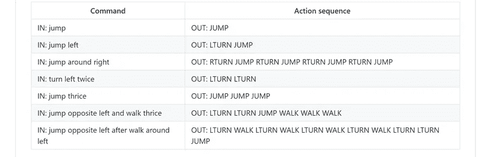

# NLP 新闻密码| 04.26.20

> 原文：<https://pub.towardsai.net/nlp-news-cypher-04-26-20-39b25c689695?source=collection_archive---------1----------------------->

切里斯·埃维尔茨在 [Unsplash](https://unsplash.com?utm_source=medium&utm_medium=referral) 上的照片

## 自然语言处理每周时事通讯

## 递归

上周是一场旋风。谢谢你的支持。🤯

如果你不在循环中，上周我们发布了超级骗子 NLP 回购！100 多台 Colab 笔记本的集合，使用模型来执行各种 NLP 任务。我们将定期继续更新这个回购，就像我们对大坏 NLP 数据库所做的那样。如果有兴趣，你可以随时关注我们的推特更新。

要了解回购，请访问:

 [## 超级骗子 NLP 回购

### 适用于 NLP 中各种任务的 Colab 笔记本

notebooks.quantumstat.com](https://notebooks.quantumstat.com/) 

哦，好消息是，Colab 的项目经理喜欢超级骗子 NLP 回购:

仅供参考，我们正在为即将到来的大坏 NLP 数据库的更新做准备，如果你知道要包括的数据集，请让我们知道！我们会在推特上为你大声疾呼。

你这周过得怎么样？😎

# 本周:

> 人工智能走向虚拟化
> 
> 为脸书和 AWS 服务
> 
> ScaledML 会议演示
> 
> DeepPavlov 更新
> 
> 解释对话人工智能
> 
> 本周数据集:扫描

# 人工智能走向虚拟化

当你读到这篇文章时，ICLR 会议正在进行中(事实上)。同时，你可以通过下面的链接查看他们的论文。Paperswithcode 发布了一份不错的 ICLR 论文列表，其中当然包括代码！

**ICLR 论文列表**:

 [## 文件与代码- ICLR 2020 1

### 如果没有做到这一点，元学习者可以忽略任务训练数据，学习一个单一的模型，执行所有的…

paperswithcode.com](https://paperswithcode.com/conference/iclr-2020-1/official) 

**最受欢迎的报纸:**

 [## 谷歌研究/谷歌研究

### 实现元正则化，如尹，乔治塔克

github.com](https://github.com/google-research/google-research/tree/master/meta_learning_without_memorization) 

# 为脸书和 AWS 服务

看起来 PyTorch 和每天给我们送棕色盒子的人成为了搭档。随着越来越多的人希望用他们喜欢的框架部署模型，AWS 和 FB 在过去的一周发布了 TorchServe(并且是用 Java 实现的):

TorchServe 是一个为人工智能模型服务的框架，为开发者提供了…

> "多模型服务、日志记录、监控指标，以及为应用集成创建 RESTful 端点."

 [## AWS 合作伙伴脸书 AI 发布新 PyTorch 库

### 作为更广泛的 PyTorch 社区的一部分，脸书人工智能和 AWS 工程师合作开发新的库…

ai.facebook.com](https://ai.facebook.com/blog/facebook-ai-aws-partner-to-release-new-pytorch-libraries-) 

**示例代码库**:

 [## 宣布 TorchServe，PyTorch | Amazon Web Services 的开源模型服务器

### PyTorch 是最受欢迎的深度学习开源库之一。特别是开发人员和研究人员…

aws.amazon.com](https://aws.amazon.com/blogs/aws/announcing-torchserve-an-open-source-model-server-for-pytorch/?fbclid=IwAR1V1_qFCrb21rWvRIw3Z0tZd1av1Dx7Aio4bBnLjxMzfcYN8QatySzrScc) 

**GitHub** :

 [## py torch/发球

### TorchServe 是一个灵活易用的工具，用于服务 PyTorch 模型。有关完整的文档，请参见…

github.com](https://github.com/pytorch/serve) 

**谷歌就像…**

# ScaledML 会议演示

早在二月，当旅行还是一件事的时候，一个会议发生了。所有的明星都出现了:乔莱、卡帕西、苏茨基弗和许多其他人。

(甚至连莱克斯·弗里德曼的黑衣人西装都出现了)

在下面的链接中，你可以找到他们的演示，如果你幸运的话，他们中的一些人会提供 PowerPoint 幻灯片。

我个人最喜欢的 *prese* 来自 Karpathy，因为我们得到了真实世界 ML 模型的第一手资料。据这位特斯拉专家称，仅仅是对停车标志进行故障排除就非常令人头疼。

 [## ScaledML 媒体存档-预览

### 对机器学习感兴趣？参加年度 ScaledML 会议。硬件，计算机视觉，人工智能，缩放…

info.matroid.com](https://info.matroid.com/scaledml-media-archive-preview) 

# DeepPavlov 更新

不要睡在 DeepPavlov 上，当谈到 NLP 时，他们已经得到了货物。如此之多，以至于我把他们伟大的笔记本加入了超级骗子回购。

他们的框架也有了新的更新:

*   用于在上面训练分类器的 [IMDB 大型电影评论数据集](https://ai.stanford.edu/~amaas/data/sentiment/)和[样本配置](https://github.com/deepmipt/DeepPavlov/blob/0.9.0/deeppavlov/configs/classifiers/sentiment_imdb_conv_bert.json)的数据集读取器
*   [基于](http://docs.deeppavlov.ai/en/0.9.0/features/models/nemo.html) [NVIDIA NeMo](https://github.com/NVIDIA/NeMo) 的语音识别和合成模型
*   一个新的混合 NER 模型为英语和越南语预先训练
*   用于句子边界检测任务的预训练的[基于 NER 的模型](http://docs.deeppavlov.ai/en/0.9.0/features/models/ner.html#ner-based-model-for-sentence-boundary-detection-task)

 [## deepmipt/DeepPavlov

### 此时您不能执行该操作。您已使用另一个标签页或窗口登录。您已在另一个选项卡中注销，或者…

github.com](https://github.com/deepmipt/DeepPavlov/releases/tag/0.9.0) 

# 解释对话人工智能

RASA 正在试验一种解释模型，以便改进对话代理的意图分类。他们的模型接受一个句子，然后生成多个释义。如果您使用它，请确保您给 RASA 留了一张便条，因为他们正在寻求社区反馈。(他们还包括一个 Colab 笔记本)

 [## NLU 数据扩充释义[实验]

### 问题当开发人员开始构建他们的助手时，一个主要的关键任务是为所有人添加训练数据…

forum.rasa.com](https://forum.rasa.com/t/paraphrasing-for-nlu-data-augmentation-experimental/27744?utm_source=twitter) 

**本周可乐杯**:

 [## 谷歌联合实验室

### 编辑描述

colab.research.google.com](https://colab.research.google.com/drive/1RGWrQv3e0CRDPDROQ3ZmUWTmlRljasGi#scrollTo=E9RYnn9VDE4N) 

# 本周数据集:扫描

**什么事？**

" SCAN 是一套简单的语言驱动的导航任务，用于研究组合学习和零镜头概括."

**样品:**

**在哪里？**

 [## 布伦丹莱克/扫描

### SCAN 是一套简单的语言驱动的导航任务，用于研究组合学习和零射击…

github.com](https://github.com/brendenlake/SCAN) 

> *每周日，我们都会对来自世界各地研究人员的 NLP 新闻和代码进行一次每周综述。*
> 
> *如果您喜欢这篇文章，请帮助我们并与朋友分享！*
> 
> *如需完整报道，请关注我们的 Twitter:*[*@ Quantum _ Stat*](http://twitter.com/Quantum_Stat)

[www.quantumstat.com](http://www.quantumstat.com/)