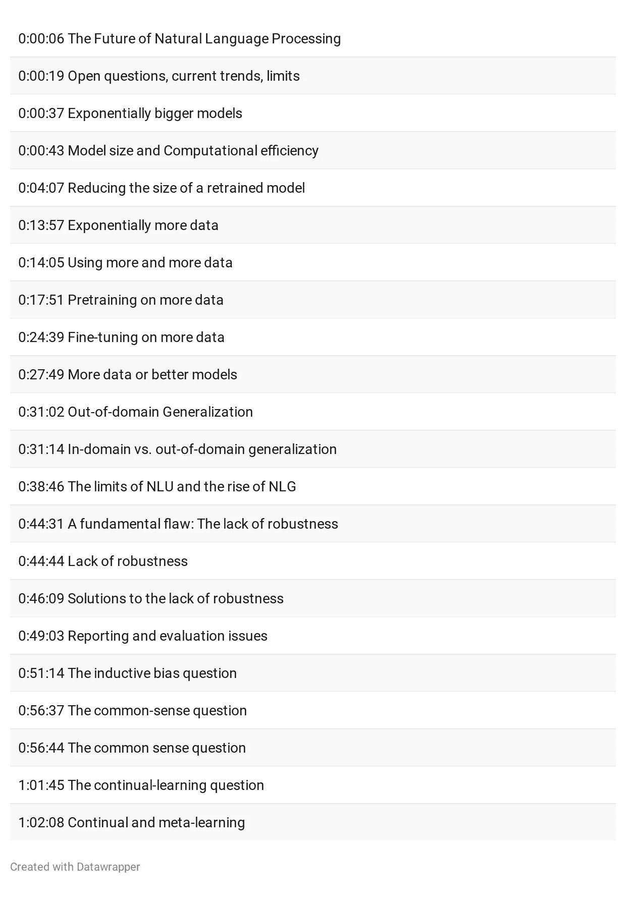
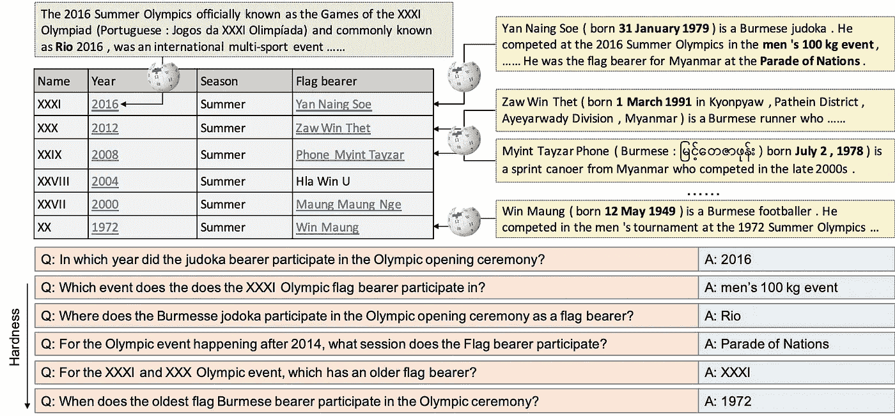

# NLP 新闻密码| 05.03.20

> 原文：<https://pub.towardsai.net/nlp-news-cypher-05-03-20-2a8ff4988098?source=collection_archive---------2----------------------->

Dwinanda Nurhanif Mujito 在 [Unsplash](https://unsplash.com?utm_source=medium&utm_medium=referral) 上拍摄的照片

## 自然语言处理每周时事通讯

## 自由

上周，发生了很多事。ICLR 是一个伟大的数字出席者，有来自 NLP 社区的大量论文/代码。结果，本周的时事通讯忙得不可开交。

就在你认为我们可以从人工智能会议中休息的时候…

脸书是这样的:

 [## ICASSP 2020 上的脸书研究

### 脸书人工智能研究人员在第 45 届国际声学会议上展示了他们的虚拟工作

ai.facebook.com](https://ai.facebook.com/blog/facebook-research-at-icassp-2020) 

顺便说一句，Ubuntu 向你问好！

 [## 20.04 LTS 到来

### 2020 年 4 月 23 日:Ubuntu 的发行商 Canonical 今天宣布 Ubuntu 20.04 LTS 版全面上市，并提供了…

ubuntu.com](https://ubuntu.com/blog/ubuntu-20-04-lts-arrives) 

KDNuggets，我们也❤你:

 [## 超级骗子 NLP 回购:100 个现成的运行 Colab 笔记本电脑

### 任何类型的机器学习建模项目都有两个主要组成部分:数据和算法(以及…

www.kdnuggets.com](https://www.kdnuggets.com/2020/04/super-duper-nlp-repo.html) 

哦，与此同时，回到牧场:🛸's 是真实的:

解密🤣

# 本周:

> ICLR 亮点
> 
> 搅拌机里的米娜的心脏
> 
> 文本-2-表格数据
> 
> 眨眼
> 
> 马赛克
> 
> 斯坦福的知识图表
> 
> 沃夫曼来自 YouTube
> 
> 本周数据集:HybridQA

# ICLR 亮点

对于 TL；人群博士:

 [## ICLR 2020 综述

### 首先，再次表示同情，亚的斯亚贝巴本周没有迎来 1000 名全球人工智能研究人员的访问，但我…

www.linkedin.com](https://www.linkedin.com/pulse/iclr-2020-roundup-alison-b-lowndes/) 

## 知识图表是一个“Boomin”

迈克尔·高尔金放弃了🔥🔥🔥这周。像往常一样，在每次重要的人工智能会议之后，Michael 都会总结 w/r/t 图和 NLP 的精华。

他的目录:

1.  [用 KGs 进行复杂问答的神经推理](https://medium.com/@mgalkin/knowledge-graphs-iclr-2020-f555c8ef10e3#f99d)
2.  [KG-增强语言模型](https://medium.com/@mgalkin/knowledge-graphs-iclr-2020-f555c8ef10e3#8d2b)
3.  [KG 嵌入:时间和归纳推理](https://medium.com/@mgalkin/knowledge-graphs-iclr-2020-f555c8ef10e3#762b)
4.  [与 GNNs 匹配的实体](https://medium.com/@mgalkin/knowledge-graphs-iclr-2020-f555c8ef10e3#7906)
5.  [奖励:文字 RPG 中的 kg！](https://medium.com/@mgalkin/knowledge-graphs-iclr-2020-f555c8ef10e3#e357)

 [## 知识图表@ ICLR 2020

### 👋你好，我希望你们在封锁期间一切都好。ICLR 2020 完全虚拟化，这是一个完全虚拟的…

medium.com](https://medium.com/@mgalkin/knowledge-graphs-iclr-2020-f555c8ef10e3) 

查看使用维基百科知识回答开放领域问答的代码:

 [## AkariAsai/learning _ to _ retrieve _ reasoning _ path

### 这是以下论文的正式实施:浅井明里，和马桥本，汉纳内赫 Hajishirzi，理查德…

github.com](https://github.com/AkariAsai/learning_to_retrieve_reasoning_paths) 

高尔金评论中我最喜欢的话题:KGs 和 RPG 游戏👇。

**论文**:

[链接](https://openreview.net/pdf?id=B1x6w0EtwH)

**GitHub** :

 [## rajammanabrolu/KG-A2C

### 使用知识图 A2C 代理的目标驱动语言生成。此代码附带纸质图形约束…

github.com](https://github.com/rajammanabrolu/KG-A2C) 

# 搅拌机里的米娜的心脏

几个月前，谷歌发布了名为 Meena 的“世界上最好的”聊天机器人，成为头条新闻。他们的代码从不开源。现在轮到脸书了，他们开源了他们的聊天机器人，有三种型号:90 米，2.7 米和 9.4 米。它被称为 Blender。

您可以在这里试用 90M 型号的本周可乐:

 [## 谷歌联合实验室

### 编辑描述

colab.research.google.com](https://colab.research.google.com/drive/1br63JtFy6c3_ndk-KZtzmbMzNBAxQzzc) 

# 文本-2-表格数据

谷歌放弃用自然语言检索表格数据。要点是，它不使用传统的 text-2-SQL 类型的查询(很难跨各种表扩展)，而是使用 BERT 对表和问题进行编码作为输入。(仅供参考，行、列和等级都有自己的嵌入！)这允许更好的概括。

表现如何？

在 SQA 数据集上，SOTA 从 55.1 上升到 67.2！

在数据集 WIKISQL 和 WIKITQ 上，它的性能与 SOTA 不相上下。

**GitHub** :

 [## 谷歌研究/tapas

### 用于训练基于转换器的表格 QA 模型的代码和检查点

github.com](https://github.com/google-research/tapas) 

**博客:**

 [## 使用神经网络在表格中寻找答案

### 世界上的许多信息都是以表格的形式存储的，这些表格可以在网上或数据库中找到。

ai.googleblog.com](https://ai.googleblog.com/2020/04/using-neural-networks-to-find-answers.html) 

# 眨眼

如果你正在寻找一个链接 python 库的实体，你应该看看脸书的 BLINK。这是一个两阶段模型，首先使用检索双向编码器来嵌入候选人的上下文和实体描述，然后在第二阶段使用交叉编码器。图书馆使用 2019/08/01 维基百科转储作为知识库，这意味着它占用了大量的磁盘空间。代码库易于跟踪和设置。

**GitHub** :

 [## facebookresearch/BLINK

### BLINK 是一个链接 python 库的实体，它使用维基百科作为目标知识库。链接的过程…

github.com](https://github.com/facebookresearch/BLINK) 

# 马赛克

艾伦研究所在 NLP 的阅读理解/常识领域做着最有趣的工作。他们有很棒的演示，我想和你分享他们的事件/常识知识图表 COMeT。很好，我查询“我去了医生的办公室”,图表生成了我“为什么”要去办公室的直观原因。你应该试一试。

 [## 镶嵌知识图

### COMeT 的演示，这是一个知识库构建引擎，它学习在常识中产生新的节点和连接…

mosaickg.apps.allenai.org](https://mosaickg.apps.allenai.org/comet_atomic) 

**GitHub** :

 [## atcbosselut/彗星-常识

### 要运行一个生成实验(conceptnet 或 atomic ),请遵循以下说明:第一个克隆，repo: git…

github.com](https://github.com/atcbosselut/comet-commonsense) 

# 斯坦福的知识图表

知识图表研讨会😎，包括视频。

 [## CS 520

### AI 应该如何显式表示知识？斯坦福大学计算机科学系，2020 年春季周二…

web.stanford.edu](https://web.stanford.edu/class/cs520/) 

# 沃夫曼来自 YouTube

一个清晰明了的关于 NLP 的现状和未来趋势的演讲🤗它是自己的:托马斯·沃尔夫。上周他们投放了一个教育视频…

**以下是视频**中的主题/时间戳:

解密的

**视频**:

# 本周数据集:HybridQA

**什么事？**

数据集允许对表格数据进行多级问答。它包含基于 13，000 个表格的超过 70，000 个问答配对，每个表格平均链接到 44 个段落。

**样本:**

**在哪里？**

 [## 文虎臣/HybridQA

### 这个库包含了论文 HybridQA 的数据集和代码:一个多跳问题回答的数据集…

github.com](https://github.com/wenhuchen/HybridQA) 

> *每周日，我们都会对来自全球研究人员的 NLP 新闻和代码进行一次每周综述。*
> 
> *如果您喜欢这篇文章，请帮助我们并与朋友分享！*
> 
> *完整报道，关注我们的推特:*[*@ Quantum _ Stat*](http://twitter.com/Quantum_Stat)

[www.quantumstat.com](http://www.quantumstat.com/)