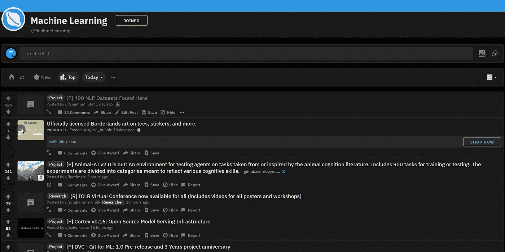
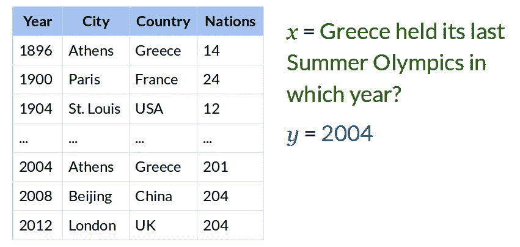

# NLP 新闻密码| 05.10.20

> 原文：<https://pub.towardsai.net/nlp-news-cypher-05-10-20-dfdb5abae713?source=collection_archive---------0----------------------->

亨德里克·科内里森在 [Unsplash](https://unsplash.com?utm_source=medium&utm_medium=referral) 上拍摄的照片

## 自然语言处理每周时事通讯

## 旅行者

我们回来了。我们发布了另一个对[大坏 NLP 数据库](https://datasets.quantumstat.com/)的更新！另外 50 个数据集使我们总共超过了 400 个，然而，还有很多要做。我要感谢所有的贡献者:马丁·施密特、雷切尔·鲍登、Devamanyu Hazarika、Panagiotis Simakis 和安德鲁·汤普森。

哦，有人在 Reddit 上给了我一个奖，不知道这是什么意思。但是我现在有一个泰迪熊(就是下面那个棕色的东西)，它叫 Hugz 奖，🤷‍♂️干杯！

解密的

Also,🛸's 继续存在。

解密的

Reddit 上一个令人敬畏的窥视展示了他们如何提高几周前发布的 3 个 UFO 视频的视频质量。我看不出视频质量有什么变化，但了解他们的工作流程还是很有趣的。概述如下:

母亲节快乐👩‍👦‍👦！

&

仅供参考，本周将有一个惊喜，敬请关注！

# 本周:

> 从罗伯塔进口刮
> 
> InferKit |将 AutoML 引入 NLP
> 
> 带代码的纸张有一个带代码的纸张
> 
> 喀拉斯遗址
> 
> TL；灾难恢复总结
> 
> 本周数据集:WikiTableQuestions

# 从罗伯塔进口刮

如果你想从头开始训练像罗伯塔这样的 SOTA 模特，看看这个代码库(也包括微调)！博客非常直观，因为除了 Colab 之外，还有注释作者工作流程的代码块！它讨论了数据、记号赋予器和模型处理。

 [## FastHugs:使用转换器和 Fastai 进行语言建模

### 这是一个端到端的描述，包括如何使用 fastai (v2)和……训练一个 transformer 语言模型的代码

www.ntentional.com](https://www.ntentional.com/nlp/transformers/training%20technique/classification/2020/04/24/fasthugs_language_model.html) 

**本周可乐杯**:

 [## 谷歌联合实验室

### 编辑描述

colab.research.google.com](https://colab.research.google.com/github/morganmcg1/ntentional/blob/master/_notebooks/2020-04-24-fasthugs_language_model.ipynb) 

# InferKit |将 AutoML 引入 NLP

Adam King 分享了他最新的 ML 项目:InferKit！这是什么？目前，它允许你不需要任何代码就可以进行最先进的文本分类，而且使用起来超级简单。无需超参数调整，您只需将 CSV 放入浏览器，单击 train，InferKit 的云架构就会完成剩下的工作。培训完成后，您会收到一封电子邮件提醒，点击链接，它会附带自己的端点 API🔥🔥。我已经试过了，它是无缝的。很快，InferKit 也将能够进行文本生成！

> 仅供参考，任何注册的人都可以获得 25 美元的免费积分。危险地生活，尝试一下。

**App** :

 [## 推断工具

### 训练最先进的机器学习模型，用自定义标签对数据进行分类——不需要编码。使用…

inferkit.com](https://inferkit.com/) 

# 带代码的纸张有纸张和代码

Paperswithcode 的重大更新。他们的数据库现在拥有超过 2500 个排行榜！此外，他们有一个新的提取模型，AxCell，允许您从 ML 研究论文中提取表格结果！

令人惊讶的是，他们的模型是开源的:

 [## paperswithcode/axcell

### 这个知识库是 AxCell 的官方实现:从机器学习论文中自动提取结果…

github.com](https://github.com/paperswithcode/axcell) 

# 喀拉斯遗址

Keras 的新网站。这并不奇怪，因为 Chollet 先生最近在 Twitter 上丢下了 gems 和许多 Colab 笔记本(我在下面附上了一个)。该网站提供了一批新的指南和例子。

**导轨**:

 [## 开发者指南

### 我们的开发人员指南深入探讨了特定的主题，如层子化、微调或模型保存…

keras.io](https://keras.io/guides/) 

**地点**:

 [## keras:Python 深度学习 API

### Keras 是为人类设计的 API，不是为机器设计的。Keras 遵循减少认知负荷的最佳实践:it…

keras.io](https://keras.io/) 

享受这部电影中的神经网络幻觉:

 [## 谷歌联合实验室

### 编辑描述

colab.research.google.com](https://colab.research.google.com/drive/18XPdEDVYdr_ODAvW0DrWRCRC25tvTuCE#scrollTo=53Pue73eu1hT) 

# TL；灾难恢复总结

艾伦研究所总结计算机科学研究论文的演示在这里。此外，他们还发布了 SCITLDR，这是一个新的数据集，包含 3，935 个作者撰写的摘要。😎

仅供参考，在 SCITLDR 上，它的性能超过了 BART！为了得到最好的结果，你可以给它提供测试集的摘要、介绍和结论。👇

**演示**:

 [## SciTLDR

### 编辑描述

scitldr.apps.allenai.org](https://scitldr.apps.allenai.org/) 

**纸张**:

[链接](https://arxiv.org/pdf/2004.15011.pdf)

# 本周数据集:WikiTableQuestions

## **什么事？**

数据集用于在半结构化的 HTML 表上回答问题。

## **样本:**

## **在哪里？**

 [## ppasupat/WikiTableQuestions

### 版本 1 . 0 . 2(2016 年 10 月 4 日)WikiTableQuestions 数据集用于半结构化…

github.com](https://github.com/ppasupat/WikiTableQuestions) 

> *每周日，我们都会对来自世界各地研究人员的 NLP 新闻和代码进行一次每周综述。*
> 
> 如果您喜欢这篇文章，请帮助我们并与朋友分享！
> 
> *如需完整报道，请关注我们的推特:*[*@ Quantum _ Stat*](http://twitter.com/Quantum_Stat)

[www.quantumstat.com](http://www.quantumstat.com/)