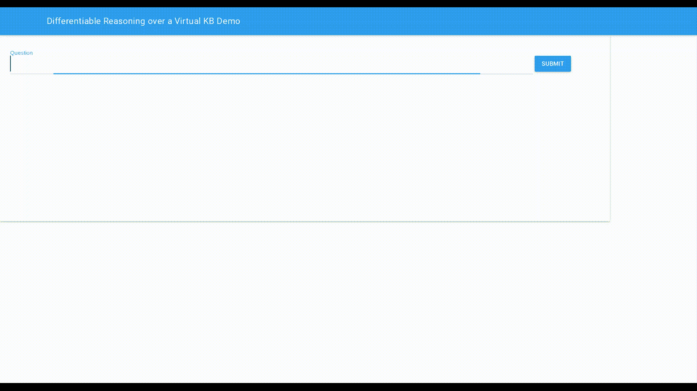
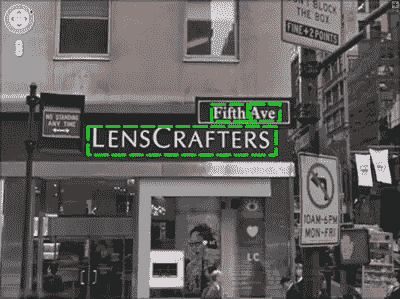

# NLP 新闻密码| 05.17.20

> 原文：<https://pub.towardsai.net/nlp-news-cypher-05-17-20-5363293883e1?source=collection_archive---------2----------------------->

谢莉·泰在 [Unsplash](https://unsplash.com?utm_source=medium&utm_medium=referral) 上拍摄的照片

## 自然语言处理每周时事通讯

## 绿洲

你可能已经听说了，埃隆·马斯克不太高兴。当脸书的人工智能负责人杰罗姆·派森蒂决定通过[在 Twitter 上就马斯克的人工智能知识呼吁](https://threader.app/conversation/1260493713924595716/nnkc3Ldm7g)来火上浇油时，这也于事无补:

## 😈牛肉丝😈

## [**杰罗姆·佩森蒂**](https://twitter.com/intent/user?screen_name=an_open_mind) @an_open_mind

我相信 AI 社区中的很多人都可以公开说出来。 [@elonmusk](https://twitter.com/elonmusk) 一说起 AI 就不知道自己在说什么。根本没有 AGI 这种东西，我们也远没有达到人类的智力水平。[#诺阿吉](https://threader.app/hashtag/noAGI)

👇

## [**埃隆马斯克**](https://twitter.com/intent/user?screen_name=elonmusk)@埃隆马斯克

脸书糟透了

👇

## [**Yann le Cun**](https://twitter.com/intent/user?screen_name=ylecun)@ y LeCun

特斯拉工程师和科学家会问“我们还能用 PyTorch 吗？”
[https://youtu.be/oBklltKXtDE](https://youtu.be/oBklltKXtDE)

👇

## [**埃隆马斯克**](https://twitter.com/intent/user?screen_name=elonmusk)@埃隆马斯克

公平点，PyTorch 很棒！

*结束*

扎克是这样的:

解密的

与此同时，NVIDIA 首席执行官黄先生(和他的皮夹克)在厨房发表了有史以来第一次主题演讲:

仅供参考，在过去的一周，我们发布了另一套笔记本电脑的超级骗子 NLP 回购！感谢所有贡献者:阿迪蒂亚·马尔特、卡皮尔·肖汉、维塞尔·科贾曼和萨亚克·保罗。😎

 [## 超级骗子 NLP 回购

### 适用于 NLP 中各种任务的 Colab 笔记本

notebooks.quantumstat.com](https://notebooks.quantumstat.com) 

附言——不要点这个🧐:

 [## 远程黑客

### ?

telehack.com](http://telehack.com/) 

# 本周:

> 流量管
> 
> 嵌套 JSON
> 
> 可视化人工智能模型训练
> 
> DrKIT
> 
> 课文 2 关于中央处理器的演讲
> 
> T5 激发了巴特的疑问
> 
> 本周实验室:T5 调谐🔥🔥
> 
> CMUs ML 视频集合
> 
> 本周数据集:街景文本(SVT)

# 流量管

你可能已经使用了在超级 Duper NLP Repo 中找到的 Tacotron 模型进行文本 2 语音实验。现在 NVIDIA 发布了 FlowTron，它有自己的可控风格调制。事实上，如果你听到上面黄视频中的主题旁白，FlowTron 就是正在使用的模型。如果有兴趣，可以看看他们的博客页面，上面展示了 Tacotron 2 的各种风格演示。

**博客**:

 [## Flowtron:基于自回归流的文本语音合成生成网络

### LJ speech Ground Truth flow tron taco tron 2 音频不支持音频不支持音频不支持 Flowtron we…

nv-adlr.github.io](https://nv-adlr.github.io/Flowtron) 

**GitHub** :

 [## NVIDIA/flowtron

### 在我们最近的论文中，我们提出了 Flowtron:一个基于自回归流的生成网络，用于文本到语音合成…

github.com](https://github.com/NVIDIA/flowtron) 

# 嵌套 JSON

这些 JSON 记录很快就会变得错综复杂，尤其是如果两个对象共享同一个键，比如人的“name”和公司名称的“name”。下面是一个快速浏览嵌套 JSON 数据的指南，它有一个隔离正确键的功能，给了我们所有人一个新的希望。😁

 [## 用 Python 解析嵌套的 JSON 记录

### JSON 是 web 服务用于消息传递的典型格式，也是相对易读的。尽管…

bcmullins.github.io](https://bcmullins.github.io/parsing-json-python/) 

# 可视化人工智能模型训练

标题说明了一切。这是一个一步一步的指南(w/Colab ),用于灌输重量和偏见可视化和拥抱脸的变形金刚库。在本例中，CoLA 数据集上的 DistilBERT 用于观察 Mathew 的相关系数指标:

 [## 跟踪拥抱脸模型性能的逐步指南

### 本教程解释了如何训练一个模型(具体来说，一个 NLP 分类器)使用的权重和偏见和…

app.wandb.ai](https://app.wandb.ai/jxmorris12/huggingface-demo/reports/A-Step-by-Step-Guide-to-Tracking-Hugging-Face-Model-Performance--VmlldzoxMDE2MTU) 

# DrKIT

搜索大量文档通常会导致多跳问题。通常，一个问题可能需要搜索知识库的多个区域才能准确回答查询。在这项工作中，CMU 大学的作者试图梳理文档(像图表一样)，而不将文档转换成图表(将文档保持在原始状态)——这比知识图表更容易构建，并提供了一个主要的速度提升。

表现如何？

在 MetaQA 任务中:

> 该模型在 2 跳和 3 跳问题上分别比以前的最佳模型高出 6%和 9%，同时速度提高了 10 倍。*🔥🔥🔥🔥*

关于 HotpotQA:

> method 牺牲了一些准确性(F1 得分 43 比 61 ),在速度方面提高了 100 倍。

**博客**:

 [## 文本上的微分推理

### 我们都依赖搜索引擎来浏览每天发布的大量在线信息。现代搜索…

blog.ml.cmu.edu](https://blog.ml.cmu.edu/2020/05/15/differentiable-reasoning-over-text/) 

**16 核 CPU 演示**:

**论文**:

[链接](https://arxiv.org/pdf/2002.10640.pdf)

# 课文 2 关于中央处理器的演讲

来自脸书的新文本-2-语音模型可以在 CPU 上以 500 毫秒生成一秒钟的音频。此外，他们还包括风格嵌入，允许人工智能的声音模仿助理，柔软，快速，投影和正式的风格！

下面的链接里有演示演讲。坏消息是，这似乎不是开源的。😌

 [## 部署在 CPU 上的高效实时文本到语音转换系统

### 脸书人工智能在 CPU 服务器上构建和部署了一个实时神经文本到语音转换系统，提供了业界领先的…

ai.facebook.com](https://ai.facebook.com/blog/a-highly-efficient-real-time-text-to-speech-system-deployed-on-cpus/) 

# T5 激发了巴特的疑问

因 DrQA 而出名的开放领域问答通常涉及两阶段模型方法，其中你搜索外部知识库(例如维基百科),然后使用另一个模型为查询检索数据。对于封闭领域的问答，就像小队任务一样，下游任务包括提供一个通用的预训练模型文本和一个问题，模型的任务是找到文本中的答案跨度。然而，在这个使用 BART-large 模型的回购中，Sewon Min 使用了一个根据知识本身预先训练的模型，然后经过微调来回答问题！这种风格被称为开放域闭卷，其灵感来自下面的 T5 论文。直射🔥🔥。

**巴特 GitHub** :

 [## shmsw 25/Bart-闭卷-qa

### 这是一个 BART 版本的序列到序列模型，用于闭卷设置中的开放域 QA，基于 PyTorch 和…

github.com](https://github.com/shmsw25/bart-closed-book-qa) 

**T5 GitHub** :

 [## 谷歌研究/谷歌研究

### 这个库包含了复制实验的代码，你能把多少知识打包到…

github.com](https://github.com/google-research/google-research/tree/master/t5_closed_book_qa) 

**纸基关 T5** :

[链接](https://arxiv.org/pdf/2002.08910.pdf)

# 本周实验室:T5 调谐🔥🔥

学会用 T5 进行复习分类，情感分类，常识推断！

 [## 谷歌联合实验室

### 编辑描述

colab.research.google.com](https://colab.research.google.com/drive/176NSaYjc2eeI-78oLH_F9-YV3po3qQQO) 

# CMUs ML 视频集合

来自 Graham Neubig，这个伟大的集合为您的机器学习启迪提供了 24 个讲座视频。当在第 7 个视频中讨论注意力时，你就知道这个系列是好的😁。在这些视频剪辑中，我们得到了从搜索树、文档级模型到机器阅读和 NLG 的一切:

# 本周数据集:街景文本(SVT)

## 这是什么？

数据集包含带有注释的街道场景图像，用于场景文本识别任务。

## 样本:

## 它在哪里？

 [## 街道视图文本数据集

### 数据集->数据集列表->当前页面王凯 EBU3B，4148 室。Sci。和工程师。大学…

www.iapr-tc11.org](http://www.iapr-tc11.org/mediawiki/index.php/The_Street_View_Text_Dataset) 

> *每周日，我们都会对来自世界各地研究人员的 NLP 新闻和代码进行一次每周综述。*
> 
> *如果您喜欢这篇文章，请帮助我们并与朋友分享！*
> 
> *如需完整报道，请关注我们的 Twitter:*[*@ Quantum _ Stat*](http://twitter.com/Quantum_Stat)

[www.quantumstat.com](http://www.quantumstat.com/)