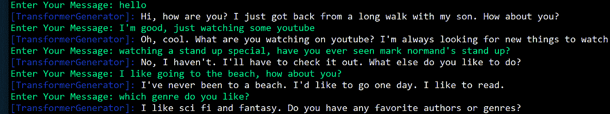
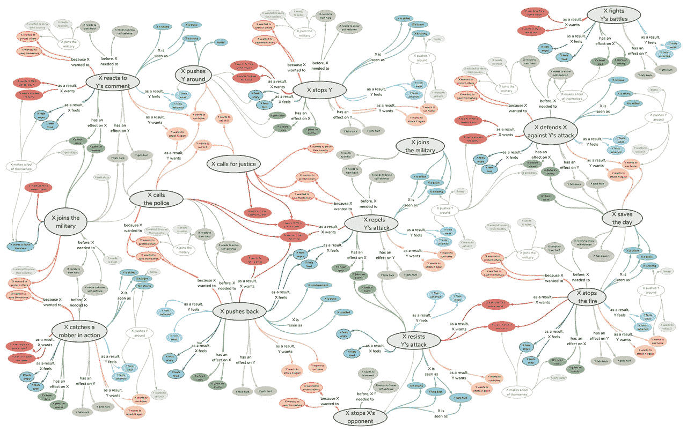

# NLP 新闻密码| 05.24.20

> 原文：<https://pub.towardsai.net/nlp-news-cypher-05-24-20-f62038edf7ed?source=collection_archive---------2----------------------->

乔斯·伍德黑德在 [Unsplash](https://unsplash.com?utm_source=medium&utm_medium=referral) 上的照片

## 自然语言处理每周时事通讯

## 一杯上路

一款 CL 2020 将于 7 月份在你身边的电脑上上市。论文和公认的演示/框架已经展出:

 [## 被接受的论文

### 请注意，标题/作者可能会更改，论文可能会被撤回。关于最终的书名/作者，请参考…

acl2020.org](https://acl2020.org/program/accepted/#system-demonstrations) 

脸书·艾在本月早些时候发布了他们的搅拌机聊天机器人。我在玩 2.7B 型号，它相当不错👇。聊天对话系统的一个常见问题通常是模型忽略了用户的陈述，这破坏了连续性。但是你可以看到，Blender 在保持连续性方面做得很好。

解密的

下面是通过 Colab 运行推理的 90M param 模型(较大的模型会使 Colab 爆炸):

 [## 谷歌联合实验室

### 编辑描述

colab.research.google.com](https://colab.research.google.com/drive/1S13cZFL8xQJIST7owvSi1w1cw1sXEEw8?authuser=1) 

**纸张**:

[链接](https://arxiv.org/pdf/2004.13637.pdf)

阵亡将士纪念日周末快乐！🌭

**&**

开斋节快乐

# 本周:

> 部署的惊涛骇浪
> 
> 伯特韦特
> 
> Microsoft Build 摘要
> 
> 黑客地球调查
> 
> 拥抱改革者
> 
> 本周数据集:原子

# 部署的惊涛骇浪

AI2 和他的公司在自然语言处理方面做了大量的研究。本周，他们的一名工程师写了一篇博文，讲述他们是如何成功部署所有优秀的演示的。他们让我们进入他们的大规模部署世界，以及他们如何能够运行如此复杂的后端来大规模部署实时推理。你不能经常看到机器内部，所以看看他们的结构(Kubernetes alert💥):

 [## 小船:驯服现代网络的惊涛骇浪

### 鉴于许多研究机构都隐藏在封闭的门后，这是由对……

medium.com](https://medium.com/ai2-blog/skiff-taming-the-stormy-seas-of-the-modern-web-a0371a3e9eae) 

# 伯特韦特

是时候有人设法在大量英语推特上预先训练伯特了。在我自己的演示中处理了 tweet 数据之后，这将会派上用场，因为 Twitter 是文本数据收集的明显选择之一。顺便说一句，它包括与 COVID 相关的 tweetss，如果您的模型需要了解 COVID 词汇，这些 tweet 可以派上用场。

**详情**:

> 8.5 亿条英文推文(16 亿字令牌~ 80GB)，包含 2012 年 1 月至 2019 年 8 月期间的 8.45 亿条推文，以及 500 万条与新冠肺炎疫情相关的推文

**GitHub** :

 [## VinAIResearch/BERTweet

### 目录 BERTweet 是第一个为英语推文预先训练的公共大规模语言模型。伯特威是…

github.com](https://github.com/VinAIResearch/BERTweet) 

# Microsoft Build 摘要

一个最大的开发者大会召开了。微软推出了一些非常酷的功能，比如自动完成 VS 代码和运行在 Azure 上的 OpenAI 超级计算机。点击此处查看精彩内容:

 [## 微软 Build 发布的最重要的公告，它是一年一度的软件会议…

### 冠状病毒并没有阻止微软在本周的年度构建会议上发布大量新闻。现在在其…

www.cnbc.com](https://www.cnbc.com/2020/05/22/microsoft-build-2020-recap-windows-azure-and-teams-tools.html) 

> 为 OpenAI 开发的超级计算机是一个单一系统，拥有超过 285，000 个 CPU 核心，10，000 个 GPU，每个 GPU 服务器每秒 400 千兆位的网络连接。

 [## 微软宣布新的超级计算机，规划未来人工智能工作的远景——人工智能博客

### 微软建造了世界上五大公开披露的超级计算机之一，使新的基础设施…

blogs.microsoft.com](https://blogs.microsoft.com/ai/openai-azure-supercomputer/?utm_source=msr-social) 

# 黑客地球调查

那么现在的开发者在忙些什么呢？让我们来看看来自 76 个国家的 16，655 名开发人员是怎么说的:

## 亮点:

> 在学生(29%)和有经验的开发人员(32%)中，Go 已经成为最受欢迎的编程语言的明显赢家。
> 
> 学习发展的第二大资源来自 YouTube，包括学生和专业人士。

**调查**:

# 拥抱改革者

在过去的一周里，拥抱脸向他们不断增长的变形金刚列表介绍了改革者，甚至包括一个用于文本生成的漂亮的 Colab。如果你很难跟上所有这些变形金刚的列表，你并不孤单，这是一个很好的问题。🤗[文档](https://huggingface.co/transformers/model_doc/reformer.html)

**本周可乐杯:**

 [## 谷歌联合实验室

### 编辑描述

colab.research.google.com](https://colab.research.google.com/drive/1jR6hA2CQXDbucJXdiDXhmxmyoQmM2Pws) 

# 本周数据集:原子

## 这是什么？

数据集是推理知识的 877K 文本描述三元组的知识图。

## 样本:

## 它在哪里？

 [## 原子知识图形浏览器

### 对于某些事件，注释相当多样化，这是否意味着数据是有噪声的？重要的是，有些事件会调用…

homes.cs.washington.edu](https://homes.cs.washington.edu/~msap/atomic/) 

> 每周日，我们都会对来自世界各地研究人员的 NLP 新闻和代码进行一次每周综述。
> 
> 如果您喜欢这篇文章，请帮助我们并与朋友分享！
> 
> *如需完整报道，请关注我们的 Twitter:*[*@ Quantum _ Stat*](http://twitter.com/Quantum_Stat)

[www.quantumstat.com](http://www.quantumstat.com/)