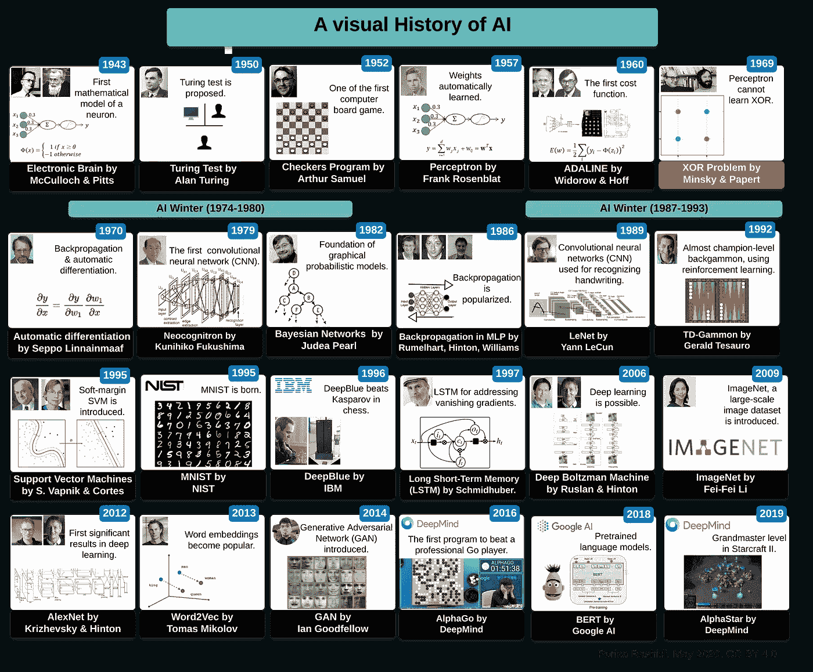
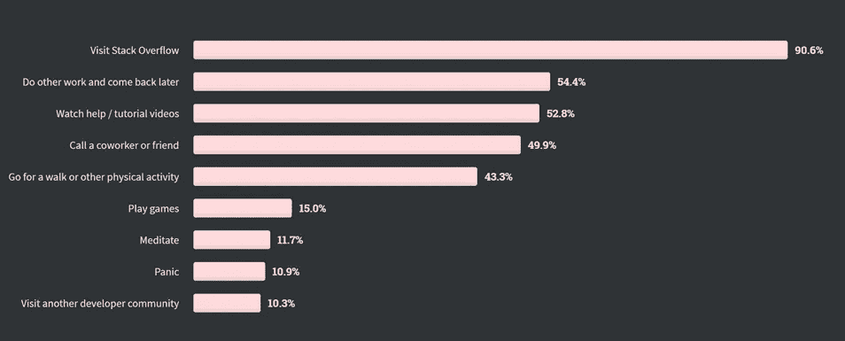
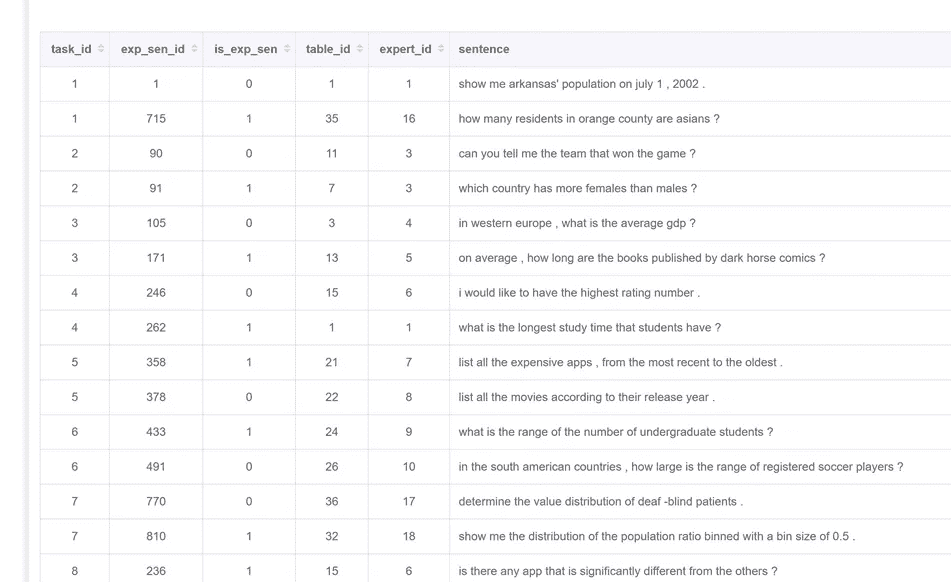

# NLP 新闻密码| 05.31.20

> 原文：<https://pub.towardsai.net/nlp-news-cypher-05-31-20-df0ab06421b6?source=collection_archive---------3----------------------->

SpaceX 在 [Unsplash](https://unsplash.com?utm_source=medium&utm_medium=referral) 上拍摄的

## 自然语言处理每周时事通讯

## 敬星星

我们成功了，我们回到了太空。SpaceX 是第一家将人类送入轨道的私营公司。在飞行了不到 19 个小时后，“龙”号机组人员与国际空间站对接，国际空间站目前在近地轨道上空 254 英里处。下一个障碍:重返大气层。一路平安。

埃隆，感觉如何？

解密的

仅供参考，我们添加了另一个伟大的更新[大坏 NLP 数据库](https://datasets.quantumstat.com/)！79 个新数据集使我们的总数达到 481 个。感谢所有贡献者:伊萨·莫拉德内贾德、约书亚·艾森伯格、开尔文·江、阿达什·辛格、约翰尼·邓恩、乔纳森·库默费尔德&托马斯·pędzimąż.

如果你已经厌倦了，那就看看帕里萨·拉什迪的人工智能历史时间轴:

# 本周:

> GPT-3，煞特
> 
> 开发溢出
> 
> DeepPavlov 更新
> 
> NLP 资源
> 
> 表情自动机
> 
> 从破烂到答案
> 
> CMUs 低资源 NLP 回购
> 
> NLP 查看器
> 
> 拉莎、NLU 和伯特
> 
> 本周数据集:Quda

# GPT-3，煞特

OpenAI 有 swag。为什么？因为他们还没有公开宣布 GPT 3，它已经开始了🔥🔥。然而，这并没有阻止人工智能社区在周四晚上注意到这个星球上最大的语言模型被介绍给世界。

刚刚论文发表了，模型还停在格雷格·布罗克曼的车库里。

在极端的情况下，该模型的大小适中😁，它的**只有**1750 亿个参数🤪，比以前的任何非稀疏语言模型多 10 倍。如果你正在考虑使用这种模式，如果它真的出现了，请三思。以下是 GPT-3 回购协议中的一条线索，讲述了开发人员在开发最大尺寸模型时将面临的挑战:

 [## 模型发布问题#1 openai/gpt-3

### OpenAI 团队的出色工作！报纸没有讨论这个问题，所以我会第一个问:这个版本是什么…

github.com](https://github.com/openai/gpt-3/issues/1) 

表现如何？

在一些任务上，如 COPA 和 ReCoRD，GPT-2，它在零射击的情况下实现了接近 SOTA 的性能(这意味着它没有为下游任务进行微调，这是它开箱即用的表现)。

关于它的局限性:

> “在一些涉及比较两个句子或片段的任务中，GPT-3 似乎在少数几次或一次设置方面表现不佳，例如，一个单词在两个句子中是否以相同的方式使用(WiC)，一个句子是否是另一个句子的释义，或者一个句子是否暗示另一个句子，”

**论文**:

[链接](https://arxiv.org/pdf/2005.14165.pdf)

## 零距离射击🤗

拥抱脸没有浪费任何时间，第二天他们发布了他们的零镜头演示供你玩:

 [## 细流

### 编辑描述

huggingface.co](https://huggingface.co/zero-shot/) 

> 嘿，还记得 1.5B 的 param 模型对发布来说“太危险”吗？*😂*

# 开发溢出

栈溢出发布了他们的年度开发者调查。以下是一些亮点:

**最受欢迎的三种语言** : Rust，TypeScript，& Python

**通缉令平台** : Docker

最受欢迎的平台:Linux

**开发者遇到卡壳怎么办？**😂11%的恐慌😂：

**全面调查结果:**

 [## 堆栈溢出开发者调查 2020

### 每个月，大约有 5000 万人访问 Stack Overflow 来学习、分享和建立他们的职业生涯。行业估计…

insights.stackoverflow.com](https://insights.stackoverflow.com/survey/2020#overview) 

# DeepPavlov 更新

来自 DeepPavlov 优秀开发者的框架更新:

他们有一个新的知识库 QA 模型，可以回答这些问题类型:

**带数值的复杂问题:**

*   " 1994 年 11 月 10 日，安格拉·默克尔在什么位置？"

**答案为数字或日期的复杂问题:**

*   "让-保罗·萨特是什么时候搬到勒阿弗尔的？"

**带答案实体计数的问题:**

*   "尤文图斯足球俱乐部有多少赞助商？"

**通过某些参数的上升或下降对答案实体进行排序的问题:**

*   "哪个国家的个人税率最高？"

**简单问题:**

*   "尤里·加加林的东方号是什么？"

 [## deepmipt/DeepPavlov

### 此时您不能执行该操作。您已使用另一个标签页或窗口登录。您已在另一个选项卡中注销，或者…

github.com](https://github.com/deepmipt/DeepPavlov/releases/tag/0.10.0) 

# NLP 资源

感谢 Vollet 先生，一个新的教育 NLP 网站为您提供了各种资源！涵盖从初级到高级难度的各种媒体，如文章、书籍、教程、笔记本，甚至 YouTube 视频。你可能会发现一些我之前讨论过的🧐的熟悉资源😁。

 [## #NLP 爱好者的智囊团

### 从文章、书籍、教程、笔记本、Youtube 等学习的数字🧠委员会。

www . opinion . so](https://www.notion.so/634eba1a37d34e2baec1bb574a8a5482?v=722708f7a2ee4fbfae92e777ef2a3ec1) 

# 表情自动机

在这篇 matplotlib 博客中，他们展示了如何使用 Python 从图像中创建表情艺术。耶！(包括代码)

什么是表情符号艺术？👇她的脸是一堆表情符号。

 [## 表情符号马赛克艺术

### 不久前，我偶然发现了这个很酷的库，可以用图像创作表情艺术。我想用它来改变我的…

matplotlib.org](https://matplotlib.org/matplotblog/posts/emoji-mosaic-art/) 

# 从破烂到答案

就在我们认为 T5 & BART 对于 QA 来说太棒了的时候，脸书·艾发布了他们的 RAG 模型，“在开放式自然问题、网络问题和精选记录上实现了最先进的结果。”

要点是，最好使用混合模型(其中结合了参数和非参数(维基百科)方法)来产生更好的结果，而不是单纯地将知识存储在预先训练的参数中(如 T5 和 BART)。

2020 年开域问答火了。据我所知，代码还没有出来。

 [## 知识密集型自然语言处理任务的检索增强生成

### 大型预先训练的语言模型已被证明在其参数存储事实知识，并实现…

arxiv.org](https://arxiv.org/abs/2005.11401) 

# CMUs 低资源 NLP 回购

对于那些对低资源 NLP 感兴趣的人，你应该看看本月早些时候举行的 CMUs bootcamp。他们的 bootcamp 分享了几个关于低资源语言(如语音合成和语音识别)的主题的幻灯片，这些主题你不会每天都看到！视频和更多材料即将推出！

**GitHub** :

 [## 东大/低资源-NLP-训练营-2020

### 这是卡内基梅隆大学举办的低资源自然语言和语音处理训练营的网页…

github.com](https://github.com/neubig/lowresource-nlp-bootcamp-2020) 

# NLP 查看器

从 Hugging Face 的 NLP 查看器中可视化您最喜欢的数据集的结构。在他们的演示中，他们展示了大量的 NLP 数据集，以及如何通过拆分和其他过滤器来可视化它们。这太棒了。

**演示**:

 [## 细流

huggingface.co](https://huggingface.co/nlp/viewer/) 

# 拉莎、NLU 和伯特

如果您对这个问题感兴趣:“什么时候使用大型预训练模型的好处超过了训练时间和计算资源的增加？”那么请阅读这篇来自 RASA 的文章，这篇文章展示了他们如何将 BERT 和其他模型管道用于 NLU 目的。

 [## 如何在 NLU Rasa 中使用 BERT

### 自从发布了包含 Rasa 开源 1.8.0 的 DIET，您可以使用来自语言模型的预训练嵌入，如…

blog.rasa.com](https://blog.rasa.com/how-to-benchmark-bert/?utm_source=twitter) 

# 本周数据集:Quda

## 这是什么？

数据集包含 14，035 个不同的用户查询，标注有 10 个低级分析任务，有助于部署最先进的机器/深度学习技术来解析复杂的人类语言。

## 样本:

## 它在哪里？

 [## 曲达

### 编辑描述

freenli.github.io](https://freenli.github.io/quda/) 

> 每周日，我们都会对来自世界各地研究人员的 NLP 新闻和代码进行一次每周综述。
> 
> 如果你喜欢这篇文章，请帮助我们并与朋友分享！
> 
> 如需完整报道，请关注我们的推特: [@Quantum_Stat](http://twitter.com/Quantum_Stat)

[www.quantumstat.com](http://www.quantumstat.com/)