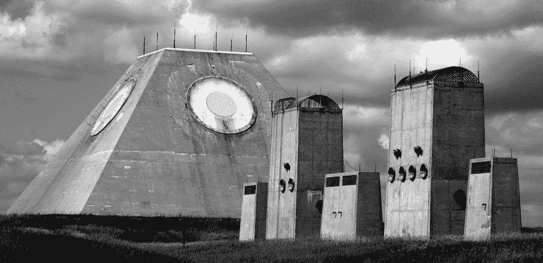
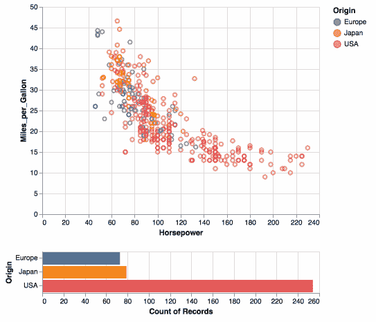
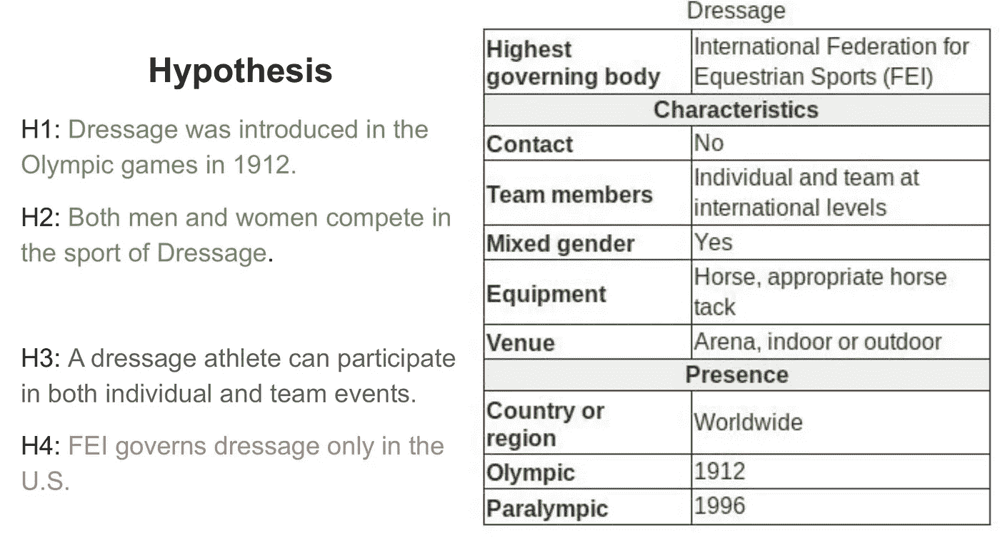

# NLP 新闻密码| 06.07.20

> 原文：<https://pub.towardsai.net/nlp-news-cypher-06-07-20-bec01ccb2a40?source=collection_archive---------3----------------------->

约翰·福勒在 [Unsplash](https://unsplash.com?utm_source=medium&utm_medium=referral) 上的照片

## 自然语言处理每周时事通讯

## 启示

在北达科他州的加拿大边境，有一座金字塔…

解密的

这是一件冷战遗物，象征着为追踪来自太平洋彼岸邻国的洲际弹道导弹而采取的严厉措施。

他们称之为斯坦利·r·米克尔森防护中心，或者阿诺德·施瓦辛格称之为“家”。在建成几个月后，它被认为无效而退役。有时候，你的应用就是不能投入生产。

在其他新闻中，上周我们发布了[超级骗子 NLP 回购](https://notebooks.quantumstat.com/)的更新。我们增加了 41 台新笔记本电脑，使总数达到 181 台！感谢 David Talby 和 Manu Romero 的贡献！如果你有很棒的 NLP 笔记本可以分享，请联系我们。

# 本周:

> GPT-2 歌词余波
> 
> Bulletpoints 演示
> 
> 这个词不存在
> 
> 阿尔泰尔
> 
> 张量流 TTS
> 
> 深筒
> 
> 人工智能培训费用
> 
> 本周数据集:信息标签

# GPT-2 歌词余波

不知道是否曾经有过一个调查来了解 GPT-3s 小兄弟:GPT-2 的文本生成质量。TickPick 调查了 1，003 名受访者，以了解人类有多喜欢文本生成的歌词，以及它如何与真人歌词进行对比。

**顶级 AI 歌词:**

“我的装备在我的宝马后面。我吃草的时候专业，我争论的时候专业。40 杯，我在嘲笑那个混蛋，我要对那个混蛋咆哮。”🤟🤟

**他们也提供了更多由人工智能生成的不同流派的歌词:**

 [## TickPick | Ai 掉一张专辑

### 1，000 名粉丝为世界上最受欢迎的流派评价和评论人工智能生成的音乐。

www.tickpick.com](https://www.tickpick.com/ai-drops-an-album#asset1) 

# Bulletpoints 演示

HAIMKE 是一个非常棒的文本生成模型。它允许您从 bulletpoints 生成文本。更酷的是，他们可以在整个生成的文本中交织这些语句。你可以在这里试一试:

 [## 和海姆克一起写

### HAIMKE 是一种语言模型，它从人类书写的要点生成合成文档。它旨在…

www.ai21.com](https://www.ai21.com/haimke) 

# 这个词不存在

继续 GPT 新协议的主题，看看这个回购协议，其中您可以使用文本生成模型来创建不存在的定义和单词(在您的韦氏词典中找到的类似结构)。它们为推理提供了节省的权重，如果您愿意，还可以训练您自己的模型。

**GitHub:**

 [## turtle soupy/这个词不存在

### 这是一个项目，允许人们训练 GPT-2 的变种，从零开始组成单词，定义和例子。

github.com](https://github.com/turtlesoupy/this-word-does-not-exist) 

这是他们的推特机器人。

# 阿尔泰尔

当您不使用 matplotlib 进行可视化时，请尝试 Altair。这个 API 有一个简洁的语法。(这是一个声明性的库🙈)

**GitHub:**

 [## 牛郎星-viz/牛郎星

### http://Altair-viz . github . io Altair 是 Python 的声明式统计可视化库。使用 Altair，您可以…

github.com](https://github.com/altair-viz/altair) 

**视觉效果图库:**

 [## 示例图库- Altair 4.1.0 文档

### 带突出显示段的条形图 Becker 的大麦网格图(包裹面)带最小/最大值的装箱热图盒图…

牛郎星-即 github.io](https://altair-viz.github.io/gallery/index.html) 

# 张量流 TTS

嘿，现在语音合成唾手可得。Dathudeptrai 发布了一个非常棒的库，它似乎是为生产而构建的:

> “我们可以通过使用[假量化感知](https://www.tensorflow.org/model_optimization/guide/quantization/training_comprehensive_guide)和[修剪](https://www.tensorflow.org/model_optimization/guide/pruning/pruning_with_keras)，进一步加快训练/推理进度和优化程序，并能够部署在移动设备或嵌入式系统上。”

该库允许您使用几种不同的模型:

1.  MelGAN 发布的论文 [MelGAN:用于条件波形合成的生成对抗网络](https://arxiv.org/abs/1910.06711)
2.  与论文[一起发布的 Tacotron-2 通过根据 Mel 光谱图预测调节 WaveNet 进行自然 TTS 合成](https://arxiv.org/abs/1712.05884)
3.  与论文一起发布的 Fast Speech[Fast Speech:快速、健壮且可控的文本到语音转换](https://arxiv.org/abs/1905.09263)
4.  与论文一同发布的多频带 MelGAN:[多频带 MelGAN:用于高质量文本到语音转换的更快波形生成](https://arxiv.org/abs/2005.05106)

**GitHub:**

 [## dathudeptrai/TensorflowTTS

### 😋TensorflowTTS 用于 Tensorflow 2 的实时最新语音合成🤪TensorflowTTS 提供实时…

github.com](https://github.com/dathudeptrai/TensorflowTTS) 

# 深筒

DeepMind 在 YouTube 上发布了新的讲座，截至今天，其中六场已经开始，至少还有六场正在进行中！对于 NLP 的人来说，关于循环网络的第 6 课是适合你的:

# 人工智能培训费用

一位 ARK Invest 分析师表示，到 2020 年 12 月，在 ResNet50 上训练一个神经网络的成本将低于 1 美元。显然，“训练一个人工智能(AI)系统的成本正以 50 倍于摩尔定律的速度增长。”

我的银行账户可不是这么说的。😁

可以咀嚼的东西👇

 [## 人工智能培训成本正以 50 倍于摩尔定律的速度增长

### 训练人工智能(AI)系统的成本正以摩尔定律的 50 倍速度增长。对于许多用途…

ark-invest.com](https://ark-invest.com/analyst-research/ai-training/) 

# 本周数据集:信息标签

## 这是什么？

数据集包含基于前提的人类编写的文本假设，前提是从维基百科信息盒中提取的表格。

## 样本:

## 它在哪里？

 [## 信息标签

### 理解普遍存在的半结构化列表数据不仅需要理解文本片段的含义…

infotabs.github.io](https://infotabs.github.io/) 

> 每周日，我们都会对来自世界各地研究人员的 NLP 新闻和代码进行一次每周综述。
> 
> *如果你喜欢这篇文章，请帮助我们并与朋友分享！*
> 
> *如需完整报道，请关注我们的推特:*[*@ Quantum _ Stat*](http://twitter.com/Quantum_Stat)

[www.quantumstat.com](http://www.quantumstat.com/)