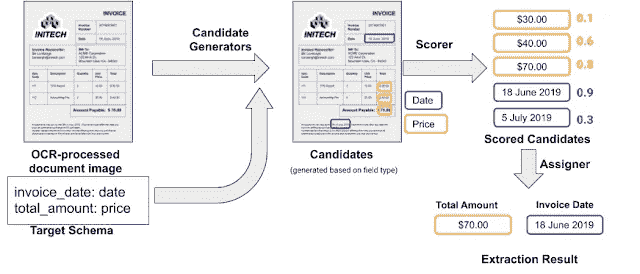
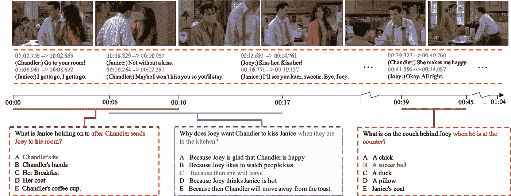

# NLP 新闻密码| 06.21.20

> 原文：<https://pub.towardsai.net/nlp-news-cypher-06-21-20-cd86b327ad8d?source=collection_archive---------3----------------------->

扎克·卡斯蒂略在 [Unsplash](https://unsplash.com?utm_source=medium&utm_medium=referral) 上的照片

## 自然语言处理每周时事通讯

## 勇敢的心

说到网络黑客，NSA 是你需要关注的三个字母的机构。如果你想知道他们是如何破解我们的电子邮件的，那么，它涉及到时钟、质数和椭圆曲线🤯。在下面的视频中，将向您介绍用于创建随机数生成的数学方法，网络安全算法使用该方法对信用卡或电子邮件进行日常加密。

安全软件之所以有效，是因为它们的加密“随机”数字序列，这使得它们不可预测，因此是安全的。但是，如果这些随机数的产生有一个后门，使它们变得可预测，那会怎么样呢？本质上，这是国家安全局发现的。为了看看他们是如何做到的，让我们进入兔子洞:

解密的

# 本周:

> MMF 多式联运框架
> 
> 结构化文档的信息检索
> 
> 空间更新
> 
> 知识图表简介
> 
> 长格式问题回答
> 
> TF Lite 中的模型量化
> 
> 生产中的深度学习
> 
> 本周数据集:TVQA

# MMF 多式联运框架

嘿现在！脸书，更确切地说是 PyTorch，发布了他们的多模态框架！它带有…

> “最先进的视觉和语言预训练模型、大量现成的标准数据集、通用层和模型组件，以及训练和推理工具。”

你可以使用 MMF 来完成几个不同的多模态任务:VQA，图像字幕，可视对话，仇恨探测等等。

当前可用型号列表:

*   针对 TextVQA [ [arXiv](https://arxiv.org/abs/1911.06258) ] [ [项目](https://github.com/facebookresearch/mmf/tree/master/projects/m4c) ]的 M4C 迭代答案预测
*   ViLBERT ViLBERT:为视觉和语言任务预先训练与任务无关的视觉语言表示[ [arXiv](https://arxiv.org/abs/1908.02265) ] [ [项目](https://github.com/facebookresearch/mmf/tree/master/projects/vilbert)
*   视觉和语言的一个简单和可执行的基线[ [arXiv](https://arxiv.org/abs/1908.03557) ] [ [项目](https://arxiv.org/abs/1908.03557)
*   LoRRA 走向可以阅读[ [arXiv](https://arxiv.org/abs/1904.08920) ] [ [项目](https://github.com/facebookresearch/mmf/tree/master/projects/lorra)的 VQA 模型
*   M4C 字幕器 TextCaps:一个用于阅读理解的图像字幕数据集[ [arXiv](https://arxiv.org/abs/2003.12462) ] [ [项目](https://github.com/facebookresearch/mmf/tree/master/projects/m4c_captioner)
*   皮媞亚皮媞亚 v0。vqa 挑战赛 2018 的获奖作品[ [arXiv](https://arxiv.org/abs/1807.09956) ] [ [项目](https://github.com/facebookresearch/mmf/tree/master/projects/pythia) ]
*   但对图像字幕和视觉问题回答的关注是自下而上和自上而下的[[arXiv](https://arxiv.org/abs/1707.07998)][[project](https://github.com/facebookresearch/mmf/tree/master/projects/butd)
*   MMBT 负责监督用于图像和文本分类的多模式双向转换器[ [arXiv](https://arxiv.org/abs/1909.02950) ] [ [项目](https://github.com/facebookresearch/mmf/tree/master/projects/mmbt)
*   班双线性注意力网络[ [arXiv](https://arxiv.org/abs/1805.07932) ] [ [项目](https://github.com/facebookresearch/mmf/tree/master/projects/ban) ]

**博客**:

 [## 使用 PyTorch 驱动的多模态框架 MMF 引导多模态项目

### 为你的下一个视觉和语言研究/制作项目打下坚实的基础

medium.com](https://medium.com/pytorch/bootstrapping-a-multimodal-project-using-mmf-a-pytorch-powered-multimodal-framework-464f75164af7) 

**GitHub** :

 [## facebookresearch/mmf

### MMF 是脸书人工智能研究所的视觉和语言多模态研究的模块化框架。MMF 包含…

github.com](https://github.com/facebookresearch/mmf) 

# 结构化文档的信息检索

记得🧐光学字符识别吗？有些技术永远不会消亡，谷歌已经创建了一个从结构化文档中提取信息的模型。该架构使用 OCR 从 pdf 或扫描文档等文档中提取文本，然后使用候选生成器来匹配目标模式中的字段。最后，给字段一个可能性分数，对提取到的预期目标进行排序。

**博客**:

 [## 从临时文档中提取结构化数据

### 临时文档，如收据、账单、保险报价等，在一个企业中是非常常见和重要的

ai.googleblog.com](https://ai.googleblog.com/2020/06/extracting-structured-data-from.html) 

# 空间更新

SpaCy 对其库进行了全新的更新，突出了新的语言和教程(以及更多！).他们增加了 5 种新语言:中文、日语、丹麦语、波兰语和罗马尼亚语。除了新语言之外，SpaCy 还改进了模型加载时间，并在此处提供了新的在线课程:

**教程**:

 [## 带空间的高级自然语言处理免费在线课程

### spaCy 是一个用于工业级自然语言处理的现代 Python 库。在这个自由和互动的…

course.spacy.io](https://course.spacy.io/en) 

**更新汇总:**

 [## 介绍 spaCy v2.3 爆炸

### spaCy 现在会说中文，日语，丹麦语，波兰语和罗马尼亚语！spaCy 自然语言处理的 2.3 版本…

explosion.ai](https://explosion.ai/blog/spacy-v2-3) 

# 知识图表简介

对知识图嵌入的一个很好的介绍，它简要地讨论了亚马逊的知识图库 DGL-KE 建立在深度图库(DGL)之上。

**博客**:

 [## 用 DGL-柯介绍知识图嵌入

### 作者:Cyrus Vahid，AWS AI 首席解决方案工程师

towardsdatascience.com](https://towardsdatascience.com/introduction-to-knowledge-graph-embedding-with-dgl-ke-77ace6fb60ef) 

**DGL-柯**

 [## aw slab/dgl-ke

### 文档知识图是存储不同实体(节点)信息的数据结构

github.com](https://github.com/awslabs/dgl-ke) 

# 长格式问题回答

拥抱脸最近发布了一个长形式问题回答的演示，它接受一个问题，从维基百科中获取段落，并对该问题写一个多句子的解释。意思是，这不是像小队模式那样的提取 QA。相反，它使用稀疏模型(Elasticsearch)来检索与问题松散链接的顶级维基段落，然后使用密集模型(Faiss ),嵌入在 ELI-5 数据集上训练的问题/答案。最后，他们使用 BART 生成答案。相当酷和高效！

**博客/笔记本**:

 [## long _ Form _ Question _ Answering _ with _ Eli 5 _ and _ Wikipedia

### 想象一下，你突然渴望了解热带树木的果实是如何转化成……

yjernite.github.io](https://yjernite.github.io/lfqa.html) 

**演示:**

 [## 细流

### 编辑描述

huggingface.co](https://huggingface.co/qa/) 

# TF Lite 中的模型量化

Sayak Paul 发表了一篇关于模型量化的博客文章，该文章将用于移动设备等边缘设备。它清晰地介绍了量化(训练后量化和量化感知训练 **)** 以及它如何与 TensorFlow Lite 相适应。

**博客**:

 [## TF Lite 中模型量化的故事

### 模型优化策略和量化技术，以帮助在资源中部署机器学习模型…

app.wandb.ai](https://app.wandb.ai/sayakpaul/tale-of-quantization/reports/A-Tale-of-Model-Quantization-in-TF-Lite--Vmlldzo5MzQwMA) 

**GitHub** :

 [## sayak Paul/tensor flow-Lite 历险记

### 本资源库包含展示 TensorFlow Lite 用于量化深度神经网络的笔记本…

github.com](https://github.com/sayakpaul/Adventures-in-TensorFlow-Lite) 

# 生产中的深度学习

一些用于生产的人工智能模型的令人清醒的统计数据，例如“**大多数公司(59%)没有在生产中优化他们的机器学习模型**”(他们应该阅读 quantization🧐的前一篇帖子)。如果你喜欢焦虑，那么看看这些新的调查结果，看看企业开发人员每天是如何紧张工作的。仅供参考，TensorFlow 在制作上还是很受欢迎的。

 [## 公司缺乏资源将深度学习模型投入生产[调查] -神经魔法

### 公司通常在生产中有多少深度学习模型？比你想象的要少得多。84%的公司…

neuralmagic.com](https://neuralmagic.com/blog/deep-learning-survey-results/) 

# 本周数据集:TVQA

# 这是什么？

数据集用于视频问答，由来自 21，793 个剪辑的 152，545 个问答对组成，跨越 460 多个小时的视频。

# 样本:

# 它在哪里？

 [## TVQA 数据集

### 下载链接:tvqa _ QA _ release . tar . gz[15MB]MD5 sum:7 f 751d 611848d 0756 ee4b 760446 ef 7 cf 文件包含 3 个 JSON 行文件…

tvqa.cs.unc.edu](http://tvqa.cs.unc.edu/download_tvqa.html) 

> 每周日，我们都会对来自世界各地研究人员的 NLP 新闻和代码进行一次每周综述。
> 
> 如果你喜欢这篇文章，请帮助我们并与朋友分享！
> 
> 如需完整报道，请关注我们的推特: [@Quantum_Stat](http://twitter.com/Quantum_Stat)

【www.quantumstat.com 