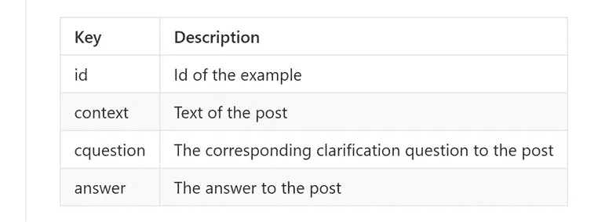

# NLP 新闻密码| 06.28.20

> 原文：<https://pub.towardsai.net/nlp-news-cypher-06-28-20-aa122d84f63c?source=collection_archive---------1----------------------->

杰夫·芬利在 [Unsplash](https://unsplash.com?utm_source=medium&utm_medium=referral) 上的照片

## 自然语言处理每周时事通讯

## 最后的边疆

eoff Hinton 反悔了，取消了一系列会议。他意识到他关于感知学习的想法有一个中心缺陷，并在他计划的会谈中失败了。辛顿不会乱来。

上周是一个模糊的…

…哦，日本有一台新的超级计算机:

 [## 世界上新的最快的超级计算机是用于人工智能的亿亿次计算机

### 世界上最快的超级计算机每年进行两次测试，看哪一台是顶级的。这些上亿美元…

singularityhub.com](https://singularityhub.com/2020/06/25/the-worlds-fastest-supercomputer-is-an-exascale-machine-for-ai/) 

**大坏 NLP 数据库**被更新😎。我们增加了 63 个新数据集，使我们的总数达到 545 个！感谢所有贡献者:Erik Chan、Ramya Tekumalla、Monisha Jegadeesan 和 Purva Tendulkar！

> 附:还有一个*🚀如果你想达到逃逸速度，点击页面底部的*按钮。

 [## 大坏 NLP 数据库-量子统计

### 自然语言处理中各种任务的数据集

datasets.quantumstat.com](https://datasets.quantumstat.com) 

最后，我们更新了我们的**主页**，灵感来自于暗翼鸭和让·卢克·皮卡德。如果你需要 NLP 软件，给我们留言！😁

 [## 我们为勇敢的心建造 NLP

### 我们为勇敢的心建造 NLP

quantumstat.com](https://quantumstat.com) 

# 本周:

> 深度学习毛毛雨
> 
> Colab 恶作剧和款待
> 
> 本周可乐
> 
> 交互式表格数据
> 
> 另一项人工智能调查
> 
> 本周数据集:ClarQ

# Colab 恶作剧和款待

在这篇勤奋的博客文章中，Amit Chaudhary 向我们展示了 Colab 提供的所有魔术。总的来说，你可以尝试 17 种令人敬畏的方法，比如:Jupyter 笔记本键盘快捷键，从 Colab 运行 flask 应用程序，从命令行管理 Colab(仅举几个例子！)还有很多。

 [## 针对高级用户的 Google Colab 提示

### Colab 是谷歌最好的产品之一。它让学习者和从业者可以自由使用 GPUs

amitness.com](https://amitness.com/2020/06/google-colaboratory-tips/) 

# 本周可乐

当我们谈到 Colab 时，Jason Phang 构建了一个很棒的 Colab 来使用 HF 库进行多任务训练。该项目涉及使用 3 个数据集进行 3 个独立的任务:语义文本相似性，自然语言推理(NLI)和多项选择问答。Jason 强调了共享同一编码器时 3 个不同模型的创建。这很棒，因为“共享编码器确保在训练期间，所有更新都将更新相同的编码器权重，并且**不会消耗任何额外的 GPU 内存**。”

 [## 谷歌联合实验室

### 多任务训练

lcolab.research.google.com](https://colab.research.google.com/github/zphang/zphang.github.io/blob/master/files/notebooks/Multi_task_Training_with_Transformers_NLP.ipynb) 

# 深度学习毛毛雨

如果你喜欢看 YouTube 教程/讲座，有一个主要的数据库按领域聚集了这些视频。尽情享受吧！

 [## 深度学习毛毛雨

### "读足够多的书，这样你就可以开始发展直觉，然后相信你的直觉并努力去做！"教授

深度学习-毛毛雨. github.io](https://deep-learning-drizzle.github.io/) 

# 交互式表格数据

当 Wolfram 不是在寻找一个万能的理论时，他必须经营一家企业。在一篇新的 Wolfram 博客文章中，他们探索了 Mathematica 12.1 中操纵数据集(表格数据框架)的新功能。

 [## 新的 12.1 数据集交互式控件和格式化选项-Wolfram 博客

### 2020 年 6 月 23 日——Christopher Carlson，高级用户界面开发人员，在他的博客文章中宣布…

blog.wolfram.com](https://blog.wolfram.com/2020/06/23/new-12-1-dataset-interactive-controls-formatting-options/) 

# 另一项人工智能调查

调查了 100 名高管在企业中使用人工智能的情况。

**TL；博士**

-首席技术官做出所有决定。

-Azure 是头号人工智能云提供商。

-文本是使用最广泛的数据类型。

-与人工智能合作的最大瓶颈是“缺乏资源/人才”

[链接](https://s33181.pcdn.co/wp-content/uploads/2020/06/Whitepaper-State-of-Ai-2020-Final.pdf)

# 本周数据集:ClarQ

# 这是什么？

用于生成澄清问题的数据集，由分布在 StackExchange 的 173 个域中的 2M 示例组成。

# 样本:

# 它在哪里？

 [## vaibhav4595/ClarQ

### 该数据集用于澄清问题生成系统的培训和评估。细节和…

github.com](https://github.com/vaibhav4595/ClarQ) 

> *每周日，我们都会对来自世界各地的研究人员的 NLP 新闻和代码进行每周综述。*
> 
> 如果您喜欢这篇文章，请帮助我们并与朋友分享！
> 
> *如需完整报道，请关注我们的 Twitter:*[*@ Quantum _ Stat*](http://twitter.com/Quantum_Stat)

[www.quantumstat.com](http://www.quantumstat.com/)