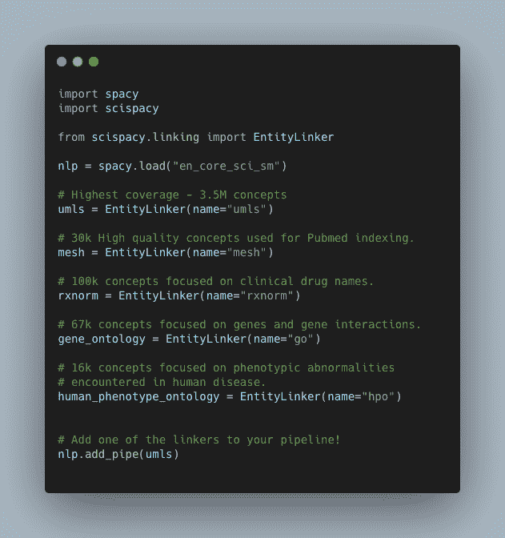
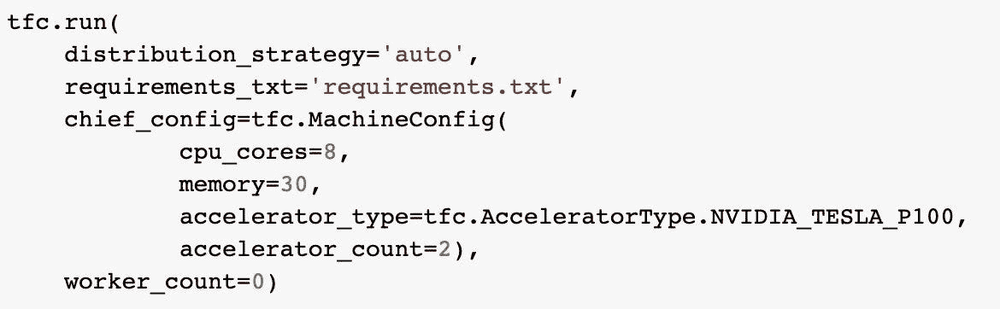
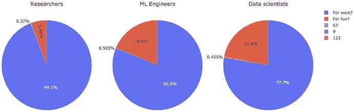
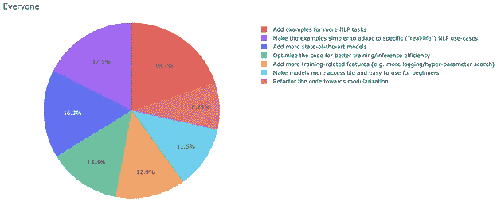

# NLP 新闻密码| 07.12.20

> 原文：<https://pub.towardsai.net/nlp-news-cypher-07-12-20-fdede056694d?source=collection_archive---------4----------------------->

劳拉·科尔奎特在 [Unsplash](https://unsplash.com?utm_source=medium&utm_medium=referral) 上的照片

## 自然语言处理每周时事通讯

## 负鬼骑士，花样满满

让我们开始我们的詹姆斯·邦德狂欢吧，好吗？🕵️‍♀️

世界各地的国防部门都在押注人工智能能够提供下一代先进的军事技术，美国也不例外。在美国，这一战略是由联合人工智能中心(JAIC)精心策划的，该中心是国防部(DoD)下属的一个部门，由代理主任 Nand Mulchandani 领导。他最近举行了他的第一次记者招待会。好消息是…

自然语言处理将在未来的 JAIC 战略中发挥更大的作用🔥。他们正在开发自己的虚拟助手，名为“火力支援认知助手”(想想爱国者导弹的 Siri)，这是一款对来电通信进行分类的软件，如呼叫炮兵或空中支援。🧐

这可能会让许多人感到惊讶，因为当我们想到国家安全和人工智能时，很难不想到 T-1000 天网机器人抢劫当地的 7-11 便利店，但在现实中，至少从他们告诉我们的情况来看，NLP 将是他们人工智能投资的重要参与者！

我带着[糟糕的 NLP 数据库](http://datasets.quantumstat.com)走进五角大楼:

解密的

哦，还有 ACL 发生了。以下是会议上提交的最佳论文列表:

 [## ACL 2020 最佳论文奖

### 祝贺 ACL 2020 最佳论文奖的获得者！超越准确性:自然语言处理的行为测试…

acl2020.org](https://acl2020.org/blog/ACL-2020-best-papers/) 

## 最佳论文

超越准确性:使用检查表对自然语言处理模型进行行为测试里贝罗，吴同双，Carlos Guestrin 和 same er Singh[https://aclweb.org/anthology/2020.acl-main.442/…](https://t.co/sffBQYoeZR?amp=1)

## 另外:

在上周的时事通讯之前，几个科技集团透露了他们的论文列表，所以如果你有兴趣了解一下:

 [## 斯坦福人工智能实验室论文和在 ACL 2020 的演讲

### 计算语言学协会第 58 届年会将于本周举行。我们是…

ai.stanford.edu](http://ai.stanford.edu/blog/acl-2020/)  [## ACL 2020 的 Salesforce 研究

### 第 58 届计算语言学协会(ACL)会议于本周召开，从 7 月 5 日(星期日)持续到…

博客.爱因斯坦. ai](https://blog.einstein.ai/salesforce-research-at-acl-2020/)  [## ACL 2020 上的谷歌

### 本周，计算语言学协会(ACL 2020)第 58 届年会，一个重要的会议…

ai.googleblog.com](https://ai.googleblog.com/2020/07/google-at-acl-2020.html) 

仅供参考，Google 用于表解析的 TAPAS 模型将包含在我们即将发布的 [Super Duper NLP Repo](http://notebooks.quantumstat.com) 更新中。🔥🔥

# 本周:

> ACL 中的知识图
> 
> 脸书巨大的 ASR 模型
> 
> 在 CPU 部署中扩展 BERT
> 
> 科学更新
> 
> 到云，只需一行代码
> 
> 艾调查，这次是从抱抱脸开始的
> 
> 本周数据集:语义学者开放研究语料库

# ACL 中的知识图

从 ACL 一路走来，Galkin 不得不提醒我们他的知识图研究是不朽的。使用自然语言而不是表格的研究，改编知识图表的变压器越来越受欢迎:

这是目录:

*   [结构化数据问答](https://towardsdatascience.com/knowledge-graphs-in-natural-language-processing-acl-2020-ebb1f0a6e0b1#1e21)
*   [KG 嵌入:双曲线和超关系](https://towardsdatascience.com/knowledge-graphs-in-natural-language-processing-acl-2020-ebb1f0a6e0b1#ce67)
*   [数据转文本 NLG:准备好你的变压器](https://towardsdatascience.com/knowledge-graphs-in-natural-language-processing-acl-2020-ebb1f0a6e0b1#3bf6)
*   [对话式人工智能:改进面向目标的机器人](https://towardsdatascience.com/knowledge-graphs-in-natural-language-processing-acl-2020-ebb1f0a6e0b1#b183)
*   [信息提取:OpenIE 和链接预测](https://towardsdatascience.com/knowledge-graphs-in-natural-language-processing-acl-2020-ebb1f0a6e0b1#c012)
*   [结论](https://towardsdatascience.com/knowledge-graphs-in-natural-language-processing-acl-2020-ebb1f0a6e0b1#cf78)

 [## 自然语言处理中的知识图@ ACL 2020

### 这篇文章是为了纪念我们研究 NLP 和 Graph ML 进展的系列文章发表一周年。

medium.com](https://medium.com/@mgalkin/knowledge-graphs-in-natural-language-processing-acl-2020-ebb1f0a6e0b1) 

# 脸书巨大的 ASR 模型

训练多语言语音识别模型对于提高低资源语言的范围和生产中模型的可扩展性是重要的。在脸书最近的研究中，他们评估了在 51 种语言上训练的 10 亿个参数模型，显示了在训练时间和减少单词错误率方面的有效结果(WER)。

> 该模型将高资源语言的 WER 平均提高了 9.1%，中等资源语言提高了 12.44%，低资源语言提高了 28.76%

**论文**:

# 在 CPU 部署中扩展 BERT

这是一篇关于如何利用 CPU 为变压器供电来改善生产中的延迟/吞吐量的精彩文章。TL；DR:优化归结为使用 BERT 的精华版本，量化，缓存最频繁的响应和水平缩放。

**博客:**

 [## 我们如何扩展 Bert 以满足 CPU 上超过 10 亿次的日常请求

### 对于数据科学家和机器学习工程师来说，这是一个经典的先有鸡还是先有蛋的问题:当开发一个新的…

medium.com](https://medium.com/roblox-tech-blog/how-we-scaled-bert-to-serve-1-billion-daily-requests-on-cpus-d99be090db26) 

# 科学更新

对于那些在科学领域的人，SpaCy 的堂兄 Scispacy 发布了一个更新，包括:4 个新的实体链接器和知识库，用于医学主题词(MeSH)、RxNorm、基因本体论和人类表型本体论。

**GitHub:**

 [## 过敏/过敏

### 该存储库包含与使用科学文档空间相关的自定义管道和模型。特别是，在那里…

github.com](https://github.com/allenai/scispacy) 

**演示:**

 [## 细流

### 编辑描述

scispacy.apps.allenai.org](https://scispacy.apps.allenai.org/) 

既然我们谈到了空间这个话题…

## 每周实验室:

SpaCy 库的闪电之旅，包含各种 NLP 任务的优秀代码块的快速片段:

 [## 谷歌联合实验室

### 编辑描述

colab.research.google.com](https://colab.research.google.com/github/explosion/spacy-notebooks/blob/master/notebooks/lightning_tour.ipynb) 

# 到云，只需一行代码

想要在云中运行您的 Keras 模型，但不想重写所有内容？现在，您可以通过简单地添加一行代码，将您的模型从开发转移到云中。为此，您需要使用 TensorFlow Cloud(下面的 GitHub)。

很酷的东西，它也可以在 Colab 上工作🔥🔥。乔莱先生的好意。

 [## 张量流/云

### TensorFlow 云存储库提供的 API 将允许您轻松地从调试和训练您的 Keras 和…

github.com](https://github.com/tensorflow/cloud) 

# 艾调查，这次是从抱抱脸开始的

拥抱脸调查了开发社区关于他们的图书馆。结果显示，大多数人把它用于工作而不是娱乐:

解密

## 他们希望优先考虑什么？

他们想要更多真实世界的例子。

解密的

**疯狂统计:** *三分之一的受访者使用该图书馆不到 3 个月！*

**全部调查结果:**

 [## 变形金刚巨大的社区反馈

### 上周，我们分享了第一个反馈请求🤗变形金刚。社区非常惊人地参与了…

discuss.huggingface.co](https://discuss.huggingface.co/t/transformers-huge-community-feedback/120) 

# 本周数据集:S2ORC:语义学者开放研究语料库

## 这是什么？

数据集是 8110 万篇英文学术论文的大型语料库，涵盖了许多学术学科。该语料库包含丰富的元数据、论文摘要、解析的参考文献，以及 810 万篇开放存取论文的结构化全文。

## 它在哪里？

 [## allenai/s2orc

### S2ORC 是一个通用语料库，用于自然语言处理和科学论文的文本挖掘研究。我们策划了一个统一的…

github.com](https://github.com/allenai/s2orc/) 

> *每周日，我们都会对来自全球研究人员的 NLP 新闻和代码进行一次每周综述。*
> 
> *如果您喜欢这篇文章，请帮助我们并与朋友分享！*
> 
> *完整报道，关注我们的推特:*[*@ Quantum _ Stat*](http://twitter.com/Quantum_Stat)

[www.quantumstat.com](http://www.quantumstat.com/)