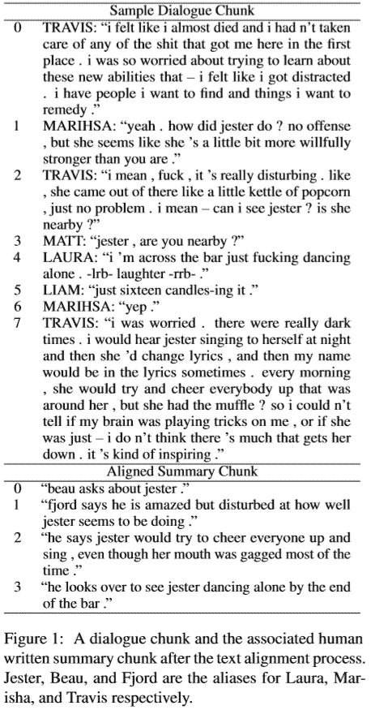

# NLP 新闻密码| 07.19.20

> 原文：<https://pub.towardsai.net/nlp-news-cypher-07-19-20-75c1a3f7f57b?source=collection_archive---------3----------------------->

穆罕默德·阿里扎德在 [Unsplash](https://unsplash.com?utm_source=medium&utm_medium=referral) 上的照片

## 自然语言处理每周时事通讯

## 模块性

Twitter 的帮助台度过了富有成效的一周。生产力如何？👇

非常多产

如果你错过了，名人的推特账户在一个比特币庞氏骗局中被黑。随着 Twitter 和 co .争相灭火，他们停用了所有蓝色支票账户。矩阵中的一个小故障！

几天后，选定的 Cloudflare 服务器陷入黑暗，因为他们将插件服务🧐(sorry 不和谐归咎于糟糕的路由。退一步说，科技股度过了艰难的一周。

但这并没有阻止我随机浏览暗网，以了解更多关于最近黑客攻击的信息。我什么也没找到！耶！然而，我确实发现美国特勤局从数字货币交易所比特币基地购买了一份为期 4 年的加密软件合同。是的，它甚至出现在美国政府的公开文件中:

 [## 贝塔。SAM.gov

### 编辑描述

beta.sam.gov](https://beta.sam.gov/awards/90905932%2BAWARD#general-information) 

这有什么关系？根据 Benzinga 的说法，“比特币基地还收集私人用户数据，作为其平台反洗钱要求的一部分。”🙈

还有，ICML 发生了！这里有一些很棒的论文:

 [## 2020 年 ICML 斯坦福人工智能实验室论文和演讲

### 2020 年机器学习国际会议(ICML)将于 7 月 13 日至 7 月 18 日举行…

ai.stanford.edu](http://ai.stanford.edu/blog/icml-2020/) 

亮点:[根据诊断反馈进行基于图形的自我监督程序修复](https://arxiv.org/pdf/2005.10636.pdf)

 [## 谷歌在 ICML 2020

### 机器学习是谷歌的一个关键战略重点，高度活跃的团队几乎在所有领域都开展研究

ai.googleblog.com](https://ai.googleblog.com/2020/07/google-at-icml-2020.html) 

亮点:[领域:检索-增强语言模型预训练](https://arxiv.org/pdf/2002.08909.pdf)

 [## 卡耐基梅隆大学 ICML 分校 2020

### 卡耐基梅隆大学很荣幸在第 37 届机器学习国际会议(ICML)上提交 44 篇论文

blog.ml.cmu.edu](https://blog.ml.cmu.edu/2020/07/13/carnegie-mellon-university-at-icml-2020/) 

亮点: [XTREME:一个用于评估跨语言泛化的大型多语言多任务基准](https://arxiv.org/pdf/2003.11080.pdf)

 [## ICML 2020 的脸书研究

### 来自世界各地的机器学习专家正在为 2020 年国际机器大会虚拟地聚集在一起…

ai.facebook.com](https://ai.facebook.com/blog/facebook-research-at-icml-2020/) 

亮点:[非自回归机器翻译的对齐交叉熵](https://arxiv.org/pdf/2004.01655.pdf)

研讨会亮点:强化学习中的语言:

 [## 拉雷尔 2020

### 语言是人类最令人印象深刻的成就之一，被认为是我们学习能力的核心…

larel-ws.github.io](https://larel-ws.github.io/) 

[荣誉奖](https://grlplus.github.io/papers/)

⚡ **超级骗子 NLP 回购** ⚡

仅供参考:又增加了 52 台笔记本电脑，使我们的 NLP Colabs 总数达到 233 台。感谢您的贡献:Manu Romero、Abhishek Mishra、Nikhil Narayan、Oleksii Trekhleb、Chris Tran、Prasanna Kumar 和 Cristiano De Nobili。

 [## 超级骗子 NLP 回购

### 适用于 NLP 中各种任务的 Colab 笔记本

notebooks.quantumstat.com](https://notebooks.quantumstat.com) 

# 本周

> 适配器、适配器集线器和模块化(带有绝密采访)
> 
> GPT-3 余波
> 
> 使用简单变压器的超参数优化
> 
> 机器学习原型的用户界面
> 
> 可视化:设置为眩晕
> 
> 基于图的深度学习报告
> 
> 开放域对话式人工智能
> 
> 本周数据集:关键角色龙与地下城数据集(CRD3)

# 适配器、适配器 Hub 和模块化

偶尔会有一些很酷的事情发生，在过去的一周里，AdapterHub 框架被弃用了。在 NLP 迁移学习的下一个发展中，适配器提供了一个新的(更模块化的)架构。

[研究论文](https://arxiv.org/pdf/2007.07779.pdf)(易读)| [Github](https://github.com/Adapter-Hub/adapter-transformers)

**轮毂:**

 [## 适配器 Hub - 175 适配器，适用于 21 种文本任务和 32 种语言

### 从我们的存储库中加载现有的适配器就像增加一行代码一样简单:model =…

adapterhub.ml](https://adapterhub.ml/) 

哦，我们假设你们大多数人会说“WTF 是适配器？!"因此，我们非常兴奋地与 AdapterHub 的作者 Jonas Pfeiffer 交谈，让我们了解适配器及其框架的所有方面:👇

😎

1.  **嗨，Jonas，祝贺你的新的和令人敬畏的框架适配器 Hub！对于那些在循环之外的人，你将如何简单地描述适配器？**

适配器是封装在转换器模型的每一层中的小型模块化单元，它学习存储特定于任务或语言的信息。这是通过训练*仅*新引入的适配器权重，同时保持预训练模型的其余部分固定来实现的。关于适配器最吸引人的概念是它们的模块化，这为组合来自许多适配器的知识提供了许多可能性，这些适配器接受了多种任务的训练。为了使训练适配器和随后尽可能容易地共享它们，我们提出了 AdapterHub 框架。

2.**与预训练模型的传统微调相比，适配器有哪些优势？**

“对于工业界的 NLP 工程师和研究人员来说，都有许多优势。对于从业者来说，最有趣的概念可能是适配器的小存储空间。**适配器仅需要 3.5Mb(在所有任务中共享> 99%的参数)，并且仍能实现一流的性能。这意味着，为了在一个设备上存储 125 个适配器型号，您需要多达 2 个完全微调的 BERT 型号的空间。**适配器提供的最大优势是它们的模块化。通过冻结预先训练的模型权重，传统的多任务学习问题如任务间的灾难性遗忘和灾难性干扰不再存在。因此，适配器可以针对各种任务进行单独训练，随后进行组合或堆叠，以组合存储在其中的信息。”

3.**在训练适配器时，其训练时间与传统微调相比如何？**

“到目前为止，我们已经观察到训练适配器通常比完全微调更快。对于一些设置，我们可以看到执行一个训练步骤所需的时间提高了 30%。这是因为我们不需要对整个模型(如 BERT 嵌入矩阵)进行反向传递，也是因为 PyTorch 优化策略。不幸的是，对于较小的数据集，由于随机权重初始化，适配器需要比完全微调更多的步骤。我们认为效率是与许多实际应用相关的重要属性。这就是为什么我们目前正在更大范围内调查不同架构的计算效率，包括几个训练和推理场景。”

4.**您已经为社区创建了 AdapterHub 来查找、培训和/或使用适配器；在哪里可以找到更多关于如何提供帮助的信息？**

“适配器最近才推出，所以研究领域相当新。我们试图在与 AdapterHub 框架一起发布的论文中总结我们对适配器的看法。对我们来说，AdapterHub 是一个长期项目，我们希望 NLP 社区能够利用它来开发新的研究方向，以适配器及其惊人的模块化功能为基础。”

5.**你认为适配器是 NLP 迁移学习的下一个重要步骤吗？**

“跨任务共享信息在机器学习中有着悠久的历史，其中多任务学习可以说受到了最多的关注，伴随着许多问题。通过首先将存储的信息封装在冻结的参数中，然后将其组合起来，我们能够缓解其中的一些问题。知识组件的模块化可以随时随意组合，这是非常可取和有效的。因此，从我的角度来看，适配器是迁移学习的一个非常重要和有前途的方向，我坚信它们有能力加快这一领域的研究。”

*鳍*👀

从乔纳斯的回答中可以看出，这是迁移学习和模型架构的显著进步。AdapterHub 框架建立在 Hugging Face 库的基础上，只需要 1-2 行代码(在您习惯于 Transformers 库中的常用代码之上)就可以初始化一个适配器。

为了展示入门(使用推理)是多么容易，我们创建了一个 Colab，其中 BERT 与 SST-2 适配器(二进制情感分析)堆叠在一起。试一试吧，别忘了检查 AdapterHub 并训练那些适配器！感谢乔纳斯的精彩介绍！

## 本周可乐🤟

 [## 谷歌联合实验室

### 编辑描述

colab.research.google.com](https://colab.research.google.com/drive/1iEymIGmkX9_EjirgQpcKoVc-0wuv-DXN?usp=sharing) 

# GPT-3 余波

GPT 3 号本周收到了很多反馈。在他的博客上，Max Woolf 评论了 GPT-3 令人印象深刻的能力和语言模型的不足之处。

**TL；博士:**

*   黑盒问题依然存在。
*   模型很慢。
*   模型输出仍然需要精选，但要比 GPT-2 更好。
*   输出不灵敏仍然是个问题。

**博客:**

 [## 降低对 GPT-3 和 open ai API 的期望

### 5 月 29 日，OpenAI 发布了一篇关于 GPT-3 的论文，这是他们基于变形金刚的文本生成神经系统的下一次迭代

minimaxir.com](https://minimaxir.com/2020/07/gpt3-expectations/) 

值得一提的是，约夫·戈德堡与 GPT 3 号的互动也值得在他的推特上查看:[https://twitter.com/yoavgo](https://twitter.com/yoavgo)

# 使用简单变压器的超参数优化

Thilina Rajapakse 是 Simple Transformers library 的作者，她在[识别文本蕴涵(RTE)](https://aclweb.org/aclwiki/Recognizing_Textual_Entailment) 任务中探索了超参数优化。一个直观的一步一步的指南(包括代码)，此外还有集成在他的库中的来自 W & B Sweeps 的可视化。

 [## 最佳变压器模型的超参数优化

### 如何使用简单的转换器调整超参数，以实现更好的自然语言处理。

towardsdatascience.com](https://towardsdatascience.com/hyperparameter-optimization-for-optimum-transformer-models-b95a32b70949) 

# 机器学习原型的用户界面

想要添加一个快速 UI 来可视化您的 transformer 模型吗？向格拉迪奥问好。该库包括 Colab/Jupyter 支持，因此您可以将您的推断从 Colab 直接传输到浏览器。它包括 TensorFlow 和 PyTorch 支持，可以用于 CV 和 NLP 演示。

仅供参考，2 Gradio 笔记本包含在最新更新的 [Super Duper NLP Repo](https://notebooks.quantumstat.com) 中！前往那里(或[这里](https://www.gradio.app/))快速体验它的功能。

 [## gradio-app/gradio

### 围绕 TensorFlow 或 PyTorch 模型，甚至任意 Python 函数，快速创建可定制的 UI 组件…

github.com](https://github.com/gradio-app/gradio) 

**论文**:

[链接](https://arxiv.org/pdf/1906.02569v1.pdf)

# 可视化:设置为眩晕

一个新的 python 可视化库问世了。光学效果令人印象深刻。如果你想走出 matplotlib 书呆子的世界，看看它令人惊叹的视觉效果。

*绘制一个简单的文本可视化只需要 10 行代码:*

1.  *第 3 行导入 matplotlib，复用和可视化样式；*
2.  *第 3 行设置可视化对象，加载数据，设置样式；*
3.  *4 行绘制和显示可视化，包括标题和题注。*

 [## Nicholas mamo/复合图

### 可视化应该讲述一个故事，并以一种美丽的方式讲述。Multiplex 是 Python 的可视化库…

github.com](https://github.com/NicholasMamo/multiplex-plot) 

# 基于图的深度学习报告

如果你想了解图表和深度学习的内幕，这是一个很方便的资源。本报告包含按年份和会议索引的研究文献/调查综述。👀

 [## nagan Andy/基于图形的深度学习文献

### 该存储库包含基于图形的深度学习中的链接。会议出版物的链接排列在…

github.com](https://github.com/naganandy/graph-based-deep-learning-literature) 

# 开放域对话式人工智能

脸书人工智能，其 ParlAI 库在开放域对话代理方面是世界一流的(还记得 Blender)。他们发布了一个说明性的概述，介绍了如何构建优秀的对话代理、当前的研究和未来的方向。

[链接](https://arxiv.org/pdf/2006.12442.pdf)

# 本周数据集:关键角色龙与地下城数据集(CRD3)

## 这是什么？

数据集从转录成文本对话的 159 个关键角色 DD 片段中收集，包括 398，682 个话轮。它还包括从 Fandom wiki 收集的相应抽象摘要。

## 样品

## 它在哪里？

 [## RevanthRameshkumar/CRD3

### 本文描述了关键角色龙与地下城数据集(CRD3)和相关分析。关键角色是一个…

github.com](https://github.com/RevanthRameshkumar/CRD3) 

> *每周日，我们都会对来自世界各地研究人员的 NLP 新闻和代码进行一次每周综述。*
> 
> 如果您喜欢这篇文章，请帮助我们并与朋友分享！
> 
> *如需完整报道，请关注我们的推特:*[*@ Quantum _ Stat*](http://twitter.com/Quantum_Stat)

[www.quantumstat.com](http://www.quantumstat.com/)