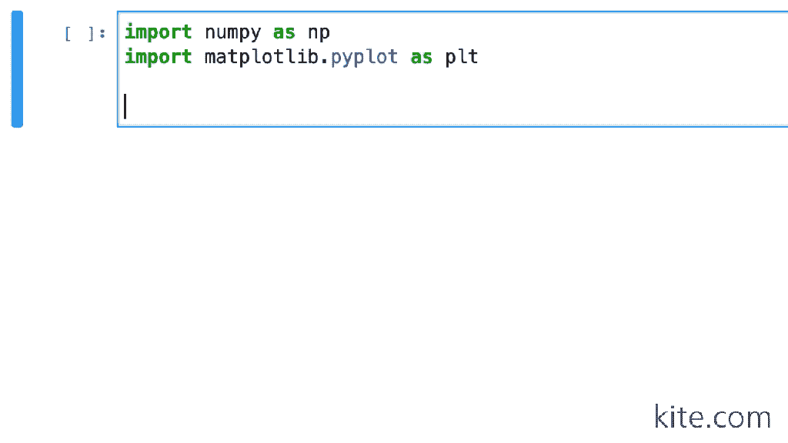
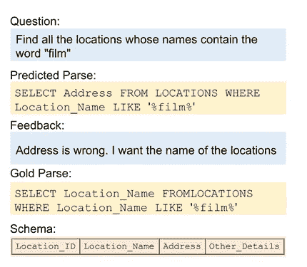

# NLP 新闻密码| 08.09.20

> 原文：<https://pub.towardsai.net/nlp-news-cypher-08-09-20-366ccffc3c83?source=collection_archive---------2----------------------->


库纳尔·辛德在 [Unsplash](https://unsplash.com?utm_source=medium&utm_medium=referral) 上拍摄的照片

## 自然语言处理每周时事通讯

## 伪造

我们到了吗？NLP 是什么状态？我们到了我们想去的地方了吗？GPT-3 炒作很酷，但需要微调，以接近生产就绪。那些图表在哪里？下游任务在企业中是如何使用的？稀疏网络呢？为什么那么多 AI 项目失败？深度学习和语义解析，我们还关心信息提取吗？变形金刚是圣杯吗？莱克斯·弗里德曼(和他的深色西装)在哪里？那些常识推理演示在哪里？

那么…我们在哪里…

埃隆？

做大，进入国家安全局…从这里开始👇

[](https://cryptohack.org/) [## CryptoHack - Home

### 一个有趣的平台，通过解决挑战和破解不安全的代码来学习密码学。你能到达顶端吗…

cryptohack.org](https://cryptohack.org/) 

NLP 索引的索引:

[](https://github.com/ivan-bilan/The-NLP-Pandect) [## 伊凡-比兰/The-NLP-总论

### 这本百科全书(πανδέκτης在古希腊语中是百科全书的意思)旨在帮助你找到几乎所有与……相关的东西

github.com](https://github.com/ivan-bilan/The-NLP-Pandect) 

# 本周

> 欢乐变形金刚
> 
> 超越英语的 NLP
> 
> 节更新
> 
> PyKEEN:知识图嵌入库
> 
> 大鸟
> 
> ONNXT5
> 
> 风筝自动完成
> 
> 本周数据集:SPLASH

# 欢乐变形金刚

DeLighT transformer 库让我们对 NLP 中最流行的模型——transformer 有了新的认识。新的架构除了使模型更深入之外，还有助于减少参数大小。这意味着这种新的架构可以与传统的变压器架构相匹配或实现更好的结果，但要轻得多。目前，该架构可以帮助语言建模和机器翻译。据作者称，更多的任务正在进行中。

**论文**:[https://arxiv.org/pdf/2008.00623v1.pdf](https://arxiv.org/pdf/2008.00623v1.pdf)

**GitHub** :

[](https://github.com/sacmehta/delight) [## sacmehta/delight

### 这个库包含了我们构建高效序列模型的源代码:定义(ICLR 20)和…

github.com](https://github.com/sacmehta/delight) 

# 超越英语的 NLP

Sebastian Ruder 对 NLP 的状态发表了意见，特别是，我们对低资源语言的限制是我们应该关注的一个更大的问题。他的博客文章讨论了缺乏这些数据集从社会到认知障碍的不同影响领域。以下是博客中关于你能做些什么的要点。

## 你能做什么

**"数据集**如果你创建一个新的数据集，保留一半的注释预算，用于用另一种语言创建相同大小的数据集。

**评估**如果你对某个特定的任务感兴趣，可以考虑用不同的语言在相同的任务上评估你的模型。对于一些任务的概述，请参见 [NLP 进度](http://nlpprogress.com/)或我们的 [XTREME 基准](https://sites.research.google/xtreme)。

**本德法则** [陈述你正在使用的语言](https://thegradient.pub/the-benderrule-on-naming-the-languages-we-study-and-why-it-matters/)。

**假设**明确了你的模型使用的信号和它做出的假设。考虑哪些是你正在学习的语言特有的，哪些可能更普遍。

**语言多样性**估计你正在学习的语言样本的语言多样性( [Ponti et al .，2020](https://arxiv.org/abs/2005.00333) )。

研究解决低资源语言挑战的方法。在下一篇帖子中，我将概述多语言 NLP 中有趣的研究方向和机会。"

**博客**:

[](https://ruder.io/nlp-beyond-english/) [## 为什么你应该做超越英语的自然语言处理

### 自然语言处理(NLP)研究主要集中在开发适用于英语的方法上

ruder.io](https://ruder.io/nlp-beyond-english/) 

# 节更新

斯坦福大学的 Stanza 更新了其图书馆，增加了对医学/临床领域的支持，包括:

1.  生物管道和 NER 模型，专门处理生物医学文献文本；
2.  专门处理临床文本的临床管道和 NER 模型。

演示:[http://stanza.run/bio](http://stanza.run/bio)

# PyKEEN:知识图嵌入库

这个新的图形库包含了模型和数据集。它附带了一个方便的管道 API，真正简化了模型和数据集的初始化。目前有 13 个数据集和 23 个模型可供使用。

这里有一个简单的例子:

```
from pykeen.pipeline import pipeline
result = pipeline(
    model='TransE',
    dataset='nations',
)
```

**GitHub** :

[](https://github.com/pykeen/pykeen?utm_campaign=Graph%20Machine%20Learning%20News&utm_medium=email&utm_source=Revue%20newsletter) [## 皮肯/皮肯

### py keen(Python Knowl Edge embedding in GS)是一个 Python 包，旨在训练和评估知识图嵌入…

github.com](https://github.com/pykeen/pykeen?utm_campaign=Graph%20Machine%20Learning%20News&utm_medium=email&utm_source=Revue%20newsletter) 

**论文**:[https://arxiv.org/pdf/2007.14175.pdf](https://arxiv.org/pdf/2007.14175.pdf)

# 大鸟

我们都知道伯特 512 令牌限制的硬停。而这种烦恼正是大鸟被创造出来的主要原因之一。

这种新设计有助于将性能“扩展到标准硬件(16GB 内存)上更长的序列长度(8 倍)以适应大尺寸型号。”🧐

BigBird 的酷之处在于，它利用了一个稀疏注意力框架，可以用更少的资源做更多的事情。也就是说，它的内存开销更少(即使与其他长上下文模型如 Longformer 相比也是如此)。

本文展示了它在仅有编码器和编码器-解码器两种情况下的性能。

在性能方面，它提供了问答和长文档摘要方面的 SOTA。

[链接](https://arxiv.org/pdf/2007.14062.pdf)

# ONNXT5

有人帮助用 ONNX 桥接 T5 模型(为了推理加速)😎。只要保持相对较短的上下文长度(大约在<500 words).

**GitHub** 左右)，你可以获得比 PyTorch 快 4 倍的速度提升:

[](https://github.com/abelriboulot/onnxt5) [## abelriboulot/onnxt5

### 使用在 ONNX 中实现的 T5 版本，以极快的速度进行摘要、翻译、问答、文本生成等操作。这个…

github.com](https://github.com/abelriboulot/onnxt5) 

# 风筝自动完成

对于所有的 Jupyter 笔记本爱好者，风筝代码自动完成现在得到支持！

[](https://venturebeat.com/2020/08/04/kite-brings-its-ai-powered-code-completions-to-jupyter-notebooks/) [## Kite 将其人工智能驱动的代码完成功能引入 Jupyter 笔记本电脑

### 为开发者实时提供代码片段建议的 Kite，今天首次与 JupyterLab 和 support……

venturebeat.com](https://venturebeat.com/2020/08/04/kite-brings-its-ai-powered-code-completions-to-jupyter-notebooks/) 

解密的

# 本周数据集:SPLASH

**什么事？**

SPLASH 是一个数据集，用于带有自然语言反馈的语义解析校正任务。

**行动中的任务**



**在哪里？**

(数据集/代码还没掉，注意)

[](https://github.com/MSR-LIT/Splash) [## MSR-点燃/飞溅

### SPLASH 是用于带有自然语言反馈的语义解析校正任务的数据集。任务、数据集以及…

github.com](https://github.com/MSR-LIT/Splash) 

> *每周日，我们都会对来自全球研究人员的 NLP 新闻和代码进行一次每周综述。*
> 
> *如果您喜欢这篇文章，请帮助我们并与朋友分享！*
> 
> *完整报道，关注我们的推特:*[*@ Quantum _ Stat*](http://twitter.com/Quantum_Stat)


[www.quantumstat.com](http://www.quantumstat.com/)