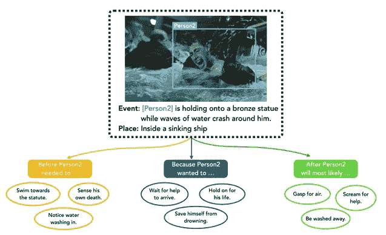

# NLP 新闻密码| 09.06.20

> 原文：<https://pub.towardsai.net/nlp-news-cypher-09-06-20-bfa8bb4a07b5?source=collection_archive---------1----------------------->


伊万·艾瓦佐夫斯基—伊斯坦布尔

## 自然语言处理每周时事通讯

## 复兴

欢迎回来，又是怎样的一周？！？！是时候和夏天说再见了。😱哦，请不要忘记给这一页👏👏如果你喜欢阅读！😎

更新:我们增加了 20+ [数据集](https://datasets.quantumstat.com)和 10+ [笔记本](https://notebooks.quantumstat.com)。(从现在开始将进行这些每周更新)。此外，我们优化了数据库的性能，以防您需要从 10 万英尺的高度查看我们的数据。在空气中。


哦，如果你错过了埃隆的人工智能大脑芯片会议，这里是亮点:

**<随机黑客素材>** : dark.fail 索引黑暗(潮湿)网络。他们有一个推特 account🧐。他们会更新 Tor 土地上发生的事情。如果你不像一个好公民那样经常去黑暗网站，你可能不知道洋葱网站经常关闭。通常来自 DDoS 攻击。因此，管理员主要关心的是尽可能保持这些网站的正常运行，这里有一些源代码，可以防止你紧张过度:

> 附:它配有有史以来最恐怖的推特图片卡…

# 本周

> 深度翻译器
> 
> 量化你的模型
> 
> 生物医学自然语言处理
> 
> QuestGen 库
> 
> 图形神经网络
> 
> 使用 AllenNLP 库训练多个 GPU
> 
> 安伯——字节跳动的语言模式
> 
> 软件更新
> 
> 本周数据集:视觉常识图

# 深度翻译器

一个整洁的翻译报告，结合了一些最著名的翻译 API！目前它支持:

*   [谷歌翻译](https://translate.google.com/)
*   [脑桥翻译器](https://de.pons.com/)
*   [语言翻译器](https://www.linguee.com/)
*   [我的记忆翻译器](https://mymemory.translated.net/)
*   [Yandex 翻译器](https://yandex.com/)(版本> = 1.2.1)
*   [QCRI 翻译器](https://mt.qcri.org/api/)(版本> = 1.2.4)
*   DeepL 翻译器(版本> = 1.2.5)

**GitHub** :

[](https://github.com/nidhaloff/deep_translator) [## nidhaloff/deep_translator

### 一个灵活的免费和无限制的工具，以简单的方式使用多个翻译器在不同语言之间进行翻译…

github.com](https://github.com/nidhaloff/deep_translator) 

# 量化你的模型

ONNX 对变形金刚库的运行时支持现在可以合并量化了！在最近的一篇博客文章中，李玉峰讨论了这种压缩技术，以及在生产中减少模型的延迟有多棒！！量化你的模型只需要你添加一个新的参数到他们的脚本中:

> 这将会给你完整的精度和量化的模型…

```
python convert_graph_to_onnx.py --framework pt --model bert-base-uncased --quantize bert-base-uncased.onnx
```

> 附注:大于 2gb 的型号目前不支持量化，但据作者称，很快就会支持… *😎*

**博客**:

[](https://medium.com/microsoftazure/faster-and-smaller-quantized-nlp-with-hugging-face-and-onnx-runtime-ec5525473bb7) [## 更快更小的量化 NLP，具有拥抱脸和 ONNX 运行时

### 流行的拥抱脸变压器模型(伯特，GPT-2 等)可以缩小和 ONNX 运行时量化加速…

medium.com](https://medium.com/microsoftazure/faster-and-smaller-quantized-nlp-with-hugging-face-and-onnx-runtime-ec5525473bb7) 

## 谈论 ONNX…

Suraj Patil 创建了这个非常棒的回购，它将 ONNX 脚本与拥抱脸管道框架结合在一起。所以你可以调用他们的模型，它已经包含了 onnx 图🔥🔥🔥！！！

```
from onnx_transformers import pipelinenlp = pipeline("sentiment-analysis", onnx=True)👀
nlp("Transformers and onnx runtime is an awesome combo!")
```

**GitHub** :

[](https://github.com/patil-suraj/onnx_transformers) [## Patil-suraj/onnx _ 变压器

### 用于快速推理的加速 NLP 流水线🚀在 CPU 上。建造于🤗变压器和 ONNX 运行时。pip 安装…

github.com](https://github.com/patil-suraj/onnx_transformers) 

# 生物医学自然语言处理

对生物医学自然语言处理的语言模型感兴趣？微软创建了第一个排行榜简介，其中包括他们的 SOTA PubMedBERT 模型和几个生物医学数据集。看看这里👇

[](https://microsoft.github.io/BLURB/leaderboard.html) [## 简介排行榜

### 总分是以任务的宏观平均绩效来计算的。详情可在我们的…

microsoft.github.io](https://microsoft.github.io/BLURB/leaderboard.html) 

**博客**:

[](https://www.microsoft.com/en-us/research/blog/domain-specific-language-model-pretraining-for-biomedical-natural-language-processing/) [## 生物医学自然语言处理领域特定语言模型预训练

### 新冠肺炎强调了全球科学家面临的一个长期问题:我们如何跟上时代的步伐…

www.microsoft.com](https://www.microsoft.com/en-us/research/blog/domain-specific-language-model-pretraining-for-biomedical-natural-language-processing/) 

# QuestGen 库

如果你的任务是从文本中生成问题，请查看 QuestGen AI repo。

**可能的用例**:

*   为数据集生成问题。
*   使用它来创建在线教育材料，向学生提出问题。

> 仅供参考，它使用 T5 模型进行编码/解码。

它目前支持生成以下类型的问题:

```
1\. Multiple Choice Questions (MCQs)

2\. Boolean Questions (Yes/No)

3\. General FAQs

4\. Paraphrasing any Question  

5\. Question Answering.
```

**GitHub** :

[](https://github.com/ramsrigouthamg/Questgen.ai) [## ramsrigouthamg/Questgen.ai

### https://questgen.ai/ quest gen AI 是一个开源的 NLP 库，专注于开发易于使用的问题生成…

github.com](https://github.com/ramsrigouthamg/Questgen.ai) 

# 图形神经网络

这里有一个关于图形神经网络的精彩介绍。

包括第 2 部分中的 colab 笔记本，介绍了 GCN 的消息传递。这可能是最常用的图表类型。

[](https://app.wandb.ai/yashkotadia/gatedgcn-pattern/reports/Part-1-Introduction-to-Graph-Neural-Networks-with-GatedGCN--VmlldzoyMDg4MjA) [## 第 1 部分-用 GatedGCN 介绍图形神经网络

### 图形表示学习是在低维空间中有效地总结图形结构的任务

app.wandb.ai](https://app.wandb.ai/yashkotadia/gatedgcn-pattern/reports/Part-1-Introduction-to-Graph-Neural-Networks-with-GatedGCN--VmlldzoyMDg4MjA) [](https://app.wandb.ai/yashkotadia/benchmarking-gnns/reports/Part-2-Comparing-Message-Passing-Based-GNN-Architectures--VmlldzoyMTk4OTA) [## 第 2 部分-比较基于消息传递的 GNN 体系结构

### 在阅读这份报告之前，我建议读者先看看第 1 部分——带门控的图形神经网络简介…

app.wandb.ai](https://app.wandb.ai/yashkotadia/benchmarking-gnns/reports/Part-2-Comparing-Message-Passing-Based-GNN-Architectures--VmlldzoyMTk4OTA) 

# 使用 AllenNLP 库训练多个 GPU

查看如何用`torch.distributed`实现 AllenNLP 的分布式训练(它为每个 GPU 运行一个单独的 Python 进程，避免 GIL😁).他们的博客文章展示了通过添加以下内容来转换他们的配置文件(用于分布式培训)是多么容易:

```
"distributed": {
  "cuda_devices": [0, 1, 2, 3],
}
```

**博客**:

[](https://medium.com/ai2-blog/tutorial-how-to-train-with-multiple-gpus-in-allennlp-c4d7c17eb6d6) [## 教程:如何在 AllenNLP 中使用多个 GPU 进行训练

### 这是一系列迷你教程的一部分，帮助您了解 AllenNLP 库的各个方面。

medium.com](https://medium.com/ai2-blog/tutorial-how-to-train-with-multiple-gpus-in-allennlp-c4d7c17eb6d6) 

# 安伯——字节跳动的语言模式

随着百老汇的灯光熄灭，抖音(在美国)因国际牛肉而日落，字节跳动(抖音的母公司。)推出了自己的语言模型，名为 AMBERT。它支持细粒度和粗粒度标记化。友好地告别抖音。😏

[链接](https://arxiv.org/pdf/2008.11869.pdf)

# 软件更新

**抱紧脸:**

[](https://github.com/huggingface/transformers/releases) [## 释放拥抱脸/变形金刚

### 来自 PEGASUS 的 Pegasus 模型:用提取的间隔句进行抽象概括的预训练，景清…

github.com](https://github.com/huggingface/transformers/releases) 

**DeepPavlov:**

[](https://deeppavlov.ai/blog/tpost/c7jnplt7xe-it-all-started-with-a-dream) [## 这一切都始于一个梦想

### 在 DeepPavlov，我们有一个梦想。我们的梦想是让人工智能助手改善每个人类的生活。无论我们…

deeppavlov.ai](https://deeppavlov.ai/blog/tpost/c7jnplt7xe-it-all-started-with-a-dream) 

**深度图库(DGL):**

[https://www.dgl.ai/release/2020/08/26/release.html](https://www.dgl.ai/release/2020/08/26/release.html)

## 谈论图表😎：

# 本周数据集:视觉常识图

## **什么事？**

数据集由超过 140 万个视觉常识推理的文本描述组成，这些文本描述仔细注释了 59，000 幅不同的图像，每幅图像都配有之前和之后的短视频摘要。

## **样本:**

[https://homes.cs.washington.edu/~jspark96/visualcomet/](https://homes.cs.washington.edu/~jspark96/visualcomet/)



## **在哪里？**

[](https://github.com/jamespark3922/visual-comet) [## 詹姆斯公园 3922/视觉彗星

### VisualCOMET 的 PyTorch 代码和数据集发布:关于静态图像动态上下文的推理。有关更多信息…

github.com](https://github.com/jamespark3922/visual-comet) 

> *每周日，我们都会对来自世界各地的研究人员的 NLP 新闻和代码进行每周综述。*
> 
> 如果你喜欢这篇文章，请帮助我们并与朋友分享！
> 
> *完整报道，关注我们的推特:*[*@ Quantum _ Stat*](http://twitter.com/Quantum_Stat)


[www.quantumstat.com](http://www.quantumstat.com/)