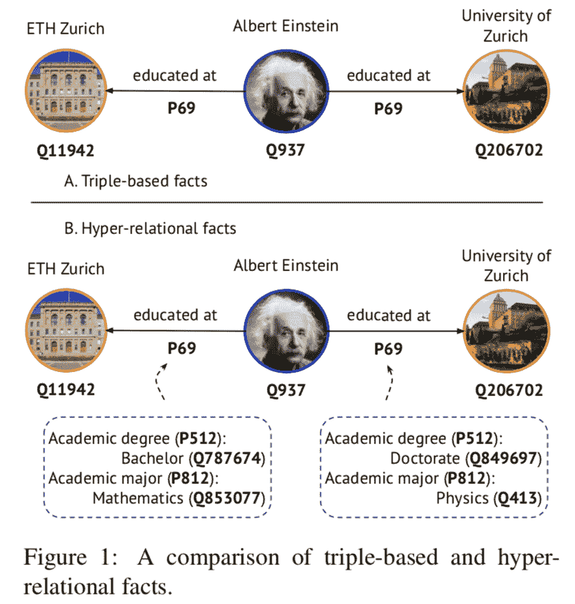
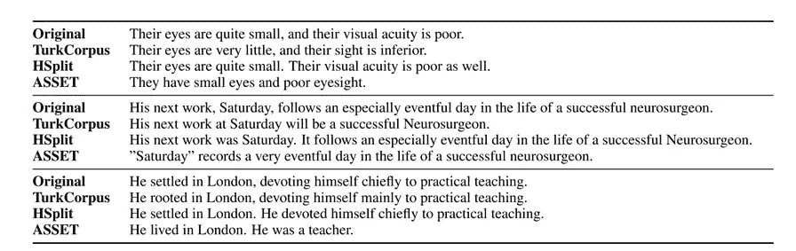

# NLP 新闻密码| 09.20.20

> 原文：<https://pub.towardsai.net/nlp-news-cypher-09-20-20-fbc2aa3637c5?source=collection_archive---------1----------------------->

易卜拉欣·贾巴尔-贝克

## 自然语言处理每周时事通讯

## EMNLP 和图😵

☝波斯艺术是美丽的。欢迎回来参加下一周的赛弗。昨天，我们对[大坏 NLP 数据库](https://datasets.quantumstat.com/)和[超级骗子 NLP 回购](https://notebooks.quantumstat.com/)进行了另一次每周更新。我们增加了 10 个数据集和 6 个新笔记本。这次更新很好，因为我们为图形神经网络增加了 PyTorch 几何笔记本，以防你们都觉得有点冒险。🙈

顺便说一句，如果你喜欢这份简讯，请分享或给它一个👏👏！

**绕道**:我一直在 BERT 问答上做 onnx 运行时推理的实验。目前在“okish”云 CPU 上运行的 ONNX 显著改善了延迟，延迟范围在 170-240 毫秒之间。这是演示:

 [## ONNX 运行时推理|量子统计

### 伯特问题回答

onnx.quantumstat.com](https://onnx.quantumstat.com/) 

仅供参考，几篇 EMNLP 认可的论文本周在 11 月的会议上传阅。在我们开始之前，这里有一份开胃菜，来自论文“**超关系知识图的消息传递**”，它比较了传统知识三元组和超关系图。

大肆宣传

## 使用原力卢克(预印本还没有出来😥)

解密的

## GNN 资源公司

从 Petar veli kovi(deep mind)发现了这个突出顶级图形神经网络资源的线程，请欣赏:

 [## @PetarV_93 写的一个线程

### 按照要求，这里有一些我推荐的不完全的资源，用于开始使用图形神经网络(GNNs)…

线程应用程序](https://threader.app/thread/1306689702020382720) 

## NeurIPS 趣味游戏:

 [## /概述

### 文字游戏:当语言遇到游戏@ NeurIPS 2020。日期和时间:12 月 11 日或 12 日星期六全天研讨会在 Fri 举行

wordplay-workshop.github.io](https://wordplay-workshop.github.io/) 

# 本周

> 对话分级预训练变压器
> 
> TensorFlow Lite 和 NLP
> 
> 印度尼西亚 NLU 基准
> 
> 药典
> 
> 语音预处理的记录
> 
> 对“X-Formers”的调查
> 
> 本周数据集:资产

# 对话分级预训练变压器

另一个在 EMNLP 接受的来自微软研究的问题是:使用变形金刚(GPT-2)来计算对评论的回复是否更有可能获得参与。很有趣吧！他们的对话排名模型是根据来自 Reddit 的 1.33 亿对人类反馈数据进行训练的。

那么它到底是做什么的呢？这是他们演示中的一个例子:对于陈述“我爱 NLP！”*，*如果你回答“这有一本免费的教科书(网址)，以防有人需要。”这比回答“我也是”更有可能被投票支持。(意味着前者将具有更高的排名分数)

此外，他们的 colab 允许您同时运行多个模型，以区分:

`updown`...哪个得票多？

`width`...哪个得到的回复更直接？

`depth`...哪个后续线程更长？

## 本周可乐

*感谢作者高祥的转发，你也可以在✌…超级骗子回购*上找到

 [## 谷歌联合实验室

### 编辑描述

colab.research.google.com](https://colab.research.google.com/drive/1jQXzTYsgdZIQjJKrX4g3CP0_PGCeVU3C?usp=sharing) 

**GitHub:**

 [## golsun/DialogRPT

### 对话响应被否决的可能性有多大👍和/或得到回复💬？这就是 DialogRPT 学会预测的东西。这是…

github.com](https://github.com/golsun/DialogRPT) 

**论文**:[https://arxiv.org/pdf/2009.06978.pdf](https://arxiv.org/pdf/2009.06978.pdf)

# TensorFlow Lite 和 NLP

来自他们上周的博客文章:TF Lite 中现在有关于 NLP 模型的新功能:他们有新的预训练的 NLP 模型，并更好地支持将 TensorFlow NLP 模型转换为 TensorFlow Lite 格式。

 [## TensorFlow Lite 模型生成器

### TensorFlow Lite 模型生成器库简化了使用自定义工具训练 TensorFlow Lite 模型的过程

www.tensorflow.org](https://www.tensorflow.org/lite/guide/model_maker) 

仅供参考，他们的 TF Lite 任务库有 3 个 API 用于:

*   [NLClassifier](https://www.tensorflow.org/lite/inference_with_metadata/task_library/nl_classifier) :将输入文本分类到一组已知的类别中。
*   [BertNLClassifier](https://www.tensorflow.org/lite/inference_with_metadata/task_library/bert_nl_classifier) :对针对 BERT 系列模型优化的文本进行分类。
*   [BERT question answer](https://www.tensorflow.org/lite/inference_with_metadata/task_library/bert_question_answerer):用 BERT-family 模型回答基于给定段落内容的问题。

请记住，这些是在手机上运行的模型(也就是不需要互联网连接到云服务器)。

 [## 面向 NLP 的 TensorFlow Lite 的新增功能

### 2020 年 9 月 16 日-由田林、范以成、钟在成和发布的 TensorFlow Lite 已被广泛…

blog.tensorflow.org](https://blog.tensorflow.org/2020/09/whats-new-in-tensorflow-lite-for-nlp.html) 

# 印度尼西亚 NLU 基准

查看新的印度尼西亚 NLU 基准。它们包括基于 BERT 的模型 IndoBERT 和它的 ALBERT 替代品 IndoBERT-lite。此外，该基准还包括关于单句分类、单句序列标记、句对分类和句对序列标记的 12 个下游任务的数据集。

最后，用于语言建模的大型语料库包含 40 亿个单词(2.5 亿个句子)🔥🔥。

 [## IndoNLU 基准

### IndoNLU benchmark 是一个用于训练、评估和分析自然语言的资源集合。

www.indobenchmark.com](https://www.indobenchmark.com/) 

**论文**:

[链接](https://arxiv.org/pdf/2009.05387.pdf)

# 药典

更多来自 EMNLP😎：

> “CoDEx 提供了三个丰富的知识图数据集，其中包含肯定和否定三元组、实体类型、实体和关系描述以及实体的维基百科页面摘录。”

此外，它们还提供了在 LibKGE 库上使用的预训练模型，用于链接预测和三重分类任务。

总的数据转储大约有 1，156，222 个三元组。

**GitHub** :

 [## tsafavi/codex

### CoDEx 是从维基数据和维基百科中提取的一组知识图完成数据集。如介绍和…

github.com](https://github.com/tsafavi/codex) 

# 语音预处理的记录

RECOApy 是一个新的库，它为 devs 提供了一个 UI，除了字形到音素的转换之外，它还可以帮助记录和按语音转录语音应用程序的数据。目前，该库支持 8 种语言的转录:捷克语，英语，法语，德语，意大利语，波兰语，罗马尼亚语和西班牙语。

**GitHub** :

 [## 阿德里亚娜斯坦/康复

### RECOApy 简化了基于语音的端到端应用中所需的数据记录和预处理步骤…

github.com](https://github.com/adrianastan/recoapy) 

# 对“X-Formers”的调查

被谷歌作者称为“X-Formers”(例如，Longformer 和 Reformer)的新模型架构是 2020 年出现的新的非常高效的内存转换器。在本文中，作者描述了这种体系结构、技术和当前趋势的整体观点。

【https://arxiv.org/pdf/2009.06732.pdf】纸 : [纸](https://arxiv.org/pdf/2009.06732.pdf)

# 本周数据集:资产

# 这是什么？

自动句子简化模型的调整和评估数据集。ASSET 由与 TurkCorpus 的 2359 个原始句子相关联的 23590 个人类简化组成。

# 样本:

# 它在哪里？

 [## Facebook 研究/资产

### ASSET 是一个数据集，用于评估具有多重重写转换的句子简化系统，如所述…

github.com](https://github.com/facebookresearch/asset) 

> *每周日，我们都会对来自世界各地研究人员的 NLP 新闻和代码进行一次每周综述。*
> 
> *如果您喜欢这篇文章，请帮助我们并与朋友分享！*
> 
> *如需完整报道，请关注我们的 Twitter:*[*@ Quantum _ Stat*](http://twitter.com/Quantum_Stat)

[www.quantumstat.com](http://www.quantumstat.com/)