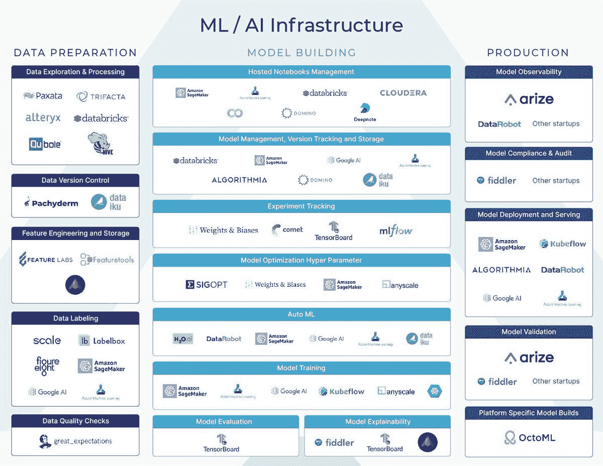
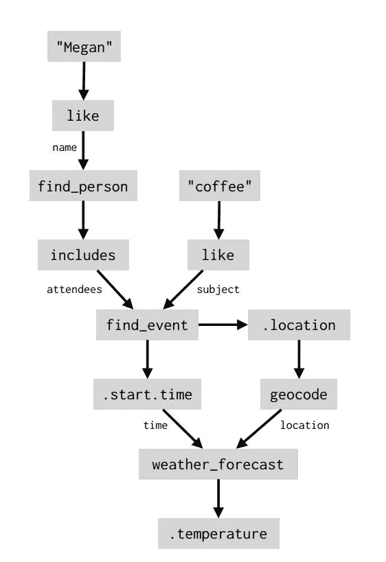
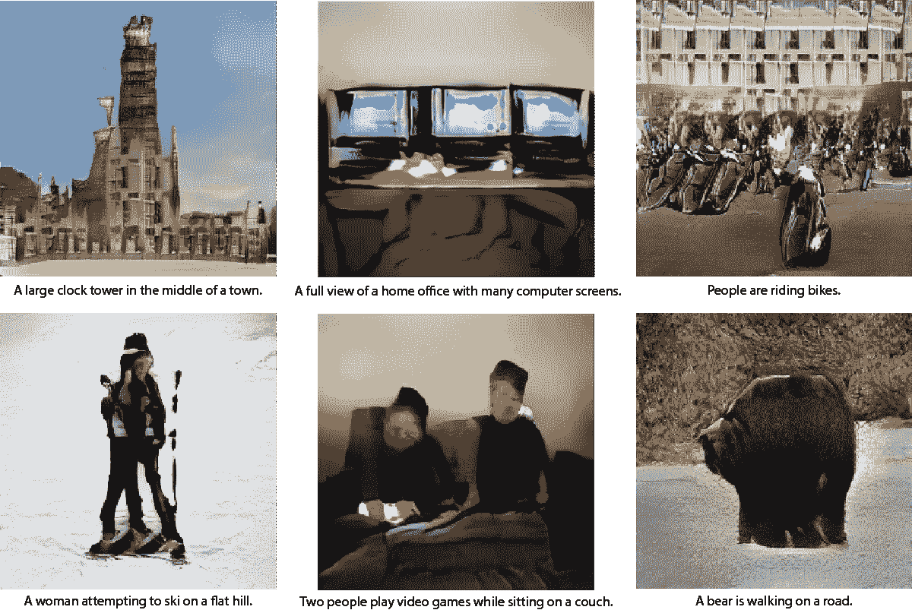

# NLP 新闻密码| 09.27.20

> 原文：<https://pub.towardsai.net/nlp-news-cypher-09-27-20-ef42286d2713?source=collection_archive---------2----------------------->


由 [Unsplash](https://unsplash.com?utm_source=medium&utm_medium=referral) 上的[vini cius Henrique 摄影](https://unsplash.com/@x_vinicius?utm_source=medium&utm_medium=referral)拍摄

## 自然语言处理每周时事通讯

## 传说

嗯…欢迎回来！本周大量的研究结果出炉了！但是，仅供参考，由于篇幅有限，我们无法在这份时事通讯中涵盖所有的故事，所以如果你想要完整的报道，请关注我们的 [twitter](https://twitter.com/Quantum_Stat) ，并且一如既往，如果你喜欢阅读，请给它一个👏👏与你的敌人分享。

还有…昨天，对超级骗子 NLP Repo 和大坏 NLP 数据库又进行了一次更新:我们增加了 10 个数据集和 5 个新笔记本。亮点包括 DialogRE 数据集，它可能是第一个人注释的基于对话的关系提取数据集。FarsTail 数据集，一个波斯语 NLI 数据集。😎

## 👁来自黑暗网络的随机故事**👁**

据网络安全专家 Alon Gal 称，过去两年来，黑客一直试图破解一个价值 6.9 亿美元的比特币钱包。钱包是。dat 文件包含一个非常强硬的加密，它是黑客和潜在的大报酬之间的所有立场。但有人说这都是胡说八道，这种说法的真实性值得怀疑，但谁知道…🤷‍♂️.据 Gal 称，最近暗网上出现了一个“销售未拆封钱包的繁荣市场”。可能是我们的彩票出了矩阵！

哦，我不是在开玩笑…👇

解密的

## GPT-3 公司化

微软在 1B 对 OpenAI 的投资获得了回报。微软宣布，它将获得 GPT-3 的独家许可，用于自己的产品。🧐

 [## 微软与 OpenAI 合作，独家授权 GPT-3 语言模型——微软官方…

### 我在微软工作的最令人满意的部分之一是能够见证和影响…

blogs.microsoft.com](https://blogs.microsoft.com/blog/2020/09/22/microsoft-teams-up-with-openai-to-exclusively-license-gpt-3-language-model/) 

## 重新审视图表

上周我们提到了一篇知识图表论文，并展示了一个图表，展示了 KG 三元组与超关系图之间的区别。事实证明，Galkin 写了一篇关于它的博文(包括代码链接)。点击此处阅读:

[](https://towardsdatascience.com/representation-learning-on-rdf-and-lpg-knowledge-graphs-6a92f2660241) [## RDF*和 LPG 知识图上的表示学习

### 超关系公斤比三公斤编码更多的知识。我们采用了图 ML 的最新进展，并提出了一个 GNN…

towardsdatascience.com](https://towardsdatascience.com/representation-learning-on-rdf-and-lpg-knowledge-graphs-6a92f2660241) 

## ML 世界的抽象



解密的

## 彭博的数据注释指南😬

[链接](https://assets.bbhub.io/company/sites/40/2020/09/Annotation-Best-Practices-091020-FINAL.pdf)

# 本周

> 伯特仍然是轻量级的
> 
> 动力工作台
> 
> 面向任务聊天机器人中 NLU 的一种新方法
> 
> Wav2vec 2.0
> 
> 谷歌推荐
> 
> X-LXMERT
> 
> 荣誉奖
> 
> 本周数据集:量化宽松

# 伯特仍然是轻量级的

pQRNN 是 Google 发布的一个新的 NLP 模型，建立在 PRADO 之上。这是一个超轻模型，仅包含 1.4M 的参数，而我们习惯的是 440M 的 BERT，并且在对 [civil_comments](https://www.tensorflow.org/datasets/catalog/civil_comments) 数据集进行基准测试时，没有损失太多的准确性。如果你关注在线推理和边缘计算，超轻模型是非常重要的。普拉多是开源的。

**博客**:

[](https://ai.googleblog.com/2020/09/advancing-nlp-with-efficient-projection.html) [## 利用高效的基于投影的模型架构推进 NLP

### 在过去的十年里，深度神经网络从根本上改变了自然语言处理(NLP ),主要是通过…

ai.googleblog.com](https://ai.googleblog.com/2020/09/advancing-nlp-with-efficient-projection.html) 

# 动力工作台

脸书引入了一个名为 [Dynabench](https://dynabench.org/?fbclid=IwAR1IKYxj3114Q0YGXeUChr8oSufTok-eiTcDtlQpA-smzeSBduYihoEST28) 的新基准，它将人类和模型置于“回路”中，以测量当人类试图愚弄模型时，模型出错的频率。

## 等等，这到底是干什么的？(来自他们的主页)

> 基本思想是我们动态地收集数据。人类的任务是找到对抗的例子，愚弄当前最先进的模型。这提供了两个好处:它允许我们衡量我们当前的 SOTA 方法到底有多好；它产生的数据可用于进一步训练更强的 SOTA 模型。这个过程会重复多轮:每次 SOTA“解决”了一轮，我们就可以利用这些模型，在它们失败的地方对抗性地收集新的数据集。随着新样本的收集，数据集将定期发布。

如果您能够欺骗模型，该实例将被传递到下一轮数据集，以对模型的准确性施加更大的压力，并最终使该数据集/模型更加健壮。数据集不是一成不变的，您的模型会随着时间的推移而改进。🔥🔥

 [## 动力工作台

### 动力工作台

Dynabenchdynabench.org](https://dynabench.org/) 

# 面向任务聊天机器人中 NLU 的一种新方法

我和梅根一起喝咖啡时，温度会是多少？

如果你知道如何构建面向任务的聊天机器人，你就会知道上面的问题对于你的模型来说很难准确回答。你的第一反应可能是想直接去填补空缺。但是语义机器的新论文告诉我们，有一个更好的方法…通过使用数据流图:



他们的模式是 NLU 的新方法！传统上，面向任务的聊天机器人将包括 NLU 模块、状态跟踪和对话策略，作为独立的模块，但他们的新方法预测代理行为，并在单个模型内的图形中记录它们。这是该领域的一个新方向，非常令人兴奋！

此外，他们还发布了一个名为 [SMCalFlow](https://www.microsoft.com/en-us/research/project/smcalflow-dataset-0/) 的新数据集，其中包含超过 41，517 个用数据流程序注释的对话！这个数据集已经被添加到[大坏 NLP 数据库](https://datasets.quantumstat.com/)。

**博客:**

[](https://www.microsoft.com/en-us/research/blog/dialogue-as-dataflow-a-new-approach-to-conversational-ai/?OCID=msr_blog_semantic_tw) [## 利用数据流图改进对话式人工智能

### “说起来容易做起来难。”这四个词反映了对话式人工智能的前景。只需几秒钟就能问出何时…

www.microsoft.com](https://www.microsoft.com/en-us/research/blog/dialogue-as-dataflow-a-new-approach-to-conversational-ai/?OCID=msr_blog_semantic_tw) 

**论文**:[https://www . mitpressjournals . org/doi/pdf/10.1162/tacl _ a _ 00333](https://www.mitpressjournals.org/doi/pdf/10.1162/tacl_a_00333)

# Wav2vec 2.0

脸书本周发布了 Wav2vec 2.0，这是一个建立在流行的自我监督学习方法基础上的框架，并使其适应原始音频数据。它包括预先训练的模型，根据他们的论文，它是健壮的:

> “我们的实验显示了对未标记数据进行预训练以进行语音处理的巨大潜力:当只使用 10 分钟的标记训练数据，或 48 次平均 12.5 秒的记录时，我们在 Librispeech 的 test-clean/other 上获得了 5.2/8.6 的 WER。”

**GitHub** :

[](https://github.com/pytorch/fairseq/tree/master/examples/wav2vec) [## pytorch/fairseq

### wav2vec 2.0 学习未标记数据上的语音表示，如 wav2vec 2.0:一个框架…

github.com](https://github.com/pytorch/fairseq/tree/master/examples/wav2vec) 

# 谷歌推荐

```
!pip install tensorflow_recommenders
```

这很酷，TensorFlow 有一个新的推荐系统库:TensorFlow 推荐器(TFRS)。他们的博客文章展示了一个例子，说明如何使用该库来构建基于 MovieLens 数据集的电影推荐系统。他们的例子遵循双塔模型，其中他们使用两个子模型分别学习查询和候选的表示。

**博客**:

[](https://blog.tensorflow.org/2020/09/introducing-tensorflow-recommenders.html?linkId=100309856) [## TensorFlow 推荐器简介

### 2020 年 9 月 23 日——由马切伊·库拉和詹姆斯·陈发布，谷歌大脑从推荐电影或餐馆到…

blog.tensorflow.org](https://blog.tensorflow.org/2020/09/introducing-tensorflow-recommenders.html?linkId=100309856) 

**GitHub** :

[](https://github.com/tensorflow/recommenders) [## tensor flow/推荐器

### TensorFlow Recommenders 是一个使用 TensorFlow 构建推荐系统模型的库。它有助于充分…

github.com](https://github.com/tensorflow/recommenders) 

# X-LXMERT

在 AI2，他们新的文本到图像的模型出来了:X-LXMERT。它根据文本提示生成图像。他们的结果有点超现实主义，有一种融化的时钟大理般的品质！在参与他们的演示之前，不要服用任何迷幻药:

[](https://vision-explorer.allenai.org/text_to_image_generation) [## 计算机视觉浏览器

### AI2 计算机视觉浏览器提供了各种流行的模型演示-尝试，比较，并评估与您自己的…

vision-explorer.allenai.org](https://vision-explorer.allenai.org/text_to_image_generation) 

**样本:**



**博客**:

[](https://prior.allenai.org/projects/x-lxmert) [## X-LXMERT:使用多模态变形器绘制、说明和回答问题

### 最近的多模态变压器已经在各种多模态识别系统上实现了最先进的性能

prior.allenai.org](https://prior.allenai.org/projects/x-lxmert) 

【https://arxiv.org/pdf/2009.11278.pdf】纸 : [纸](https://arxiv.org/pdf/2009.11278.pdf)

# 荣誉奖

## 当前视觉和语言研究的长期调查

[链接](https://arxiv.org/pdf/1907.09358.pdf)

## COMET——机器翻译评估框架

[](https://github.com/Unbabel/COMET) [## 无标签/彗星

### 注意:这是预发布版本。我们目前正在研究 WMT2020 共享任务的结果，可能会…

github.com](https://github.com/Unbabel/COMET) 

## 数据集制图

[链接](https://arxiv.org/pdf/2009.10795.pdf)

# 本周数据集:量化宽松

# 这是什么？

给定一个问题和一篇文章，QED 将答案的解释表示为离散的、人类可解释的步骤的组合:句子选择、指称相等和谓词蕴涵。数据集是作为自然问题数据集的子集构建的。

# 样本:


# 它在哪里？

[](https://github.com/google-research-datasets/QED) [## 谷歌研究数据集/量化宽松

### 本页包含与论文相关的数据和评估脚本:https://arxiv.org/abs/2009.06354 QED:A…

github.com](https://github.com/google-research-datasets/QED) 

> *每周日，我们都会对来自世界各地研究人员的 NLP 新闻和代码进行一次每周综述。*
> 
> *完整报道，关注我们的推特:*[*@ Quantum _ Stat*](http://twitter.com/Quantum_Stat)


[www.quantumstat.com](http://www.quantumstat.com/)