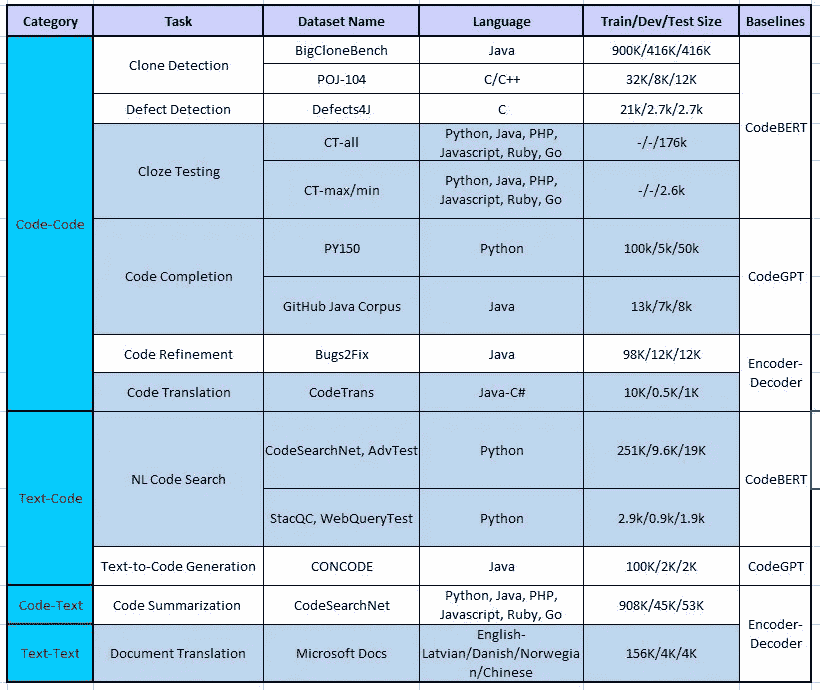
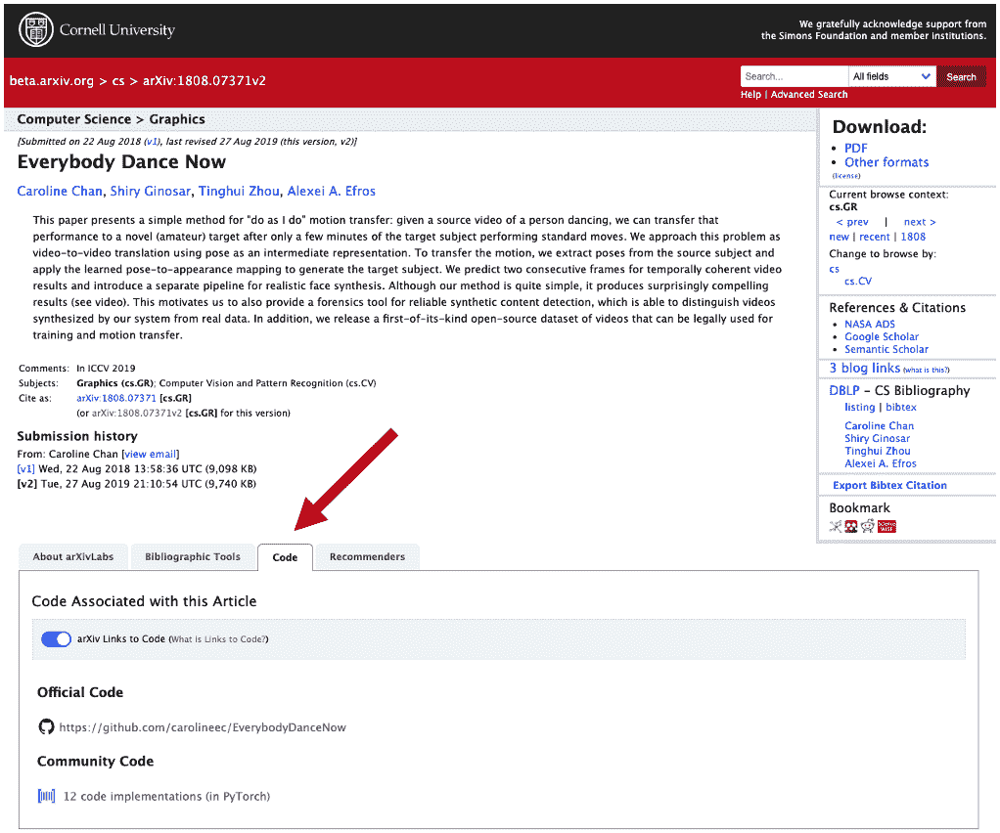
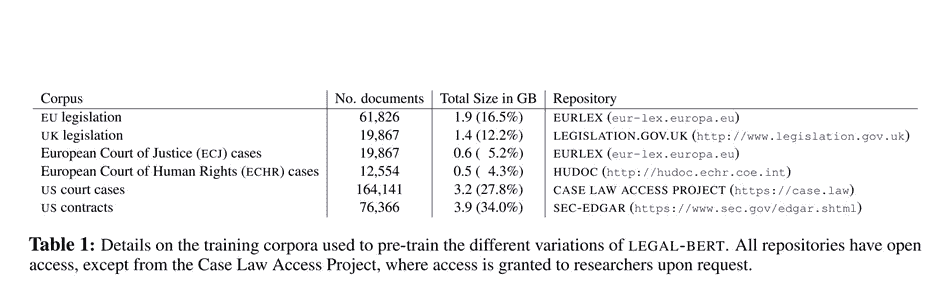
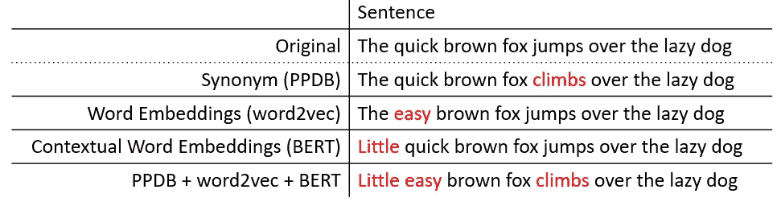
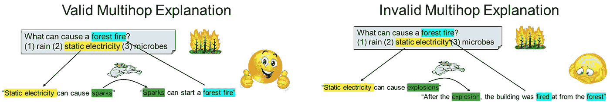

# NLP 新闻密码| 10.11.20

> 原文：<https://pub.towardsai.net/nlp-news-cypher-10-11-20-cdfff4d69157?source=collection_archive---------2----------------------->

[安赫塞娜蒙](https://unsplash.com/@ankhesenamunnn?utm_source=medium&utm_medium=referral)在 [Unsplash](https://unsplash.com?utm_source=medium&utm_medium=referral) 上拍照

## 自然语言处理每周时事通讯

## 代码的颂歌

嘿，欢迎回来！这周我们有另一个很棒的 NLP 密码。和往常一样，如果你喜欢阅读，请给它一个👏👏并与你的敌人分享。

此外，我们用 14 个新闻数据集和 5 个新笔记本更新了[大坏 NLP 数据库](https://datasets.quantumstat.com/)和 [Super Duper NLP Repo](https://notebooks.quantumstat.com/) 。感谢**如来·拉哈、****和**柳井·艾拉扎**的杰出贡献。👩‍💻**

> **新:其中一个笔记本包括来自 Silero 的“语音到文本”推理*😁***

**仅供参考:BBND 更新的大部分来自 CodeXGLUE 基准测试(上个月发布)，其中有几个数据集用于代码相关任务中的机器学习(例如代码完成或 code-2-code 翻译，仅举几例)。这是整个画面👇：**

****

## **给我看看代码！**

**喜欢在 arXiv 上追踪代码的预印本吗？现在 arXiv 上有一个特殊的按钮标签，可以访问机器学习论文的源代码(如果有的话)！赢了！😎**

****博客**:**

** [## 新的 arXivLabs 特性提供了对代码的即时访问

### 当读者激活 arXiv 摘要记录页上的代码工具时，作者的代码实现将…

blog.arxiv.org](https://blog.arxiv.org/2020/10/08/new-arxivlabs-feature-provides-instant-access-to-code/) 

解密的** 

# **本周**

> **法律伯特**
> 
> **印度伯特**
> 
> **野外意图检测**
> 
> **维基百科 2Vec**
> 
> **文本数据扩充**
> 
> **2020 年人工智能状况报告**
> 
> **荣誉文件**
> 
> **本周数据集:eQASC**

# **法律伯特**

**直接从 EMNLP 中，我们现在有了法律领域的预训练模型，称为法律 BERT！这些模型经过训练，着眼于在法律研究、计算法律和法律技术领域的应用。在培训中，模特接触了 12 GB 的英语法律文本，这些文本来自立法、法庭案例和合同。👇**

****

**训练前语料库**

**哪些地方获得了最佳性能提升？**

> **“在最具挑战性的最终任务中，性能提升更大(例如，ECHR 案例和合同标题中的多标签分类，以及 NER 合同中的租赁详细信息)”**

**在文本分类和序列标记任务上评估该模型。**

****论文**:[https://arxiv.org/pdf/2010.02559.pdf](https://arxiv.org/pdf/2010.02559.pdf)**

****洛斯莫德洛斯**:**

** [## nlpaueb (AUEB NLP 集团)

### 我们正踏上通过自然语言解决人工智能并使其大众化的旅程。

huggingface.co](https://huggingface.co/nlpaueb) 

# 印度伯特

如果你对印度语感兴趣，请查看基于高频变压器的印度伯特库👀。他们的多语言 ALBERT 模型支持 12 种语言，并在自定义的 90 亿令牌语料库上进行训练。该图书馆承担多种评估任务:

新闻分类，命名实体识别，标题预测，维基百科章节标题预测，完形填空式问答(WCQA，跨语言句子检索(XSR)等等。

**GitHub** :

 [## AI4Bharat/indic-bert

### Indic bert 是一个多语言 ALBERT 模型，专门涵盖 12 种主要的印度语言。它是在我们的……

github.com](https://github.com/AI4Bharat/indic-bert) 

感谢如来转发他们的模型给我们！

## 本周可乐

 [## 谷歌联合实验室

### 编辑描述

colab.research.google.com](https://colab.research.google.com/github/ai4bharat/indic-bert/blob/master/notebooks/finetuning.ipynb) 

# 野外意图检测

底线:我们需要更多真实世界的数据集。在最近的这篇 Haptik 论文中，作者展示了在给定 3 个包含范围内和范围外查询的真实数据集时，4 个 NLU 平台(RASA、Dialogflow、LUIS、Haptik)和 BERT 的性能。*(由于难以推广到数据的测试集，结果参差不齐)*

什么样的数据集？

> “每个数据集在一个领域中包含不同的意向集—床垫产品零售、健身补充品零售和在线游戏……”

* *这里的真实世界指的是真实的用户查询，而不是众包。*

**在这里找到数据**:

 [## hellohaptik/HINT3

### 这个存储库包含论文“提示 3:提高野外意图检测的标准”的数据集和代码…

github.com](https://github.com/hellohaptik/HINT3) 

**论文**:[https://arxiv.org/pdf/2009.13833.pdf](https://arxiv.org/pdf/2009.13833.pdf)

# 维基百科 2Vec

你听说过 Wikipedia2Vec 吗，它已经存在好几年了。它包含单词和概念的嵌入，在维基百科中有相应的页面。由于维基百科是信息检索中研究最多的数据集之一，这可能会对你有用。它们的嵌入有 12 种语言，并且包括一个 API。

 [## 维基百科 2Vec

### Wikipedia2Vec 是一个工具，用于获得单词和实体的嵌入(或向量表示)(例如，概念…

wikipedia2vec.github.io](https://wikipedia2vec.github.io/wikipedia2vec/) 

**维基百科 2Vec 的应用:**

*   实体链接: [Yamada 等人，2016](https://arxiv.org/abs/1601.01343) ， [Eshel 等人，2017](https://arxiv.org/abs/1706.09147) ， [Chen 等人，2019](https://arxiv.org/abs/1911.03834) ， [Poerner 等人，2020](https://arxiv.org/abs/1911.03681) 。
*   命名实体识别:[佐藤等人，2017](http://www.aclweb.org/anthology/I17-2017) ，[拉拉-克拉雷斯和加西亚-塞拉诺，2019](http://ceur-ws.org/Vol-2421/eHealth-KD_paper_6.pdf) 。
*   问题解答:[山田等人，2017](https://arxiv.org/abs/1803.08652) ，[波尔纳等人，2020](https://arxiv.org/abs/1911.03681) 。
*   实体分型:[山田等，2018](https://arxiv.org/abs/1806.02960) 。
*   文本分类:[山田等人，2018](https://arxiv.org/abs/1806.02960) ，[山田和神童，2019](https://arxiv.org/abs/1909.01259) 。
*   关系分类: [Poerner 等人，2020](https://arxiv.org/abs/1911.03681) 。
*   意译检测: [Duong 等人，2018](https://ieeexplore.ieee.org/abstract/document/8606845) 。
*   知识图补全:[沙阿等人，2019](https://aaai.org/ojs/index.php/AAAI/article/view/4162) 。
*   假新闻检测: [Singh 等人，2019](https://arxiv.org/abs/1906.11126) 。
*   电影剧情分析:[paparampidi 等，2019](https://arxiv.org/abs/1908.10328) 。
*   利用维基百科知识增强 BERT:[poer ner 等人，2019](https://arxiv.org/abs/1911.03681) 。
*   小说实体发现:[张等，2020](https://arxiv.org/abs/2002.00206) 。
*   实体检索: [Gerritse 等人，2020](https://link.springer.com/chapter/10.1007%2F978-3-030-45439-5_7) 。

**论文**:[https://arxiv.org/abs/1812.06280](https://t.co/f9tjsypbhw?amp=1)

# 文本数据扩充

NLPaug 是一个用于数据扩充的方便的库，您可以在字符或单词级别上向数据集中注入噪声，从而提高模型性能。

这里有一个例子来说明我的意思:

以下是它的一些特点:

*   OCR 增强器、QWERTY 增强器和随机字符增强器
*   `Word` : WordNet 增强器、word2vec 增强器、GloVe 增强器、fasttext 增强器、BERT 增强器、随机单词字符
*   顺序增强器，有时是增强器

**关于图书馆的博文**:

 [## 文本数据扩充库

### 在前面的故事中，您了解了为 NLP 任务模型生成更多训练数据的不同方法。在这个…

towardsdatascience.com](https://towardsdatascience.com/data-augmentation-library-for-text-9661736b13ff) 

**GitHub** :

 [## makcedward/nlpaug

### 这个 python 库帮助你为你的机器学习项目扩充 nlp。请访问此介绍…

github.com](https://github.com/makcedward/nlpaug) 

> 揭秘:SDNR 有一个 nlpaug colab*👆*

# 2020 年人工智能状况报告

年度人工智能报告出来了，NLP 大获全胜。

**TL；博士在 NLP 方面的事情**:

只有 15%的论文公布了他们的代码。

在研究论文方面，脸书的 PyTorch 正在快速超越谷歌的 TensorFlow。

*较大的模型比较小的对等体需要更少的数据来实现相同的性能。*

生物学正在经历它的“人工智能时刻”:仅在 2020 年就有超过 21，000 篇论文。

大学毕业生流失到科技公司。

*企业中多层次人才的崛起。*

*NLP 用于利用《世界新闻》自动量化公司的环境、社会和治理(ESG)认知。*

*模型和数据集共享正在推动 NLP 的寒武纪大爆发。*

 [## 2020 年人工智能状况报告

### 《人工智能状况报告》分析了人工智能领域最有趣的发展。我们旨在引发一场知情的对话…

www.stateof.ai](https://www.stateof.ai/) 

# 荣誉文件

[链接](https://arxiv.org/pdf/2010.00462.pdf)

论文:[https://arxiv.org/pdf/2009.13013.pdf](https://arxiv.org/pdf/2009.13013.pdf)稀疏开域 QA

论文:[https://arxiv.org/pdf/2010.03099.pdf](https://arxiv.org/pdf/2010.03099.pdf)小说框架蒸馏

论文:[https://arxiv.org/pdf/2010.03604.pdf](https://arxiv.org/pdf/2010.03604.pdf)语义角色标注图

# 本周数据集:eQASC

# 这是什么？

数据集包含对 QASC 数据集中的问题的 98k 2 跳解释，并带有注释，指示它们是有效解释还是无效解释。

# 样本:

# 它在哪里？

 [## eq ASC:QASC 数据集的多跳解释-艾伦人工智能研究所

### 这个知识库解决了目前缺乏训练数据来区分有效的多跳解释和无效的…

allenai.org](https://allenai.org/data/eqasc) 

> 每周日，我们都会对来自世界各地的研究人员的 NLP 新闻和代码进行每周综述。
> 
> *如需完整报道，请关注我们的推特:*[*@ Quantum _ Stat*](http://twitter.com/Quantum_Stat)

[www.quantumstat.com](http://www.quantumstat.com/)**