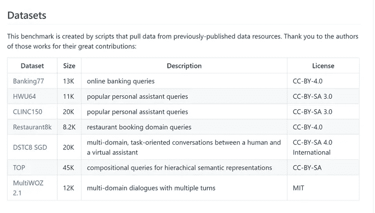

# NLP 新闻密码| 10.18.20

> 原文：<https://pub.towardsai.net/nlp-news-cypher-10-18-20-163582982628?source=collection_archive---------0----------------------->

在 [Unsplash](https://unsplash.com?utm_source=medium&utm_medium=referral) 上由[Fatih yurür](https://unsplash.com/@fatihyurur?utm_source=medium&utm_medium=referral)拍照

## 自然语言处理每周时事通讯

## 紧急超驰

欢迎回来！这是全新的一周。如果你不知道，我们挖掘了 arXiv 的新代码链接功能的金矿(在上周的新闻稿中提到)。最近，arXiv 与 PapersWithCode 合作，在摘要页面上方便地将任何相关的回购链接到其附带的论文(这比跟踪 PDF 好得多)。👇

解密的

嗯…我们想知道我们是否可以提取链接，比如说…在连续 5 天的一周内发表的所有 NLP 相关的论文？！？！请注意，arXiv 上的论文是在周一至 Fri 发布的，每周 NLP 相关材料的论文总数在 300-500 篇之间。

在过去的一周里，有 330 篇论文发表在*计算和语言*目录中。其中，108 个有 GitHub 链接👀。这大约是 0.300 的平均打击率(比最近的 17-20%略高)。其余的没有代码，但是有链接到 PapersWithCode 网站的论文。最后的 11 个左右都不包括，这些被排除在外，给我们一个总数为 319。(请记住，代码可以在以后添加，所以有可能一些摘要在过去的 72 小时内已经被代码填充，因此我的统计数据可能会略有偏差)

数据转储有 3 个字段:

> 摘要的网址*，*
> 
> 摘要的标题
> 
> *将*编码到 GitHub 页面(如果可用)或 PwC。**

* [## arxiv

### arxiv_10_17 id，url，title，code 1，https://arxiv.org/abs/2010.07375，[2010.07375]神经叙事的解码方法…

docs.google.com](https://docs.google.com/spreadsheets/d/151pATsU_ajV6lApke9_A1oMVC2QCfovgo3w0JjUczMY/edit?usp=sharing) 

**酷事实** : *较老的* *论文已经被追溯性地附加了代码链接，尽管这个特性只有一周的历史。(例如*[【https://arxiv.org/abs/2005.11787】](https://arxiv.org/abs/2005.11787)*比如这篇论文是 5 月份提交的但是有代码 url)。*

总之，这是一个令人敬畏的实验时间，获得的数据量是一种坚果。大量新的图书馆和相关笔记本很快被发现。

顺便说一句，如果你想获得 NLP 论文和其他研究新闻的精彩精选，你可以随时注册我们的时事通讯。(仅供参考,“NLP 论文”并不是指上面链接的 arXiv 数据转储，这只是一次性的😥)

**在这里报名**:【https://quantumstat.com 

> …如果你能复制这次冒险，你就是一个真正的绝地大师。*👩‍💻** 

## *IBM 在 INTERSPEECH 2020 上的研究论文*

*谈论文件…*

* [## IBM 在 INTERSPEECH 2020 上的研究| IBM 研究博客

### 第 21 届 INTERSPEECH 会议将于 10 月 25 日至 29 日以完全虚拟会议的形式举行…

www.ibm.com](https://www.ibm.com/blogs/research/2020/10/ibm-research-at-interspeech-2020/) 

## 新斯坦福研讨会

对于那些对构建现代 ML 堆栈并将其应用于现实世界感兴趣的人来说，这个新的斯坦福研讨会系列刚刚起步:

最后但并非最不重要的是，特别感谢 Sebastian Ruder 在他的简讯中为超级骗子 NLP Repo 大声疾呼！😎

 [## ML 和 NLP 入门工具包，低资源 NLP 工具包，“一个 LM 能理解自然语言吗？”，那个…

### 大家好，已经有一段时间了...我希望你在这个疯狂而奇怪的时代过得很好。新冠肺炎已经影响了…

newsletter.ruder.io](http://newsletter.ruder.io/issues/ml-and-nlp-starter-toolkit-low-resource-nlp-toolkit-can-a-lm-understand-natural-language-the-next-generation-of-nlp-benchmarks-254211) 

# Spotify 开源 Klio

Spotify 在 GitHub bruh 上！Klio 是他们的文件处理库，允许你处理大的音频文件(或任何二进制文件)。它是在阿帕奇梁上建造的。

**GitHub** :

 [## spotify/klio

### Klio 是一个生态系统，允许你处理音频文件-或任何二进制文件-容易和大规模。Klio 工作是…

github.com](https://github.com/spotify/klio) 

# 部署后人工智能管理

在 O'Reilly 的这份白皮书中，重点讨论了生产领域的 MLOps 主题。本文讨论了:密切关注数据领域转变的迹象、服务水平指标，以便了解模型在生产中的预期性能、模型监控等等。

**白皮书**:

 [## 部署后的人工智能产品管理

### 人工智能产品管理领域继续获得发展势头。随着人工智能产品管理角色越来越成熟…

www.oreilly.com](https://www.oreilly.com/radar/ai-product-management-after-deployment/) 

# 多语言事实知识检索

想知道你的语言模型知道多少关于它被训练的数据的事实，(但是在多语言风格中)？X-FACTR 就是这样一个基准。(也做多令牌)。基准遵循来自 T-REx 数据集的以主体-关系-客体三元组形式表达的事实知识。

> “X-FACTR 是一个多语言基准，用于探测语言模型中的事实知识。母语人士创建了 23 种语言的提示，通过让他们填写提示的空白来探索 LMs 中的事实知识，例如:Punta Cana 位于 _。

## 语言支持:

*   `en`(英语)、`fr`(法语)、`nl`(荷兰语)、`ru`(俄语)、`es`(西班牙语)、`jp`(日语)、`vi`(越南语)、`zh`(汉语)、`hu`(匈牙利语)、`ko`(韩语)、`tr`(土耳其语)、`he`(希伯来语)、`el`(希腊语)、`war`(瓦雷语)、`mr`(马拉地语)、`mg`(马达加斯加语)、`bn`(孟加拉语)、`tl`(塔加禄语)、【17】。

 [## x 因素

### 从预先训练的语言模型中检索多语言事实知识查看我的 GitHub 个人资料 X-FACTR 是一个…

x-factr.github.io](https://x-factr.github.io/) 

**GitHub** :

 [## jzbjyb/X-FACTR

### X-FACTR 是一个多语言基准，用于探测语言模型中的事实知识。23 种语言的提示是…

github.com](https://github.com/jzbjyb/X-FACTR) 

# 注释-工具报告

Mariana Neves 有一个很棒的 repo，它可以索引不同领域的注释工具，以满足您的 NLP 需求。他们还有一个网络应用程序，可以让你搜索他们的索引。如果您参与数据注释，请将此标记为书签:

 [## mariana eves/注释-工具

### 我们根据许多标准评估了所有工具。此外，我们还开发了一个 Web 应用程序来搜索…

github.com](https://github.com/mariananeves/annotation-tools) 

# 新闻-请

News-Please 是一个新闻爬虫，它从…你猜对了，新闻文章中提取结构化信息。这不仅仅是一个刮刀，这个库还允许你从 commoncrawl.org 网站抓取和提取新闻文章！

这里有一个 JSON 输出的例子:

 [## fhamborg/news-请

### Permalink GitHub 是 5000 多万开发人员的家园，他们一起工作来托管和审查代码、管理项目以及…

github.com](https://github.com/fhamborg/news-please/blob/master/newsplease/examples/sample.json) 

**GitHub** :

 [## fhamborg/news-请

### news-please 是一个开源、易用的新闻爬虫，可以从几乎任何新闻中提取结构化信息…

github.com](https://github.com/fhamborg/news-please) 

# 空间 3.0

空间更新🔥。变形金刚管道是涂料。他们现在支持多任务学习。他们的更新支持 16 种语言和 51 种管道的新训练模型。点击此处阅读更多内容:

 [## 介绍 spaCy v3.0 夜间爆炸

### spaCy v3.0 将会是一个巨大的发布！它具有新的变压器为基础的管道，获得空间的准确性的权利…

explosion.ai](https://explosion.ai/blog/spacy-v3-nightly) 

# 荣誉文件

常识和适配器:[https://arxiv.org/pdf/2005.11787.pdf](https://arxiv.org/pdf/2005.11787.pdf)

溯因推理:【https://arxiv.org/pdf/2010.05906.pdf】T2

生物电子加速器:【https://arxiv.org/pdf/2010.06060.pdf 

# 本周数据集:DialoGLUE

# 这是什么？

dialogue 是一个对话式人工智能基准，包含 7 个与面向任务的对话相关的数据集。

解密的

# 它在哪里？

 [## Alexa/对话

### dialogue 是一个对话式人工智能基准，旨在鼓励基于表征的转移中的对话研究…

github.com](https://github.com/alexa/DialoGLUE/) 

**论文**:[https://arxiv.org/pdf/2009.13570.pdf](https://arxiv.org/pdf/2009.13570.pdf)

> *每周日，我们都会对来自全球研究人员的 NLP 新闻和代码进行一次每周综述。*
> 
> *如需完整报道，请关注我们的 Twitter:*[*@ Quantum _ Stat*](http://twitter.com/Quantum_Stat)

[www.quantumstat.com](http://www.quantumstat.com/)*