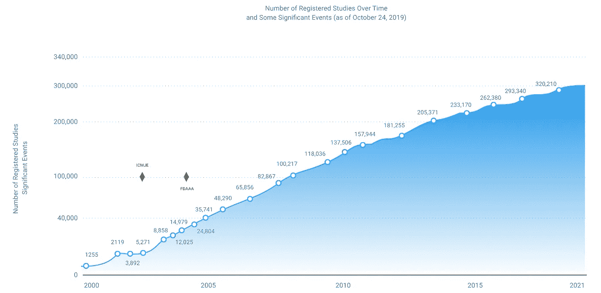

# SLR 和元分析的 NLP 驱动的数据提取

> 原文：<https://pub.towardsai.net/nlp-powered-data-extraction-for-slrs-and-meta-analyses-252d898d8ec3?source=collection_archive---------1----------------------->

## [自然语言处理](https://towardsai.net/p/category/nlp)

从已发表的报告和临床试验中获取所需的数据并纳入系统文献综述(SLR)——这一过程被称为数据提取——只是创建 SLR 和荟萃分析所涉及的一系列极其耗时、重复且可能容易出错的步骤之一。

这也是一个从自动或半自动机器学习(ML)和自然语言处理(NLP)技术中受益最多的领域。这些技术越来越多地[用于](https://www.capestart.com/resources/blog/nlp-aided-systematic-literature-review-why-its-needed-and-how-it-works/)加速和提高几个 SLR 过程步骤的精度，包括数据提取、选择主要研究和制定研究问题。在过去的几年中，研究人员越来越多地试图通过各种 ML 技术来改进数据提取过程。

这对经常研究单反的研究人员来说是个好消息，因为传统的过程慢得令人麻木:【2017 年的一项分析发现，单反平均需要 67 周才能生产出来。另一项 2018 年的研究发现，每个 SLR 在每个项目中总共需要近 1200 个小时。这还不包括单反相机的材料成本，单反相机的生产价格通常高达每台 25 万美元。

正是由于这些原因，几乎每个人都在单反自动化中有既得利益。这个正在进行的过程跨越了循证医学、数据科学和人工智能(AI)之间的交叉点。*随着高性能计算机和 ML 算法能力的增长，改进 SLR 过程的机会也在增加。*即使是速度或精度方面的微小改进也会对主要依赖手动方法的研究人员产生重大影响。

## SLR 手动数据提取的挑战

虽然 SLR 和荟萃分析总是需要大量的时间和精力投入，但由于研究人员可以获得的[快速增长的](https://www.ncbi.nlm.nih.gov/pmc/articles/PMC7338918/)证据基础，每个项目的潜在工作量只会增加。

虽然广泛的证据基础的指数级增长无疑是一件好事，但它使得通过手动过程包含所有可用数据变得越来越难以实现。速度是至关重要的，这种快速的出版节奏也意味着每台单反相机都需要不断更新以保持相关性。相应地，预印本储存库，如 [arXiv](https://arxiv.org/) 现在在相对较短的审核过程后提供快速出版(相对于完全的同行评审)。

人工提取数据容易出错，尤其是在这样一个快节奏的研究环境中。[说](https://www.sciencedirect.com/science/article/abs/pii/S0950584921000690) van Dinter 等人(2021)。

此外，数据提取可能比其他 SLR 元素更难自动化。例如，仅使用研究摘要就可以轻松选择主要研究，而数据提取则需要访问全文临床文档(并能够智能阅读)。

## 通过自然语言处理的 SLR(半)自动数据提取

研究人员可以部署各种 ML 和 NLP 技术来帮助缓解这些挑战。[要自动化的最常见的](https://www.sciencedirect.com/science/article/abs/pii/S0950584921000690) SLR 元素是使用单词袋、频率-逆文档频率(TFIDF)和 n-gram 技术等的相关研究的主要研究选择和识别。

在一些使用上述技术的研究中，数据提取也实现了自动化，但更常见的是通过命名实体识别(NER)，使用 CRF、LSTM [BioBERT](https://academic.oup.com/bioinformatics/article/36/4/1234/5566506) 或 [SciBERT 等模型。](https://github.com/allenai/scibert)数据提取本质上是[文本分类](https://systematicreviewsjournal.biomedcentral.com/articles/10.1186/s13643-019-1074-9) *、*中的一个练习，其中根据单词本身、其周围的单词以及单词在文档中的位置来判断文档中特定领域的单词的相关性，这使得 NER 技术成为理想的方法。

BioBERT 和类似的基于 BERT 的 NER 模型使用生物医学语料库(或数据集)进行训练和微调，如 [NCBI 病](https://www.ncbi.nlm.nih.gov/research/bionlp/Data/disease/#:~:text=The%20NCBI%20disease%20corpus%20is,biomedical%20natural%20language%20processing%20community.&text=divided%20into%20training%2C%20developing%20and%20testing%20sets.)、 [BC5CDR](https://paperswithcode.com/dataset/bc5cdr) 或[物种-800](https://paperswithcode.com/sota/named-entity-recognition-on-species-800) 。[将数据输入 NER 模型的数据格式](https://simpletransformers.ai/docs/ner-data-formats/)通常包括 Pandas 数据帧或 CoNLL 格式的文本文件(即。每行一个单词的文本文件)。

通过注释感兴趣的段落，提取的数据元素可以被自动引用到源，使得人类评论者可以容易地验证并将其添加到评论中。

其他常用于 SLR 过程自动化的 NLP 技术有文本向量(用于研究识别和主要研究选择)、奇异值分解(主要研究选择)和潜在语义分析模型(主要研究选择)。

根据 van Dinter 等人的，新的研究也开始关注用于自动系统综述的深度学习算法，其中包括 2020 年的一篇论文，该论文使用去噪自动编码器和深度神经网络以及扁平向量和支持向量机进行特征提取，以评估研究相关性。

## SLR 数据提取中的 NLP

几项研究已经显示了通过 NLP 模型进行自动提取的可行性。[Bui 等人的这项研究](https://www.sciencedirect.com/science/article/pii/S1532046416301514?via%3Dihub)使用 ML 和 NLP 来生成全文的自动摘要，与人类相比，实现了较高的召回率(91.2%比 83.8%)和精确度(59%的相关句子密度比 39%)。[另一项研究](https://bmcmedinformdecismak.biomedcentral.com/articles/10.1186/1472-6947-10-56)，尽管是从 2010 年开始的，使用了一个自动提取系统(称为 ExaCT)来帮助研究人员从全文随机临床试验(RCT)文档中定位和提取关键信息。它以 94%的部分准确率提取数据，并在近 70%的时间内返回完全正确的数据。

并且[该研究](https://www.ncbi.nlm.nih.gov/pmc/articles/PMC5065023)使用 ML 模型成功地从与微微元素相关的全文文章中提取句子(用于开发临床研究问题的微微元素识别和提取是 SLR 生产的另一个[非常耗时的](https://www.capestart.com/resources/blog/using-nlp-to-improve-pico-element-identification-and-extraction/)元素)。

## 使用 CapeStart 加速单反制作并提高精度

NLP 技术为 SLR 和荟萃分析释放更大的价值和效率带来了巨大的希望。但医学研究人员不是机器学习工程师，没有时间或带宽来自己构建这些解决方案。

这就是为什么 [CapeStart](https://www.capestart.com/solutions/nlp-aided-systematic-literature-review/) 的数据科学家和 NLP 辅助的系统文献综述解决方案可以成为您组织的力量倍增器，帮助自动或半自动执行耗时且昂贵的 SLR、PICO 或荟萃分析流程的几个要素。

我们在处理 NCBI 病、BC5CDR 和 Species-800 等生物医学数据集，以及部署和微调基于 BioBERT 和 SciBERT 的 NER 模型方面拥有丰富的经验。CapeStart 的数据准备和注释团队还可以将任何数据集转换为所需的 Pandas DataFrame 或 CoNLL 格式，以便输入训练 NER 模型。

立即联系我们，探索我们广泛的以医疗保健为重点的 NLP 和数据注释解决方案，从针对特定医疗保健应用的定制 NLP 模型到用于培训、调整和微调模型准确性的数据准备。