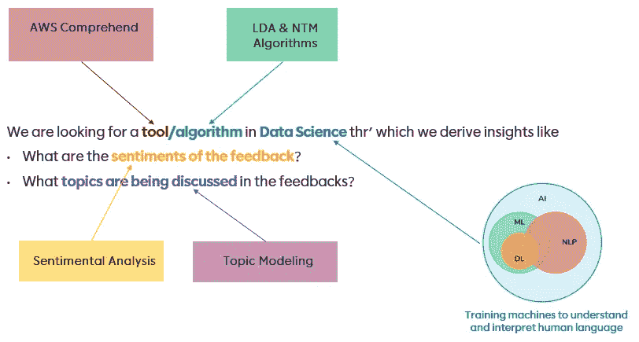
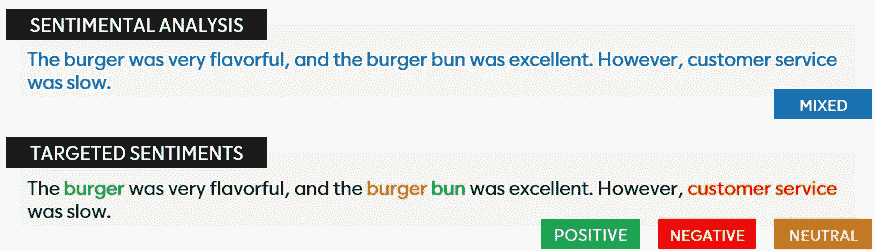
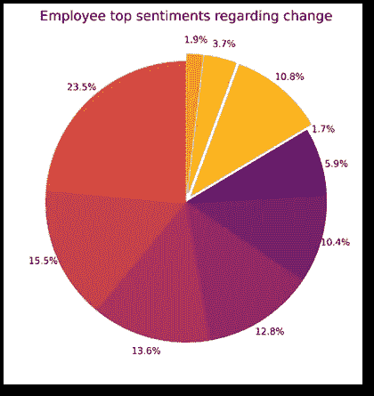
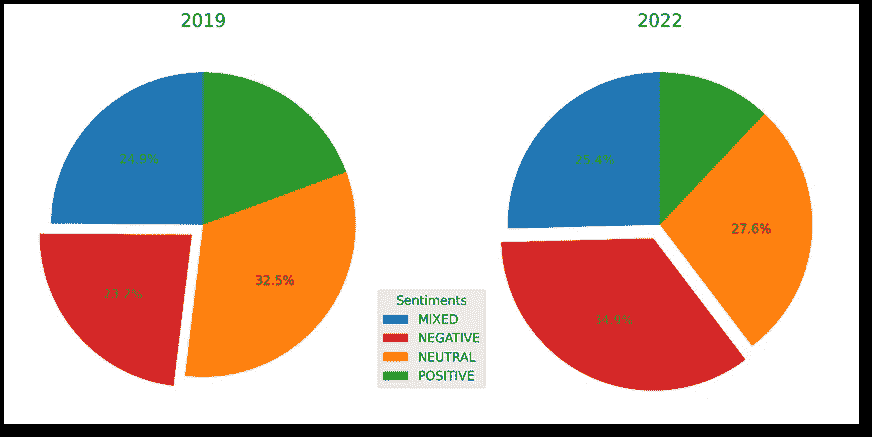
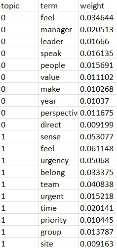
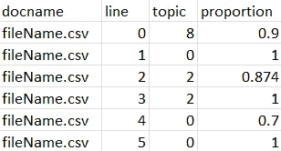
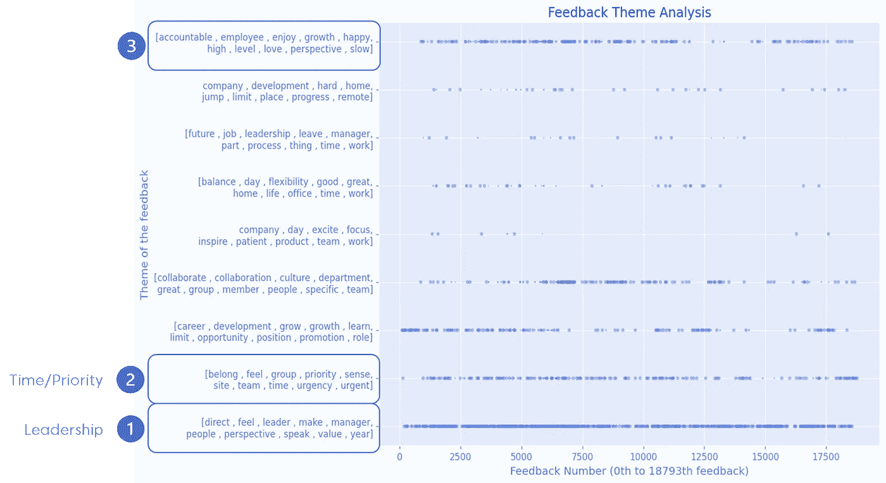

# 包含 AWS 的 NLP 用例

> 原文：<https://pub.towardsai.net/nlp-use-case-with-aws-comprehend-a6fcb9efc4e0?source=collection_archive---------3----------------------->

## 本文涵盖了自然语言处理的概念，以及如何使用 AWS understand 的组件从文本数据中获得洞察力。


罗伯特·科林斯在 [Unsplash](https://unsplash.com?utm_source=medium&utm_medium=referral) 上拍摄的照片

> ***讨论的话题！***
> 
> 1.问题！
> 2。AWS 基础理解
> 3。情感分析&有针对性的情感
> 4。主题建模

# 1.问题！

## 视力

"通过实现企业变革计划的目标，加速并维持业务成果."

## 我们将如何实现我们的愿景？

成熟的组织变革能力

> 变革能力定义:组织有效地计划、设计和实施所有类型变革的能力，同时最大限度地减少业务中断，确保利益相关者的承诺，并加速和维持预期的业务成果(财务和文化)。

让我们将愿景分解成小问题，看看如何解决它们！

## **了解:**

*   员工对组织中的变化有什么看法？(这对他们有什么影响？他们有什么感觉？)
*   员工对我们的 5 个重点领域(领导力、应用、标准化、能力、社交)有什么看法
*   关于团队的变化模式(R&D，公司等。)?我们在不同的团队中看到了什么样的模式？
*   全面排名前 5-10 位的观点
*   长期变化的影响(2019 年至 2022 年)

## 我们能用数据吗？

是啊！我们有 8 个季度的员工反馈数据。总共 12 万条记录。

## 基于数据的决策

10% (11，000 条记录)的员工反馈数据处于变更的背景下，尽管对组织中的变更提出了“否”的问题

由于 11，000 条记录代表了员工的个人心声，因此这些数据足以进行进一步的分析！

## 方法

现在我们有了问题陈述和数据来激发一些决策！我们可以看一下方法；



技术方法(作者)

因此，我们将使用 AWS intensive 对员工反馈数据进行情感分析和主题建模，以了解变化背景下的情感和主题！

# 2.AWS 理解的基础


照片由[何塞·拉莫斯](https://unsplash.com/@joser0337?utm_source=medium&utm_medium=referral)在 [Unsplash](https://unsplash.com?utm_source=medium&utm_medium=referral) 上拍摄

## AWS 领悟是什么？

[亚马逊理解](https://docs.aws.amazon.com/comprehend/latest/dg/what-is.html)使用自然语言处理(NLP)来提取关于文档内容的见解；在我们的用例中，我们使用 AWS understand 从反馈数据中提取关键信息。

您可以使用 Amazon understand 控制台或 Amazon understand API 来使用 understand 执行文本分析。

参考 [*AWS 领悟文档*](https://us-east-1.console.aws.amazon.com/comprehend/home?region=us-east-1#welcome)

# 3.情感分析和目标情感



情感分析和目标情感(作者)

我们使用 Amazon understand 来分析文档的情感。在我们的用例中，您可以使用情绪分析来确定员工对变化的反馈情绪，以及他们是喜欢还是不喜欢组织中发生的变化。

亚马逊理解支持多种语言。请注意，一个作业中的所有文档必须使用同一种语言。

情感确定返回以下值:

*   **积极** —反馈表达了总体积极的情绪。
*   **负面** —反馈表达了总体负面情绪。
*   **混合** —反馈表达了一种混合的感觉，既有积极的也有消极的情绪。
*   **中性** —反馈不表达积极或消极的情绪。

*目标情感*在我们的反馈文档中提供与特定实体(如组织或领导)相关的情感的详细理解。

**执行此操作的一种方式是使用 UI 方法，**我们将更深入地了解如何执行此操作！

**第一步:**访问 [AWS 领悟主页](https://us-east-1.console.aws.amazon.com/comprehend/home?region=us-east-1#welcome)

**第二步:**下浏览>-[分析岗位](https://us-east-1.console.aws.amazon.com/analysis)

**第三步:** [创建一个作业](https://us-east-1.console.aws.amazon.com/comprehend/home?region=us-east-1#create-analysis-job)

*   *名称* —给它一个唯一的名称，如 EmpFeedbackSentiV1
*   *分析类型* —实体、事件、关键短语、主要语言、个人识别信息(PII)、情感、目标情感或主题建模。
*   *语言* —输入文件的语言。
*   *输入数据*
    **数据源*—‘我的文档’
    ** S3 位置—*S3 某输入数据文件的 URL/S3 的桶/文件夹位置。
    * *输入格式* —当您创建了一个每行包含一个文档的文件时，选择每行一个文档。当每个文件包含单个文档时，为每个文件选择一个文档
*   输出数据-位于 S3 S3/桶/文件夹位置的输出数据文件的 URL。
*   访问权限—使用现有权限，如果没有权限，则创建一个权限；相当简单。
*   保留其他字段不变
*   点击“创建工作”

该模型将运行 2-10 分钟，具体取决于输入的大小。完成后，您可以在输出路径中找到 output.tar.gz。要查看内容，使用 [7 zip](https://www.webhostinghub.com/help/learn/website/managing-files/extract-file) 下载并提取该文件的内容。

输出是一个 JSON 结构，您可以使用[在线 JSON 阅读器](http://jsoneditoronline.org)更好地查看。输出的示例如下所示:

```
{ "SentimentScore": {         
"Mixed": 0.0238794648325487,         
"Positive": 0.843765435823298,         
"Neutral": 0.0230283082030323,         
"Negative": 0.0082836127816313     
},     
"Sentiment": "POSITIVE",     
"LanguageCode": "en" }
```

该分数表示情绪被正确检测到的可能性。例如，在下面的例子中，85%的可能性文本有积极的情感。文本带有负面情绪的可能性不到 2%。一旦细化了 JSON，就可以得到可视化。



出于保密目的，标签是隐藏的(图片由作者提供)



从 2022 年的员工反馈中分析整体情绪，并与 2019 年的调查结果进行比较(图片由作者提供)

# 4.主题建模


梅尔·普尔在 [Unsplash](https://unsplash.com?utm_source=medium&utm_medium=referral) 上拍摄的照片

您可以使用 Amazon understand 来检查一组文档的内容，以确定共同的主题。我们向 AWS intensive 提供反馈数据，主题和权重由 AWS intensive 生成。

Amazon understand 使用基于潜在狄利克雷分配(T2)的学习模型来确定一组文档中的主题。它遍历每个文档来获取单词的上下文和含义。在整个文档中经常属于同一上下文的单词构成一个主题。(参见[https://docs . AWS . Amazon . com/imperstand/latest/DG/topic-modeling . html](https://docs.aws.amazon.com/comprehend/latest/dg/topic-modeling.html))

在 Amazon understand 进程之后，它返回两个文件，topic-terms.csv 和 doc-topics.csv。

## 输出文件 1， **topic-terms.csv**

集合中的主题列表。对于每个主题，默认情况下，该列表根据主题的权重包括排名靠前的术语。

在我们的用例中，下面描述集合中的前两个主题:



主题术语(按作者)

表中的权重表示给定主题中单词的概率分布。它只返回每个主题的前 10 个单词，权重总和不会为 1.0。在极少数情况下，一个主题中的单词少于 10 个，权重总和为 1.0。

通过分析这些词在所有主题中的出现频率，根据它们的区分能力对它们进行排序。

您必须指定要返回的主题数量。例如，如果您说 10 个主题，它会在反馈中返回 10 个最重要的主题。它最多可以检测一个集合中的 100 个主题。主题的数量可以根据文档的内容来确定，这通常是一种反复试验的方法。

## 输出文件 2，`doc-topics.csv`

列出与主题相关的文档以及与主题相关的文档的比例。

在我们的用例中，



文档-主题(按作者)

进一步利用这两个。csv 文件，你可以得到洞察力，一个简单的散点图会给你这个；



*图表解释:较粗的线条表示当员工谈到变革时，该主题经常被讨论。*主题建模(作者)

在变革的背景下，一些经常讨论的主题是:

1.**高频率**:直接、感觉、领导、经理、人员、视角、发言、价值、年份(可作为领导)

2.**中度**:归属、感觉、群体、优先级、感觉、地点、团队、时间、紧急、急迫(可按时间/优先级划分)

# 结论

了解员工的情绪以及在变革背景下讨论的话题！

作为分析的结果，团队可以确定与改进现有变更管理相关的任务的优先级。改进了变革的应用和沟通

感谢您的阅读！祝你度过愉快的一天/一夜！

## 参考

1.  [https://docs . AWS . Amazon . com/imperstand/latest/DG/what-is . html](https://docs.aws.amazon.com/comprehend/latest/dg/what-is.html)
2.  [https://docs . AWS . Amazon . com/imperstand/latest/DG/topic-modeling . html](https://docs.aws.amazon.com/comprehend/latest/dg/topic-modeling.html)
3.  [https://docs . AWS . Amazon . com/imperstand/latest/DG/how-perspective . html](https://docs.aws.amazon.com/comprehend/latest/dg/how-sentiment.html)